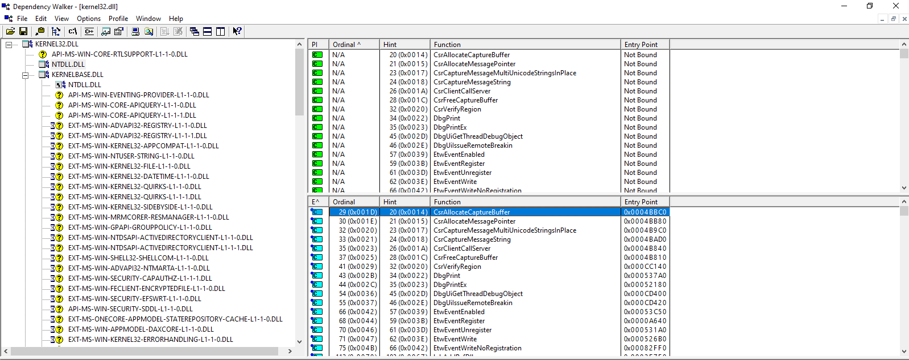

Encontrei uma das ferramentas clássicas, o **Dependency Walker**, que ajuda a entender arquivos EXE e DLL e suas dependências. Na imagem abaixo, abri o conhecido `Kernel32.dll`, que permite que o aplicativo use as APIs Win32. Dá para ver a lista de subdependências das DLLs e, à direita, funções de importação e exportação. A ferramenta ajuda a ter uma ideia geral de quais funções da API Win32 um EXE ou DLL chamam. Comecei a usá-la para enxergar, em alto nível, como um aplicativo interage com o kernel do Windows. Há ferramentas mais avançadas, mas esta atende bem quem está começando.

Espero que seja útil.

