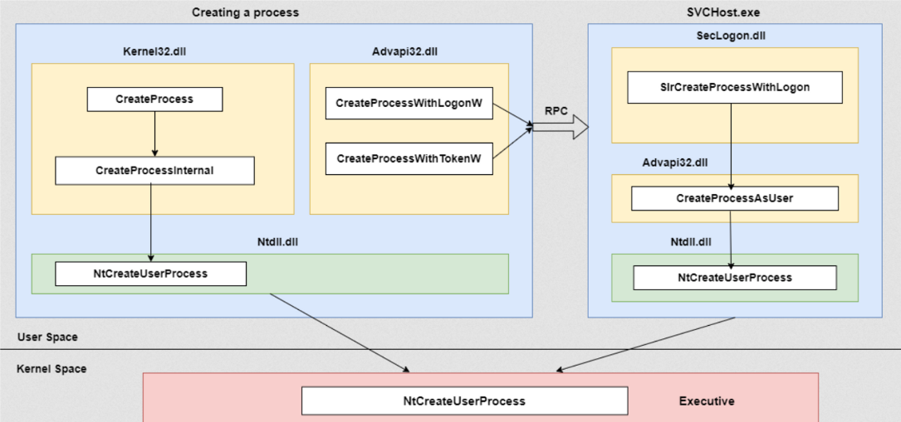

# Resumo

Visão rápida de como um processo simples é criado, quais funções da API Win32 entram, o que ocorre nas DLLs de modo usuário e a transição para o kernel. Visão geral; código e depuração entram em textos posteriores.

# O que é processo?

Processo é uma instância de um programa em execução. O código fica em arquivo; ao executar, vira o processo que realiza o trabalho. Em geral o processo tem:

- **Objeto de kernel** que o SO usa para gerir o processo (estatísticas, etc.).
- **Espaço de endereço** com código e dados de executáveis e DLLs, pilhas de *threads* e *heap*.

# Visão geral da criação de processo

Fluxo (diagrama) ao criar um processo:



**Nota:** o diagrama foi levemente ajustado em relação ao do livro *Windows Internals* Parte 1 (pág. 114) após pesquisa.

O usuário chama a API **[CreateProcess](https://learn.microsoft.com/en-us/windows/win32/api/processthreadsapi/nf-processthreadsapi-createprocessa)** em **Kernel32.dll**, no mesmo contexto e token. Exemplo (C++ e C#):

```Cpp
BOOL creationResult;
    
    creationResult = CreateProcess(
        NULL,                   // Nome de módulo (use linha de comando)
        cmdLine,                // Linha de comando
        NULL,                   // Processo sem herança de handle
        NULL,                   // Thread sem herança de handle
        FALSE,                  // Herança de handles desligada
        NORMAL_PRIORITY_CLASS | CREATE_NEW_CONSOLE | CREATE_NEW_PROCESS_GROUP,
        NULL,                   // Bloco de ambiente do pai
        NULL,                   // Diretório inicial do pai
        &startupInfo,
        &processInformation);
```

```C#
[DllImport("kernel32.dll", SetLastError=true, CharSet=CharSet.Auto)]
static extern bool CreateProcess(
   string lpApplicationName,
   string lpCommandLine,
   ref SECURITY_ATTRIBUTES lpProcessAttributes,
   ref SECURITY_ATTRIBUTES lpThreadAttributes,
   bool bInheritHandles,
   uint dwCreationFlags,
   IntPtr lpEnvironment,
   string lpCurrentDirectory,
   [In] ref STARTUPINFO lpStartupInfo,
   out PROCESS_INFORMATION lpProcessInformation);
```

*Malware* abusa de **CreateProcess** em técnicas como criação ou alteração de processos do sistema ([T1543](https://attack.mitre.org/techniques/T1543/)) e injeção ([T1055](https://attack.mitre.org/techniques/T1055/)), entre outras.

Com essa API, o filho roda no mesmo contexto (mesmo *token*). Depois entra a **CreateProcessInternal()** (não documentada), que monta o processo em modo usuário. Estrutura (ReactOS, ~linha 4625):

```C++
BOOL WINAPI CreateProcessInternalA(HANDLE hToken,
		LPCSTR lpApplicationName,
		LPSTR lpCommandLine,
		LPSECURITY_ATTRIBUTES lpProcessAttributes,
		LPSECURITY_ATTRIBUTES lpThreadAttributes,
		BOOL bInheritHandles,
		DWORD dwCreationFlags,
		LPVOID lpEnvironment,
		LPCSTR lpCurrentDirectory,
		LPSTARTUPINFOA lpStartupInfo,
		LPPROCESS_INFORMATION lpProcessInformation,
		PHANDLE hNewToken 
	)
```

Em seguida **NtCreateUserProcess** em `ntdll.dll` faz a ponte do modo usuário para o kernel. Assinaturas (C e C#):

```C++
NTSTATUS NTAPI
NtCreateUserProcess (
    PHANDLE ProcessHandle,
    PHANDLE ThreadHandle,
    ACCESS_MASK ProcessDesiredAccess,
    ACCESS_MASK ThreadDesiredAccess,
    POBJECT_ATTRIBUTES ProcessObjectAttributes,
    POBJECT_ATTRIBUTES ThreadObjectAttributes,
    ULONG ProcessFlags,
    ULONG ThreadFlags,
    PRTL_USER_PROCESS_PARAMETERS ProcessParameters,
    PPROCESS_CREATE_INFO CreateInfo,
    PPROCESS_ATTRIBUTE_LIST AttributeList
    );
```

```C#
[DllImport("ntdll.dll", SetLastError=true)]
static extern UInt32 NtCreateUserProcess(ref IntPtr ProcessHandle, ref IntPtr ThreadHandle, AccessMask ProcessDesiredAccess, AccessMask ThreadDesiredAccess, IntPtr ProcessObjectAttributes, IntPtr ThreadObjectAttributes, UInt32 ProcessFlags, UInt32 ThreadFlags, IntPtr ProcessParameters, ref PS_CREATE_INFO CreateInfo, ref PS_ATTRIBUTE_LIST AttributeList);
```

No kernel, **NtCreateUserProcess** em *ntoskrnl* (não documentada) conclui o trabalho.

Há outras APIs em outras DLLs, por exemplo **Advapi32.dll** (Advanced API), em *%System%* (ex.: `C:\Windows\System32`). Oferece registro, reinício, serviços, contas, etc.

Exemplos do Advapi: **CreateProcessWithLogon** inicia processo com outro usuário e senha (como *Runas*), em C++:

```C++
BOOL CreateProcessWithLogonW(
  LPCWSTR lpUsername,
  LPCWSTR lpDomain,
  LPCWSTR lpPassword,
  DWORD dwLogonFlags,
  LPCWSTR lpApplicationName,
  LPWSTR lpCommandLine,
  DWORD dwCreationFlags,
  LPVOID lpEnvironment,
  LPCWSTR lpCurrentDirectory,
  LPSTARTUPINFOW lpStartupInfo,
  LPPROCESS_INFORMATION lpProcessInfo
);
```

**CreateProcessWithLogon** liga a manipulação de token de acesso ([T1134](https://attack.mitre.org/techniques/T1134/); artigo Elastic).

**CreateProcessWithTokenW** cria processo com token de outro usuário. Abuso: sub-técnica [T1134.002](https://attack.mitre.org/techniques/T1134/002/).

**Nota:** **CreateProcessWithLogonW** e **CreateProcessWithTokenW** são parecidas com **CreateProcessAsUser**, mas o chamador não precisa de **LogonUser** antes.

**CreateProcessWithTokenW** e **CreateProcessWithLogon** falam com **seclogon.dll** (*Secondary Logon*), em *System32*, hospedada em **svchost.exe**. Ex.: **SlrCreateProcessWithLogon** e internamente **CreateProcessAsUserA**.

```C
BOOL CreateProcessAsUserA(
  HANDLE                hToken,
  LPCSTR                lpApplicationName,
  LPSTR                 lpCommandLine,
  LPSECURITY_ATTRIBUTES lpProcessAttributes,
  LPSECURITY_ATTRIBUTES lpThreadAttributes,
  BOOL                  bInheritHandles,
  DWORD                 dwCreationFlags,
  LPVOID                lpEnvironment,
  LPCSTR                lpCurrentDirectory,
  LPSTARTUPINFOA        lpStartupInfo,
  LPPROCESS_INFORMATION lpProcessInformation
);
```

Dá para chamar **CreateProcessAsUser** diretamente, com privilégio **SeAssignPrimaryToken** em contas de serviço, e ainda assim chegar a **NtCreateUserProcess** em *ntdll* e no kernel.

Este texto é só panorama; o interior é mais complexo e entra em textos futuros.

Links úteis: [ReactOS proc.c](https://doxygen.reactos.org/d9/dd7/dll_2win32_2kernel32_2client_2proc_8c_source.html).
