# Resumo
Neste artigo, vamos ver o que é o PEB e como ele funciona por dentro, usando um depurador. Será uma série em várias partes, cobrindo e entendendo diferentes parâmetros do PEB e sua estrutura. As referências estão no final.

# Índice
1. **[O que é o PEB?](#what-is-peb)**
2. **[Estrutura do PEB](#structure-of-the-peb)**
3. **[Análise do PEB no WinDbg](#peb-analysis-in-windbg)**
4. **[BeingDebugged](#beingdebugged)**
5. **[BitField](#bitfield)**
6. **[Processo protegido](#protected-process)**
7. **[IsImageDynamicallyRelocated](#isimagedynamicallyrelocated)**
8. **[SkipPatchingUser32Forwarders](#skippatchinguser32forwarders)**
9. **[IsLongPathAwareProcess](#islongpathawareprocess)**
10. **[ImageBaseAddress](#imagebaseaddress)**
11. **[LDR](#ldr)**
12. **[Parâmetros do processo](#process-parameters)**

<a name="what-is-peb"></a>
# O que é o PEB?
O PEB é a representação de um processo no espaço do usuário. É a estrutura em modo usuário que mais sabe sobre um processo. Contém detalhes diretos sobre o processo e muitos ponteiros para outras estruturas com ainda mais dados sobre o PE. Qualquer processo com o mínimo de presença em modo usuário terá um PEB correspondente. O PEB é criado pelo kernel, mas em geral é manipulado a partir do modo usuário. Armazena dados gerenciados no modo usuário, o que oferece acesso aos dados mais fácil do que transitar para o kernel ou usar IPC.

<a name="structure-of-the-peb"></a>
# Estrutura do PEB

A seguir, a representação de onde o PEB fica na arquitetura Windows.
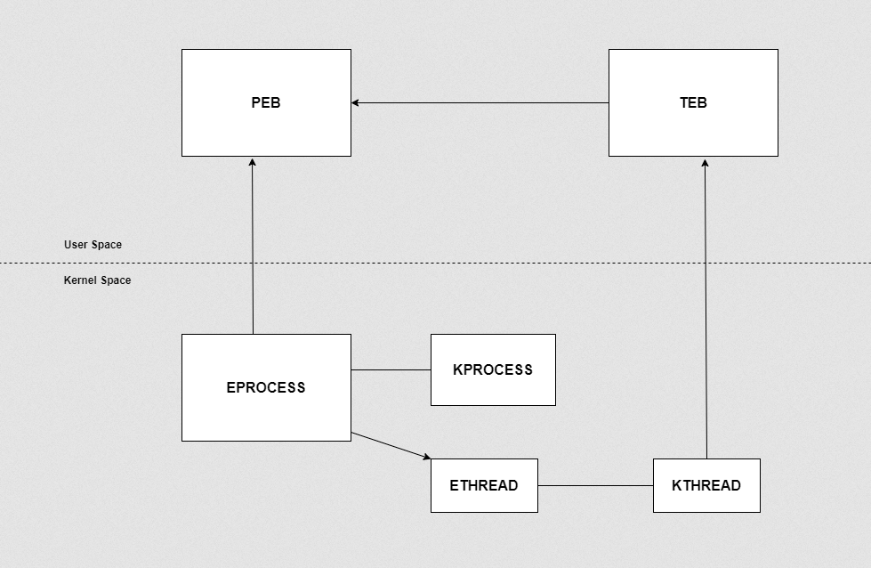

No diagrama acima, o PEB fica no espaço do usuário. Há mais coisas por trás disso. Vamos entender de forma simples. 

O espaço do kernel no Windows é dividido em três partes: HAL, kernel e subsistema executivo. O executivo cuida de políticas gerais e operação do SO; o kernel trata de detalhes de arquitetura de processo e operações de baixo nível. O HAL trata de diferenças em implementações concretas de uma arquitetura de processador. Cada camada tem complexidade própria, tema para outros textos.

Ao criar um processo novo, o kernel e o executivo precisam rastreá-lo, cada um à sua maneira. A estrutura que o kernel usa é o KPROCESS; a que o executivo usa é o EPROCESS. Além disso, o KPROCESS é o primeiro campo do EPROCESS. Vejamos a estrutura do EPROCESS no depurador de kernel.

```
lkd> dt _eprocess
nt!_EPROCESS
  +0x000 Pcb              : _KPROCESS
  +0x080 ProcessLock      : _EX_PUSH_LOCK
  +0x088 CreateTime       : _LARGE_INTEGER
  +0x090 ExitTime         : _LARGE_INTEGER
  +0x098 RundownProtect   : _EX_RUNDOWN_REF
  +0x09c UniqueProcessId  : Ptr32 Void
  +0x0a0 ActiveProcessLinks : _LIST_ENTRY
  +0x0a8 QuotaUsage       : [3] Uint4B
  +0x0b4 QuotaPeak        : [3] Uint4B
  +0x0c0 CommitCharge     : Uint4B
  +0x0c4 PeakVirtualSize  : Uint4B
  +0x0c8 VirtualSize      : Uint4B
  +0x0cc SessionProcessLinks : _LIST_ENTRY
  +0x0d4 DebugPort        : Ptr32 Void
  +0x0d8 ExceptionPortData : Ptr32 Void
  +0x0d8 ExceptionPortValue : Uint4B
  +0x0d8 ExceptionPortState : Pos 0, 3 Bits
  +0x0dc ObjectTable      : Ptr32 _HANDLE_TABLE
  +0x0e0 Token            : _EX_FAST_REF
  +0x0e4 WorkingSetPage   : Uint4B
  +0x0e8 AddressCreationLock : _EX_PUSH_LOCK
  +0x0ec RotateInProgress : Ptr32 _ETHREAD
  +0x0f0 ForkInProgress   : Ptr32 _ETHREAD
  +0x0f4 HardwareTrigger  : Uint4B
  +0x0f8 PhysicalVadRoot  : Ptr32 _MM_AVL_TABLE
  +0x0fc CloneRoot        : Ptr32 Void
  +0x100 NumberOfPrivatePages : Uint4B
  +0x104 NumberOfLockedPages : Uint4B
  +0x108 Win32Process     : Ptr32 Void
  +0x10c Job              : Ptr32 _EJOB
  +0x110 SectionObject    : Ptr32 Void
  +0x114 SectionBaseAddress : Ptr32 Void
  +0x118 QuotaBlock       : Ptr32 _EPROCESS_QUOTA_BLOCK
```
O primeiro campo é o KPROCESS. A estrutura KPROCESS aparece assim:

```
lkd> dt _kprocess
nt!_KPROCESS
  +0x000 Header           : _DISPATCHER_HEADER
  +0x010 ProfileListHead  : _LIST_ENTRY
  +0x018 DirectoryTableBase : Uint4B
  +0x01c Unused0          : Uint4B
  +0x020 LdtDescriptor    : _KGDTENTRY
  +0x028 Int21Descriptor  : _KIDTENTRY
  +0x030 IopmOffset       : Uint2B
  +0x032 Iopl             : UChar
  +0x033 Unused           : UChar
  +0x034 ActiveProcessors : Uint4B
  +0x038 KernelTime       : Uint4B
  +0x03c UserTime         : Uint4B
  +0x040 ReadyListHead    : _LIST_ENTRY
  +0x048 SwapListEntry    : _SINGLE_LIST_ENTRY
  +0x04c VdmTrapcHandler  : Ptr32 Void
  +0x050 ThreadListHead   : _LIST_ENTRY
  +0x058 ProcessLock      : Uint4B
  +0x05c Affinity         : Uint4B
  +0x060 AutoAlignment    : Pos 0, 1 Bit
  +0x060 DisableBoost     : Pos 1, 1 Bit
  +0x060 DisableQuantum   : Pos 2, 1 Bit
  +0x060 ReservedFlags    : Pos 3, 29 Bits
  +0x060 ProcessFlags     : Int4B
  +0x064 BasePriority     : Char
  +0x065 QuantumReset     : Char
  +0x066 State            : UChar
  +0x067 ThreadSeed       : UChar
  +0x068 PowerState       : UChar
  +0x069 IdealNode        : UChar
  +0x06a Visited          : UChar
  +0x06b Flags            : _KEXECUTE_OPTIONS
  +0x06b ExecuteOptions   : UChar
  +0x06c StackCount       : Uint4B
  +0x070 ProcessListEntry : _LIST_ENTRY
  +0x078 CycleTime        : Uint8B
```
A mesma lógica vale para os threads do processo, com ETHREAD e KTHREAD. O PEB vem do Thread Environment Block (TEB), também chamado de Thread Information Block (TIB). O TEB guarda dados sobre o thread atual - cada thread tem sua própria estrutura TEB.

Expliquei esses termos de forma bem básica; por baixo do capô fica mais complexo e cada estrutura merece atenção própria, em artigos futuros.

Antes de seguir, o fluxo básico de criação e onde cada coisa entra:  
1. Um processo novo (por exemplo, Cmd.exe) é iniciado e chama a Win32 API **[CreateProcess](https://learn.microsoft.com/en-us/windows/win32/api/processthreadsapi/nf-processthreadsapi-createprocessa)**, que envia o pedido de criação do processo.
2. A estrutura EPROCESS é criada no espaço do kernel.
3. O Windows cria o processo, a memória virtual e a representação da memória física e guarda isso dentro de EPROCESS.
4. O PEB é criado no espaço do usuário com as informações necessárias e carrega as duas DLLs mais importantes, Ntdll.dll e Kernel32.dll
5. Carrega o PE e inicia a execução.

Para ver mais sobre as APIs chamadas ao criar um processo simples, leia o artigo anterior **[`Overview of process creation`](./Overview%20of%20process%20creation.md)**.

Vejamos a estrutura PEB conforme a documentacao da **[MSDN](https://learn.microsoft.com/en-us/windows/win32/api/winternl/ns-winternl-peb)**.
```Cpp
typedef struct _PEB {
  BYTE                          Reserved1[2];
  BYTE                          BeingDebugged;
  BYTE                          Reserved2[1];
  PVOID                         Reserved3[2];
  PPEB_LDR_DATA                 Ldr;
  PRTL_USER_PROCESS_PARAMETERS  ProcessParameters;
  PVOID                         Reserved4[3];
  PVOID                         AtlThunkSListPtr;
  PVOID                         Reserved5;
  ULONG                         Reserved6;
  PVOID                         Reserved7;
  ULONG                         Reserved8;
  ULONG                         AtlThunkSListPtr32;
  PVOID                         Reserved9[45];
  BYTE                          Reserved10[96];
  PPS_POST_PROCESS_INIT_ROUTINE PostProcessInitRoutine;
  BYTE                          Reserved11[128];
  PVOID                         Reserved12[1];
  ULONG                         SessionId;
} PEB, *PPEB;
```
O PEB não é totalmente documentado. No WinDbg, vemos o seguinte.

```
0:007> dt ntdll!_PEB
+0x000 InheritedAddressSpace : UChar
+0x001 ReadImageFileExecOptions : UChar
+0x002 BeingDebugged : UChar
+0x003 BitField : UChar
+0x003 ImageUsesLargePages : Pos 0, 1 Bit
+0x003 IsProtectedProcess : Pos 1, 1 Bit
+0x003 IsImageDynamicallyRelocated : Pos 2, 1 Bit
+0x003 SkipPatchingUser32Forwarders : Pos 3, 1 Bit
+0x003 IsPackagedProcess : Pos 4, 1 Bit
+0x003 IsAppContainer : Pos 5, 1 Bit
+0x003 IsProtectedProcessLight : Pos 6, 1 Bit
+0x003 IsLongPathAwareProcess : Pos 7, 1 Bit
+0x004 Padding0 : [4] UChar
+0x008 Mutant : Ptr64 Void
+0x010 ImageBaseAddress : Ptr64 Void
+0x018 Ldr : Ptr64 _PEB_LDR_DATA
+0x020 ProcessParameters : Ptr64 _RTL_USER_PROCESS_PARAMETERS
+0x028 SubSystemData : Ptr64 Void
+0x030 ProcessHeap : Ptr64 Void
+0x038 FastPebLock : Ptr64 _RTL_CRITICAL_SECTION
+0x040 AtlThunkSListPtr : Ptr64 _SLIST_HEADER
+0x048 IFEOKey : Ptr64 Void
+0x050 CrossProcessFlags : Uint4B
+0x050 ProcessInJob : Pos 0, 1 Bit
+0x050 ProcessInitializing : Pos 1, 1 Bit
+0x050 ProcessUsingVEH : Pos 2, 1 Bit
+0x050 ProcessUsingVCH : Pos 3, 1 Bit
+0x050 ProcessUsingFTH : Pos 4, 1 Bit
+0x050 ProcessPreviouslyThrottled : Pos 5, 1 Bit
+0x050 ProcessCurrentlyThrottled : Pos 6, 1 Bit
+0x050 ReservedBits0 : Pos 7, 25 Bits
+0x054 Padding1 : [4] UChar
+0x058 KernelCallbackTable : Ptr64 Void
+0x058 UserSharedInfoPtr : Ptr64 Void
+0x060 SystemReserved : Uint4B
+0x064 AtlThunkSListPtr32 : Uint4B
+0x068 ApiSetMap : Ptr64 Void
+0x070 TlsExpansionCounter : Uint4B
+0x074 Padding2 : [4] UChar
+0x078 TlsBitmap : Ptr64 Void
+0x080 TlsBitmapBits : [2] Uint4B
+0x088 ReadOnlySharedMemoryBase : Ptr64 Void
+0x090 SharedData : Ptr64 Void
+0x098 ReadOnlyStaticServerData : Ptr64 Ptr64 Void
+0x0a0 AnsiCodePageData : Ptr64 Void
+0x0a8 OemCodePageData : Ptr64 Void
+0x0b0 UnicodeCaseTableData : Ptr64 Void
+0x0b8 NumberOfProcessors : Uint4B
+0x0bc NtGlobalFlag : Uint4B
+0x0c0 CriticalSectionTimeout : _LARGE_INTEGER
+0x0c8 HeapSegmentReserve : Uint8B
+0x0d0 HeapSegmentCommit : Uint8B
+0x0d8 HeapDeCommitTotalFreeThreshold : Uint8B
+0x0e0 HeapDeCommitFreeBlockThreshold : Uint8B
8/17
+0x0e8 NumberOfHeaps : Uint4B
+0x0ec MaximumNumberOfHeaps : Uint4B
+0x0f0 ProcessHeaps : Ptr64 Ptr64 Void
+0x0f8 GdiSharedHandleTable : Ptr64 Void
+0x100 ProcessStarterHelper : Ptr64 Void
+0x108 GdiDCAttributeList : Uint4B
+0x10c Padding3 : [4] UChar
+0x110 LoaderLock : Ptr64 _RTL_CRITICAL_SECTION
+0x118 OSMajorVersion : Uint4B
+0x11c OSMinorVersion : Uint4B
+0x120 OSBuildNumber : Uint2B
+0x122 OSCSDVersion : Uint2B
+0x124 OSPlatformId : Uint4B
+0x128 ImageSubsystem : Uint4B
+0x12c ImageSubsystemMajorVersion : Uint4B
+0x130 ImageSubsystemMinorVersion : Uint4B
+0x134 Padding4 : [4] UChar
+0x138 ActiveProcessAffinityMask : Uint8B
+0x140 GdiHandleBuffer : [60] Uint4B
+0x230 PostProcessInitRoutine : Ptr64 void
+0x238 TlsExpansionBitmap : Ptr64 Void
+0x240 TlsExpansionBitmapBits : [32] Uint4B
+0x2c0 SessionId : Uint4B
+0x2c4 Padding5 : [4] UChar
+0x2c8 AppCompatFlags : _ULARGE_INTEGER
+0x2d0 AppCompatFlagsUser : _ULARGE_INTEGER
+0x2d8 pShimData : Ptr64 Void
+0x2e0 AppCompatInfo : Ptr64 Void
+0x2e8 CSDVersion : _UNICODE_STRING
+0x2f8 ActivationContextData : Ptr64 _ACTIVATION_CONTEXT_DATA
+0x300 ProcessAssemblyStorageMap : Ptr64 _ASSEMBLY_STORAGE_MAP
+0x308 SystemDefaultActivationContextData : Ptr64 _ACTIVATION_CONTEXT_DATA
+0x310 SystemAssemblyStorageMap : Ptr64 _ASSEMBLY_STORAGE_MAP
+0x318 MinimumStackCommit : Uint8B
+0x320 FlsCallback : Ptr64 _FLS_CALLBACK_INFO
+0x328 FlsListHead : _LIST_ENTRY
+0x338 FlsBitmap : Ptr64 Void
+0x340 FlsBitmapBits : [4] Uint4B
+0x350 FlsHighIndex : Uint4B
+0x358 WerRegistrationData : Ptr64 Void
+0x360 WerShipAssertPtr : Ptr64 Void
+0x368 pUnused : Ptr64 Void
+0x370 pImageHeaderHash : Ptr64 Void
+0x378 TracingFlags : Uint4B
+0x378 HeapTracingEnabled : Pos 0, 1 Bit
+0x378 CritSecTracingEnabled : Pos 1, 1 Bit
+0x378 LibLoaderTracingEnabled : Pos 2, 1 Bit
+0x378 SpareTracingBits : Pos 3, 29 Bits
+0x37c Padding6 : [4] UChar
+0x380 CsrServerReadOnlySharedMemoryBase : Uint8B
+0x388 TppWorkerpListLock : Uint8B
+0x390 TppWorkerpList : _LIST_ENTRY
+0x3a0 WaitOnAddressHashTable : [128] Ptr64 Void
+0x7a0 TelemetryCoverageHeader : Ptr64 Void
+0x7a8 CloudFileFlags : Uint4B
```
Há muitos campos. Nesta série, vou cobrir o máximo possível de forma simples.

<a name="peb-analysis-in-windbg"></a>
# Análise do PEB no WinDbg
Nesta demonstração, usamos o executável simples CMD.exe e examinamos a estrutura PEB no WinDbg Preview. Inicie o cmd.exe e abra o WinDbg Preview.

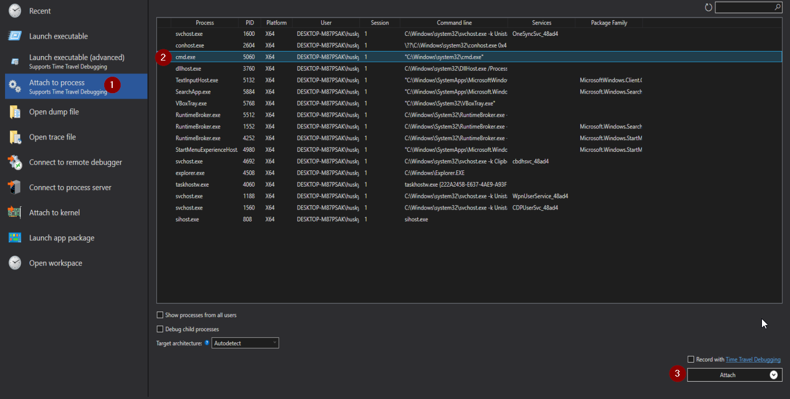

Anexe ao processo cmd.exe.

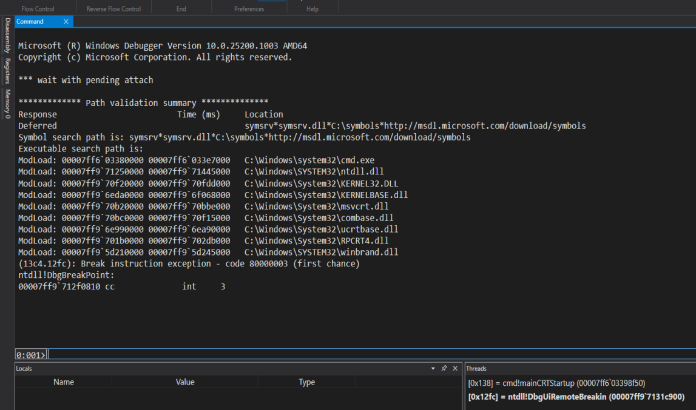

O processo alvo é carregado com sucesso no WinDbg. Agora vamos obter o endereço do PEB. Há duas formas e vamos ver as duas.

Abra o Process Hacker e dê duplo clique no processo cmd.exe. O endereço do PEB aparece.

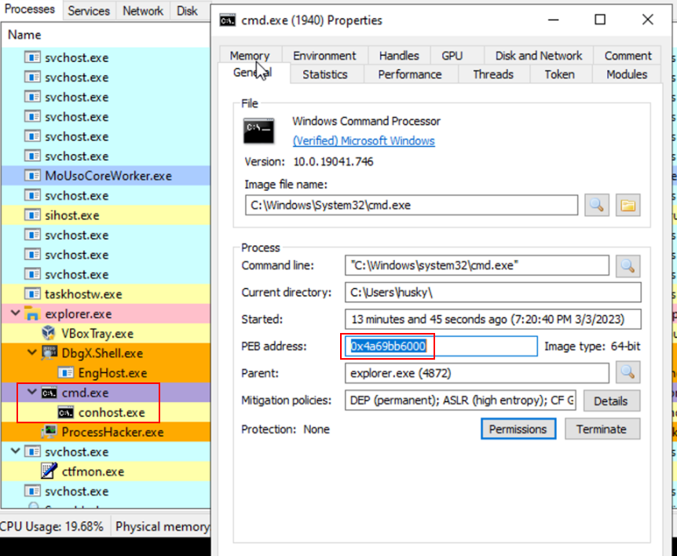

Também dá para usar o comando do WinDbg para obter o endereço do PEB.
```
0:001> r $peb
$peb=0000004a69bb6000
```
Agora carregando a estrutura PEB do Cmd.exe com o comando:
```
dt _peb @$peb
```
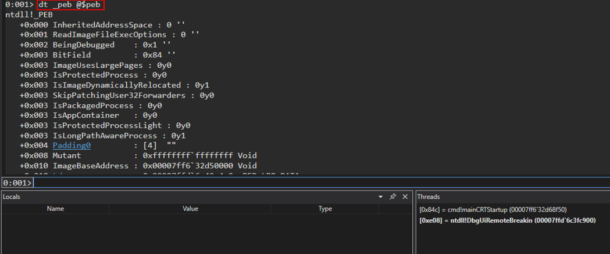

Também podemos usar um comando semelhante, com visão melhor.
```
!peb
```
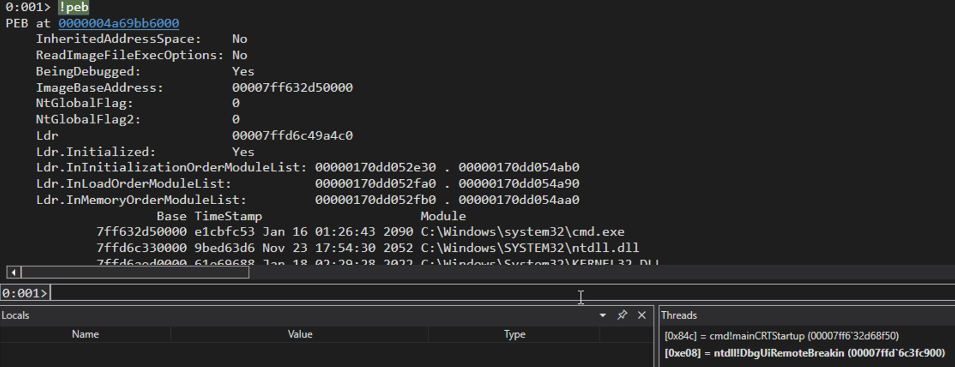

Vamos aos campos do PEB.

<a name="beingdebugged"></a>
# BeingDebugged

Indica se o processo em questão está, no momento, sob depuração por um depurador em modo usuário, como OllyDbg, WinDbg, etc. Alguns malwares checam o PEB manualmente em vez da API **```kernel32!IsDebuggerPresent()```**. O código a seguir pode encerrar o processo se estiver em depuração.

```ASM
.text:004010CD                 mov     eax, large fs:30h   ; PEB
.text:004010D3                 db      3Eh                 ; IDA Pro display error (byte is actually used in next instruction)
.text:004010D3                 cmp     byte ptr [eax+2], 1 ; PEB.BeingDebugged
.text:004010D8                 jz      short loc_4010E1
```

```Cpp
if (IsDebuggerPresent())
    ExitProcess(-1);
```

Se `byte ptr [eax+2]` retornar 1, como na saída acima, o processo atual está em depuração.

<a name="bitfield"></a>
# BitField

Isto indica a arquitetura do processo.

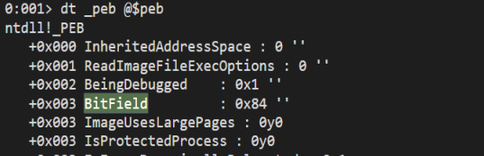

O deslocamento obtido era 0x84, o que significa que o cmd.exe é um processo de 32 bits e também indica a versão do Windows. Veja **[este artigo](https://www.geoffchappell.com/studies/windows/km/ntoskrnl/inc/api/pebteb/peb/bitfield.htm)** para mais referência.

<a name="protected-process"></a>
# Processo protegido

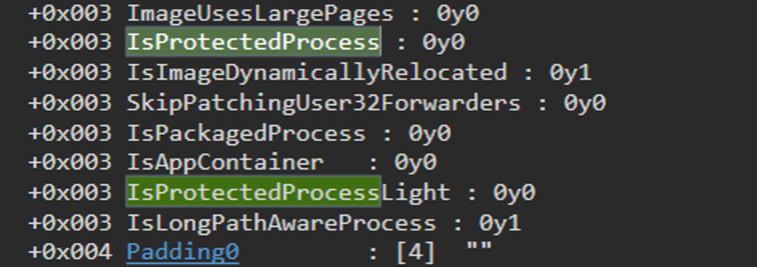

**```IsProtectedProcess```** e **```IsProtectedProcessLight```** servem para ver se o processo atual é protegido. A Microsoft usa esses mecanismos para proteger processos de sistema contra abusos de software malicioso ou encerramento forçado por terceiros.

Tudo isso é imposto a partir do modo kernel pelo kernel do Windows com a estrutura EPROCESS (não documentada e opaca). Você não consegue escrever nesses campos do PEB e ter efeito prático sem que o EPROCESS do processo atual seja atualizado.

<a name="isimagedynamicallyrelocated"></a>
# IsImageDynamicallyRelocated 

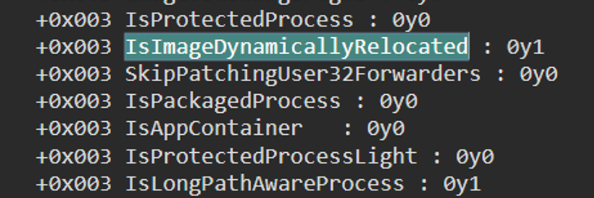

A flag **```IsImageDynamicallyRelocated```** é um booleano que indica se a imagem executável do processo atual foi relocada dinamicamente em tempo de execução. Relocação dinâmica é o processo pelo qual o sistema operacional carrega a imagem em um endereço de memória diferente do especificado nos cabeçalhos. Isso evita conflitos com outros processos que usem o mesmo espaço de endereços.

Quando o processo é relocado dinamicamente, o SO ajusta ponteiros e endereços nos cabeçalhos da imagem para refletir o novo local. A flag IsImageDynamicallyRelocated no PEB fica verdadeira se essa relocação foi aplicada ao processo atual.

Programas podem acessar essa flag via PEB chamando **[GetModuleHandleEx](https://learn.microsoft.com/en-us/windows/win32/api/libloaderapi/nf-libloaderapi-getmodulehandleexa)** com **[GET_MODULE_HANDLE_EX_FLAG_UNCHANGED_REFCOUNT](https://learn.microsoft.com/en-us/windows/win32/api/libloaderapi/nf-libloaderapi-getmodulehandleexa#get_module_handle_ex_flag_unchanged_refcount-0x00000002)**. A função obtém um handle ao módulo e atualiza a contagem de referência, mas não carrega o módulo se ainda não estiver carregado. Também define IsImageDynamicallyRelocated no PEB se o módulo foi relocado dinamicamente.

<a name="skippatchinguser32forwarders"></a>
# SkipPatchingUser32Forwarders

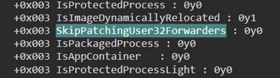

O campo **```SkipPatchingUser32Forwarders```** no PEB é um bit de controle usado pelo Windows para decidir o patch de certas funções de biblioteca em modo usuário no processo.

Quando o processo carrega user32.dll, o sistema em geral aplica um conjunto de patches específico do processo a algumas funções exportadas. Esses patches são os "forwarders" e redirecionam chamadas para outro ponto na mesma biblioteca ou para outra biblioteca. Esse mecanismo é o encaminhamento (forwarding).

A flag **```SkipPatchingUser32Forwarders```** indica se esses encaminhamentos serão aplicados. Com valor 1, o SO pula o patch dos encaminhamentos em user32.dll. Com 0, aplica o patch normalmente.

O principal motivo para ativar a flag é melhorar o tempo de inicialização de certos processos, pois o patch pode ser custoso, sobretudo se o processo usa muito user32.dll. Pular o passo acelera a subida do processo.

Cuidado: pular o patch de encaminhadores pode gerar incompatibilidade com alguns aplicativos. Só se recomenda definir a flag se for seguro e necessário no cenário.

No Windows 64 bits, a flag vem 1 por padrão (encaminhadores ficam de fora, salvo se forem habilitados). No Windows 32 bits, vem 0 (encaminhadores aplicados, salvo se forem desativados).

Para habilitar ou desabilitar explicitamente, use a API **[SetProcessMitigationPolicy](https://learn.microsoft.com/en-us/windows/win32/api/processthreadsapi/nf-processthreadsapi-setprocessmitigationpolicy)**.

```
BOOL SetProcessMitigationPolicy(
  [in] PROCESS_MITIGATION_POLICY MitigationPolicy,
  [in] PVOID                     lpBuffer,
  [in] SIZE_T                    dwLength
);
```

<a name="islongpathawareprocess"></a>
# IsLongPathAwareProcess

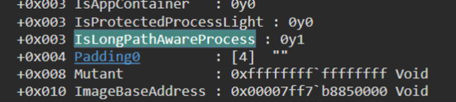

O campo **`IsLongPathAwareProcess`** no PEB é um booleano que indica se o processo atual conhece caminhos longos. Caminhos longos excedem o máximo de 260 caracteres no Windows.

Com suporte a caminho longo, o processo trata I/O de arquivo nesses caminhos com menos erros. Caminhos longos costumam exigir o prefixo especial (**`\\?\`**) e nem todo software lida com isso corretamente.

1 em **`IsLongPathAwareProcess`** indica consciência de caminhos longos; 0 indica o contrário. O SO define a flag na inicialização, por exemplo com manifesto que declara consciência de caminho longo.

<a name="imagebaseaddress"></a>
# ImageBaseAddress

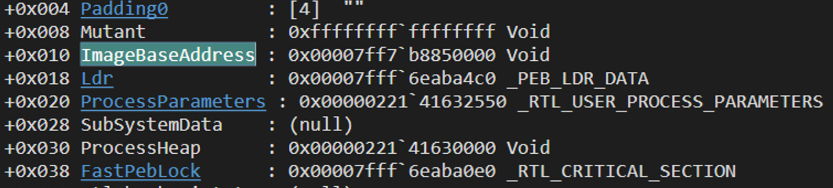

No PEB do Windows, **```ImageBaseAddress```** é o endereço virtual onde a imagem executável do processo foi carregada.

Ao iniciar o processo, o SO cria o objeto de processo, aloca memória virtual e carrega a imagem executável, inicializa e executa. O campo **```ImageBaseAddress```** do PEB guarda o endereço do primeiro módulo na lista de módulos do processo.

É importante porque é a base em que código e dados da imagem estão mapeados. A CPU usa **```ImageBaseAddress```** para calcular endereços virtuais de instruções e dados, permitir link e acesso a dados do próprio processo.

Podemos inspecionar no WinDbg:

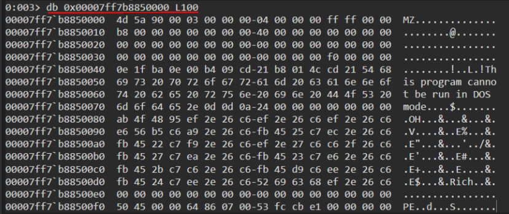

<a name="ldr"></a>
# LDR

Um dos campos do PEB é a Loader Data Table (LDR), com informações sobre todos os módulos carregados (DLLs e executáveis) no espaço de endereços do processo.

Quando o processo começa, o SO cria o campo LDR no PEB e inicializa com a entrada LDR do executável principal. Ao carregar mais módulos, novas entradas LDR descrevem cada um.

A LDR importa para o SO saber o que está carregado, resolver símbolos, calcular endereços e manter a execução coerente.

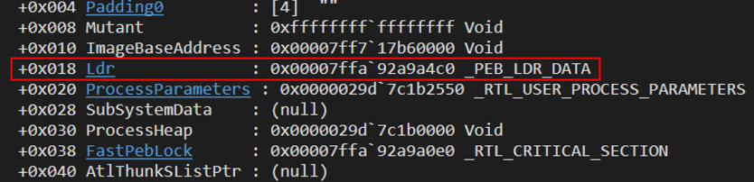

Clique no hiperlink LDR.

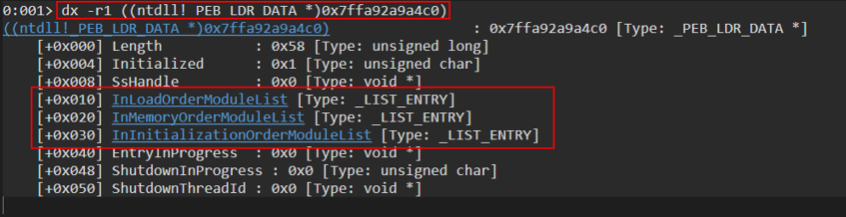

A estrutura é exibida.

```
0:001> dx -r1 ((ntdll!_PEB_LDR_DATA *)0x7ffa92a9a4c0)
((ntdll!_PEB_LDR_DATA *)0x7ffa92a9a4c0)                 : 0x7ffa92a9a4c0 [Type: _PEB_LDR_DATA *]
    [+0x000] Length           : 0x58 [Type: unsigned long]
    [+0x004] Initialized      : 0x1 [Type: unsigned char]
    [+0x008] SsHandle         : 0x0 [Type: void *]
    [+0x010] InLoadOrderModuleList [Type: _LIST_ENTRY]
    [+0x020] InMemoryOrderModuleList [Type: _LIST_ENTRY]
    [+0x030] InInitializationOrderModuleList [Type: _LIST_ENTRY]
    [+0x040] EntryInProgress  : 0x0 [Type: void *]
    [+0x048] ShutdownInProgress : 0x0 [Type: unsigned char]
    [+0x050] ShutdownThreadId : 0x0 [Type: void *]
```

Há três listas importantes, destacadas. Vejamos a estrutura de uma delas.

```
0:001> dx -r1 (*((ntdll!_LIST_ENTRY *)0x7ffa92a9a4d0))
(*((ntdll!_LIST_ENTRY *)0x7ffa92a9a4d0))                 [Type: _LIST_ENTRY]
    [+0x000] Flink            : 0x29d7c1b2fa0 [Type: _LIST_ENTRY *]
    [+0x008] Blink            : 0x29d7c1b4a90 [Type: _LIST_ENTRY *]
```

São listas duplamente encadeadas. Pela documentação (MSDN):

```Cpp
typedef struct _LIST_ENTRY {
   struct _LIST_ENTRY *Flink;
   struct _LIST_ENTRY *Blink;
} LIST_ENTRY, *PLIST_ENTRY, *RESTRICTED_POINTER PRLIST_ENTRY;
```

Cada entrada de lista tem uma estrutura como esta (layout simplificado no exemplo).

```Cpp
typedef struct _LDR_DATA_TABLE_ENTRY {
    PVOID Reserved1[2];
    LIST_ENTRY InMemoryOrderLinks;
    PVOID Reserved2[2];
    PVOID DllBase;
    PVOID EntryPoint;
    PVOID Reserved3;
    UNICODE_STRING FullDllName;
    BYTE Reserved4[8];
    PVOID Reserved5[3];
    union {
        ULONG CheckSum;
        PVOID Reserved6;
    };
    ULONG TimeDateStamp;
} LDR_DATA_TABLE_ENTRY, *PLDR_DATA_TABLE_ENTRY;
```

Com o comando do WinDbg obtemos a lista detalhada.

```
0:001> dt _LDR_DATA_TABLE_ENTRY
ntdll!_LDR_DATA_TABLE_ENTRY
   +0x000 InLoadOrderLinks : _LIST_ENTRY
   +0x010 InMemoryOrderLinks : _LIST_ENTRY
   +0x020 InInitializationOrderLinks : _LIST_ENTRY
   +0x030 DllBase          : Ptr64 Void
   +0x038 EntryPoint       : Ptr64 Void
   +0x040 SizeOfImage      : Uint4B
   +0x048 FullDllName      : _UNICODE_STRING
   +0x058 BaseDllName      : _UNICODE_STRING
   +0x068 FlagGroup        : [4] UChar
   +0x068 Flags            : Uint4B
   +0x068 PackagedBinary   : Pos 0, 1 Bit
   +0x068 MarkedForRemoval : Pos 1, 1 Bit
   +0x068 ImageDll         : Pos 2, 1 Bit
   +0x068 LoadNotificationsSent : Pos 3, 1 Bit
   +0x068 TelemetryEntryProcessed : Pos 4, 1 Bit
   +0x068 ProcessStaticImport : Pos 5, 1 Bit
   +0x068 InLegacyLists    : Pos 6, 1 Bit
   +0x068 InIndexes        : Pos 7, 1 Bit
   +0x068 ShimDll          : Pos 8, 1 Bit
   +0x068 InExceptionTable : Pos 9, 1 Bit
   +0x068 ReservedFlags1   : Pos 10, 2 Bits
   +0x068 LoadInProgress   : Pos 12, 1 Bit
   +0x068 LoadConfigProcessed : Pos 13, 1 Bit
   +0x068 EntryProcessed   : Pos 14, 1 Bit
   +0x068 ProtectDelayLoad : Pos 15, 1 Bit
   +0x068 ReservedFlags3   : Pos 16, 2 Bits
   +0x068 DontCallForThreads : Pos 18, 1 Bit
   +0x068 ProcessAttachCalled : Pos 19, 1 Bit
   +0x068 ProcessAttachFailed : Pos 20, 1 Bit
   +0x068 CorDeferredValidate : Pos 21, 1 Bit
   +0x068 CorImage         : Pos 22, 1 Bit
   +0x068 DontRelocate     : Pos 23, 1 Bit
   +0x068 CorILOnly        : Pos 24, 1 Bit
   +0x068 ChpeImage        : Pos 25, 1 Bit
   +0x068 ReservedFlags5   : Pos 26, 2 Bits
   +0x068 Redirected       : Pos 28, 1 Bit
   +0x068 ReservedFlags6   : Pos 29, 2 Bits
   +0x068 CompatDatabaseProcessed : Pos 31, 1 Bit
   +0x06c ObsoleteLoadCount : Uint2B
   +0x06e TlsIndex         : Uint2B
   +0x070 HashLinks        : _LIST_ENTRY
   +0x080 TimeDateStamp    : Uint4B
   +0x088 EntryPointActivationContext : Ptr64 _ACTIVATION_CONTEXT
   +0x090 Lock             : Ptr64 Void
   +0x098 DdagNode         : Ptr64 _LDR_DDAG_NODE
   +0x0a0 NodeModuleLink   : _LIST_ENTRY
   +0x0b0 LoadContext      : Ptr64 _LDRP_LOAD_CONTEXT
   +0x0b8 ParentDllBase    : Ptr64 Void
   +0x0c0 SwitchBackContext : Ptr64 Void
   +0x0c8 BaseAddressIndexNode : _RTL_BALANCED_NODE
   +0x0e0 MappingInfoIndexNode : _RTL_BALANCED_NODE
   +0x0f8 OriginalBase     : Uint8B
   +0x100 LoadTime         : _LARGE_INTEGER
   +0x108 BaseNameHashValue : Uint4B
   +0x10c LoadReason       : _LDR_DLL_LOAD_REASON
   +0x110 ImplicitPathOptions : Uint4B
   +0x114 ReferenceCount   : Uint4B
   +0x118 DependentLoadFlags : Uint4B
   +0x11c SigningLevel     : UChar
```

Carregando os dados LDR.

```
0:001> dt _PEB_LDR_DATA 0x7ffa92a9a4c0
ntdll!_PEB_LDR_DATA
   +0x000 Length           : 0x58
   +0x004 Initialized      : 0x1 ''
   +0x008 SsHandle         : (null) 
   +0x010 InLoadOrderModuleList : _LIST_ENTRY [ 0x0000029d`7c1b2fa0 - 0x0000029d`7c1b4a90 ]
   +0x020 InMemoryOrderModuleList : _LIST_ENTRY [ 0x0000029d`7c1b2fb0 - 0x0000029d`7c1b4aa0 ]
   +0x030 InInitializationOrderModuleList : _LIST_ENTRY [ 0x0000029d`7c1b2e30 - 0x0000029d`7c1b4ab0 ]
   +0x040 EntryInProgress  : (null) 
   +0x048 ShutdownInProgress : 0 ''
   +0x050 ShutdownThreadId : (null)
```

Isso carrega a struct LDR. Agora veja **```InLoadOrderModuleList```** (no original havia o typo *ModuelList*).

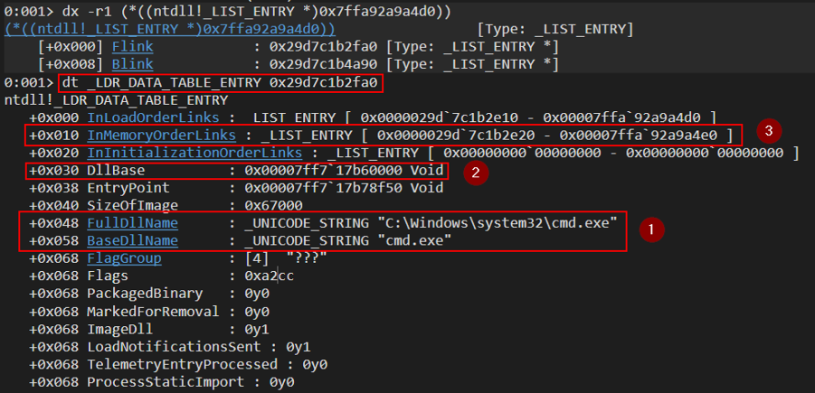

1. Contém o caminho do .exe carregado; aqui, "cmd.exe"
2. O endereço base do cmd.exe. Confirmando

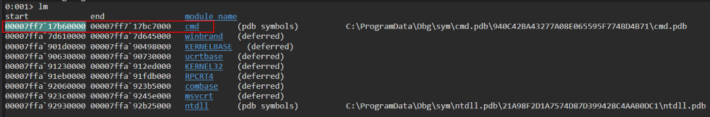

3. O endereço do próximo LIST_ENTRY, InMemoryOrderModuleList

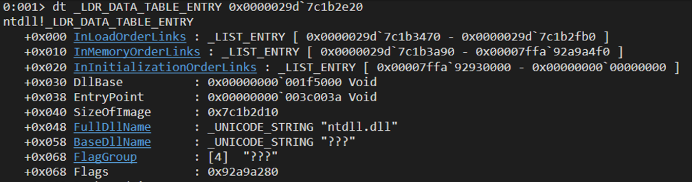

LDR do PEB é assunto à parte; deixo para outro artigo.

<a name="process-parameters"></a>
# Parâmetros do processo

O campo ProcessParameters contém a linha de comando e o ambiente usados para iniciar o processo.

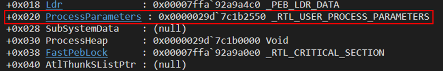

Usa a estrutura **```_RTL_USER_PROCESS_PARAMETERS```**. No WinDbg:

```
0:001> dx -r1 ((ntdll!_RTL_USER_PROCESS_PARAMETERS *)0x29d7c1b2550)
((ntdll!_RTL_USER_PROCESS_PARAMETERS *)0x29d7c1b2550)                 : 0x29d7c1b2550 [Type: _RTL_USER_PROCESS_PARAMETERS *]
    [+0x000] MaximumLength    : 0x7aa [Type: unsigned long]
    [+0x004] Length           : 0x7aa [Type: unsigned long]
    [+0x008] Flags            : 0x6001 [Type: unsigned long]
    [+0x00c] DebugFlags       : 0x0 [Type: unsigned long]
    [+0x010] ConsoleHandle    : 0x44 [Type: void *]
    [+0x018] ConsoleFlags     : 0x0 [Type: unsigned long]
    [+0x020] StandardInput    : 0x50 [Type: void *]
    [+0x028] StandardOutput   : 0x54 [Type: void *]
    [+0x030] StandardError    : 0x58 [Type: void *]
    [+0x038] CurrentDirectory [Type: _CURDIR]
    [+0x050] DllPath          [Type: _UNICODE_STRING]
    [+0x060] ImagePathName    [Type: _UNICODE_STRING]
    [+0x070] CommandLine      [Type: _UNICODE_STRING]
    [+0x080] Environment      : 0x29d7c1c5540 [Type: void *]
    [+0x088] StartingX        : 0x0 [Type: unsigned long]
    [+0x08c] StartingY        : 0x0 [Type: unsigned long]
    [+0x090] CountX           : 0x0 [Type: unsigned long]
    [+0x094] CountY           : 0x0 [Type: unsigned long]
    [+0x098] CountCharsX      : 0x0 [Type: unsigned long]
    [+0x09c] CountCharsY      : 0x0 [Type: unsigned long]
    [+0x0a0] FillAttribute    : 0x0 [Type: unsigned long]
    [+0x0a4] WindowFlags      : 0x801 [Type: unsigned long]
    [+0x0a8] ShowWindowFlags  : 0x1 [Type: unsigned long]
    [+0x0b0] WindowTitle      [Type: _UNICODE_STRING]
    [+0x0c0] DesktopInfo      [Type: _UNICODE_STRING]
    [+0x0d0] ShellInfo        [Type: _UNICODE_STRING]
    [+0x0e0] RuntimeData      [Type: _UNICODE_STRING]
    [+0x0f0] CurrentDirectores [Type: _RTL_DRIVE_LETTER_CURDIR [32]]
    [+0x3f0] EnvironmentSize  : 0x1584 [Type: unsigned __int64]
    [+0x3f8] EnvironmentVersion : 0x5 [Type: unsigned __int64]
    [+0x400] PackageDependencyData : 0x0 [Type: void *]
    [+0x408] ProcessGroupId   : 0x244 [Type: unsigned long]
    [+0x40c] LoaderThreads    : 0x0 [Type: unsigned long]
    [+0x410] RedirectionDllName [Type: _UNICODE_STRING]
    [+0x420] HeapPartitionName [Type: _UNICODE_STRING]
    [+0x430] DefaultThreadpoolCpuSetMasks : 0x0 [Type: unsigned __int64 *]
    [+0x438] DefaultThreadpoolCpuSetMaskCount : 0x0 [Type: unsigned long]
    [+0x43c] DefaultThreadpoolThreadMaximum : 0x0 [Type: unsigned long]
```

A estrutura completa (não documentada oficialmente) consta neste **[site](http://undocumented.ntinternals.net/index.html?page=UserMode%2FStructures%2FRTL_USER_PROCESS_PARAMETERS.html)**

```Cpp
typedef struct _RTL_USER_PROCESS_PARAMETERS {
  ULONG                   MaximumLength;
  ULONG                   Length;
  ULONG                   Flags;
  ULONG                   DebugFlags;
  PVOID                   ConsoleHandle;
  ULONG                   ConsoleFlags;
  HANDLE                  StdInputHandle;
  HANDLE                  StdOutputHandle;
  HANDLE                  StdErrorHandle;
  UNICODE_STRING          CurrentDirectoryPath;
  HANDLE                  CurrentDirectoryHandle;
  UNICODE_STRING          DllPath;
  UNICODE_STRING          ImagePathName;
  UNICODE_STRING          CommandLine;
  PVOID                   Environment;
  ULONG                   StartingPositionLeft;
  ULONG                   StartingPositionTop;
  ULONG                   Width;
  ULONG                   Height;
  ULONG                   CharWidth;
  ULONG                   CharHeight;
  ULONG                   ConsoleTextAttributes;
  ULONG                   WindowFlags;
  ULONG                   ShowWindowFlags;
  UNICODE_STRING          WindowTitle;
  UNICODE_STRING          DesktopName;
  UNICODE_STRING          ShellInfo;
  UNICODE_STRING          RuntimeData;
  RTL_DRIVE_LETTER_CURDIR DLCurrentDirectory[0x20];

} RTL_USER_PROCESS_PARAMETERS, *PRTL_USER_PROCESS_PARAMETERS;
```

Vejamos com **```dt _RTL_USER_PROCESS_PARAMETERS 0x0000029d`7c1b2550```**

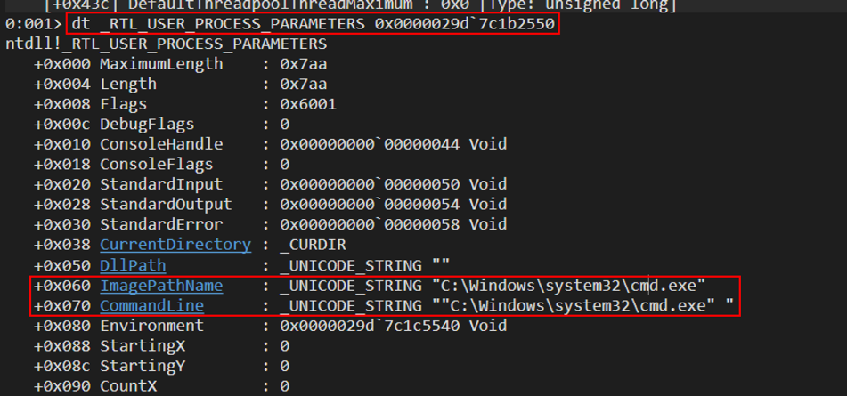

Daí o caminho completo do cmd.exe.

Fim da parte 1 sobre o interior do PEB. Na parte 2, mais campos. Leia a parte 2 **[aqui](./PEB%20-%20Part%202.md)**

# Referências

1. **[https://www.ired.team/miscellaneous-reversing-forensics/windows-kernel-internals/exploring-process-environment-block](https://www.ired.team/miscellaneous-reversing-forensics/windows-kernel-internals/exploring-process-environment-block)**
2. **[https://mohamed-fakroud.gitbook.io/red-teamings-dojo/windows-internals/peb](https://mohamed-fakroud.gitbook.io/red-teamings-dojo/windows-internals/peb)**
3. **[https://papers.vx-underground.org/papers/Malware%20Defense/Malware%20Analysis%202018/2018-02-26%20-%20Anatomy%20of%20the%20Process%20Environment%20Block%20(PEB)%20(Windows%20Internals).pdf](https://papers.vx-underground.org/papers/Malware%20Defense/Malware%20Analysis%202018/2018-02-26%20-%20Anatomy%20of%20the%20Process%20Environment%20Block%20(PEB)%20(Windows%20Internals).pdf)**
4. **[https://dosxuz.gitlab.io/post/perunsfart/](https://dosxuz.gitlab.io/post/perunsfart/)**
5. **[https://www.geoffchappell.com/studies/windows/km/ntoskrnl/inc/api/pebteb/peb/index.htm](https://www.geoffchappell.com/studies/windows/km/ntoskrnl/inc/api/pebteb/peb/index.htm)**
