# Resumo

Neste texto, vemos o que é a **System Service Descriptor Table (SSDT)** e como inspecioná-la com o [WinDbg](https://learn.microsoft.com/en-us/windows-hardware/drivers/debugger/debugger-download-tools). Também o que acontece ao subir um `.exe` e como entram `Ntdll.dll` e as APIs Win32.

**Nota:** a SSDT é um tema amplo e complexo; aqui vai uma introdução clara, também para consolidar o entendimento.

# O que é a System Service Descriptor Table?

Segundo as fontes: em 32 bits, costuma ser um **vetor de endereços** para rotinas do kernel; em 64 bits, um **vetor de deslocamentos relativos** às mesmas rotinas. A SSDT é o primeiro membro da estrutura **Service Descriptor Table** no kernel, como abaixo.

```CPP
typedef struct tagSERVICE_DESCRIPTOR_TABLE {
    SYSTEM_SERVICE_TABLE nt; // em essência, ponteiro para a própria tabela de despacho (SSDT)
    SYSTEM_SERVICE_TABLE win32k;
    SYSTEM_SERVICE_TABLE sst3; // ponteiro a informação sobre quantas rotinas existem
    SYSTEM_SERVICE_TABLE sst4;
} SERVICE_DESCRIPTOR_TABLE;
```

A definição acima é densa; um exemplo concreto ajuda. Veja o diagrama.

<p align="center">
  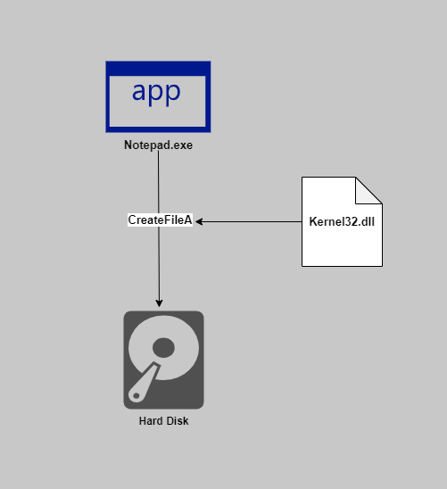
</p>

Imagine o processo `Notepad.exe` gravando um arquivo no disco. Ele chama **[CreateFileA](https://learn.microsoft.com/en-us/windows/win32/api/fileapi/nf-fileapi-createfilea)** em **Kernel32.dll** (DLL que expõe boa parte das APIs Win32). A seguir, entendemos o fluxo e onde a SSDT entra.

<p align="center">
    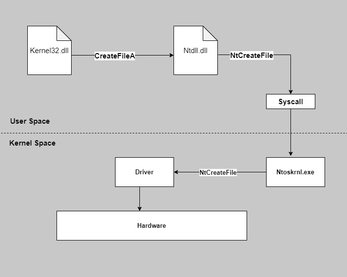
</p>

O Notepad chama **CreateFileA** em **Kernel32.dll**; em seguida, internamente, entra **[NtCreateFile](http://undocumented.ntinternals.net/index.html?page=UserMode%2FUndocumented%20Functions%2FNT%20Objects%2FFile%2FNtCreateFile.html)** vinda de **Ntdll.dll** (NT Layer DLL, em *System* / *System32*, com funções centrais do kernel em modo usuário).

O código de **NtCreateFile** dispara a **chamada de sistema** (**syscall** / **sysenter**). Depois, **Ntoskrnl.exe** (kernel) atende a **NtCreateFile** no modo kernel (mesmo nome simbólico, trabalho real no kernel). **A SSDT é usada para obter o endereço absoluto da rotina de kernel correspondente a NtCreateFile.** Com isso, posicionamos a SSDT no desenho geral. Guarde o diagrama acima.

### 32 bits vs 64 bits

SSDT em 32 bits:

<p align="center">
    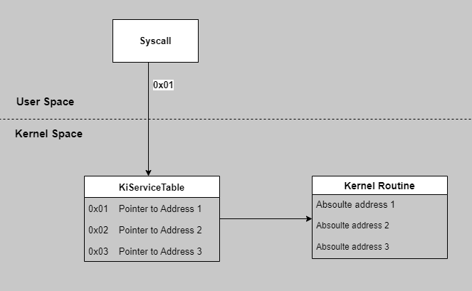
</p>

*Syscall* e SSDT (`KiServiceTable`) funcionam como ponte entre chamadas no modo usuário e rotinas no kernel. O número da *syscall* indexa `KiServiceTable` (ponteiros para endereços reais). Aqui só o índice importa, não a função nominal; um exemplo detalhado vem adiante.

Em 64 bits a ideia muda um pouco:

<p align="center">
    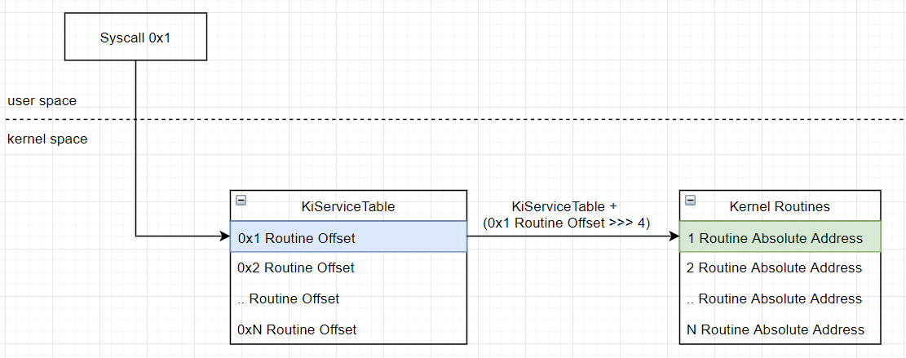
</p>

(Referência ired.team.) A SSDT em x64 guarda **deslocamentos relativos**. Endereço absoluto:

```
RoutineAbsoluteAddress = KiServiceTableAddress + (routineOffset >>> 4)
```

Soma do endereço de `KiServiceTable`, deslocamento da *syscall* e *unsigned right shift*. Ferramenta dedicada (SSDT View):

<p align="center">
    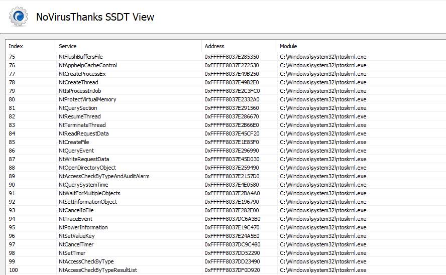
</p>

O detalhamento completo fica melhor no WinDbg (consulte a documentação da Microsoft sobre depuração de kernel e o seu ambiente).

Estrutura com **KeServiceDescriptorTable**: o primeiro membro reconhecido é **KiServiceTable**, ponteiro para a SSDT (tabela de despacho com ponteiros ou deslocamentos).

<p align="center">
    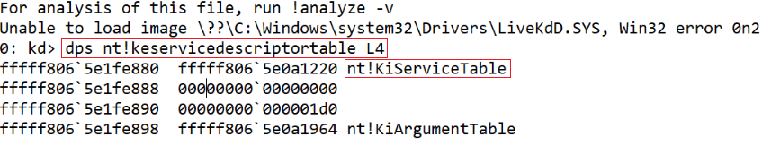
</p>

Listando valores da SSDT:

<p align="center">
    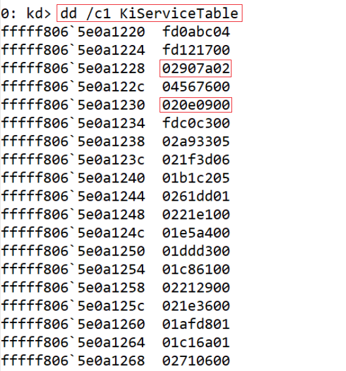
</p>

A SSDT mostra deslocamentos até rotinas de kernel, que levam a APIs com endereço absoluto. Tomando os destaques **02907a02** e **020e0900** e a fórmula:

```
RoutineAbsoluteAddress = KiServiceTableAddress + (routineOffset >>> 4)
```

<p align="center">
    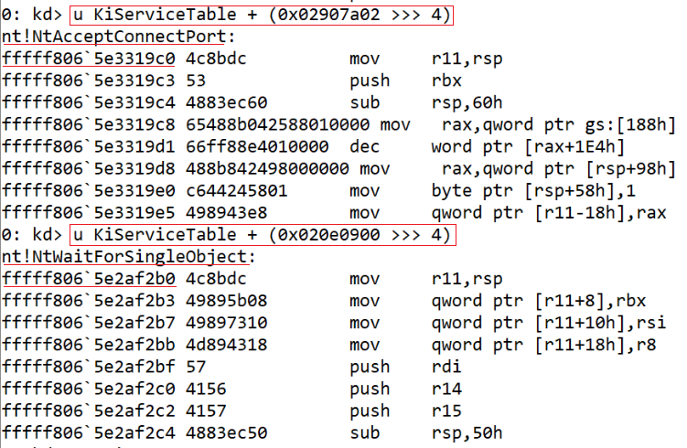
</p>

Obtemos nomes como **[NtAcceptConnectPort](http://undocumented.ntinternals.net/index.html?page=UserMode%2FUndocumented%20Functions%2FNT%20Objects%2FPort%2FNtConnectPort.html)** e **NtWaitForSingleObject** (o texto original tinha um typo "NtWatiFor...") com endereço absoluto. Dá para desmontar e conferir.

<p align="center">
    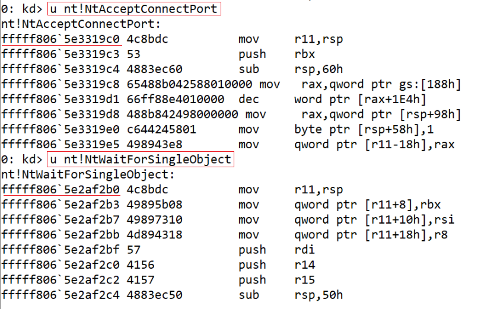
</p>

Se os valores batem, o raciocínio está correto. Diagrama:

<p align="center">
    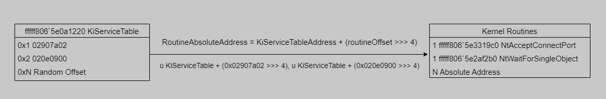
</p>

# Exemplo

Com a ideia da SSDT, vamos a `notepad.exe` e endereços absolutos de APIs. No WinDbg, abra o notepad em *System32*.

<p align="center">
    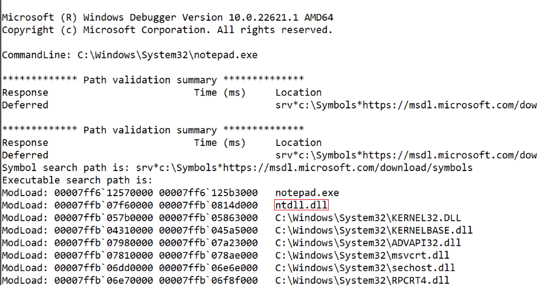
</p>

Na subida, `Ntdll.dll` carrega (destaque). Desmonte **NtCreateFile**.

<p align="center">
    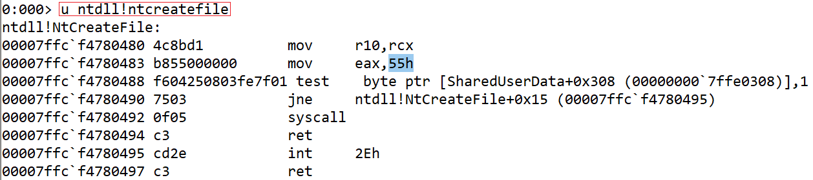
</p>

EAX fica com `55h` (0x55), número de serviço no Windows 10 x64; a **syscall** nesse índice leva o processador ao kernel. Verifique a SSDT no índice 0x55 no WinDbg (kernel, conforme o seu setup).

```
0: kd> dd /c1 kiservicetable+4*0x55 L1
fffff806`5e0a1374  01da3d07
```

Com o deslocamento **01da3d07**, aplique a fórmula.

<p align="center">
    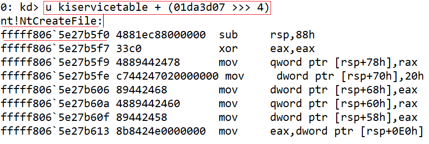
</p>

Obtém-se o endereço absoluto de **NtCreateFile**. Diagrama:

<p align="center">
    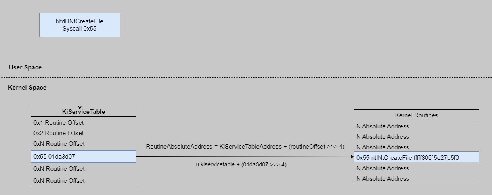
</p>

Comando com laço para listar nomes e endereços:

```
0: kd> .foreach /ps 1 /pS 1 ( offset {dd /c 1 nt!KiServiceTable L poi(nt!KeServiceDescriptorTable+10)}){ r $t0 = ( offset >>> 4) + nt!KiServiceTable; .printf "%p - %y\n", $t0, $t0 }
fffff8066ddabde0 - fffff806`6ddabde0
fffff8066ddb3390 - fffff806`6ddb3390
fffff8065e3319c0 - nt!NtAcceptConnectPort (fffff806`5e3319c0)
fffff8065e4f7980 - nt!NtMapUserPhysicalPagesScatter (fffff806`5e4f7980)
fffff8065e2af2b0 - nt!NtWaitForSingleObject (fffff806`5e2af2b0)
fffff8066de61e50 - fffff806`6de61e50
fffff8065e34a550 - nt!NtReadFile (fffff806`5e34a550)
fffff8065e2c05f0 - nt!NtDeviceIoControlFile (fffff806`5e2c05f0)
fffff8065e252e40 - nt!NtWriteFile (fffff806`5e252e40)
fffff8065e302ff0 - nt!NtRemoveIoCompletion (fffff806`5e302ff0)
```

# Por que a SSDT importa?

1. Em 32 bits, *malware* em modo kernel (ex.: *rootkit*) podia alterar **nt!KiServiceTable** ou **win32k!W32pServiceTable** e redirecionar *syscalls*. Antivírus também *hookavam* a SSDT para receber alertas.  
2. Em 64 bits, o **Kernel Patch Protection (PatchGuard)** verifica periodicamente estruturas críticas, incluindo SSDTs. Software de segurança passou a usar outras técnicas; autores de *rootkits* ainda buscam atalhos, em geral frágeis.

### Fechando

Quando o Notepad (ou outro app) usa APIs Win32, a SSDT ajuda a resolver **onde** a rotina de kernel fica e **como** chegar lá. O mesmo raciocínio se aplica a qualquer interação com Win32.

# Recursos

1. https://www.ired.team/miscellaneous-reversing-forensics/windows-kernel-internals/glimpse-into-ssdt-in-windows-x64-kernel
2. https://www.codeproject.com/Articles/1191465/The-Quest-for-the-SSDTs
3. https://learn.microsoft.com/en-us/windows-hardware/drivers/debugger/debugger-download-tools
4. https://www.novirusthanks.org/products/ssdt-view/
