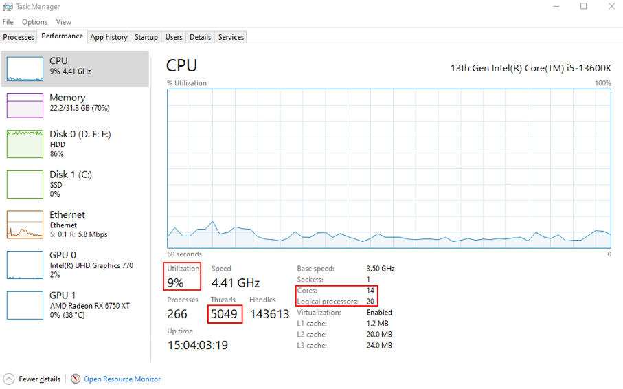
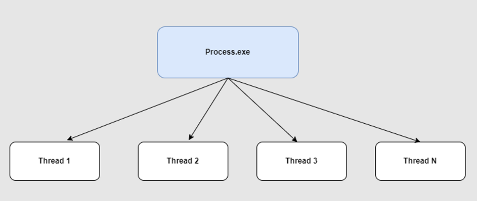
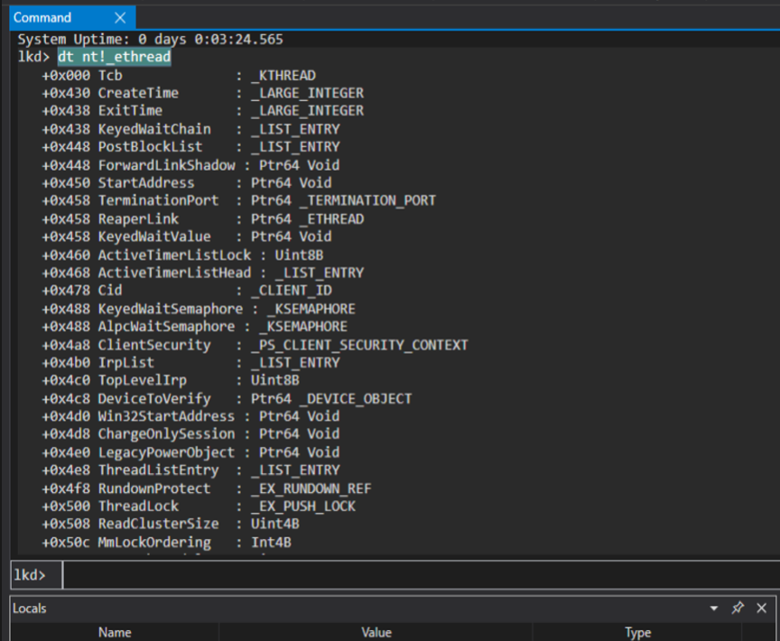
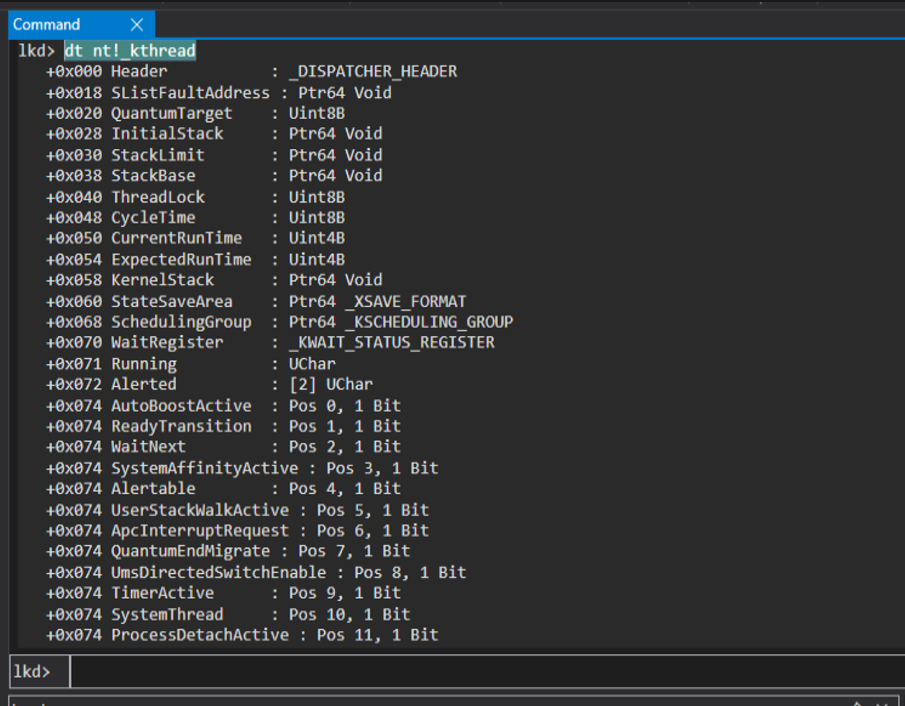

# Resumo

Noções básicas de *threads* no Windows: o que são, estrutura em depuração e alguns comandos do WinDbg.

# O que são threads?

- Uma *thread* é a menor unidade de execução no processo: sequência de instruções agendada em um núcleo de CPU. *Threads* do mesmo processo compartilham memória e *handles* de arquivos.
- Várias *threads* no mesmo processo podem executar partes distintas do código ao mesmo tempo.
- Sem *threads* concorrentes, o processo não roda trechos em paralelo; num processo de uma só *thread*, tudo é sequencial.

Visão rápida no Gerenciador de Tarefas.

  

Há milhares de *threads* no SO; a maior parte fica aguardando. Com CPU em ~9%, poucas estão de fato em execução. Se todas corressem ao mesmo tempo, o uso de CPU aproximaria 100%.

Diagrama básico:


# ETHREAD e KTHREAD

No Windows, uma *thread* é representada por um objeto executivo; o bloco **ETHREAD** concentra a maior parte da informação. Estrutura (referência, não a versão exata de cada build):

```CPP
//0x4c8 bytes (sizeof)
struct _ETHREAD
{
    struct _KTHREAD Tcb;                                                    //0x0
    union _LARGE_INTEGER CreateTime;                                        //0x348
    union
    {
        union _LARGE_INTEGER ExitTime;                                      //0x350
        struct _LIST_ENTRY KeyedWaitChain;                                  //0x350
    };
    VOID* ChargeOnlySession;                                                //0x360
    union
    {
        struct _LIST_ENTRY PostBlockList;                                   //0x368
        struct
        {
            VOID* ForwardLinkShadow;                                        //0x368
            VOID* StartAddress;                                             //0x370
        };
    };
    union
    {
        struct _TERMINATION_PORT* TerminationPort;                          //0x378
        struct _ETHREAD* ReaperLink;                                        //0x378
        VOID* KeyedWaitValue;                                               //0x378
    };
    ULONGLONG ActiveTimerListLock;                                          //0x380
    struct _LIST_ENTRY ActiveTimerListHead;                                 //0x388
    struct _CLIENT_ID Cid;                                                  //0x398
    union
    {
        struct _KSEMAPHORE KeyedWaitSemaphore;                              //0x3a8
        struct _KSEMAPHORE AlpcWaitSemaphore;                               //0x3a8
    };
    union _PS_CLIENT_SECURITY_CONTEXT ClientSecurity;                       //0x3c8
    struct _LIST_ENTRY IrpList;                                             //0x3d0
    ULONGLONG TopLevelIrp;                                                  //0x3e0
    struct _DEVICE_OBJECT* DeviceToVerify;                                  //0x3e8
    VOID* Win32StartAddress;                                                //0x3f0
    VOID* LegacyPowerObject;                                                //0x3f8
    struct _LIST_ENTRY ThreadListEntry;                                     //0x400
    struct _EX_RUNDOWN_REF RundownProtect;                                  //0x410
    struct _EX_PUSH_LOCK ThreadLock;                                        //0x418
    ULONG ReadClusterSize;                                                  //0x420
    volatile LONG MmLockOrdering;                                           //0x424
    volatile LONG CmLockOrdering;                                           //0x428
    union
    {
        ULONG CrossThreadFlags;                                             //0x42c
        struct
        {
            ULONG Terminated:1;                                             //0x42c
            ULONG ThreadInserted:1;                                         //0x42c
            ULONG HideFromDebugger:1;                                       //0x42c
            ULONG ActiveImpersonationInfo:1;                                //0x42c
            ULONG HardErrorsAreDisabled:1;                                  //0x42c
            ULONG BreakOnTermination:1;                                     //0x42c
            ULONG SkipCreationMsg:1;                                        //0x42c
            ULONG SkipTerminationMsg:1;                                     //0x42c
            ULONG CopyTokenOnOpen:1;                                        //0x42c
            ULONG ThreadIoPriority:3;                                       //0x42c
            ULONG ThreadPagePriority:3;                                     //0x42c
            ULONG RundownFail:1;                                            //0x42c
            ULONG UmsForceQueueTermination:1;                               //0x42c
            ULONG ReservedCrossThreadFlags:15;                              //0x42c
        };
    };
    union
    {
        ULONG SameThreadPassiveFlags;                                       //0x430
        struct
        {
            ULONG ActiveExWorker:1;                                         //0x430
            ULONG MemoryMaker:1;                                            //0x430
            ULONG ClonedThread:1;                                           //0x430
            ULONG KeyedEventInUse:1;                                        //0x430
            ULONG SelfTerminate:1;                                          //0x430
        };
    };
    union
    {
        ULONG SameThreadApcFlags;                                           //0x434
        struct
        {
            UCHAR Spare:1;                                                  //0x434
            volatile UCHAR StartAddressInvalid:1;                           //0x434
            UCHAR EtwCalloutActive:1;                                       //0x434
            UCHAR OwnsProcessWorkingSetExclusive:1;                         //0x434
            UCHAR OwnsProcessWorkingSetShared:1;                            //0x434
            UCHAR OwnsSystemCacheWorkingSetExclusive:1;                     //0x434
            UCHAR OwnsSystemCacheWorkingSetShared:1;                        //0x434
            UCHAR OwnsSessionWorkingSetExclusive:1;                         //0x434
            UCHAR OwnsSessionWorkingSetShared:1;                            //0x435
            UCHAR OwnsProcessAddressSpaceExclusive:1;                       //0x435
            UCHAR OwnsProcessAddressSpaceShared:1;                          //0x435
            UCHAR SuppressSymbolLoad:1;                                     //0x435
            UCHAR Prefetching:1;                                            //0x435
            UCHAR OwnsVadExclusive:1;                                       //0x435
            UCHAR OwnsChangeControlAreaExclusive:1;                         //0x435
            UCHAR OwnsChangeControlAreaShared:1;                            //0x435
            UCHAR OwnsPagedPoolWorkingSetExclusive:1;                       //0x436
            UCHAR OwnsPagedPoolWorkingSetShared:1;                          //0x436
            UCHAR OwnsSystemPtesWorkingSetExclusive:1;                      //0x436
            UCHAR OwnsSystemPtesWorkingSetShared:1;                         //0x436
            UCHAR TrimTrigger:2;                                            //0x436
            UCHAR Spare2:2;                                                 //0x436
            UCHAR PriorityRegionActive;                                     //0x437
        };
    };
    UCHAR CacheManagerActive;                                               //0x438
    UCHAR DisablePageFaultClustering;                                       //0x439
    UCHAR ActiveFaultCount;                                                 //0x43a
    UCHAR LockOrderState;                                                   //0x43b
    ULONGLONG AlpcMessageId;                                                //0x440
    union
    {
        VOID* AlpcMessage;                                                  //0x448
        ULONG AlpcReceiveAttributeSet;                                      //0x448
    };
    LONG ExitStatus;                                                        //0x450
    struct _LIST_ENTRY AlpcWaitListEntry;                                   //0x458
    ULONG CacheManagerCount;                                                //0x468
    ULONG IoBoostCount;                                                     //0x46c
    struct _LIST_ENTRY BoostList;                                           //0x470
    struct _LIST_ENTRY DeboostList;                                         //0x480
    ULONGLONG BoostListLock;                                                //0x490
    ULONGLONG IrpListLock;                                                  //0x498
    VOID* ReservedForSynchTracking;                                         //0x4a0
    struct _SINGLE_LIST_ENTRY CmCallbackListHead;                           //0x4a8
    struct _GUID* ActivityId;                                               //0x4b0
    VOID* WnfContext;                                                       //0x4b8
    ULONG KernelStackReference;                                             //0x4c0
}; 
```
Comando no WinDbg:

```
dt nt!_ethread
```



O primeiro membro de **ETHREAD** é **KTHREAD** (*Tcb*), usado para escalonamento, sincronismo e contagem de tempo.

Estrutura de **KTHREAD** (referência):

```CPP
//0x200 bytes (sizeof)
struct _KTHREAD
{
    struct _DISPATCHER_HEADER Header;                                       //0x0
    volatile ULONGLONG CycleTime;                                           //0x10
    volatile ULONG HighCycleTime;                                           //0x18
    ULONGLONG QuantumTarget;                                                //0x20
    VOID* InitialStack;                                                     //0x28
    VOID* volatile StackLimit;                                              //0x2c
    VOID* KernelStack;                                                      //0x30
    ULONG ThreadLock;                                                       //0x34
    union _KWAIT_STATUS_REGISTER WaitRegister;                              //0x38
    volatile UCHAR Running;                                                 //0x39
    UCHAR Alerted[2];                                                       //0x3a
    union
    {
        struct
        {
            ULONG KernelStackResident:1;                                    //0x3c
            ULONG ReadyTransition:1;                                        //0x3c
            ULONG ProcessReadyQueue:1;                                      //0x3c
            ULONG WaitNext:1;                                               //0x3c
            ULONG SystemAffinityActive:1;                                   //0x3c
            ULONG Alertable:1;                                              //0x3c
            ULONG GdiFlushActive:1;                                         //0x3c
            ULONG UserStackWalkActive:1;                                    //0x3c
            ULONG ApcInterruptRequest:1;                                    //0x3c
            ULONG ForceDeferSchedule:1;                                     //0x3c
            ULONG QuantumEndMigrate:1;                                      //0x3c
            ULONG UmsDirectedSwitchEnable:1;                                //0x3c
            ULONG TimerActive:1;                                            //0x3c
            ULONG SystemThread:1;                                           //0x3c
            ULONG Reserved:18;                                              //0x3c
        };
        LONG MiscFlags;                                                     //0x3c
    };
    union
    {
        struct _KAPC_STATE ApcState;                                        //0x40
        struct
        {
            UCHAR ApcStateFill[23];                                         //0x40
            CHAR Priority;                                                  //0x57
        };
    };
    volatile ULONG NextProcessor;                                           //0x58
    volatile ULONG DeferredProcessor;                                       //0x5c
    ULONG ApcQueueLock;                                                     //0x60
    ULONG ContextSwitches;                                                  //0x64
    volatile UCHAR State;                                                   //0x68
    CHAR NpxState;                                                          //0x69
    UCHAR WaitIrql;                                                         //0x6a
    CHAR WaitMode;                                                          //0x6b
    volatile LONG WaitStatus;                                               //0x6c
    struct _KWAIT_BLOCK* WaitBlockList;                                     //0x70
    union
    {
        struct _LIST_ENTRY WaitListEntry;                                   //0x74
        struct _SINGLE_LIST_ENTRY SwapListEntry;                            //0x74
    };
    struct _KQUEUE* volatile Queue;                                         //0x7c
    ULONG WaitTime;                                                         //0x80
    union
    {
        struct
        {
            SHORT KernelApcDisable;                                         //0x84
            SHORT SpecialApcDisable;                                        //0x86
        };
        ULONG CombinedApcDisable;                                           //0x84
    };
    VOID* Teb;                                                              //0x88
    struct _KTIMER Timer;                                                   //0x90
    union
    {
        struct
        {
            volatile ULONG AutoAlignment:1;                                 //0xb8
            volatile ULONG DisableBoost:1;                                  //0xb8
            volatile ULONG EtwStackTraceApc1Inserted:1;                     //0xb8
            volatile ULONG EtwStackTraceApc2Inserted:1;                     //0xb8
            volatile ULONG CalloutActive:1;                                 //0xb8
            volatile ULONG ApcQueueable:1;                                  //0xb8
            volatile ULONG EnableStackSwap:1;                               //0xb8
            volatile ULONG GuiThread:1;                                     //0xb8
            volatile ULONG UmsPerformingSyscall:1;                          //0xb8
            volatile ULONG VdmSafe:1;                                       //0xb8
            volatile ULONG UmsDispatched:1;                                 //0xb8
            volatile ULONG ReservedFlags:21;                                //0xb8
        };
        volatile LONG ThreadFlags;                                          //0xb8
    };
    VOID* ServiceTable;                                                     //0xbc
    struct _KWAIT_BLOCK WaitBlock[4];                                       //0xc0
    struct _LIST_ENTRY QueueListEntry;                                      //0x120
    struct _KTRAP_FRAME* TrapFrame;                                         //0x128
    VOID* FirstArgument;                                                    //0x12c
    union
    {
        VOID* CallbackStack;                                                //0x130
        ULONG CallbackDepth;                                                //0x130
    };
    UCHAR ApcStateIndex;                                                    //0x134
    CHAR BasePriority;                                                      //0x135
    union
    {
        CHAR PriorityDecrement;                                             //0x136
        struct
        {
            UCHAR ForegroundBoost:4;                                        //0x136
            UCHAR UnusualBoost:4;                                           //0x136
        };
    };
    UCHAR Preempted;                                                        //0x137
    UCHAR AdjustReason;                                                     //0x138
    CHAR AdjustIncrement;                                                   //0x139
    CHAR PreviousMode;                                                      //0x13a
    CHAR Saturation;                                                        //0x13b
    ULONG SystemCallNumber;                                                 //0x13c
    ULONG FreezeCount;                                                      //0x140
    volatile struct _GROUP_AFFINITY UserAffinity;                           //0x144
    struct _KPROCESS* Process;                                              //0x150
    volatile struct _GROUP_AFFINITY Affinity;                               //0x154
    ULONG IdealProcessor;                                                   //0x160
    ULONG UserIdealProcessor;                                               //0x164
    struct _KAPC_STATE* ApcStatePointer[2];                                 //0x168
    union
    {
        struct _KAPC_STATE SavedApcState;                                   //0x170
        struct
        {
            UCHAR SavedApcStateFill[23];                                    //0x170
            UCHAR WaitReason;                                               //0x187
        };
    };
    CHAR SuspendCount;                                                      //0x188
    CHAR Spare1;                                                            //0x189
    UCHAR OtherPlatformFill;                                                //0x18a
    VOID* volatile Win32Thread;                                             //0x18c
    VOID* StackBase;                                                        //0x190
    union
    {
        struct _KAPC SuspendApc;                                            //0x194
        struct
        {
            UCHAR SuspendApcFill0[1];                                       //0x194
            UCHAR ResourceIndex;                                            //0x195
        };
        struct
        {
            UCHAR SuspendApcFill1[3];                                       //0x194
            UCHAR QuantumReset;                                             //0x197
        };
        struct
        {
            UCHAR SuspendApcFill2[4];                                       //0x194
            ULONG KernelTime;                                               //0x198
        };
        struct
        {
            UCHAR SuspendApcFill3[36];                                      //0x194
            struct _KPRCB* volatile WaitPrcb;                               //0x1b8
        };
        struct
        {
            UCHAR SuspendApcFill4[40];                                      //0x194
            VOID* LegoData;                                                 //0x1bc
        };
        struct
        {
            UCHAR SuspendApcFill5[47];                                      //0x194
            UCHAR LargeStack;                                               //0x1c3
        };
    };
    ULONG UserTime;                                                         //0x1c4
    union
    {
        struct _KSEMAPHORE SuspendSemaphore;                                //0x1c8
        UCHAR SuspendSemaphorefill[20];                                     //0x1c8
    };
    ULONG SListFaultCount;                                                  //0x1dc
    struct _LIST_ENTRY ThreadListEntry;                                     //0x1e0
    struct _LIST_ENTRY MutantListHead;                                      //0x1e8
    VOID* SListFaultAddress;                                                //0x1f0
    struct _KTHREAD_COUNTERS* ThreadCounters;                               //0x1f4
    struct _XSTATE_SAVE* XStateSave;                                        //0x1f8
}; 
```

No WinDbg (depurador de kernel local, etc.):

```
dt nt!_kthread
```




