# Resumo
Neste artigo, vamos mergulhar em como um processo comum é criado em um ambiente Windows. Vamos começar escrevendo um código curto para criar um processo simples, depurá-lo com o depurador para entender o funcionamento interno e ver também como criar um processo via NTAPIs.

Observação: todas as referências, créditos e códigos serão citados neste artigo.

# Índice
1. **[Criação de processo com C++](#process-creation-via-c)**
2. **[Análise estática](#static-analysis)**
3. **[Análise com x64dbg](#x64dbg-analysis)**
4. **[Criação de processo via NTAPIs](#creating-process-via-ntapis)**

<a name="process-creation-via-c"></a>
# Criação de processo com C++
Há um artigo com uma visão geral de como um processo é criado no Windows; você pode ler **[aqui](./Overview%20of%20process%20creation.md)**. Ali tentei explicar a visão geral de toda a criação de processo (sem trocadilho). Vamos aprofundar. Abaixo há um C++ simples que inicia o processo **notepad.exe**. (O código está em **[`Create_Process.cpp`](../../codes/processos-jobs/Create_Process.cpp)**)
```CPP
#include <windows.h>
#include <iostream>

int main() {
    STARTUPINFO si = {};
    PROCESS_INFORMATION pi = {};

    // Path to the executable
    LPCWSTR notepadPath = L"C:\\Windows\\System32\\notepad.exe";

    if (CreateProcess(notepadPath, NULL, NULL, NULL, FALSE, 0, NULL, NULL, &si, &pi)) {
        std::wcout << L"Process ID (PID): " << pi.dwProcessId << std::endl;

        // Close process and thread handles
        CloseHandle(pi.hProcess);
        CloseHandle(pi.hThread);
    }
    else {
        std::cerr << "CreateProcess failed. Error: " << GetLastError() << std::endl;
    }

    return 0;
}
```
O código acima usa a API básica **[CreateProcess](https://learn.microsoft.com/en-us/windows/win32/api/processthreadsapi/nf-processthreadsapi-createprocessw)**, usada pelo Windows para criar processos e por malwares para criar processos maliciosos. A seguir, a assinatura da API.
```CPP
BOOL CreateProcessW(
  [in, optional]      LPCWSTR               lpApplicationName,
  [in, out, optional] LPWSTR                lpCommandLine,
  [in, optional]      LPSECURITY_ATTRIBUTES lpProcessAttributes,
  [in, optional]      LPSECURITY_ATTRIBUTES lpThreadAttributes,
  [in]                BOOL                  bInheritHandles,
  [in]                DWORD                 dwCreationFlags,
  [in, optional]      LPVOID                lpEnvironment,
  [in, optional]      LPCWSTR               lpCurrentDirectory,
  [in]                LPSTARTUPINFOW        lpStartupInfo,
  [out]               LPPROCESS_INFORMATION lpProcessInformation
);
```
Vamos passar pelos parâmetros.  
* **lpApplicationName** é o nome do processo a ser criado e deve ter o caminho completo para o executável. Neste exemplo, vemos **notepadPath** como parâmetro e essa variável é declarada acima com o caminho completo do notepad.exe
    ```CPP
    // Path to the executable
    LPCWSTR notepadPath = L"C:\\Windows\\System32\\notepad.exe";
    ```
* **`lpCommandLine`** são os argumentos de linha de comando do processo; podem ser declarados e passados. É opcional, então aqui é **NULL**.
* O **`lpProcessAttributes`** é um ponteiro para a estrutura **[SECURITY_ATTRIBUTES](https://learn.microsoft.com/en-us/previous-versions/windows/desktop/legacy/aa379560(v=vs.85))** que determina se o handle retornado para o novo objeto de processo pode ser herdado por processos filhos. Se lpProcessAttributes for **NULL**, o handle não é herdável.
* O **`lpThreadAttributes`** é o mesmo que **lpProcessAttributes**, declarado como **NULL**.
* Se **`bInheritHandles`** for TRUE, cada handle herdável no processo chamador é herdado pelo novo processo. Aqui é **FALSE**, ou seja, os handles não são herdados.
* O **`dwCreationFlags`** controla a classe de prioridade e a criação do processo. Aqui está a lista de valores para referência (**[aqui](https://learn.microsoft.com/en-us/windows/win32/procthread/process-creation-flags)**). A flag é declarada com valor 0.
* O **`lpEnvironment`** é um ponteiro para o bloco de ambiente do novo processo. Se for **NULL**, o novo processo usa o ambiente do processo chamador.
* O **`lpCurrentDirectory`** é o caminho completo do diretório do processo. Se for **NULL**, o processo usa a mesma unidade e diretório atuais do processo chamador. Também não precisamos do caminho de diretório de trabalho separado, porque já declaramos o caminho completo do notepad.exe
* O **`lpStartupInfo`** contém o ponteiro para a estrutura **[STARTUPINFO](https://learn.microsoft.com/en-us/windows/win32/api/processthreadsapi/ns-processthreadsapi-startupinfoa)**, usada para especificar propriedades da janela principal se uma nova janela for criada para o novo processo. A estrutura é declarada no código.
  ```
  STARTUPINFO si = {};
  ```
* O **`lpProcessInformation`** aponta para a estrutura **[PROCESS_INFORMATION](https://learn.microsoft.com/en-us/windows/win32/api/processthreadsapi/ns-processthreadsapi-process_information)** com informações sobre o processo e o thread primário recém-criados. A estrutura é declarada no código.
  ```
  PROCESS_INFORMATION pi = {};
  ```

Agora compilamos o código em modo Release e abrimos o executável gerado com duplo clique.  
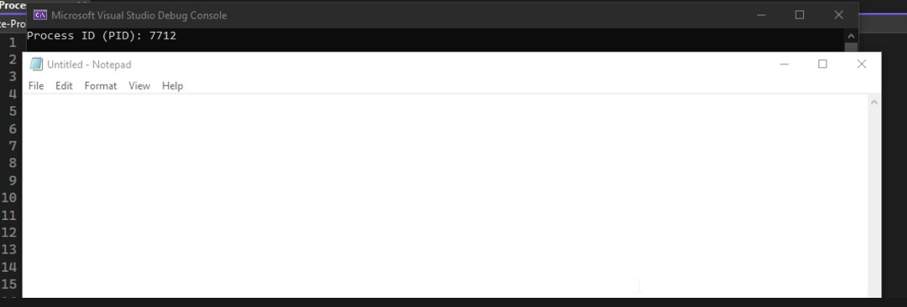  
Executou com sucesso e iniciou o notepad.exe

<a name="static-analysis"></a>
# Análise estática
Como em análise de malware, primeiro vemos a metodologia do nosso código de dentro. Para análise estática vamos abrir o executável em uma ferramenta chamada Cutter.

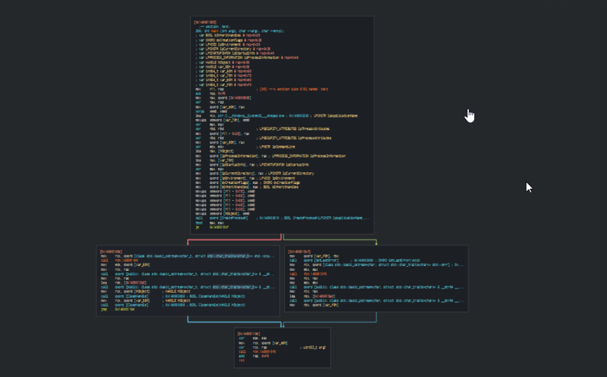  

Aqui está o fluxo gráfico de todo o processo (de novo, sem trocadilho)  

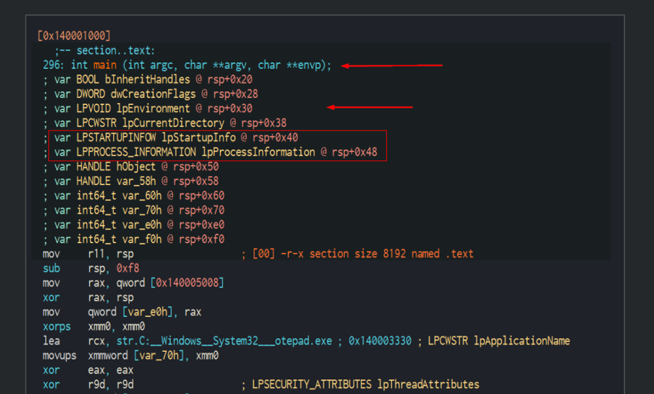  

Como se vê, a função **`main()`** aparece na análise junto com as variáveis e estruturas declaradas.

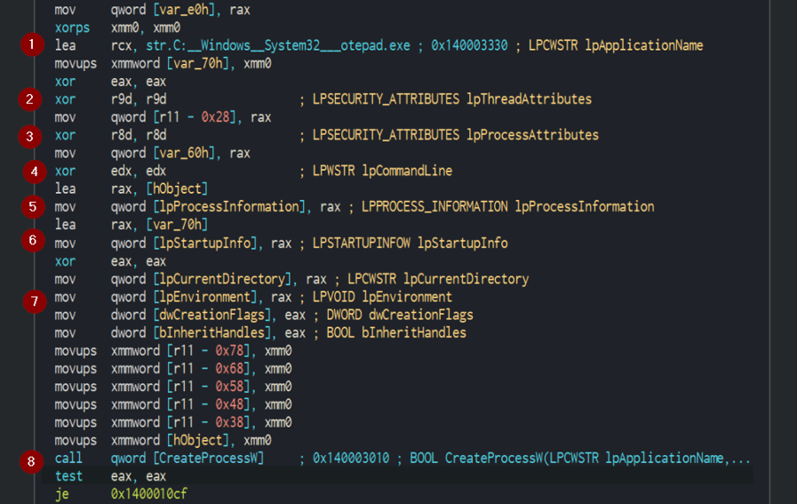  

Rolando para baixo, vemos o código em assembly - o que acontece:  
* O valor de `lpApplicationName` é carregado em rcx,
* O valor de `lpThreadAttributes` é definido como NULL
* O valor de `lpProcessAttributes` é definido como NULL
* O valor de `lpCommandLine` é definido como NULL
* O ponteiro de `lpProcessInformation` vem da variável definida
* O ponteiro de `lpStartupInfo` vem da variável definida
* Os demais parâmetros são ajustados conforme o caso.
* Depois a API `CreateProcess` é chamada com suas variáveis.

A API CreateProcess tem tipo de retorno BOOL. O retorno é não zero se a API tiver sucesso; caso contrário, o valor é 0.

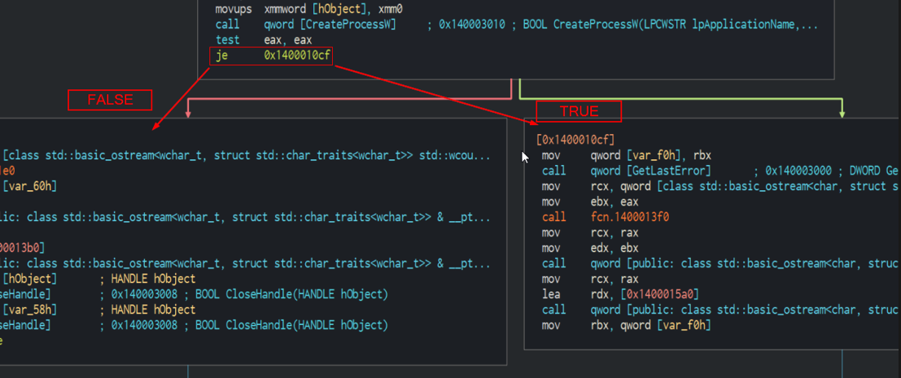  

A instrução JE (Jump If Equal) faz a comparação e desvia a execução se a API falhar.  

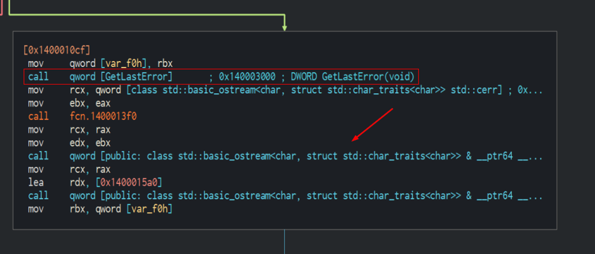  

**[GetLastError](https://learn.microsoft.com/en-us/windows/win32/api/errhandlingapi/nf-errhandlingapi-getlasterror)** é chamada para tratar o erro. E se a API tiver sucesso.  

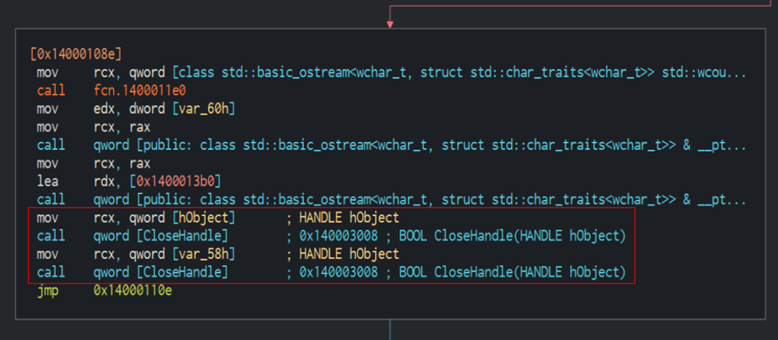  

O processo é criado e a API **[CloseHandle](https://learn.microsoft.com/en-us/windows/win32/api/handleapi/nf-handleapi-closehandle)** é chamada para fechar o processo de forma completa.

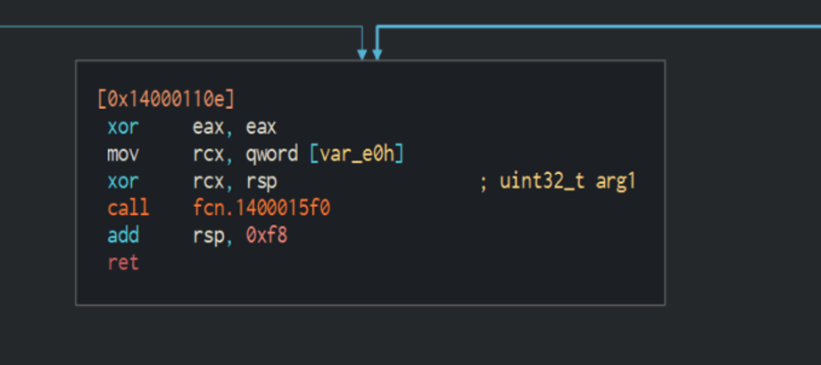  

Em seguida a função de retorno encerra o programa. Embora o fluxo todo seja compreensível, ainda não vemos a transição do modo usuário para o modo kernel. Para isso, faremos análise dinâmica do executável

<a name="x64dbg-analysis"></a>
# Análise com x64dbg
Abra o executável no x64dbg e pressione F9 para iniciar a execução. Para facilitar, já defini pontos de parada em pontos importantes.

Antes de continuar, eis o diagrama do fluxo de criação de um processo.

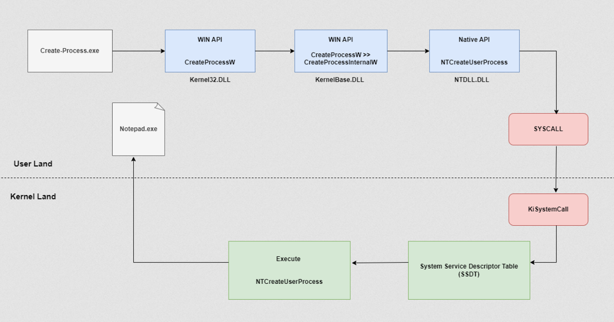  

Guarde esse fluxo em mente para entender melhor. Abra o .exe no depurador e pressione F9.

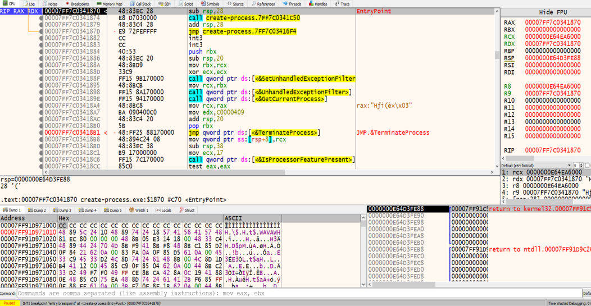  

Pressione F9 para ir ao próximo ponto de parada. 

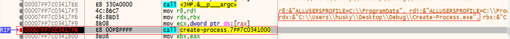  

É feita uma chamada de execução para o binário, ou seja, **create-process.exe**. Agora entre nessa chamada (step into) e pressione F9 para o próximo ponto de parada.  

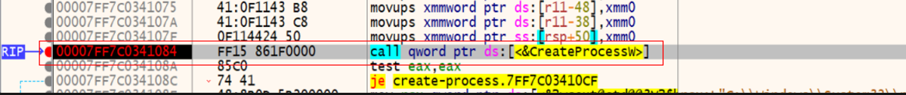  

Dentro vemos a chamada da API CreateProcessW, onde os parâmetros são definidos. Entre nela também. Depois de definir os parâmetros, avance até o instante imediatamente anterior à execução.  

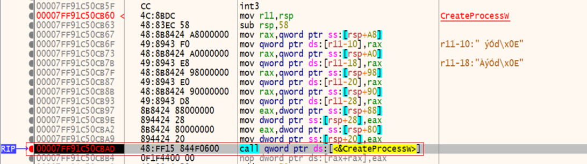  

Entre de novo para ver o que acontece após a chamada a **`CreateProcessW`**.  

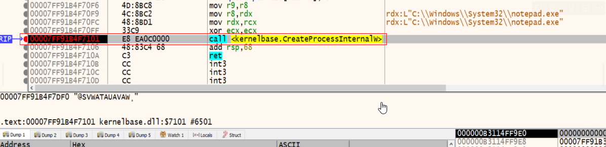  

**[CreateProcessInternalW](https://doxygen.reactos.org/d9/dd7/dll_2win32_2kernel32_2client_2proc_8c.html#a13a0f94b43874ed5a678909bc39cc1ab)** é chamada a partir de KernelBase.dll, que, em resumo, obtém funcionalidade de kernel32.dll e advapi32.dll. Agora entre em CreateProcessInternalW.

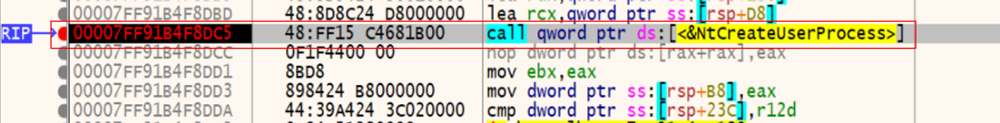

Há uma chamada a **`NtCreateUserProcess`** no NTDLL. A seguir, a assinatura da API
```CPP
NTSTATUS
NTAPI
NtCreateUserProcess(
    _Out_ PHANDLE ProcessHandle,
    _Out_ PHANDLE ThreadHandle,
    _In_ ACCESS_MASK ProcessDesiredAccess,
    _In_ ACCESS_MASK ThreadDesiredAccess,
    _In_opt_ POBJECT_ATTRIBUTES ProcessObjectAttributes,
    _In_opt_ POBJECT_ATTRIBUTES ThreadObjectAttributes,
    _In_ ULONG ProcessFlags,
    _In_ ULONG ThreadFlags,
    _In_ PRTL_USER_PROCESS_PARAMETERS ProcessParameters,
    _Inout_ PPS_CREATE_INFO CreateInfo,
    _In_ PPS_ATTRIBUTE_LIST AttributeList
);
```
Entrando na chamada da API.

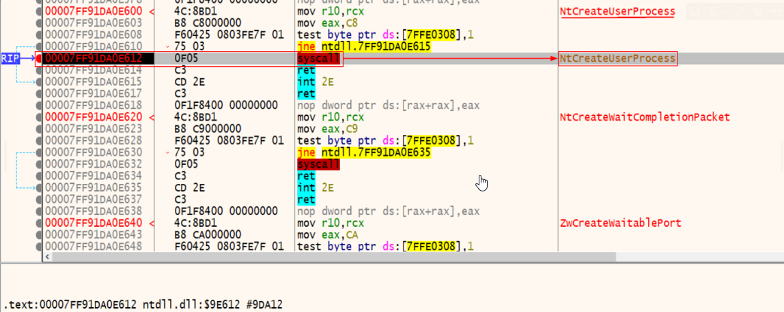  

É feita uma syscall para NtCreateUserProcess, que fica no kernel e de fato inicia o nosso processo. Se pressionarmos F9 para retomar, o notepad.exe é iniciado.  

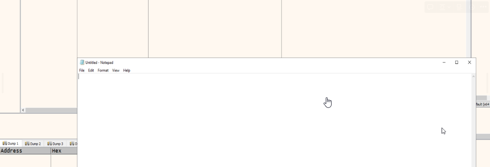  

Podemos ver todo esse processo de criação em um vídeo curto.  

<video controls width="100%"><source src="../../_media/process-creation-walkthrough.mp4" type="video/mp4"></video>

[Demonstração em vídeo](../../_media/process-creation-walkthrough.mp4)

<a name="creating-process-via-ntapis"></a>
# Criação de processo via NTAPIs
Nesta seção, vemos como criar um processo diretamente com a API nativa **`NtCreateUserProcess`**. Embora isso esteja além do meu nível, felizmente o **[@CaptMeelo](https://twitter.com/CaptMeelo)** escreveu um ótimo artigo mostrando como fazer. Aqui vou tentar explicar o método de forma simples. Para aprofundar, leia no site do autor **([AQUI](https://captmeelo.com/redteam/maldev/2022/05/10/ntcreateuserprocess.html))**. Todos os créditos ao autor pelo material.

Como vimos, a API **`NtCreateUserProcess`** é onde ocorre a transição do modo usuário para o modo kernel. A assinatura é a mesma de antes:

```CPP
NTSTATUS
NTAPI
NtCreateUserProcess(
    _Out_ PHANDLE ProcessHandle,
    _Out_ PHANDLE ThreadHandle,
    _In_ ACCESS_MASK ProcessDesiredAccess,
    _In_ ACCESS_MASK ThreadDesiredAccess,
    _In_opt_ POBJECT_ATTRIBUTES ProcessObjectAttributes,
    _In_opt_ POBJECT_ATTRIBUTES ThreadObjectAttributes,
    _In_ ULONG ProcessFlags,
    _In_ ULONG ThreadFlags,
    _In_ PRTL_USER_PROCESS_PARAMETERS ProcessParameters,
    _Inout_ PPS_CREATE_INFO CreateInfo,
    _In_ PPS_ATTRIBUTE_LIST AttributeList
);
```
Vamos entender os parâmetros. 
**`ProcessHandle`** e **`ThreadHandle`** armazenam os handles do processo e do thread criados. Esses dois argumentos são simples e podem ser inicializados assim.
```
HANDLE hProcess, hThread = NULL;
```
Para **`ProcessDesiredAccess`** e **`ThreadDesiredAccess`**, precisamos passar valores **`ACCESS_MASK`** que definem os direitos e o controle sobre o processo e o thread. Vários valores podem ser atribuídos a **`ACCESS_MASK`**, listados em **`winnt.h`**. Tratando apenas de processo e thread, podemos usar os direitos específicos **`PROCESS_ALL_ACCESS`** e **`THREAD_ALL_ACCESS`**.

Outras referências:  
* **[Direitos de acesso a processo](https://docs.microsoft.com/en-us/windows/win32/procthread/process-security-and-access-rights)**
* **[Direitos de acesso a thread](https://docs.microsoft.com/en-us/windows/win32/procthread/thread-security-and-access-rights)**

Os próximos parâmetros são **`ProcessObjectAttributes`** e **`ThreadObjectAttributes`**, ponteiros para **[OBJECT_ATTRIBUTES](https://learn.microsoft.com/en-us/windows/win32/api/ntdef/ns-ntdef-_object_attributes)**. Essa estrutura contém atributos que podem ser aplicados aos objetos ou handles que serão criados. Como são opcionais, podemos usar **`NULL`**.

As flags em **`ProcessFlags`** e **`ThreadFlags`** definem como queremos que processo e thread sejam criados. São semelhantes ao argumento **`dwCreationFlags`** de **`CreateProcess()`**, embora nesse contexto a correspondência não seja direta. Vale olhar o **[Process Hacker](https://processhacker.sourceforge.io/)** (aberto) para inspecionar propriedades de processo; ele interage com o kernel e APIs nativas. 

A partir do NTSAPI, eis parâmetros e valores válidos de **`ProcessFlags`** (**[aqui](https://github.com/winsiderss/systeminformer/blob/master/phnt/include/ntpsapi.h#L1354)**).
```CPP
#define PROCESS_CREATE_FLAGS_BREAKAWAY 0x00000001 // NtCreateProcessEx & NtCreateUserProcess
#define PROCESS_CREATE_FLAGS_NO_DEBUG_INHERIT 0x00000002 // NtCreateProcessEx & NtCreateUserProcess
#define PROCESS_CREATE_FLAGS_INHERIT_HANDLES 0x00000004 // NtCreateProcessEx & NtCreateUserProcess
#define PROCESS_CREATE_FLAGS_OVERRIDE_ADDRESS_SPACE 0x00000008 // NtCreateProcessEx only
#define PROCESS_CREATE_FLAGS_LARGE_PAGES 0x00000010 // NtCreateProcessEx only, requires SeLockMemory
#define PROCESS_CREATE_FLAGS_LARGE_PAGE_SYSTEM_DLL 0x00000020 // NtCreateProcessEx only, requires SeLockMemory
#define PROCESS_CREATE_FLAGS_PROTECTED_PROCESS 0x00000040 // NtCreateUserProcess only
#define PROCESS_CREATE_FLAGS_CREATE_SESSION 0x00000080 // NtCreateProcessEx & NtCreateUserProcess, requires SeLoadDriver
#define PROCESS_CREATE_FLAGS_INHERIT_FROM_PARENT 0x00000100 // NtCreateProcessEx & NtCreateUserProcess
#define PROCESS_CREATE_FLAGS_SUSPENDED 0x00000200 // NtCreateProcessEx & NtCreateUserProcess
#define PROCESS_CREATE_FLAGS_FORCE_BREAKAWAY 0x00000400 // NtCreateProcessEx & NtCreateUserProcess, requires SeTcb
#define PROCESS_CREATE_FLAGS_MINIMAL_PROCESS 0x00000800 // NtCreateProcessEx only
#define PROCESS_CREATE_FLAGS_RELEASE_SECTION 0x00001000 // NtCreateProcessEx & NtCreateUserProcess
#define PROCESS_CREATE_FLAGS_CLONE_MINIMAL 0x00002000 // NtCreateProcessEx only
#define PROCESS_CREATE_FLAGS_CLONE_MINIMAL_REDUCED_COMMIT 0x00004000 //
#define PROCESS_CREATE_FLAGS_AUXILIARY_PROCESS 0x00008000 // NtCreateProcessEx & NtCreateUserProcess, requires SeTcb
#define PROCESS_CREATE_FLAGS_CREATE_STORE 0x00020000 // NtCreateProcessEx & NtCreateUserProcess
#define PROCESS_CREATE_FLAGS_USE_PROTECTED_ENVIRONMENT 0x00040000 // NtCreateProcessEx & NtCreateUserProcess
```
E para **`ThreadFlags`** também (**[aqui](https://github.com/winsiderss/systeminformer/blob/master/phnt/include/ntpsapi.h#L2325)**).
```CPP
#define THREAD_CREATE_FLAGS_NONE 0x00000000
#define THREAD_CREATE_FLAGS_CREATE_SUSPENDED 0x00000001 // NtCreateUserProcess & NtCreateThreadEx
#define THREAD_CREATE_FLAGS_SKIP_THREAD_ATTACH 0x00000002 // NtCreateThreadEx only
#define THREAD_CREATE_FLAGS_HIDE_FROM_DEBUGGER 0x00000004 // NtCreateThreadEx only
#define THREAD_CREATE_FLAGS_LOADER_WORKER 0x00000010 // NtCreateThreadEx only
#define THREAD_CREATE_FLAGS_SKIP_LOADER_INIT 0x00000020 // NtCreateThreadEx only
#define THREAD_CREATE_FLAGS_BYPASS_PROCESS_FREEZE 0x00000040 // NtCreateThreadEx only
```
O útil é que os comentários indicam quais flags cada API suporta. Aqui vamos tratar de criação de processo comum, então a flag fica em **NULL**.

O último argumento, **`AttributeList`**, configura atributos na criação de processo e thread. Exemplo: PPID Spoofing com o atributo **`PROC_THREAD_ATTRIBUTE_PARENT_PROCESS`**. De novo, veja o NTSAPI do Process Hacker para valores e parâmetros válidos (**[aqui](https://github.com/winsiderss/systeminformer/blob/master/phnt/include/ntpsapi.h#L2001)**).

```CPP
#define PS_ATTRIBUTE_PARENT_PROCESS PsAttributeValue(PsAttributeParentProcess, FALSE, TRUE, TRUE)
#define PS_ATTRIBUTE_DEBUG_PORT PsAttributeValue(PsAttributeDebugPort, FALSE, TRUE, TRUE)
#define PS_ATTRIBUTE_TOKEN PsAttributeValue(PsAttributeToken, FALSE, TRUE, TRUE)
#define PS_ATTRIBUTE_CLIENT_ID PsAttributeValue(PsAttributeClientId, TRUE, FALSE, FALSE)
#define PS_ATTRIBUTE_TEB_ADDRESS PsAttributeValue(PsAttributeTebAddress, TRUE, FALSE, FALSE)
#define PS_ATTRIBUTE_IMAGE_NAME PsAttributeValue(PsAttributeImageName, FALSE, TRUE, FALSE)
#define PS_ATTRIBUTE_IMAGE_INFO PsAttributeValue(PsAttributeImageInfo, FALSE, FALSE, FALSE)
#define PS_ATTRIBUTE_MEMORY_RESERVE PsAttributeValue(PsAttributeMemoryReserve, FALSE, TRUE, FALSE)
#define PS_ATTRIBUTE_PRIORITY_CLASS PsAttributeValue(PsAttributePriorityClass, FALSE, TRUE, FALSE)
#define PS_ATTRIBUTE_ERROR_MODE PsAttributeValue(PsAttributeErrorMode, FALSE, TRUE, FALSE)
#define PS_ATTRIBUTE_STD_HANDLE_INFO PsAttributeValue(PsAttributeStdHandleInfo, FALSE, TRUE, FALSE)
#define PS_ATTRIBUTE_HANDLE_LIST PsAttributeValue(PsAttributeHandleList, FALSE, TRUE, FALSE)
#define PS_ATTRIBUTE_GROUP_AFFINITY PsAttributeValue(PsAttributeGroupAffinity, TRUE, TRUE, FALSE)
#define PS_ATTRIBUTE_PREFERRED_NODE PsAttributeValue(PsAttributePreferredNode, FALSE, TRUE, FALSE)
#define PS_ATTRIBUTE_IDEAL_PROCESSOR PsAttributeValue(PsAttributeIdealProcessor, TRUE, TRUE, FALSE)
#define PS_ATTRIBUTE_UMS_THREAD PsAttributeValue(PsAttributeUmsThread, TRUE, TRUE, FALSE)
#define PS_ATTRIBUTE_MITIGATION_OPTIONS PsAttributeValue(PsAttributeMitigationOptions, FALSE, TRUE, FALSE)
#define PS_ATTRIBUTE_PROTECTION_LEVEL PsAttributeValue(PsAttributeProtectionLevel, FALSE, TRUE, TRUE)
#define PS_ATTRIBUTE_SECURE_PROCESS PsAttributeValue(PsAttributeSecureProcess, FALSE, TRUE, FALSE)
#define PS_ATTRIBUTE_JOB_LIST PsAttributeValue(PsAttributeJobList, FALSE, TRUE, FALSE)
#define PS_ATTRIBUTE_CHILD_PROCESS_POLICY PsAttributeValue(PsAttributeChildProcessPolicy, FALSE, TRUE, FALSE)
#define PS_ATTRIBUTE_ALL_APPLICATION_PACKAGES_POLICY PsAttributeValue(PsAttributeAllApplicationPackagesPolicy, FALSE, TRUE, FALSE)
#define PS_ATTRIBUTE_WIN32K_FILTER PsAttributeValue(PsAttributeWin32kFilter, FALSE, TRUE, FALSE)
#define PS_ATTRIBUTE_SAFE_OPEN_PROMPT_ORIGIN_CLAIM PsAttributeValue(PsAttributeSafeOpenPromptOriginClaim, FALSE, TRUE, FALSE)
#define PS_ATTRIBUTE_BNO_ISOLATION PsAttributeValue(PsAttributeBnoIsolation, FALSE, TRUE, FALSE)
#define PS_ATTRIBUTE_DESKTOP_APP_POLICY PsAttributeValue(PsAttributeDesktopAppPolicy, FALSE, TRUE, FALSE)
#define PS_ATTRIBUTE_CHPE PsAttributeValue(PsAttributeChpe, FALSE, TRUE, TRUE)
#define PS_ATTRIBUTE_MITIGATION_AUDIT_OPTIONS PsAttributeValue(PsAttributeMitigationAuditOptions, FALSE, TRUE, FALSE)
#define PS_ATTRIBUTE_MACHINE_TYPE PsAttributeValue(PsAttributeMachineType, FALSE, TRUE, TRUE)
```

No código, a inicialização fica assim.

```CPP
PPS_ATTRIBUTE_LIST AttributeList = (PS_ATTRIBUTE_LIST*)RtlAllocateHeap(RtlProcessHeap(), HEAP_ZERO_MEMORY, sizeof(PS_ATTRIBUTE));
AttributeList->TotalLength = sizeof(PS_ATTRIBUTE_LIST) - sizeof(PS_ATTRIBUTE);

AttributeList->Attributes[0].Attribute = PS_ATTRIBUTE_IMAGE_NAME;
AttributeList->Attributes[0].Size = NtImagePath.Length;
AttributeList->Attributes[0].Value = (ULONG_PTR)NtImagePath.Buffer;
```

O **`pProcessParameters`** aponta para **`RTL_USER_PROCESS_PARAMETERS`**, que guarda os parâmetros do processo após executar **`RtlCreateProcessParametersEx()`**. O que constar na estrutura é entrada para **`NtCreateProcess()`**.

Assinatura de **`RtlCreateProcessParametersEx()`**:

```CPP
typedef NTSTATUS (NTAPI *_RtlCreateProcessParametersEx)(
    _Out_ PRTL_USER_PROCESS_PARAMETERS *pProcessParameters,
    _In_ PUNICODE_STRING ImagePathName,
    _In_opt_ PUNICODE_STRING DllPath,
    _In_opt_ PUNICODE_STRING CurrentDirectory,
    _In_opt_ PUNICODE_STRING CommandLine,
    _In_opt_ PVOID Environment,
    _In_opt_ PUNICODE_STRING WindowTitle,
    _In_opt_ PUNICODE_STRING DesktopInfo,
    _In_opt_ PUNICODE_STRING ShellInfo,
    _In_opt_ PUNICODE_STRING RuntimeData,
    _In_ ULONG Flags
);
```

E a estrutura **`RTL_USER_PROCESS_PARAMETERS`**:

```CPP
typedef struct _RTL_USER_PROCESS_PARAMETERS
{
    ULONG MaximumLength;
    ULONG Length;
 
    ULONG Flags;
    ULONG DebugFlags;
 
    HANDLE ConsoleHandle;
    ULONG ConsoleFlags;
    HANDLE StandardInput;
    HANDLE StandardOutput;
    HANDLE StandardError;
 
    CURDIR CurrentDirectory;
    UNICODE_STRING DllPath;
    UNICODE_STRING ImagePathName;
    UNICODE_STRING CommandLine;
    PVOID Environment;
 
    ULONG StartingX;
    ULONG StartingY;
    ULONG CountX;
    ULONG CountY;
    ULONG CountCharsX;
    ULONG CountCharsY;
    ULONG FillAttribute;
 
    ULONG WindowFlags;
    ULONG ShowWindowFlags;
    UNICODE_STRING WindowTitle;
    UNICODE_STRING DesktopInfo;
    UNICODE_STRING ShellInfo;
    UNICODE_STRING RuntimeData;
    RTL_DRIVE_LETTER_CURDIR CurrentDirectories[RTL_MAX_DRIVE_LETTERS];
 
    ULONG EnvironmentSize;
    ULONG EnvironmentVersion;
    PVOID PackageDependencyData;
    ULONG ProcessGroupId;
} RTL_USER_PROCESS_PARAMETERS, *PRTL_USER_PROCESS_PARAMETERS;
```

O segundo parâmetro, **`ImagePathName`**, guarda o caminho completo (formato NT) da imagem ou binário a partir do qual o processo será criado. Por exemplo:

```CPP
UNICODE_STRING NtImagePath;
RtlInitUnicodeString(&NtImagePath, (PWSTR)L"\\??\\C:\\Windows\\System32\\calc.exe");
```

A função **`RtlInitUnicodeString()`**, com a assinatura abaixo, é necessária para inicializar **`UNICODE_STRING`**.

```CPP
VOID NTAPIRtlInitUnicodeString(
    _Out_ PUNICODE_STRING DestinationString,
    _In_opt_ PWSTR SourceString
);
```

E a estrutura **`UNICODE_STRING`**.

```CPP
typedef struct _UNICODE_STRING
{
  USHORT Length;
  USHORT MaximumLength;
  PWSTR Buffer;
} UNICODE_STRING, * PUNICODE_STRING;
```


A inicialização de **`UNICODE_STRING`** ocorre assim:
- **Length** e **MaximumLength** recebem o tamanho de **`SourceString`**
- **Buffer** recebe o endereço da string passada em **`SourceString`**
  
Os demais argumentos são opcionais, então **NULL**. Um cenário em que esses parâmetros ajudam é “misturar-se” para evitar detecção. Se **CommandLine** for **NULL**, o valor após a criação do processo fica o mesmo de **ImagePathName**.  

Segue o código completo do **[@CaptMeelo](https://twitter.com/CaptMeelo)**.

```CPP
#include <Windows.h>
#include "ntdll.h"
#pragma comment(lib, "ntdll")

int main()
{
	// Path to the image file from which the process will be created
	UNICODE_STRING NtImagePath;
	RtlInitUnicodeString(&NtImagePath, (PWSTR)L"\\??\\C:\\Windows\\System32\\calc.exe");

	// Create the process parameters
	PRTL_USER_PROCESS_PARAMETERS ProcessParameters = NULL;
	RtlCreateProcessParametersEx(&ProcessParameters, &NtImagePath, NULL, NULL, NULL, NULL, NULL, NULL, NULL, NULL, RTL_USER_PROCESS_PARAMETERS_NORMALIZED);

	// Initialize the PS_CREATE_INFO structure
	PS_CREATE_INFO CreateInfo = { 0 };
	CreateInfo.Size = sizeof(CreateInfo);
	CreateInfo.State = PsCreateInitialState;

	// Initialize the PS_ATTRIBUTE_LIST structure
	PPS_ATTRIBUTE_LIST AttributeList = (PPS_ATTRIBUTE_LIST*)RtlAllocateHeap(RtlProcessHeap(), HEAP_ZERO_MEMORY, sizeof(PS_ATTRIBUTE));
	AttributeList->TotalLength = sizeof(PS_ATTRIBUTE_LIST) - sizeof(PS_ATTRIBUTE);
	AttributeList->Attributes[0].Attribute = PS_ATTRIBUTE_IMAGE_NAME;
	AttributeList->Attributes[0].Size = NtImagePath.Length;
	AttributeList->Attributes[0].Value = (ULONG_PTR)NtImagePath.Buffer;

	// Create the process
	HANDLE hProcess, hThread = NULL;
	NtCreateUserProcess(&hProcess, &hThread, PROCESS_ALL_ACCESS, THREAD_ALL_ACCESS, NULL, NULL, NULL, NULL, ProcessParameters, &CreateInfo, AttributeList);

	// Clean up
	RtlFreeHeap(RtlProcessHeap(), 0, AttributeList);
	RtlDestroyProcessParameters(ProcessParameters);
}
```

Compilando e executando, o calc.exe é exibido.

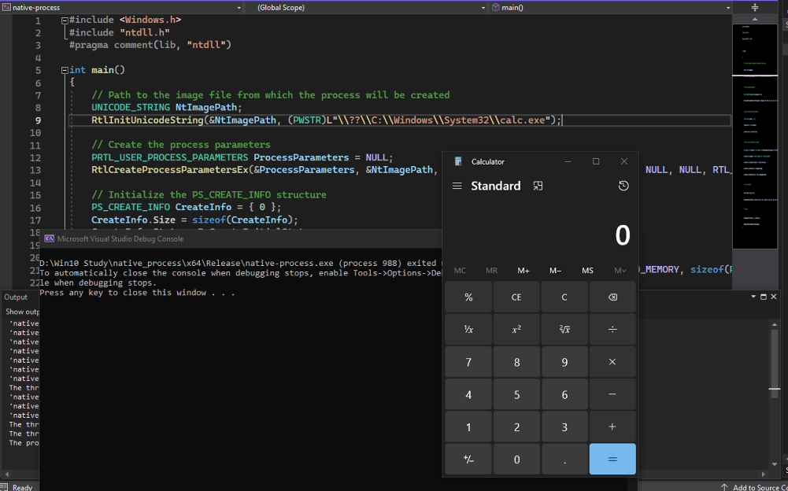


# Conclusão
Neste artigo vimos como um processo comum é criado no Windows. Escrevemos C++ que inicia um processo, depuramos no depurador para ver o fluxo interno e vimos um POC que cria processo via NTAPIs. Referências e recursos abaixo.

Obrigado por ler.

# Referências
1. **https://doxygen.reactos.org/**
2. **https://captmeelo.com/redteam/maldev/2022/05/10/ntcreateuserprocess.html**
3. **https://github.com/capt-meelo/NtCreateUserProcess**
4. **https://github.com/winsiderss/systeminformer/blob/master/phnt/include/ntpsapi.h**


 


