# Resumo
Neste artigo, continuamos a inspecionar campos do PEB com um depurador. Também percorremos o PEB e vemos como o arquivo NTDLL é carregado na memória do processo.

A parte anterior está **[aqui](./PEB%20-%20Part%201.md)**

# Índice
1. **[ProcessHeap](#processheap)**
2. **[FastPebLock](#fastpeblock)**
3. **[KernelCallbackTable](#kernelcallbacktable)**
4. **[Percorrendo o PEB](#percorrendo-o-peb)**
5. **[Percorrendo o PEB com C++](#percorrendo-o-peb-com-c)**
6. **[Recursos](#recursos)**

Você pode usar qualquer processo; aqui uso **notepad.exe**

# ProcessHeap
O campo ```ProcessHeap``` no PEB é um ponteiro para o heap do processo. 
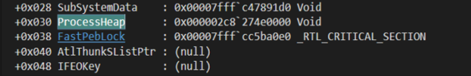

Em 64 bits, ProcessHeap fica no deslocamento 0x30. Usa a estrutura **_HEAP**. Vejamos.
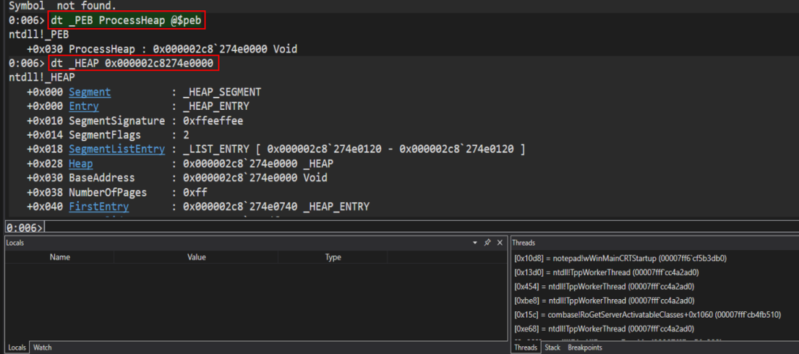

```
0:006> dt _PEB ProcessHeap @$peb
ntdll!_PEB
   +0x030 ProcessHeap : 0x000002c8`274e0000 Void
```
```
0:006> dt _HEAP 0x000002c8274e0000
ntdll!_HEAP
   +0x000 Segment          : _HEAP_SEGMENT
   +0x000 Entry            : _HEAP_ENTRY
   +0x010 SegmentSignature : 0xffeeffee
   +0x014 SegmentFlags     : 2
   +0x018 SegmentListEntry : _LIST_ENTRY [ 0x000002c8`274e0120 - 0x000002c8`274e0120 ]
   +0x028 Heap             : 0x000002c8`274e0000 _HEAP
   +0x030 BaseAddress      : 0x000002c8`274e0000 Void
   +0x038 NumberOfPages    : 0xff
   +0x040 FirstEntry       : 0x000002c8`274e0740 _HEAP_ENTRY
   +0x048 LastValidEntry   : 0x000002c8`275df000 _HEAP_ENTRY
   +0x050 NumberOfUnCommittedPages : 0x8b
   +0x054 NumberOfUnCommittedRanges : 1
   +0x058 SegmentAllocatorBackTraceIndex : 0
   +0x05a Reserved         : 0
   +0x060 UCRSegmentList   : _LIST_ENTRY [ 0x000002c8`27553fe0 - 0x000002c8`27553fe0 ]
   +0x070 Flags            : 2
   +0x074 ForceFlags       : 0
   +0x078 CompatibilityFlags : 0
   +0x07c EncodeFlagMask   : 0x100000
   +0x080 Encoding         : _HEAP_ENTRY
   +0x090 Interceptor      : 0
   +0x094 VirtualMemoryThreshold : 0xff00
   +0x098 Signature        : 0xeeffeeff
   +0x0a0 SegmentReserve   : 0x100000
   +0x0a8 SegmentCommit    : 0x2000
   +0x0b0 DeCommitFreeBlockThreshold : 0x400
   +0x0b8 DeCommitTotalFreeThreshold : 0x1000
   +0x0c0 TotalFreeSize    : 0x257
   +0x0c8 MaximumAllocationSize : 0x00007fff`fffdefff
   +0x0d0 ProcessHeapsListIndex : 1
   +0x0d2 HeaderValidateLength : 0x2c0
   +0x0d8 HeaderValidateCopy : (null) 
   +0x0e0 NextAvailableTagIndex : 0
   +0x0e2 MaximumTagIndex  : 0
   +0x0e8 TagEntries       : (null) 
   +0x0f0 UCRList          : _LIST_ENTRY [ 0x000002c8`27553fd0 - 0x000002c8`27553fd0 ]
   +0x100 AlignRound       : 0x1f
   +0x108 AlignMask        : 0xffffffff`fffffff0
   +0x110 VirtualAllocdBlocks : _LIST_ENTRY [ 0x000002c8`274e0110 - 0x000002c8`274e0110 ]
   +0x120 SegmentList      : _LIST_ENTRY [ 0x000002c8`274e0018 - 0x000002c8`274e0018 ]
   +0x130 AllocatorBackTraceIndex : 0
   +0x134 NonDedicatedListLength : 0
   +0x138 BlocksIndex      : 0x000002c8`274e02e8 Void
   +0x140 UCRIndex         : (null) 
   +0x148 PseudoTagEntries : (null) 
   +0x150 FreeLists        : _LIST_ENTRY [ 0x000002c8`27524a10 - 0x000002c8`275521d0 ]
   +0x160 LockVariable     : 0x000002c8`274e02c0 _HEAP_LOCK
   +0x168 CommitRoutine    : 0x0f65525e`88e4e94d     long  +f65525e88e4e94d
   +0x170 StackTraceInitVar : _RTL_RUN_ONCE
   +0x178 CommitLimitData  : _RTL_HEAP_MEMORY_LIMIT_DATA
   +0x198 FrontEndHeap     : 0x000002c8`27440000 Void
   +0x1a0 FrontHeapLockCount : 0
   +0x1a2 FrontEndHeapType : 0x2 ''
   +0x1a3 RequestedFrontEndHeapType : 0x2 ''
   +0x1a8 FrontEndHeapUsageData : 0x000002c8`274e67f0  ""
   +0x1b0 FrontEndHeapMaximumIndex : 0x402
   +0x1b2 FrontEndHeapStatusBitmap : [129]  "???"
   +0x238 Counters         : _HEAP_COUNTERS
   +0x2b0 TuningParameters : _HEAP_TUNING_PARAMETERS
```
Há muitos campos; vale notar que **_HEAP** em grande parte não é documentada. Com a API **GetProcessHeap()** obtemos o handle do heap.
```CPP
HANDLE GetProcessHeap();
```
No Windows, o heap do processo é gerenciado pelo Heap Manager, parte do Memory Manager. O Heap Manager oferece funções para alocar, liberar e gerir memória no heap. Algumas APIs importantes:

**[HeapCreate()](https://learn.microsoft.com/en-us/windows/win32/api/heapapi/nf-heapapi-heapcreate)** - Cria um novo objeto de heap para o processo chamador. Parametros incluem tamanho inicial, maximo e flags.
```CPP
HANDLE HeapCreate(
  [in] DWORD  flOptions,
  [in] SIZE_T dwInitialSize,
  [in] SIZE_T dwMaximumSize
);
```

**[HeapAlloc()](https://learn.microsoft.com/en-us/windows/win32/api/heapapi/nf-heapapi-heapalloc)** - Aloca um bloco no heap do processo: handle do heap e tamanho.
```CPP
DECLSPEC_ALLOCATOR LPVOID HeapAlloc(
  [in] HANDLE hHeap,
  [in] DWORD  dwFlags,
  [in] SIZE_T dwBytes
);
```

**[HeapFree()](https://learn.microsoft.com/en-us/windows/win32/api/heapapi/nf-heapapi-heapfree)** - Libera um bloco alocado no heap: handle do heap e ponteiro para o bloco.
```CPP
BOOL HeapFree(
  [in] HANDLE                 hHeap,
  [in] DWORD                  dwFlags,
  [in] _Frees_ptr_opt_ LPVOID lpMem
);
```
**[HeapReAlloc()](https://learn.microsoft.com/en-us/windows/win32/api/heapapi/nf-heapapi-heaprealloc)** - Redimensiona um bloco previamente alocado: handle, ponteiro e novo tamanho.
```CPP
DECLSPEC_ALLOCATOR LPVOID HeapReAlloc(
  [in] HANDLE                 hHeap,
  [in] DWORD                  dwFlags,
  [in] _Frees_ptr_opt_ LPVOID lpMem,
  [in] SIZE_T                 dwBytes
);
```

# FastPebLock
O campo **`FastPebLock`** no PEB é um mecanismo de sincronismo para acesso thread-safe ao PEB. É um lock rápido e leve para que apenas um thread de cada vez acesse ou modifique o PEB.  
O objetivo é evitar corrupção de dados ou inconsistência quando vários threads acessam o PEB ao mesmo tempo. Ajuda a manter a integridade dos dados e sincronizar acesso concorrente.  
O **`FastPebLock`** é implementado como lock leitor-escritor: vários leitores podem ler em paralelo; a escrita é exclusiva.  
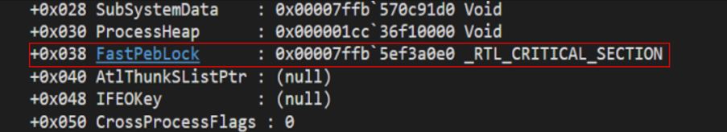  
**`RtlAcquirePebLock()`** adquire o **`FastPebLock`** antes de acessar ou modificar o PEB, de modo a serializar o acesso quando necessário.
```CPP
RtlAcquirePebLock(VOID)
{
   PPEB Peb = NtCurrentPeb ();
   RtlEnterCriticalSection(Peb->FastPebLock);
}
```
**`RtlReleasePebLock()`** libera o FastPebLock após as operações no PEB.
```CPP
RtlReleasePebLock(VOID)
{
   PPEB Peb = NtCurrentPeb ();
   RtlLeaveCriticalSection(Peb->FastPebLock);
}
```

# KernelCallbackTable
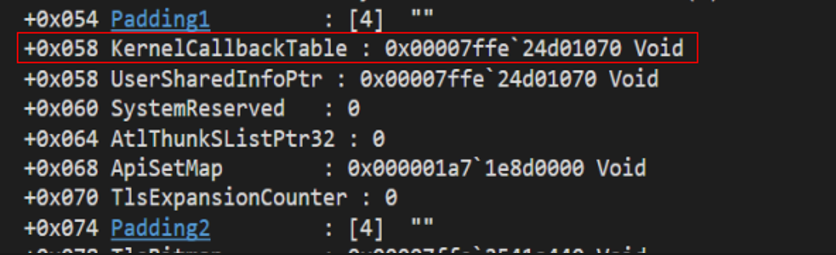
O campo **`KernelCallbackTable`** no PEB aponta para um array de ponteiros de funções de callback no kernel. Esses callbacks permitem a drivers ou componentes do kernel reagir a eventos do sistema.  
O array de **`KernelCallbackTable`** mapeia rotinas de callback; o kernel as invoca em eventos como criação de processo ou thread, registro, sistema de arquivos, etc.  
`KernelCallbackTable` fica no PEB e é preenchida quando user32.dll é carregada em um processo com GUI.  
A estrutura (simplificada) segue.  
```CPP
typedef struct _KERNELCALLBACKTABLE_T {
  ULONG_PTR __fnCOPYDATA;
  ULONG_PTR __fnCOPYGLOBALDATA;
  ULONG_PTR __fnDWORD;
  ULONG_PTR __fnNCDESTROY;
  ULONG_PTR __fnDWORDOPTINLPMSG;
  ULONG_PTR __fnINOUTDRAG;
  ULONG_PTR __fnGETTEXTLENGTHS;
  ULONG_PTR __fnINCNTOUTSTRING;
  ULONG_PTR __fnPOUTLPINT;
  ULONG_PTR __fnINLPCOMPAREITEMSTRUCT;
  ULONG_PTR __fnINLPCREATESTRUCT;
  ULONG_PTR __fnINLPDELETEITEMSTRUCT;
  ULONG_PTR __fnINLPDRAWITEMSTRUCT;
  ULONG_PTR __fnPOPTINLPUINT;
  ULONG_PTR __fnPOPTINLPUINT2;
  ULONG_PTR __fnINLPMDICREATESTRUCT;
  ULONG_PTR __fnINOUTLPMEASUREITEMSTRUCT;
  ULONG_PTR __fnINLPWINDOWPOS;
  ULONG_PTR __fnINOUTLPPOINT5;
  ULONG_PTR __fnINOUTLPSCROLLINFO;
  ULONG_PTR __fnINOUTLPRECT;
  ULONG_PTR __fnINOUTNCCALCSIZE;
  ULONG_PTR __fnINOUTLPPOINT5_;
  ULONG_PTR __fnINPAINTCLIPBRD;
  ULONG_PTR __fnINSIZECLIPBRD;
  ULONG_PTR __fnINDESTROYCLIPBRD;
  ULONG_PTR __fnINSTRING;
  ULONG_PTR __fnINSTRINGNULL;
  ULONG_PTR __fnINDEVICECHANGE;
  ULONG_PTR __fnPOWERBROADCAST;
  ULONG_PTR __fnINLPUAHDRAWMENU;
  ULONG_PTR __fnOPTOUTLPDWORDOPTOUTLPDWORD;
  ULONG_PTR __fnOPTOUTLPDWORDOPTOUTLPDWORD_;
  ULONG_PTR __fnOUTDWORDINDWORD;
  ULONG_PTR __fnOUTLPRECT;
  ULONG_PTR __fnOUTSTRING;
  ULONG_PTR __fnPOPTINLPUINT3;
  ULONG_PTR __fnPOUTLPINT2;
  ULONG_PTR __fnSENTDDEMSG;
  ULONG_PTR __fnINOUTSTYLECHANGE;
  ULONG_PTR __fnHkINDWORD;
  ULONG_PTR __fnHkINLPCBTACTIVATESTRUCT;
  ULONG_PTR __fnHkINLPCBTCREATESTRUCT;
  ULONG_PTR __fnHkINLPDEBUGHOOKSTRUCT;
  ULONG_PTR __fnHkINLPMOUSEHOOKSTRUCTEX;
  ULONG_PTR __fnHkINLPKBDLLHOOKSTRUCT;
  ULONG_PTR __fnHkINLPMSLLHOOKSTRUCT;
  ULONG_PTR __fnHkINLPMSG;
  ULONG_PTR __fnHkINLPRECT;
  ULONG_PTR __fnHkOPTINLPEVENTMSG;
  ULONG_PTR __xxxClientCallDelegateThread;
  ULONG_PTR __ClientCallDummyCallback;
  ULONG_PTR __fnKEYBOARDCORRECTIONCALLOUT;
  ULONG_PTR __fnOUTLPCOMBOBOXINFO;
  ULONG_PTR __fnINLPCOMPAREITEMSTRUCT2;
  ULONG_PTR __xxxClientCallDevCallbackCapture;
  ULONG_PTR __xxxClientCallDitThread;
  ULONG_PTR __xxxClientEnableMMCSS;
  ULONG_PTR __xxxClientUpdateDpi;
  ULONG_PTR __xxxClientExpandStringW;
  ULONG_PTR __ClientCopyDDEIn1;
  ULONG_PTR __ClientCopyDDEIn2;
  ULONG_PTR __ClientCopyDDEOut1;
  ULONG_PTR __ClientCopyDDEOut2;
  ULONG_PTR __ClientCopyImage;
  ULONG_PTR __ClientEventCallback;
  ULONG_PTR __ClientFindMnemChar;
  ULONG_PTR __ClientFreeDDEHandle;
  ULONG_PTR __ClientFreeLibrary;
  ULONG_PTR __ClientGetCharsetInfo;
  ULONG_PTR __ClientGetDDEFlags;
  ULONG_PTR __ClientGetDDEHookData;
  ULONG_PTR __ClientGetListboxString;
  ULONG_PTR __ClientGetMessageMPH;
  ULONG_PTR __ClientLoadImage;
  ULONG_PTR __ClientLoadLibrary;
  ULONG_PTR __ClientLoadMenu;
  ULONG_PTR __ClientLoadLocalT1Fonts;
  ULONG_PTR __ClientPSMTextOut;
  ULONG_PTR __ClientLpkDrawTextEx;
  ULONG_PTR __ClientExtTextOutW;
  ULONG_PTR __ClientGetTextExtentPointW;
  ULONG_PTR __ClientCharToWchar;
  ULONG_PTR __ClientAddFontResourceW;
  ULONG_PTR __ClientThreadSetup;
  ULONG_PTR __ClientDeliverUserApc;
  ULONG_PTR __ClientNoMemoryPopup;
  ULONG_PTR __ClientMonitorEnumProc;
  ULONG_PTR __ClientCallWinEventProc;
  ULONG_PTR __ClientWaitMessageExMPH;
  ULONG_PTR __ClientWOWGetProcModule;
  ULONG_PTR __ClientWOWTask16SchedNotify;
  ULONG_PTR __ClientImmLoadLayout;
  ULONG_PTR __ClientImmProcessKey;
  ULONG_PTR __fnIMECONTROL;
  ULONG_PTR __fnINWPARAMDBCSCHAR;
  ULONG_PTR __fnGETTEXTLENGTHS2;
  ULONG_PTR __fnINLPKDRAWSWITCHWND;
  ULONG_PTR __ClientLoadStringW;
  ULONG_PTR __ClientLoadOLE;
  ULONG_PTR __ClientRegisterDragDrop;
  ULONG_PTR __ClientRevokeDragDrop;
  ULONG_PTR __fnINOUTMENUGETOBJECT;
  ULONG_PTR __ClientPrinterThunk;
  ULONG_PTR __fnOUTLPCOMBOBOXINFO2;
  ULONG_PTR __fnOUTLPSCROLLBARINFO;
  ULONG_PTR __fnINLPUAHDRAWMENU2;
  ULONG_PTR __fnINLPUAHDRAWMENUITEM;
  ULONG_PTR __fnINLPUAHDRAWMENU3;
  ULONG_PTR __fnINOUTLPUAHMEASUREMENUITEM;
  ULONG_PTR __fnINLPUAHDRAWMENU4;
  ULONG_PTR __fnOUTLPTITLEBARINFOEX;
  ULONG_PTR __fnTOUCH;
  ULONG_PTR __fnGESTURE;
  ULONG_PTR __fnPOPTINLPUINT4;
  ULONG_PTR __fnPOPTINLPUINT5;
  ULONG_PTR __xxxClientCallDefaultInputHandler;
  ULONG_PTR __fnEMPTY;
  ULONG_PTR __ClientRimDevCallback;
  ULONG_PTR __xxxClientCallMinTouchHitTestingCallback;
  ULONG_PTR __ClientCallLocalMouseHooks;
  ULONG_PTR __xxxClientBroadcastThemeChange;
  ULONG_PTR __xxxClientCallDevCallbackSimple;
  ULONG_PTR __xxxClientAllocWindowClassExtraBytes;
  ULONG_PTR __xxxClientFreeWindowClassExtraBytes;
  ULONG_PTR __fnGETWINDOWDATA;
  ULONG_PTR __fnINOUTSTYLECHANGE2;
  ULONG_PTR __fnHkINLPMOUSEHOOKSTRUCTEX2;
} KERNELCALLBACKTABLE;
```
Comando no WinDbg para exibir a tabela.
```
0:006> dps 0x00007ffe24d01070
00007ffe`24d01070  00007ffe`24c92710 USER32!_fnCOPYDATA
00007ffe`24d01078  00007ffe`24cf9a00 USER32!_fnCOPYGLOBALDATA
00007ffe`24d01080  00007ffe`24c90b90 USER32!_fnDWORD
00007ffe`24d01088  00007ffe`24c969f0 USER32!_fnNCDESTROY
00007ffe`24d01090  00007ffe`24c9da60 USER32!_fnDWORDOPTINLPMSG
00007ffe`24d01098  00007ffe`24cfa230 USER32!_fnINOUTDRAG
00007ffe`24d010a0  00007ffe`24c97f20 USER32!_fnGETTEXTLENGTHS
00007ffe`24d010a8  00007ffe`24cf9ed0 USER32!_fnINCNTOUTSTRING
00007ffe`24d010b0  00007ffe`24cf9f90 USER32!_fnINCNTOUTSTRINGNULL
00007ffe`24d010b8  00007ffe`24c99690 USER32!_fnINLPCOMPAREITEMSTRUCT
00007ffe`24d010c0  00007ffe`24c92b70 USER32!__fnINLPCREATESTRUCT
00007ffe`24d010c8  00007ffe`24cfa050 USER32!_fnINLPDELETEITEMSTRUCT
00007ffe`24d010d0  00007ffe`24c9fdf0 USER32!__fnINLPDRAWITEMSTRUCT
00007ffe`24d010d8  00007ffe`24cfa0b0 USER32!_fnINLPHELPINFOSTRUCT
00007ffe`24d010e0  00007ffe`24cfa0b0 USER32!_fnINLPHELPINFOSTRUCT
00007ffe`24d010e8  00007ffe`24cfa1b0 USER32!_fnINLPMDICREATESTRUCT
```
Técnicas de injeção de processo via KernelCallbackTable são usadas em malware, inclusive por atores do tipo FinSpy e Lazarus; veja **[MITRE T1574.013](https://attack.mitre.org/techniques/T1574/013/)**.

# Percorrendo o PEB
Nesta demonstração, obtemos o endereço base do NTDLL a partir do LDR no PEB. O processo é o notepad.exe. Para o contexto LDR, veja a seção LDR do **PEB - Parte 1** **[aqui](./PEB%20-%20Part%201.md#ldr)**.
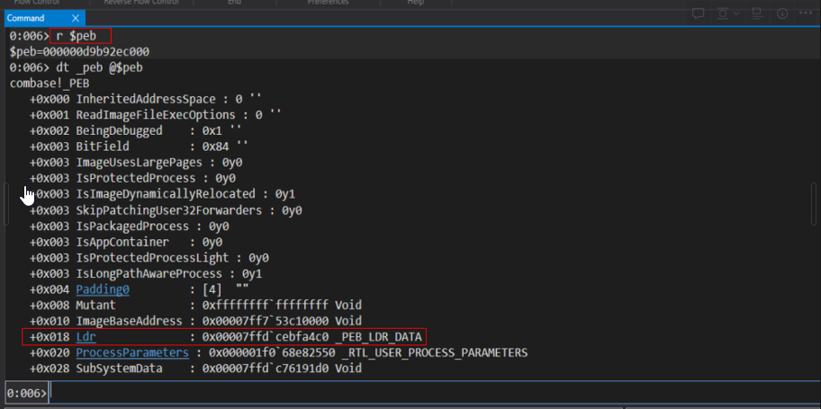\
A estrutura LDR fica no deslocamento **0x18** em 64 bits. A estrutura PEB (trecho) é:
```Cpp
typedef struct _PEB {
  BYTE                          Reserved1[2];
  BYTE                          BeingDebugged;
  BYTE                          Reserved2[1];
  PVOID                         Reserved3[2];
  PPEB_LDR_DATA                 Ldr;
  // ...
} PEB, *PPEB;
```
As três entradas iniciais ``Reserved1``, ``BeingDebugged`` e ``Reserved2`` ocupam 4 bytes em x86 e x64. Depois disso, o cálculo de deslocamento muda entre 32 e 64 bits.
Em 32 bits, ponteiros têm 4 bytes e não há padding entre Reserved2 e Reserved3. Com Reserved3 de 8 bytes (dois ponteiros de 4), o deslocamento de Ldr fica **2*1 + 1 + 1*1 + 0 + 2*4 = 12 (0x0C)**.
Em 64 bits, ponteiros têm 8 bytes e alinhamento de 8 bytes, o que adiciona padding entre Reserved2 e Reserved3. O deslocamento de Ldr fica **2*1 + 1 + 1*1 + 4 + 2*8 = 24 (0x18)**.
Tabela resumo:

| Campo | Offset (x86) | Offset (x64) |
| ------ | ---------- | ---------- |
| Reserved1 | 0 -> +2 | 0 -> +2 |
| BeingDebugged | 2 -> +1 | 2 -> +1 |
| Reserved2 | 3 -> +1 | 3 -> +1+4 (padding) |
| Reserved3 | 4 -> +(2*4=8) | 8 -> +(2*8=16)  |
| Ldr | **12 (0x0C)** | **24 (0x18)** |

Somam-se os tamanhos em cada coluna para acompanhar o fluxo de deslocamentos.

Navegando no LDR.
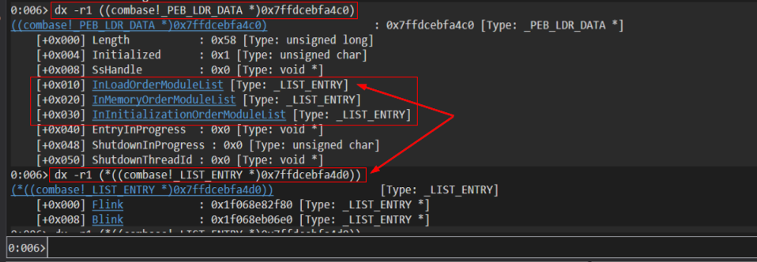\
Três listas são as mais importantes. Cada uma é uma lista duplamente encadeada com Flink (frente) e Blink (trás). Indo ao endereço de Flink.
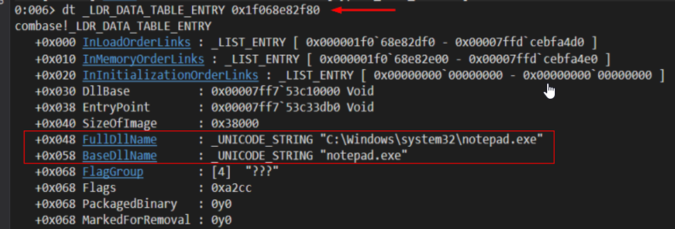\
Aparecem o nome e o caminho completo. Conferindo ``InInitializationOrderModuleList`` na lista.
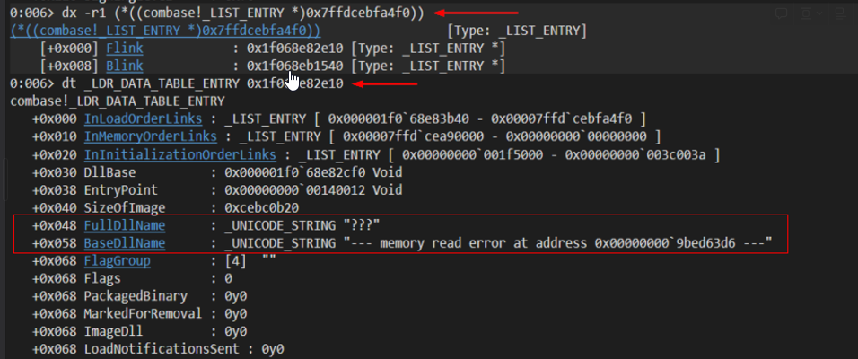\
Erro de leitura. Como é lista dupla, ajusta-se 0x20 porque InInitializationOrderLinks fica com offset 0x20; em termos de navegação, recua-se em relação a ``InLoadOrderLinks`` para achar a base do NTDLL.
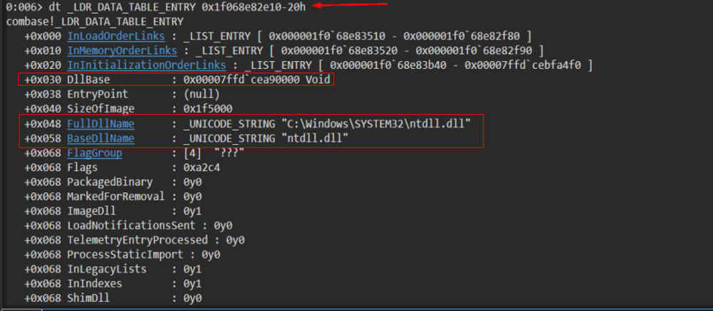\
Aqui o endereço base de NTDLL. Dá para continuar andando de trás para frente na lista para outras DLLs. Na seção seguinte, código C++ para automatizar.

# Percorrendo o PEB com C++
Em vez de calcular tudo à mão, o código C++ a seguir obtém a base de todas as DLLs. Primeiro, diagrama geral do PEB/LDR.
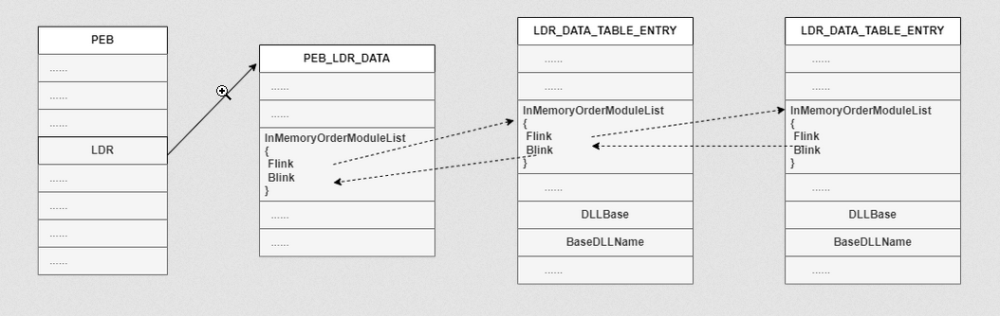

O código completo está em **[`PEB_walker.cpp`](../../codes/processos-jobs/PEB_walker.cpp)**.\
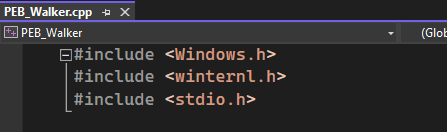\
Com os headers necessários. Em vez da struct PEB mínima da MSDN, veja **[PEB](https://learn.microsoft.com/en-us/windows/win32/api/winternl/ns-winternl-peb)** e **[PEB_LDR_DATA](https://learn.microsoft.com/en-us/windows/win32/api/winternl/ns-winternl-peb_ldr_data)**; usamos versões adaptadas para este uso (referência **[Sandsprite - PEB loader list](http://sandsprite.com/CodeStuff/Understanding_the_Peb_Loader_Data_List.html)**).
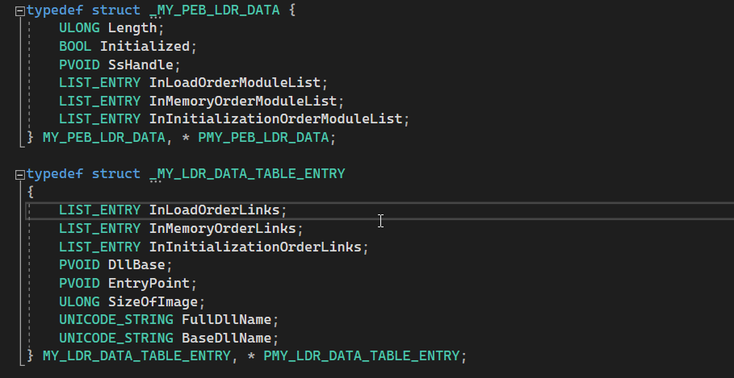\
Seguindo para o `main`.
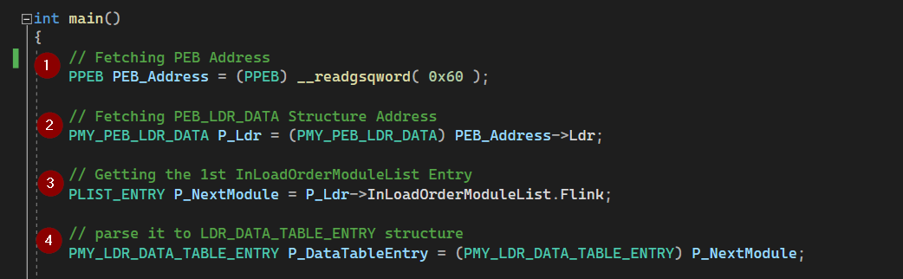\
Resumo:
1. Endereço do PEB com ``__readgsqword(0x60)`` em 64 bits.
2. Endereço de PEB_LDR_DATA a partir do PEB.
3. Obter ``InLoadOrderModuleList``.
4. Interpretar como LDR_DATA_TABLE_ENTRY.

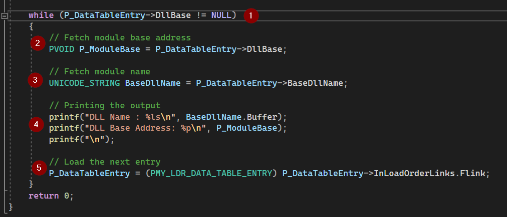\
No passo seguinte:
1. `while` enquanto DllBase for diferente de 0.
2. Ler DllBase da entrada LDR.
3. Ler BaseDllName.
4. Imprimir.
5. Carregar o próximo módulo.

Compilando e executando.
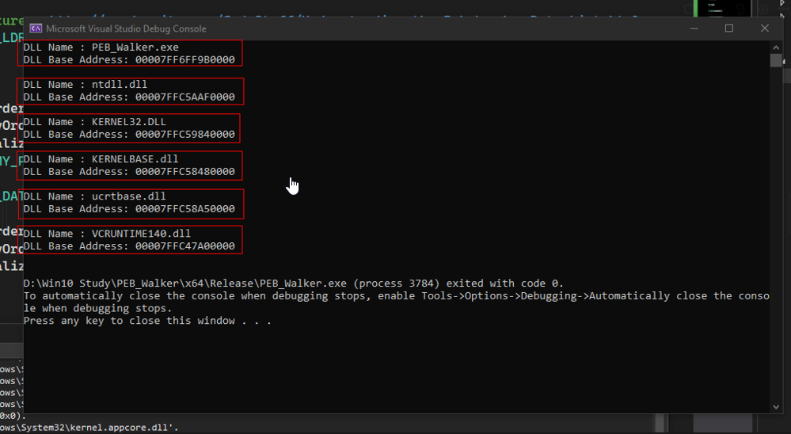\
Os nomes e endereços base aparecem corretamente.

É isso neste artigo. Obrigado pela leitura.

# Recursos
1. **[https://www.youtube.com/watch?v=kOTb0Nm3_ks](https://www.youtube.com/watch?v=kOTb0Nm3_ks)**.
2. **[https://www.apriorit.com/dev-blog/367-anti-reverse-engineering-protection-techniques-to-use-before-releasing-software](https://www.apriorit.com/dev-blog/367-anti-reverse-engineering-protection-techniques-to-use-before-releasing-software)**.
3. **[https://www.ired.team/miscellaneous-reversing-forensics/windows-kernel-internals/exploring-process-environment-block](https://www.ired.team/miscellaneous-reversing-forensics/windows-kernel-internals/exploring-process-environment-block)**.
