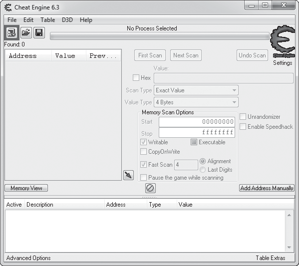
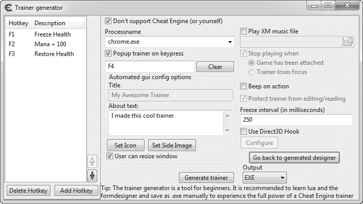
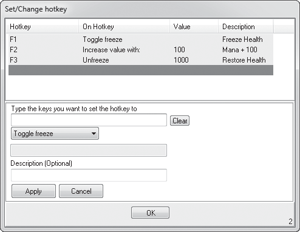
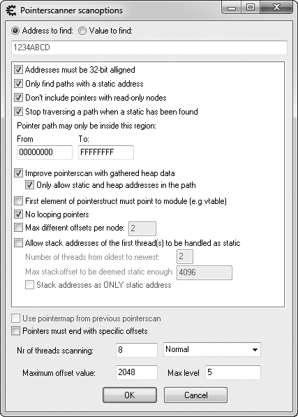
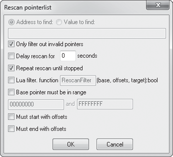

# Capitulo 1 - Escaneando memoria com Cheat Engine

> Titulo original: *Scanning Memory Using Cheat Engine*

> Navegacao: [Anterior](introducao.md) | [Indice](README.md) | [Proximo](capitulo-02.md)

## Topicos

- Por que scanners de memoria sao importantes
- Escaneamento basico de memoria
- Tipos de scan e primeiro scan
- Cheat tables e modificacao manual
- Pointer scanning e rescanning
- Automacao com Lua no Cheat Engine

## Abertura

Os melhores game hackers do mundo passam anos montando arsenais robustos
com ferramentas customizadas. Esse tipo de toolkit permite analisar jogos
de forma fluida, prototipar hacks com pouco esforco e desenvolver bots de
maneira eficaz. No fundo, porem, todos esses kits sao construidos a partir
das mesmas quatro pecas-chave: um scanner de memoria, um debugger em
nivel de assembly, um monitor de processos e um editor hexadecimal.

Memory scanning e a porta de entrada para game hacking. Este capitulo
vai apresentar o Cheat Engine, um scanner de memoria poderoso que
varre a memoria operacional de um jogo (que vive na RAM) procurando
valores como nivel do jogador, vida ou dinheiro do jogo. Primeiro o foco
sera em scan basico, modificacao de memoria e pointer scanning. Em
seguida vamos mergulhar no engine de scripting Lua embutido no Cheat
Engine.

> NOTA: voce pode obter o Cheat Engine em <http://www.cheatengine.org/>.
> Preste atencao ao instalar, pois o instalador tenta empurrar barras de
> ferramentas e outros bloatwares. Voce pode desabilitar essas opcoes.

## Por que scanners de memoria sao importantes

Conhecer o estado de um jogo e fundamental para interagir com ele de
forma inteligente, mas, ao contrario dos humanos, software nao consegue
determinar o estado do jogo apenas olhando para a tela. Felizmente, por
baixo de todos os estimulos produzidos por um jogo, a memoria do
computador contem uma representacao puramente numerica desse estado,
e numeros sao algo que programas conseguem entender com facilidade.
Hackers usam scanners de memoria para localizar esses valores e, em seus
programas, leem a memoria nesses enderecos para entender o estado do
jogo.

Por exemplo, um programa que cura o jogador quando a vida cai abaixo de
500 precisa fazer duas coisas: rastrear a vida atual do jogador e
disparar o feitico de cura. A primeira parte exige acesso ao estado do
jogo; a segunda pode exigir apenas o pressionamento de um botao. Dado o
endereco onde a vida do jogador esta armazenada e uma forma de ler a
memoria do jogo, o programa se pareceria com este pseudocodigo:

```cpp
// faz isso dentro de algum loop
health = readMemory(game, HEALTH_LOCATION)
if (health < 500)
    pressButton(HEAL_BUTTON)
```

Um scanner de memoria permite encontrar `HEALTH_LOCATION` para que o
seu software possa consulta-lo depois.

## Escaneamento basico de memoria

O scanner de memoria e a ferramenta mais basica, e ainda assim mais
importante, para o aspirante a game hacker. Como em qualquer programa,
todos os dados na memoria de um jogo residem em uma localizacao
absoluta chamada *memory address*. Se voce pensar na memoria como um
array de bytes muito grande, um endereco de memoria e um indice que
aponta para um valor nesse array. Quando o scanner recebe a tarefa de
encontrar um valor `x` (chamado *scan value*, porque e o valor que voce
esta procurando) na memoria do jogo, ele percorre o array de bytes
procurando qualquer valor igual a `x`. A cada correspondencia, o indice
do match e adicionado a lista de resultados.

Devido ao tamanho da memoria de um jogo, no entanto, o valor de `x`
pode aparecer em centenas de locais. Imagine que `x` e a vida do
jogador, atualmente em `500`. Nosso `x` contem `500` de forma unica,
mas `500` nao e exclusivo de `x`, entao um scan por `x` retorna todas as
variaveis com valor `500`. Enderecos sem relacao com `x` sao apenas
ruido; eles compartilham o valor `500` por mero acaso.

Para filtrar esses valores indesejados, o scanner permite que voce
refaca a varredura sobre a lista de resultados, removendo enderecos que
nao seguram mais o mesmo valor que `x`, seja `x` ainda igual a `500` ou
ja alterado.

Para que esses *rescans* sejam eficazes, o estado geral do jogo precisa
ter entropia significativa, ou seja, certo grau de desordem. Voce
aumenta a entropia mexendo no ambiente do jogo, em geral movimentando
o personagem, matando criaturas ou trocando de heroi. A medida que a
entropia cresce, enderecos nao relacionados se tornam menos propensos a
manter por acaso o mesmo valor, e com entropia suficiente alguns rescans
filtram todos os falsos positivos, deixando voce com o endereco real de
`x`.

## O scanner de memoria do Cheat Engine

Esta secao apresenta um tour pelas opcoes de scan de memoria do Cheat
Engine, que vao te ajudar a rastrear enderecos de valores do estado do
jogo. Voce tera oportunidade de praticar com o scanner mais a frente,
no exercicio "Edicao basica de memoria".
Por enquanto, abra o Cheat Engine e navegue. O scanner de memoria fica
encapsulado na janela principal, semelhante a Figura 1-1.

> Figura 1-1: tela principal do Cheat Engine.
> Elementos numerados (1) icone Attach, (2) lista de processos,
> (3) campo Scan Value, (4) Scan Type, (5) Value Type, (6) lista de
> resultados.




Para comecar a escanear a memoria de um jogo, clique no icone Attach (1)
para anexar a um processo e digite o scan value (referido como `x` no
nosso scanner conceitual) que voce quer localizar (3). Anexar a um
processo significa dizer ao Cheat Engine para se preparar para operar
sobre ele; nesse caso, a operacao e um scan. Tambem ajuda informar ao
Cheat Engine que tipo de scan rodar, o que veremos a seguir.

### Scan Types

O Cheat Engine permite selecionar duas diretivas de varredura, chamadas
**Scan Type** e **Value Type** (4 e 5 na figura). O Scan Type diz ao
scanner como comparar o seu valor de busca com a memoria escaneada,
usando um dos seguintes tipos:

- **Exact Value**: retorna enderecos que apontam para valores iguais ao
  scan value. Escolha esta opcao se o valor que voce procura nao deve
  mudar durante o scan; vida, mana e nivel costumam cair nesta categoria.
- **Bigger Than**: retorna enderecos que apontam para valores maiores
  que o scan value. Util quando o valor procurado esta crescendo de
  forma constante, o que e comum em timers.
- **Smaller Than**: retorna enderecos que apontam para valores menores
  que o scan value. Como `Bigger Than`, e util para timers (neste caso,
  os que decrescem em vez de crescer).
- **Value Between**: retorna enderecos que apontam para valores dentro
  de uma faixa. Combina `Bigger Than` e `Smaller Than`, exibindo uma
  segunda caixa de scan value para voce restringir o intervalo.
- **Unknown Initial Value**: retorna todos os enderecos da memoria do
  programa, permitindo que rescans examinem o intervalo inteiro
  comparando com os valores iniciais. Util para encontrar tipos de
  itens ou criaturas, ja que nem sempre voce conhece o valor interno
  que os desenvolvedores usaram para representar esses objetos.

A diretiva Value Type informa ao scanner do Cheat Engine qual e o tipo
de variavel que voce esta procurando.

### Executando seu primeiro scan

Com as duas diretivas configuradas, clique em **First Scan** para
disparar a busca, e o scanner vai preencher a lista de resultados.
Enderecos em verde nessa lista sao *static*, ou seja, devem se manter
persistentes entre reinicios do programa. Enderecos listados em preto
ficam em memoria *alocada dinamicamente*, ou seja, alocada em tempo de
execucao.

Quando a lista de resultados e preenchida pela primeira vez, ela mostra
o endereco e o valor em tempo real de cada resultado. Cada novo scan
mostra tambem o valor anterior. Os valores em tempo real sao atualizados
em um intervalo configuravel em **Edit > Settings > General Settings >
Update interval**.

### Next Scans

Depois que a lista esta populada, o scanner habilita o botao **Next
Scan**, que oferece seis novos tipos de varredura. Esses tipos
adicionais permitem comparar os enderecos da lista com os valores
gravados no scan anterior, ajudando a restringir qual endereco contem
o valor de estado de jogo procurado. Sao eles:

- **Increased Value**: retorna enderecos cujo valor *aumentou*.
  Complementa o tipo `Bigger Than`, mantendo o mesmo valor minimo e
  removendo qualquer endereco cujo valor tenha caido.
- **Increased Value By**: retorna enderecos cujo valor aumentou em uma
  quantidade definida. Em geral devolve muito menos falsos positivos,
  mas voce so pode usar quando sabe exatamente o quanto o valor cresceu.
- **Decreased Value**: o oposto de `Increased Value`.
- **Decreased Value By**: o oposto de `Increased Value By`.
- **Changed Value**: retorna enderecos cujo valor mudou. Util quando
  voce sabe que o valor vai sofrer mutacao, mas nao tem certeza de como.
- **Unchanged Value**: retorna enderecos cujo valor nao mudou. Ajuda a
  eliminar falsos positivos, ja que e facil criar bastante entropia
  garantindo que o valor desejado fique estavel.

Em geral voce vai precisar combinar varios tipos de scan para reduzir
uma lista grande de resultados ate o endereco correto. Eliminar falsos
positivos costuma ser uma questao de criar entropia adequadamente
(como descrito em "Escaneamento basico de memoria"), ajustar
taticamente as diretivas de scan, apertar **Next Scan** com coragem e
repetir o processo ate sobrar um unico endereco.

### Quando voce nao consegue chegar a um unico resultado

As vezes e impossivel chegar a um unico resultado no Cheat Engine; nesse
caso voce precisa determinar o endereco correto por experimentacao. Por
exemplo, se voce procura a vida do personagem e nao consegue baixar
para menos de cinco enderecos, pode tentar modificar o valor de cada
um deles (como discutido em "Modificacao manual com Cheat Engine") ate
ver a barra de vida mudar ou outros valores mudarem automaticamente
para o que voce definiu.

## Cheat tables

Quando voce encontra o endereco certo, pode dar um clique duplo nele
para envia-lo ao painel da *cheat table*; enderecos no painel da cheat
table podem ser modificados, monitorados e salvos em arquivos de cheat
table para uso futuro.

Para cada endereco no painel da cheat table voce pode adicionar uma
descricao com clique duplo na coluna **Description**, e adicionar uma
cor com clique direito > **Change Color**. Tambem da para exibir os
valores de cada endereco em hexadecimal ou decimal via clique direito
> **Show as hexadecimal** ou **Show as decimal**, respectivamente. Por
fim, voce pode trocar o tipo de dado de cada valor com clique duplo na
coluna **Type**, ou alterar o proprio valor com clique duplo na coluna
**Value**.

Como o objetivo principal do painel da cheat table e permitir que o
hacker organize enderecos de forma limpa, ele pode ser salvo e
carregado dinamicamente. Va em **File > Save** ou **File > Save As**
para gravar o painel atual em um arquivo `.ct` com cada endereco, seu
tipo de valor, descricao, cor e formato de exibicao. Para carregar
documentos `.ct` salvos, use **File > Load**. Voce encontra varias
cheat tables prontas para jogos populares em
<http://cheatengine.org/tables.php>.

Agora que sabemos como buscar um valor de estado de jogo, vamos falar
de como alterar esse valor quando voce sabe onde ele vive na memoria.

## Modificacao de memoria em jogos

Bots enganam o sistema de jogo modificando valores na memoria do estado
do jogo: dinheiro in-game, vida do personagem, posicao no mapa e por ai
vai. Na maioria dos jogos online, os atributos vitais do personagem
(como vida, mana, habilidades e posicao) ficam em memoria, mas sao
controlados pelo servidor do jogo e replicados para o cliente local via
Internet. Modificar esses valores durante uma partida online e apenas
cosmetico e nao afeta os valores reais do servidor. Qualquer modificacao
de memoria realmente util em jogos online exige hacks bem mais
avancados, fora das capacidades do Cheat Engine. Em jogos locais sem
servidor remoto, no entanto, voce pode manipular esses valores a
vontade.

### Modificacao manual com Cheat Engine

Vamos usar o Cheat Engine para entender como funciona a magica da
modificacao de memoria.

Para modificar memoria manualmente:

1. Anexe o Cheat Engine a um jogo.
2. Faca scan do endereco que quer modificar ou carregue uma cheat
   table que ja contenha esse endereco.
3. Clique duplo na coluna **Value** do endereco para abrir um prompt
   de entrada onde voce digita um novo valor.
4. Para garantir que o novo valor nao seja sobrescrito, marque a
   caixa na coluna **Active** para *freezar* o endereco; o Cheat
   Engine continuara reescrevendo o mesmo valor toda vez que ele
   mudar.

Esse metodo funciona muito bem para hacks rapidos, mas alterar valores
manualmente o tempo todo e cansativo; uma solucao automatizada e bem
mais atraente.

### Trainer Generator

O Trainer Generator do Cheat Engine permite automatizar todo o
processo de modificacao de memoria sem escrever codigo.

Para criar um *trainer* (um bot simples que liga acoes de modificacao
de memoria a hotkeys do teclado), va em **File > Create generic
trainer Lua script from table**. Isso abre uma caixa de dialogo do
Trainer generator semelhante a Figura 1-2.

> Figura 1-2: caixa de dialogo do Trainer generator do Cheat Engine.




Os campos a configurar sao:

- **Processname**: nome do executavel ao qual o trainer deve se
  anexar. E o nome que aparece na lista de processos quando voce
  anexou com Cheat Engine, e ja deve vir preenchido com o nome do
  processo atualmente anexado.
- **Popup trainer on keypress**: opcionalmente, habilita uma hotkey
  (definida pela combinacao de teclas na caixa abaixo do checkbox)
  para exibir a janela principal do trainer.
- **Title**: nome do seu trainer, exibido na interface dele. Opcional.
- **About text**: descricao do trainer, exibida na interface.
  Opcional.
- **Freeze interval (in milliseconds)**: intervalo durante o qual a
  operacao de freeze sobrescreve o valor. Em geral deixe em `250`,
  pois intervalos mais baixos consomem recursos e mais altos podem
  ficar lentos demais.

Com esses valores configurados, clique em **Add Hotkey** para definir
uma sequencia de teclas que ativa seu trainer. Voce sera convidado a
escolher um valor da sua cheat table. Apos escolher, vai para uma tela
**Set/Change hotkey** semelhante a Figura 1-3.

> Figura 1-3: tela Set/Change hotkey do Cheat Engine.
> Elementos numerados: (1) caixa para digitar a hotkey,
> (2) drop-down com a acao, (3) caixa de valor associado a acao,
> (4) descricao da acao.




Nesta tela, posicione o cursor na caixa rotulada **Type the keys you
want to set the hotkey to** (1) e digite a combinacao desejada. Em
seguida escolha a acao no drop-down (2); as opcoes aparecem nesta
ordem:

- **Toggle freeze**: alterna o estado de freeze do endereco.
- **Toggle freeze and allow increase**: alterna o freeze, mas permite
  que o valor aumente. Sempre que o valor cai, o trainer reescreve com
  o anterior. Aumentos nao sao sobrescritos.
- **Toggle freeze and allow decrease**: o oposto da opcao acima.
- **Freeze**: define o endereco como freezado se ainda nao estiver.
- **Unfreeze**: defreeza o endereco se estiver freezado.
- **Set value to**: define o valor para o que voce informa na caixa
  de valor (3).
- **Decrease value with**: subtrai do valor atual a quantidade na
  caixa de valor (3).
- **Increase value with**: o oposto de `Decrease value with`.

Por fim, voce pode definir uma descricao para a acao (4). Clique em
**Apply** e depois em **OK**, e a acao aparece na lista da tela do
Trainer generator. A partir desse momento, o Cheat Engine roda o
trainer em segundo plano, e basta apertar as hotkeys configuradas para
executar as acoes na memoria.

Para salvar seu trainer como um executavel portatil, clique em
**Generate trainer**. Rodar esse executavel depois que o jogo for
aberto vai anexar seu trainer ao jogo, sem necessidade de iniciar o
Cheat Engine.

Agora que voce conhece o scanner de memoria e o Trainer Generator do
Cheat Engine, experimente modificar alguma memoria por conta propria.

> ### Exercicio: Edicao basica de memoria
>
> Baixe os arquivos do livro em <https://www.nostarch.com/gamehacking/>
> e execute o arquivo `BasicMemory.exe`. Em seguida, abra o Cheat
> Engine e anexe ao binario. Usando apenas o Cheat Engine, encontre os
> enderecos das coordenadas `x` e `y` da bola cinza. (Dica: use o
> Value Type `4 Bytes`.)
>
> Depois de encontrar os valores, modifique-os para colocar a bola em
> cima do quadrado preto. O jogo te avisa que voce conseguiu exibindo
> o texto "Good job!". (Dica: cada vez que a bola se move, sua
> posicao, armazenada como um inteiro de 4 bytes, muda em 1 unidade
> naquele plano. Tente filtrar apenas resultados estaticos, em verde.)

## Pointer scanning

Como mencionado, jogos online costumam armazenar valores em memoria
alocada dinamicamente. Embora enderecos que referenciam memoria
dinamica nao sirvam para nada por si so, sempre existira algum
endereco estatico que aponta para outro endereco, que aponta para
outro, e assim por diante, ate que o ultimo elo da cadeia chegue a
memoria dinamica que nos interessa. O Cheat Engine consegue localizar
essas cadeias usando uma tecnica chamada *pointer scanning*.

Nesta secao vamos apresentar pointer chains e descrever como o pointer
scanning funciona no Cheat Engine. Quando voce tiver bom dominio da
interface, pode praticar no exercicio "Pointer Scanning" mais a
frente.

### Pointer chains

A cadeia de offsets descrita acima e chamada de *pointer chain* e tem
este formato:

```cpp
list<int> chain = {start, offset1, offset2[, ...]}
```

O primeiro valor da pointer chain (`start`) se chama *memory pointer*.
E o endereco que inicia a cadeia. Os valores restantes (`offset1`,
`offset2` e por ai vai) compoem a rota ate o valor desejado, conhecida
como *pointer path*.

Este pseudocodigo mostra como uma pointer chain pode ser lida:

```cpp
int readPointerChain(chain) {
    ret = read(chain[0])             // (1)
    for i = 1, chain.len - 1, 1 {
        offset = chain[i]
        ret = read(ret + offset)
    }
    return ret
}
```

Esse codigo cria a funcao `readPointerChain()`, que recebe uma pointer
chain chamada `chain` como parametro. A funcao trata o pointer path em
`chain` como uma lista de offsets de memoria a partir do endereco
`ret`, que comeca apontado para o memory pointer em (1). Ela percorre
esses offsets, atualizando `ret` para o resultado de
`read(ret + offset)` em cada iteracao e devolvendo `ret` no fim. O
proximo pseudocodigo mostra como `readPointerChain()` se parece com o
loop desenrolado:

```cpp
list<int> chain = {0xDEADBEEF, 0xAB, 0x10, 0xCC}
value = readPointerChain(chain)
// a chamada da funcao desenrola para isto
ret = read(0xDEADBEEF) // chain[0]
ret = read(ret + 0xAB)
ret = read(ret + 0x10)
ret = read(ret + 0xCC)
int value = ret
```

A funcao acaba chamando `read` quatro vezes, em quatro enderecos
diferentes, um para cada elemento de `chain`.

> NOTA: muitos game hackers preferem inserir as leituras da chain
> direto no codigo, em vez de encapsula-las em funcoes como
> `readPointerChain()`.

### Nocoes basicas de pointer scanning

Pointer chains existem porque todo bloco de memoria alocada
dinamicamente precisa ter um endereco estatico correspondente que o
codigo do jogo possa usar para referencia-lo. Game hackers acessam
esses blocos localizando as pointer chains que os referenciam. Por
causa da estrutura em multiplas camadas, no entanto, pointer chains
nao podem ser localizadas pela abordagem linear que os scanners de
memoria usam, entao game hackers criaram novas formas de encontra-las.

Do ponto de vista de engenharia reversa, voce poderia localizar e
analisar o codigo assembly para deduzir qual pointer path foi usado
para acessar o valor, mas isso consome muito tempo e exige ferramentas
avancadas. Pointer scanners resolvem esse problema usando forca bruta
para iterar recursivamente sobre todas as possiveis pointer chains ate
encontrar uma que resolva ate o endereco-alvo.

O pseudocodigo da Listagem 1-1 da uma ideia geral de como um pointer
scanner funciona.

```cpp
list<int> pointerScan(target, maxAdd, maxDepth) {
    for address = BASE, 0x7FFFFFF, 4 {        // (1)
        ret = rScan(address, target, maxAdd, maxDepth, 1)
        if (ret.len > 0) {
            ret.pushFront(address)
            return ret
        }
    }
    return {}
}

list<int> rScan(address, target, maxAdd, maxDepth, curDepth) {
    for offset = 0, maxAdd, 4 {               // (2)
        value = read(address + offset)
        if (value == target)                  // (3)
            return list<int>(offset)
    }
    if (curDepth < maxDepth) {                // (4)
        curDepth++
        for offset = 0, maxAdd, 4 {           // (5)
            ret = rScan(address + offset, target, maxAdd, maxDepth, curDepth)
            if (ret.len > 0) {                // (6)
                ret.pushFront(offset)
                return ret                    // (7)
            }
        }
    }
    return {}
}
```

> Listagem 1-1: pseudocodigo para um pointer scanner.

Este codigo cria as funcoes `pointerScan()` e `rScan()`.

#### pointerScan()

A funcao `pointerScan()` e o ponto de entrada da varredura. Recebe os
parametros `target` (o endereco de memoria dinamica a localizar),
`maxAdd` (o valor maximo de qualquer offset) e `maxDepth` (o
comprimento maximo do pointer path). Ela percorre cada endereco
alinhado em 4 bytes (1) no jogo, chamando `rScan()` com os parametros
`address` (o endereco da iteracao atual), `target`, `maxAdd`,
`maxDepth` e `curDepth` (a profundidade do path, que aqui sempre comeca
em `1`).

#### rScan()

A funcao `rScan()` le memoria a cada offset alinhado em 4 bytes entre
`0` e `maxAdd` (2) e retorna se algum resultado for igual a `target`
(3). Caso `rScan()` nao retorne no primeiro loop e a recursao ainda
nao seja profunda demais (4), ela incrementa `curDepth` e novamente
percorre cada offset (5), chamando a si mesma a cada iteracao.

Se uma chamada recursiva devolver um pointer path parcial (6),
`rScan()` insere o offset atual no inicio do path e retorna pela
cadeia de recursao (7) ate alcancar `pointerScan()`. Quando uma
chamada de `rScan()` feita por `pointerScan()` devolve um pointer
path, `pointerScan()` empurra o endereco atual para o inicio do path e
retorna a cadeia completa.

### Pointer scanning com Cheat Engine

O exemplo anterior mostra o processo basico de pointer scanning, mas a
implementacao apresentada e primitiva. Alem de ser absurdamente lenta,
geraria inumeros falsos positivos. O pointer scanner do Cheat Engine
usa varias interpolacoes avancadas para acelerar a varredura e
torna-la mais precisa, e nesta secao vamos apresentar a variedade de
opcoes de scan disponiveis.

Para iniciar um pointer scan no Cheat Engine, clique direito em um
endereco de memoria dinamica na sua cheat table e clique em **Pointer
scan for this address**. O Cheat Engine pergunta onde armazenar os
resultados como um arquivo `.ptr`. Depois de informar o local, aparece
uma caixa **Pointerscanner scanoptions** semelhante a Figura 1-4.

> Figura 1-4: caixa de dialogo Pointerscanner scanoptions do Cheat
> Engine.




O campo **Address to find** no topo exibe o seu endereco de memoria
dinamica. A partir dai, escolha com cuidado entre as varias opcoes de
scan do Cheat Engine.

#### Opcoes principais

Varias opcoes de scan do Cheat Engine costumam ficar nos valores
padrao. Sao elas:

- **Addresses must be 32-bits aligned**: instrui o Cheat Engine a
  varrer apenas enderecos multiplos de 4, o que aumenta muito a
  velocidade. Como veremos no Capitulo 4, compiladores alinham dados
  de modo que a maioria dos enderecos ja sao multiplos de 4 por
  padrao. Voce raramente precisara desativar essa opcao.
- **Only find paths with a static address**: acelera o scan impedindo
  que o Cheat Engine pesquise paths com pointer inicial dinamico.
  Deve ficar sempre habilitada, ja que escanear um path comecando em
  outro endereco dinamico costuma ser contraproducente.
- **Don't include pointers with read-only nodes**: tambem deve ficar
  sempre habilitada. Memoria dinamica que armazena dados volateis
  nunca deveria ser somente leitura.
- **Stop traversing a path when a static has been found**: encerra o
  scan quando encontra um pointer path com endereco inicial estatico.
  Deve estar habilitada para reduzir falsos positivos e acelerar o
  scan.
- **Pointer path may only be inside this region**: em geral pode
  ficar como esta. As outras opcoes compensam essa faixa ampla
  estreitando o escopo de forma inteligente.
- **First element of pointerstruct must point to module**: diz ao
  Cheat Engine para nao varrer chunks de heap em que nao foram
  encontradas virtual function tables, supondo que o jogo foi feito
  com orientacao a objetos. Embora possa acelerar bastante o scan,
  e altamente nao confiavel; quase sempre deixe desligada.
- **No looping pointers**: invalida paths que apontam para si
  mesmos, eliminando paths ineficientes mas tornando o scan um pouco
  mais lento. Em geral mantenha ligada.
- **Max level**: define o comprimento maximo do pointer path
  (lembra do `maxDepth` no codigo da Listagem 1-1?). Mantenha por
  volta de 6 ou 7.

Claro que havera momentos em que voce precisara mexer nessas opcoes.
Por exemplo, falhar em obter resultados confiaveis com **No looping
pointers** ou **Max level** geralmente indica que o valor procurado
vive em uma estrutura de dados dinamica como linked list, arvore
binaria ou vetor. Outro exemplo e **Stop traversing a path when a
static has been found**, que em casos raros pode atrapalhar a obtencao
de resultados confiaveis.

#### Opcoes situacionais

Diferente das opcoes anteriores, a configuracao das proximas depende da
sua situacao. Veja como decidir a melhor combinacao para cada uma:

- **Improve pointerscan with gathered heap data**: deixa o Cheat
  Engine usar o registro de alocacao de heap para definir limites de
  offset, eliminando muitos falsos positivos e acelerando o scan. Se
  voce caiu em um jogo que usa um alocador de memoria customizado
  (cada vez mais comum), essa opcao pode ter o efeito oposto. Pode
  ficar habilitada nos scans iniciais, mas seja a primeira a desligar
  quando nao conseguir achar paths confiaveis.
- **Only allow static and heap addresses in the path**: invalida
  todos os paths que nao podem ser otimizados com dados de heap, o
  que torna a abordagem ainda mais agressiva.
- **Max different offsets per node**: limita o numero de pointers de
  mesmo valor que o scanner verifica. Se `n` enderecos diferentes
  apontam para `0x0BADF00D`, esta opcao diz ao Cheat Engine para
  considerar apenas os primeiros `m`. Pode ser util quando voce nao
  consegue restringir o conjunto de resultados; em outros casos
  desligue, pois pode descartar muitos paths validos.
- **Allow stack addresses of the first thread(s) to be handled as
  static**: faz scan na call stack das `m` threads mais antigas do
  jogo, considerando os primeiros `n` bytes de cada uma. Permite que
  o Cheat Engine escaneie parametros e variaveis locais de funcoes na
  cadeia de chamada do jogo (a ideia e achar variaveis usadas pelo
  loop principal). Os paths encontrados podem ser bem volateis e
  bem uteis; uso essa opcao apenas quando nao acho enderecos de heap.
- **Stack addresses as only static address**: leva a opcao anterior
  ainda mais longe, permitindo apenas enderecos de stack em pointer
  paths.
- **Pointers must end with specific offsets**: util se voce conhece
  o(s) offset(s) ao final de um path valido. Permite informar esses
  offsets (com o ultimo no topo), reduzindo bastante o escopo do
  scan.
- **Nr of threads scanning**: define quantas threads o scanner vai
  usar. Um numero igual ao de cores do processador costuma funcionar
  melhor. O drop-down de prioridade tem opcoes: `Idle` se voce quer
  scan bem lento, `Normal` para a maior parte dos casos, e
  `Time critical` para scans demorados, sabendo que o computador
  fica praticamente inutilizavel durante a varredura.
- **Maximum offset value**: define o valor maximo de cada offset no
  path (lembra do `maxAdd` na Listagem 1-1?). Comeco com um valor
  baixo, aumentando apenas se o scan falha; `128` e um bom valor
  inicial. Lembre que esse valor e geralmente ignorado quando se usa
  as opcoes de otimizacao por heap.

> NOTA: e se ambas **Only allow static and heap addresses in the
> path** e **Stack addresses as only static address** ficarem
> habilitadas? O scan vai vir vazio? Parece um experimento divertido,
> embora inutil.

Apos definir suas opcoes, clique em **OK** para iniciar o pointer
scan. Quando terminar, abre uma janela de resultados com a lista de
pointer chains encontradas. Em geral essa lista tem milhares de
resultados, contendo tanto chains reais quanto falsos positivos.

### Pointer rescanning

O pointer scanner tem uma funcionalidade de rescan que ajuda a
eliminar falsos positivos. Para comecar, aperte `Ctrl-R` na janela de
resultados para abrir a caixa **Rescan pointerlist**, semelhante a
Figura 1-5.

> Figura 1-5: caixa de dialogo Rescan pointerlist do Cheat Engine.
> Elementos numerados: (1) checkbox Only filter out invalid pointers,
> (2) checkbox Repeat rescan until stopped.




Existem duas opcoes principais:

- **Only filter out invalid pointers**: se marcada (1), o rescan
  descarta apenas pointer chains que apontam para memoria invalida,
  o que ajuda quando o conjunto inicial e muito grande. Desmarque
  para filtrar paths que nao resolvem para um endereco ou valor
  especifico.
- **Repeat rescan until stopped**: se marcada (2), o rescan roda em
  loop continuo. Idealmente habilite e deixe rodar enquanto voce gera
  bastante entropia de memoria.

Para o rescan inicial, habilite **Only filter out invalid pointers** e
**Repeat rescan until stopped** e clique em **OK** para iniciar. A
janela de rescan some, e um botao **Stop rescan loop** aparece na
janela de resultados. A lista sera reescaneada continuamente ate voce
clicar em **Stop rescan loop**, mas dedique alguns minutos para gerar
entropia antes de parar.

Em casos raros, mesmo o rescan em loop ainda deixa uma lista grande de
paths possiveis. Quando isso acontece, voce pode reiniciar o jogo,
encontrar o endereco que segura o seu valor (pode ter mudado) e usar a
funcionalidade de rescan nesse endereco para reduzir ainda mais. Neste
scan, deixe **Only filter out invalid pointers** desmarcada e digite
o novo endereco no campo **Address to find**.

> NOTA: se voce fechou a janela de resultados, e possivel reabri-la e
> recarregar a lista indo a janela principal do Cheat Engine e
> apertando o botao **Memory View** abaixo do painel de resultados.
> Isso abre uma janela de memory dump. Quando ela aparecer, aperte
> `Ctrl-P` para abrir a lista de resultados do pointer scan e depois
> `Ctrl-O` para abrir o arquivo `.ptr` em que voce salvou o pointer
> scan.

Se seus resultados ainda nao estiverem suficientemente reduzidos,
tente rodar o mesmo scan entre reboots do sistema ou ate em maquinas
diferentes. Se ainda assim sobrar uma lista grande, cada resultado
pode ser considerado estatico com seguranca, pois mais de uma pointer
chain pode resolver para o mesmo endereco.

Apos restringir o conjunto, clique duplo em uma pointer chain
utilizavel para adicionar a sua cheat table. Se houver varias chains
utilizaveis, prefira a que tem menos offsets. Se voce achar varias
chains com offsets identicos comecando do mesmo pointer mas divergindo
a partir de certo ponto, seus dados podem estar em uma estrutura de
dados dinamica.

E isso e tudo sobre pointer scanning no Cheat Engine. Experimente.

> ### Exercicio: Pointer Scanning
>
> Acesse <https://www.nostarch.com/gamehacking/> e baixe
> `MemoryPointers.exe`. Diferente da tarefa anterior, em que era
> preciso vencer apenas uma vez, esta exige vencer 50 vezes em
> 10 segundos seguidos. A cada vitoria, os enderecos de memoria das coordenadas
> `x` e `y` mudam, ou seja, voce so consegue freezar o valor se tiver
> achado um pointer path adequado. Comece como no exercicio anterior,
> mas depois de encontrar os enderecos use a funcionalidade Pointer
> scan para localizar pointer paths para eles. Coloque a bola em cima
> do quadrado preto, freeze o valor e aperte `Tab` para iniciar o
> teste. Como antes, o jogo te avisa quando voce vence. (Dica: tente
> definir Max level em `5` e Maximum offset value em `512`. Brinque
> tambem com as opcoes para permitir stack addresses, encerrar o scan
> quando encontrar um estatico e melhorar o pointer scan com dados de
> heap. Veja qual combinacao da o melhor resultado.)

## Ambiente de scripting Lua

Historicamente, desenvolvedores de bots raramente usavam o Cheat
Engine para atualizar enderecos quando um jogo lancava um patch,
porque era muito mais facil fazer isso no OllyDbg. Isso tornava o
Cheat Engine inutil para game hackers alem da pesquisa e
desenvolvimento iniciais, pelo menos ate que um poderoso engine de
scripting embutido baseado em Lua foi implementado em torno do
ambiente de scanning robusto do Cheat Engine. Embora esse engine tenha
nascido para permitir o desenvolvimento de bots simples dentro do
proprio Cheat Engine, hackers profissionais perceberam que tambem
podiam usa-lo para escrever scripts complexos que localizam enderecos
em diferentes versoes do binario de um jogo, automatizando uma tarefa
que de outra forma poderia tomar horas.

> NOTA: voce encontra mais detalhes sobre o engine de scripting Lua do
> Cheat Engine no wiki em <http://wiki.cheatengine.org/>.

Para comecar a usar o engine Lua, aperte `Ctrl-Alt-L` na janela
principal do Cheat Engine. Quando a janela abrir, escreva seu script
na area de texto e clique em **Execute script** para rodar. Salve com
`Ctrl-S` e abra um script salvo com `Ctrl-O`.

O engine de scripting tem centenas de funcoes e usos infinitos, entao
vou apenas dar uma amostra das suas possibilidades destrinchando dois
scripts. Cada jogo e diferente e cada hacker escreve seus scripts para
objetivos especificos, entao esses scripts servem so para ilustrar
conceitos.

### Procurando padroes de assembly

Este primeiro script localiza funcoes que montam pacotes de saida e
enviam para o servidor do jogo. Funciona buscando, no codigo assembly,
por funcoes que contem certa sequencia de bytes.

```lua
BASEADDRESS = getAddress("Game.exe")                            -- (1)
function LocatePacketCreation(packetType)                       -- (2)
    for address = BASEADDRESS, (BASEADDRESS + 0x2ffffff) do     -- (3)
        local push = readBytes(address, 1, false)
        local type = readInteger(address + 1)
        local call = readInteger(address + 5)
        if (push == 0x68 and type == packetType and call == 0xE8) then  -- (4)
            return address
        end
    end
    return 0
end

FUNCTIONHEADER = { 0xCC, 0x55, 0x8B, 0xEC, 0x6A }
function LocateFunctionHead(checkAddress)                       -- (5)
    if (checkAddress == 0) then return 0 end
    for address = checkAddress, (checkAddress - 0x1fff), -1 do  -- (6)
        local match = true
        local checkheader = readBytes(address, #FUNCTIONHEADER, true)
        for i, v in ipairs(FUNCTIONHEADER) do                   -- (7)
            if (v ~= checkheader[i]) then
                match = false
                break
            end
        end
        if (match) then return address + 1 end                  -- (8)
    end
    return 0
end

local funcAddress = LocateFunctionHead(LocatePacketCreation(0x64))  -- (9)
if (funcAddress ~= 0) then
    print(string.format("0x%x", funcAddress))
else
    print("Not found!")
end
```

O codigo comeca obtendo o endereco base do modulo ao qual o Cheat
Engine esta anexado (1). Com o endereco base em maos, a funcao
`LocatePacketCreation()` e definida (2). Essa funcao percorre os
primeiros `0x2FFFFFF` bytes da memoria do jogo (3), procurando uma
sequencia que representa este codigo x86:

```text
PUSH type   ; bytes: 0x68 [type 4 bytes]
CALL offset ; bytes: 0xE8 [offset 4 bytes]
```

A funcao verifica se `type` e igual a `packetType`, sem se importar
com qual e o offset da call (4). Quando encontra a sequencia, retorna.

Em seguida e definida `LocateFunctionHead()` (5). Ela faz backtracking
de ate `0x1FFF` bytes a partir de um endereco dado (6) e, em cada
endereco, checa se ha um stub assembly (7) que se parece com isto:

```text
INT3          ; 0xCC
PUSH EBP      ; 0x55
MOV EBP, ESP  ; 0x8B 0xEC
PUSH [-1]    ; 0x6A 0xFF
```

Esse stub aparece no comeco de toda funcao, porque faz parte do
prologo de funcao que monta o stack frame. Quando o codigo e
encontrado, a funcao retorna o endereco do stub mais 1 (8) (o
primeiro byte, `0xCC`, e padding).

Para amarrar tudo, `LocatePacketCreation()` e chamada com o
`packetType` que estou procurando (arbitrariamente `0x64`) e o
endereco resultante e passado para `LocateFunctionHead()` (9). Isso
localiza efetivamente a primeira funcao que envia `packetType` para
uma chamada de funcao e armazena o endereco em `funcAddress`. Este
stub mostra o resultado:

```text
INT3          ; LocateFunctionHead voltou ate aqui
PUSH EBP      ;   e retornou este endereco
MOV EBP, ESP
PUSH [-1]
--snip--
PUSH [0x64]   ; LocatePacketCreation retornou este endereco
CALL [algo]
```

Esse script de 35 linhas consegue localizar automaticamente 15 funcoes
diferentes em menos de um minuto.

### Procurando strings

Este proximo script Lua varre a memoria do jogo em busca de strings de
texto. Funciona de forma parecida com o que o scanner de memoria do
Cheat Engine faz quando voce usa o value type `string`.

```lua
BASEADDRESS = getAddress("Game.exe")
function findString(str)                                                       -- (1)
    local len = string.len(str)
    local chunkSize = 4096                                                     -- (2)
    local chunkStep = chunkSize - len                                          -- (3)
    print("Found '" .. str .. "' at:")
    for address = BASEADDRESS, (BASEADDRESS + 0x2ffffff), chunkStep do         -- (4)
        local chunk = readBytes(address, chunkSize, true)
        if (not chunk) then break end
        for c = 0, chunkSize - len do                                          -- (5)
            checkForString(address, chunk, c, str, len)                        -- (6)
        end
    end
end

function checkForString(address, chunk, start, str, len)
    for i = 1, len do
        if (chunk[start + i] ~= string.byte(str, i)) then
            return false
        end
    end
    print(string.format("\t0x%x", address + start))                            -- (7)
end

findString("hello")  -- (8)
findString("world")  -- (9)
```

Apos pegar o endereco base, e definida a funcao `findString()` (1),
que recebe uma string `str` como parametro. Essa funcao percorre a
memoria do jogo (4) em chunks de `4096` bytes (2). Os chunks sao
escaneados sequencialmente, cada um comecando `len` bytes (o tamanho
de `str`) antes do final do anterior (3) para evitar perder uma
string que comeca em um chunk e termina no proximo.

A medida que `findString()` le cada chunk, ele itera sobre cada byte
ate o ponto de overlap (5), passando cada subchunk para
`checkForString()` (6). Se `checkForString()` casar o subchunk com
`str`, imprime o endereco do subchunk no console (7).

Por fim, para encontrar todos os enderecos que referenciam as strings
`"hello"` e `"world"`, sao chamadas as funcoes `findString("hello")`
(8) e `findString("world")` (9). Usando esse codigo para procurar
strings de debug embutidas e combinando com o codigo anterior para
localizar headers de funcao, da para achar uma quantidade enorme de
funcoes internas em segundos.

> ### Boxe: Otimizando codigo de memoria
>
> Por causa do alto overhead de leitura de memoria, otimizacao e
> extremamente importante quando voce escreve codigo que faz reads.
> No script anterior, perceba que `findString()` nao usa a funcao
> nativa `readString()` do engine Lua. Em vez disso, le grandes
> chunks de memoria e procura a string desejada localmente. Vamos
> aos numeros.
>
> Um scan usando `readString()` tentaria ler uma string de `len`
> bytes em cada endereco possivel da memoria. Ou seja, leria, no
> maximo, `(0x2FFFFFF * len + len)` bytes. `findString()`, por outro
> lado, le chunks de `4096` bytes e procura strings localmente. Ou
> seja, leria, no maximo,
> `(0x2FFFFFF + 4096 + (0x2FFFFFF / (4096 - 10)) * len)` bytes.
> Buscando uma string de tamanho 10, o numero de bytes que cada
> metodo le e `503,316,480` e `50,458,923`, respectivamente.
>
> Alem de ler uma ordem de magnitude menos dados, `findString()`
> tambem invoca muito menos reads de memoria. Ler em chunks de
> `4096` bytes exige um total de `(0x2FFFFFF / (4096 - len))` leituras.
> Compare com um scan via `readString()`, que precisaria de
> `0x2FFFFFF` leituras. O scan que usa `findString()` e um avanco
> enorme porque invocar uma leitura e bem mais caro do que aumentar
> o tamanho dos dados lidos. (Note que `4096` foi escolhido
> arbitrariamente. Mantenho o chunk relativamente pequeno porque ler
> memoria pode demorar, e seria desperdicio ler quatro paginas de
> uma vez so para achar a string na primeira.)

## Fechando

A esta altura voce ja deve ter um entendimento basico do Cheat Engine
e de como ele funciona. Cheat Engine e uma ferramenta muito importante
no seu kit, e vale a pena adquirir experiencia pratica seguindo os
exercicios "Edicao basica de memoria" e "Pointer Scanning" e
brincando com a ferramenta por conta propria.
