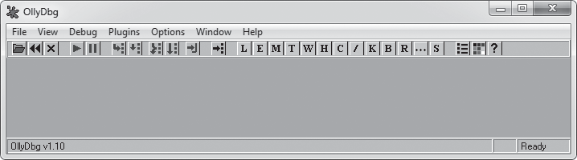
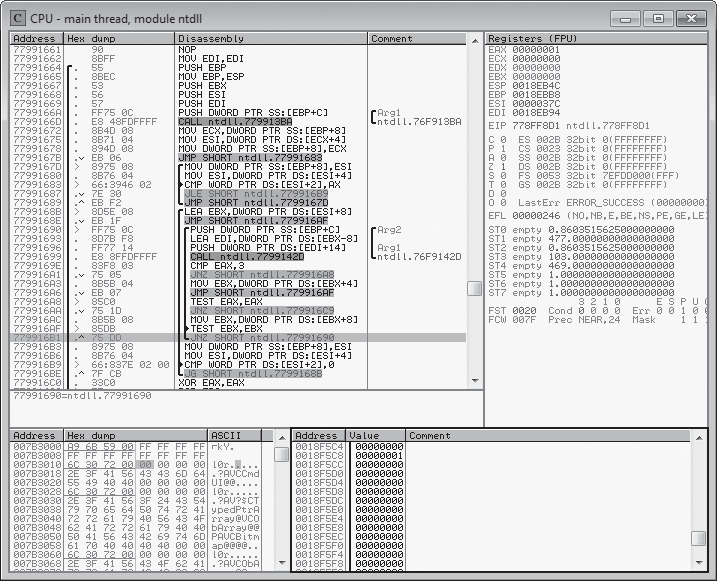
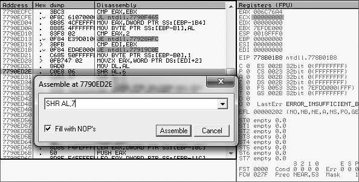
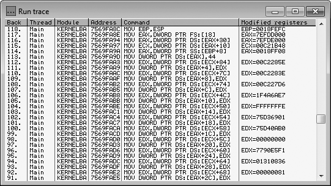
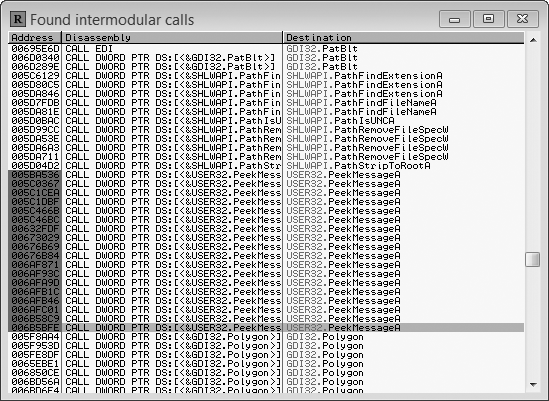
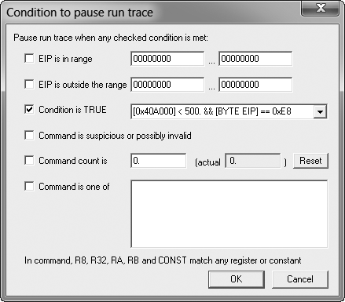
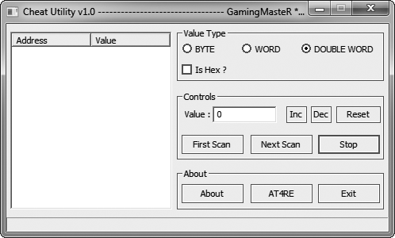
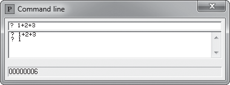
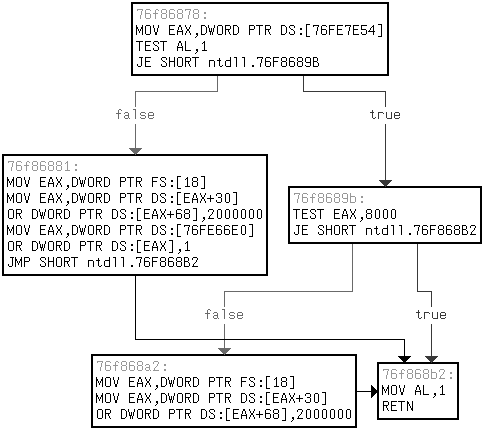

# Capitulo 2 - Debugando jogos com OllyDbg

> Titulo original: *Debugging Games with OllyDbg*

> Navegacao: [Anterior](capitulo-01.md) | [Indice](README.md) | [Proximo](capitulo-03.md)

## Topicos

- Interface e CPU window do OllyDbg
- Navegacao em assembly, registradores e memoria
- Call stack e criacao de code patches
- Expression engine e breakpoints avancados
- Plug-ins do OllyDbg para game hacking

## Abertura

Voce consegue arranhar a superficie do que acontece enquanto um game
roda usando o Cheat Engine, mas com um bom debugger e possivel cavar
ate entender a estrutura e o execution flow do game. Isso torna o
OllyDbg essencial para o seu arsenal de game hacking. Ele vem cheio de
ferramentas poderosas como conditional breakpoints, referenced string
search, assembly pattern search e execution tracing, sendo um debugger
robusto em nivel de assembler para aplicativos Windows de 32 bits.

A estrutura de codigo low-level vai ser tratada em detalhes no
Capitulo 4. Para este capitulo, parto do principio que voce ao menos
ja teve algum contato com debuggers modernos em nivel de codigo, como
o que vem com o Microsoft Visual Studio. O OllyDbg e funcionalmente
parecido com esses, com uma diferenca importante: ele faz interface
com o codigo assembly da aplicacao, funcionando ate na ausencia de
codigo-fonte e/ou debug symbols, o que o torna ideal quando voce
precisa explorar os internals de um game. Afinal, empresas de games
raramente sao boazinhas (ou bobas) o suficiente para distribuir os
binarios com debug symbols.

Neste capitulo vamos passear pela UI do OllyDbg, mostrar como usar as
funcionalidades de debugging mais comuns, destrinchar a expression
engine dele e dar exemplos reais de como amarrar tudo isso ao seu
trabalho de game hacking. Para fechar, apresento alguns plug-ins
uteis e te mando embora com um game de teste para colocar a mao na
massa.

> NOTA: este capitulo foca no OllyDbg 1.10 e pode nao estar 100%
> preciso para versoes posteriores. Uso essa versao porque, na epoca
> da escrita do livro, a interface de plug-ins do OllyDbg 2 ainda era
> bem menos robusta que a do OllyDbg 1.

Quando voce achar que ja tem certo dominio sobre a interface e os
recursos do OllyDbg, experimente em um game pelo exercicio "Patching
an if() Statement" mais a frente.

## Um tour rapido pela UI do OllyDbg

Acesse o site do OllyDbg (<http://www.ollydbg.de/>), baixe e instale
o programa, e abra. Voce deve ver uma toolbar como a da Figura 2-1
acima de uma area de janelas multiplas.

> Figura 2-1: janela principal do OllyDbg.
> Elementos numerados: (1) controles do programa, (2) botoes de debug,
> (3) botao Go to, (4) botoes das control windows, (5) botao Settings.




Essa toolbar contem os controles do programa (1), os debug buttons
(2), o botao Go to (3), os botoes das control windows (4) e o botao
Settings (5).

Os tres controles do programa permitem abrir um executavel e anexar
ao processo que ele cria, reiniciar o processo atual ou encerrar a
execucao do processo atual, respectivamente. Voce tambem completa
essas funcoes com as hotkeys `F3`, `Ctrl-F2` e `Alt-F2`. Para anexar
a um processo que ja esta rodando, use **File > Attach**.

### Debug buttons

Os debug buttons controlam as acoes do debugger. A Tabela 2-1 descreve
o que cada botao faz, junto com hotkeys e funcoes. A tabela tambem
lista tres acoes uteis do debugger que nao tem botao na barra.

> Tabela 2-1: Debug buttons e outras funcoes do debugger
>
> | Botao | Hotkey | Funcao |
> |---|---|---|
> | Play | `F9` | Retoma a execucao normal do processo. |
> | Pause | `F12` | Pausa todas as threads e abre a CPU window na instrucao atual. |
> | Step into | `F7` | Single-step para a proxima operacao (entra em function calls). |
> | Step over | `F8` | Step para a proxima operacao no mesmo escopo (pula function calls). |
> | Trace into | `Ctrl-F11` | Trace profundo, registrando cada operacao executada. |
> | Trace over | `Ctrl-F12` | Trace passivo, registrando so operacoes no escopo atual. |
> | Execute until return | `Ctrl-F9` | Executa ate atingir um return no escopo atual. |
> | (animado, step into) | `Ctrl-F7` | Single-step automatico em cada operacao, seguindo a janela de disassembly (parece animacao). |
> | (animado, step over) | `Ctrl-F8` | Tambem anima, mas usa step over no lugar de step into. |
> | Stop animation | `Esc` | Encerra a animacao, pausando na operacao atual. |

### Go to

O botao Go to abre um dialog pedindo um endereco hex. Apos digitar, o
OllyDbg abre a CPU window e mostra o disassembly nesse endereco. Com
a CPU window em foco, voce tambem dispara isso com `Ctrl-G`.

### Control windows

Os botoes das control windows abrem janelas que mostram informacao
util sobre o processo em debug e expoem mais funcoes (como criar
breakpoints). O OllyDbg tem 13 control windows que podem ficar
abertas ao mesmo tempo dentro da area multi-janela. A Tabela 2-2
descreve essas janelas, na ordem em que aparecem na barra.

> Tabela 2-2: Control windows do OllyDbg
>
> | Janela | Hotkey | Funcao |
> |---|---|---|
> | Log | `Alt-L` | Lista de mensagens de log: debug prints, eventos de thread, eventos do debugger, module loads, etc. |
> | Modules | `Alt-E` | Lista de modulos executaveis carregados no processo. Duplo clique abre o modulo na CPU window. |
> | Memory map | `Alt-M` | Lista de blocos de memoria alocados pelo processo. Duplo clique abre uma dump window. |
> | Threads | - | Lista de threads do processo. Cada thread tem uma estrutura chamada Thread Information Block (TIB); voce ve a TIB com clique direito > Dump thread data block. |
> | Windows | - | Lista de window handles do processo. Clique direito numa janela permite jump ou breakpoint na class procedure. |
> | Handles | - | Lista de handles do processo. (O Process Explorer tem uma lista bem melhor, como veremos no Capitulo 3.) |
> | CPU | `Alt-C` | Interface principal do disassembler e controle da maior parte das funcionalidades de debug. |
> | Patches | `Ctrl-P` | Lista de modificacoes de assembly aplicadas a modulos do processo. |
> | Call stack | `Alt-K` | Call stack da thread ativa. Atualiza quando o processo para. |
> | Breakpoints | `Alt-B` | Lista de breakpoints ativos do debugger; permite ligar/desligar. |
> | References | - | Lista de referencias usada como resultado de varias buscas; aparece sozinha quando voce roda uma search. |
> | Run trace | - | Lista de operacoes registradas por um trace do debugger. |
> | Source | - | Mostra o codigo-fonte do modulo desmontado se houver um program debug database. |

Por fim, o botao Settings abre a janela de configuracoes do OllyDbg.
Mantenha as configuracoes padrao por enquanto.

Agora que voce conheceu a janela principal, vamos olhar mais de perto
as janelas CPU, Patches e Run trace, que voce vai usar muito como
game hacker.

## CPU window do OllyDbg

A CPU window (Figura 2-2) e onde game hackers passam a maior parte do
tempo no OllyDbg, ja que e a control window principal das
funcionalidades de debug.

> Figura 2-2: CPU window do OllyDbg.
> Elementos numerados: (1) disassembler pane, (2) registers pane,
> (3) dump pane, (4) stack pane.




A janela tem quatro paineis: disassembler pane (1), registers pane
(2), dump pane (3) e stack pane (4). Esses quatro paineis encapsulam
as funcoes principais do debugger; vale conhecer cada um.

### Visualizando e navegando o assembly de um game

Voce navega pelo codigo do game e controla a maior parte do debugging
no disassembler pane. Esse painel mostra o codigo assembly do modulo
atual em uma tabela com quatro colunas: **Address**, **Hex dump**,
**Disassembly** e **Comment**.

A coluna Address mostra os enderecos de memoria de cada operacao no
processo do game. Duplo clique em um endereco alterna se ele e o
display base; quando um endereco e o display base, os outros aparecem
como offsets relativos a ele.

A coluna Hex dump mostra o byte code de cada operacao, agrupando
opcodes e parametros. Chaves pretas verticais ao lado esquerdo dessa
coluna marcam limites de funcoes conhecidas. Operacoes que sao alvo
de jumps aparecem com uma seta para a direita dentro dessas chaves.
Operacoes que executam jumps aparecem com setas para cima ou para
baixo, dependendo da direcao do jump. Por exemplo, na Figura 2-2 a
instrucao em `0x779916B1` (em destaque cinza) tem uma seta para cima,
indicando jump para tras. Pense em um jump como um operador `goto`.

A coluna Disassembly mostra o codigo assembly de cada operacao. Voce
pode confirmar que a instrucao em `0x779916B1` da Figura 2-2 e um
jump olhando o assembly: aparece um `JNZ` (jump if nonzero). Chaves
pretas nessa coluna marcam limites de loops. Setas para a direita
ligadas a essas chaves apontam para os comandos condicionais que
controlam se o loop continua ou sai. As tres setas para a direita na
Figura 2-2 apontam para instrucoes `CMP` (compare) e `TEST`, usadas
para comparar valores no assembly.

A coluna Comment mostra comentarios em linguagem natural sobre cada
operacao. Se o OllyDbg encontra nomes conhecidos de funcoes da API,
ele insere automaticamente um comentario com o nome da funcao. Da
mesma forma, se ele detecta argumentos sendo passados para uma
funcao, vai rotular como `Arg1`, `Arg2`, ..., `ArgN`. Duplo clique
nessa coluna adiciona um comentario customizado. Chaves pretas aqui
marcam os limites assumidos de parametros de function calls.

> NOTA: o OllyDbg infere limites de funcao, direcao de jumps,
> estruturas de loop e parametros de funcao durante a code analysis.
> Se essas colunas estiverem sem chaves ou setas, aperte `Ctrl-A`
> para rodar uma analise de codigo no binario.

Com o disassembler pane em foco, algumas hotkeys uteis para navegar
codigo e controlar o debugger:

- `F2` para Toggle breakpoint
- `Shift-F12` para Place conditional breakpoint
- `-` (hifen) para Go back e `+` para Go forward (funcionam como em
  navegador)
- `*` (asterisco) para Go to EIP (o execution pointer no x86)
- `Ctrl--` para Go to previous function
- `Ctrl-+` para Go to next function

O disassembler tambem alimenta a janela References com varios tipos
de resultados de busca. Para mudar o conteudo da References, clique
direito no disassembler, expanda o menu **Search for** e escolha uma
das opcoes:

- **All intermodular calls**: procura todas as chamadas a funcoes em
  modulos remotos. Permite, por exemplo, ver todos os pontos onde o
  game chama `Sleep()`, `PeekMessage()` ou qualquer outra funcao da
  Windows API, possibilitando inspecionar ou colocar breakpoint nas
  chamadas.
- **All commands**: procura todas as ocorrencias de uma operacao em
  assembly, onde os operadores adicionados `CONST` e `R32` casam com
  valor constante ou valor de registrador. Util para procurar
  comandos como `MOV [0xDEADBEEF], CONST`, `MOV [0xDEADBEEF], R32` e
  `MOV [0xDEADBEEF], [R32+CONST]` para listar tudo que modifica a
  memoria em `0xDEADBEEF` (que pode ser, por exemplo, o endereco de
  health do personagem).
- **All sequences**: procura todas as ocorrencias de uma sequencia
  de operacoes, igual ao item anterior mas permitindo varios
  comandos.
- **All constants**: procura todas as instancias de uma constante
  hex. Por exemplo, se voce digita o endereco da health, lista todos
  os comandos que acessam esse endereco diretamente.
- **All switches**: procura todos os blocos `switch-case`.
- **All referenced text strings**: procura todas as strings
  referenciadas no codigo. Util para correlacionar textos exibidos
  in-game com o codigo que os exibe, e excelente para localizar
  strings de debug, asserts ou logs, que ajudam muito a deduzir o
  proposito de pedacos de codigo.

O disassembler tambem alimenta a janela Names com todos os labels do
modulo atual (`Ctrl-N`) ou todos os labels conhecidos em todos os
modulos (**Search for > Name in all modules**). Funcoes conhecidas
da API ja vem rotuladas com seus nomes, e voce pode adicionar um
label num comando highlightando-o, apertando `Shift-;` e digitando o
label. Quando um comando rotulado e referenciado em codigo, o label
aparece no lugar do endereco. Um uso comum e nomear funcoes que voce
ja analisou (basta colocar um label na primeira instrucao da funcao)
para reconhece-las quando outras funcoes a chamam.

### Visualizando e editando registradores

O registers pane mostra o conteudo dos oito registradores do
processador, dos oito flag bits, dos seis segment registers, do
ultimo Windows error code e de EIP. Abaixo desses valores, esse
painel pode mostrar registradores da Floating-Point Unit (FPU) ou
debug registers; clique no header do painel para alternar. Os valores
so aparecem quando o processo esta freezado. Valores em vermelho
foram modificados desde a ultima pausa. Duplo clique para editar.

### Visualizando e buscando memoria

O dump pane mostra um dump da memoria a partir de um endereco
especifico. Para pular para um endereco e mostrar o conteudo, aperte
`Ctrl-G` e digite o endereco. Tambem da para pular para o endereco
de uma entrada nos outros paineis da CPU window: clique direito na
coluna Address e escolha **Follow in dump**.

O dump pane sempre tem tres colunas, mas a unica que aparece sempre e
a Address (que se comporta igual a do disassembler). O tipo de
exibicao escolhido determina as outras duas colunas. Clique direito
no dump para mudar; para o tipo da Figura 2-2, use
**Hex > Hex/ASCII (8 bytes)**.

Para colocar um memory breakpoint num endereco mostrado no dump,
clique direito nele e expanda o submenu **Breakpoint**. Escolha
**Memory > On access** para parar em qualquer codigo que use o
endereco, ou **Memory > On write** para parar so quando codigo
escreve nesse endereco. Para remover, use **Remove memory
breakpoint** (so aparece se ja houver breakpoint).

Com um ou mais valores selecionados no dump, aperte `Ctrl-R` para
buscar referencias a esse endereco no codigo do modulo atual; os
resultados aparecem na janela References. Tambem da para buscar
valores no dump com `Ctrl-B` (binary strings) e `Ctrl-N` (labels).
Apos iniciar uma busca, `Ctrl-L` pula para o proximo match.
`Ctrl-E` permite editar valores selecionados.

> NOTA: as dump windows que voce abre a partir da Memory window
> funcionam exatamente como o dump pane.

### Visualizando a call stack

O ultimo painel da CPU window e o stack pane que, como o nome diz,
mostra a call stack. Igual ao dump e ao disassembler, ele tem uma
coluna Address. Tambem tem uma coluna Value (mostra a stack como um
array de inteiros de 32 bits) e uma coluna Comment (mostra return
addresses, nomes conhecidos de funcoes e outros labels). Suporta as
mesmas hotkeys do dump pane, com excecao de `Ctrl-N`.

> ### Boxe: Multiclient patching
>
> Um tipo de hack chamado *multiclient patch* sobrescreve o codigo de
> single-instance limitation dentro do binario do game com codigo
> no-operation, permitindo que o usuario rode varias instancias do
> client mesmo quando isso normalmente e proibido. Como o codigo que
> faz instance limitation precisa rodar muito cedo apos o launch do
> game client, pode ser quase impossivel para um bot injetar o patch
> a tempo. A solucao mais facil e tornar os multiclient patches
> persistentes aplicando-os no OllyDbg e salvando direto no binario
> do game.

## Criando code patches

Os code patches do OllyDbg te deixam fazer modificacoes no codigo
assembly de um game que voce queira hackear, sem precisar projetar
uma ferramenta especifica para aquele game. Isso facilita muito
prototipar *control flow hacks*, que manipulam o comportamento do
game atraves de uma mistura de game design flaws, x86 assembly
protocols e construtos comuns de binarios.

Game hackers em geral incluem patches refinados como features
opcionais no toolkit do bot, mas em alguns casos torna-las
persistentes e mais conveniente para o usuario final. O sistema de
patches do OllyDbg tem tudo o que voce precisa para projetar, testar
e salvar permanentemente modificacoes em um executavel usando so o
OllyDbg.

Para colocar um patch, navegue ate a linha de assembly no CPU window,
duplo clique na instrucao a modificar, digite a nova instrucao no
prompt e clique em **Assemble**, como na Figura 2-3.

> Figura 2-3: aplicando um patch no OllyDbg.




Sempre preste atencao no tamanho do patch: nao da para redimensionar
e mover codigo assembly como bem entender. Patches maiores que o
codigo a substituir vao transbordar para operacoes seguintes,
potencialmente quebrando funcionalidade critica. Patches menores que
as operacoes que voce quer substituir sao seguros desde que **Fill
with NOPs** esteja marcado. Essa opcao preenche bytes orfaos com
comandos no-operation (NOP), que sao operacoes de 1 byte que nao
fazem nada quando executadas.

Todos os patches aplicados aparecem listados, com endereco, tamanho,
estado, codigo antigo, codigo novo e comentario, na janela Patches.
Selecione um patch nessa lista para acessar um conjunto pequeno mas
poderoso de hotkeys, mostradas na Tabela 2-3.

> Tabela 2-3: hotkeys da janela Patches
>
> | Operador | Funcao |
> |---|---|
> | `Enter` | Pula para o patch no disassembler. |
> | `Spacebar` | Liga ou desliga o patch. |
> | `F2` | Coloca um breakpoint no patch. |
> | `Shift-F2` | Coloca um conditional breakpoint no patch. |
> | `Shift-F4` | Coloca um conditional log breakpoint no patch. |
> | `Del` | Remove a entrada do patch (apenas da lista). |

No OllyDbg voce tambem pode salvar seus patches direto no binario.
Clique direito no disassembler e escolha **Copy to executable > All
modifications**. Para copiar somente patches especificos, selecione-os
no disassembler e escolha **Copy to executable > Selection**.

> ### Boxe: Determinando o tamanho de um patch
>
> Existem algumas formas de saber se o seu patch tera tamanho
> diferente do codigo original. Por exemplo, na Figura 2-3 o comando
> em `0x7790ED2E` esta sendo trocado de `SHR AL, 6` para `SHR AL, 7`.
> Olhando os bytes a esquerda do comando, voce ve 3 bytes que
> representam a memoria do comando. Isso significa que o novo comando
> deve ter 3 bytes ou ser preenchido com NOPs se tiver menos. Alem
> disso, esses bytes vem em duas colunas. A primeira tem `0xC0` e
> `0x08`, que representam o comando `SHR` e o primeiro operando
> `AL`. A segunda tem `0x06`, que representa o operando original.
> Como a segunda coluna mostra um unico byte, qualquer operando
> substituto tambem precisa ter 1 byte (entre `0x00` e `0xFF`). Se
> essa coluna mostrasse `0x00000006`, um operando substituto poderia
> ter ate 4 bytes.
>
> Code patches comuns ou usam so NOPs para remover completamente um
> comando (deixando a caixa vazia para preencher tudo com NOPs) ou
> trocam apenas um unico operando, entao essa forma de checar
> tamanho do patch quase sempre funciona.

## Tracing pelo codigo assembly

Quando voce roda um trace em qualquer programa, o OllyDbg single-step
sobre cada operacao executada e armazena dados sobre cada uma. Quando
o trace termina, os dados aparecem na janela Run trace, mostrada na
Figura 2-4.

> Figura 2-4: janela Run trace.




A Run trace tem seis colunas:

- **Back**: numero de operacoes registradas entre uma operacao e o
  estado atual de execucao.
- **Thread**: a thread que executou a operacao.
- **Module**: o modulo onde a operacao reside.
- **Address**: endereco da operacao.
- **Command**: a operacao executada.
- **Modified registers**: registradores alterados pela operacao e
  seus novos valores.

No game hacking, o trace do OllyDbg e muito eficaz para encontrar
pointer paths para memoria dinamica quando os scans do Cheat Engine
nao convergem. Funciona porque voce consegue seguir o log da Run
trace de tras para frente, do ponto onde a memoria e usada ate o
ponto em que ela e resolvida a partir de um endereco estatico.

A utilidade desse recurso so e limitada pela criatividade do hacker.
Embora eu use principalmente para encontrar pointer paths, ja vi
algumas situacoes onde foi inestimavel. Os exemplos em "OllyDbg
Expressions in Action" mais a frente vao ajudar a iluminar o poder
do tracing.

## Expression engine do OllyDbg

O OllyDbg tem uma expression engine customizada capaz de compilar e
avaliar expressoes avancadas com sintaxe simples. A engine e
surpreendentemente poderosa e, bem usada, pode ser a diferenca entre
um usuario mediano e um wizard do OllyDbg. Voce pode usar essa
engine para varios recursos, como conditional breakpoints,
conditional traces e o command line plug-in.

> NOTA: parte desta secao se baseia na documentacao oficial de
> expressions (<http://www.ollydbg.de/Help/i_Expressions.htm>). Tem
> alguns componentes que estao na doc mas que nao parecem funcionar,
> pelo menos no OllyDbg v1.10. Dois exemplos sao os data types `INT`
> e `ASCII`, que precisam ser substituidos pelos aliases `LONG` e
> `STRING`. Por isso, aqui so listamos componentes testados e
> entendidos.

### Usando expressions em breakpoints

Quando um conditional breakpoint e ativado, o OllyDbg pede uma
expression para a condicao; e onde a maior parte das expressions e
usada. Quando o breakpoint e atingido, o OllyDbg pausa silenciosamente
a execucao e avalia a expression. Se o resultado for diferente de
zero, a execucao fica pausada e voce ve o breakpoint disparar. Se o
resultado for `0`, o OllyDbg retoma a execucao silenciosamente como
se nada tivesse acontecido.

Com a quantidade enorme de execucoes que rolam num game por segundo,
voce vai perceber que um trecho de codigo as vezes executa em
contextos demais para um breakpoint comum dar conta. Um conditional
breakpoint somado a um bom entendimento do codigo ao redor e a forma
mais segura de evitar isso.

### Operadores da expression engine

Para data types numericos, as expressions do OllyDbg suportam os
operadores tipicos de C, como mostrado na Tabela 2-4. Nao ha doc
clara sobre precedencia, mas o OllyDbg parece seguir precedencia
estilo C e suporta agrupamento por parenteses.

> Tabela 2-4: operadores numericos do OllyDbg
>
> | Operador | Funcao |
> |---|---|
> | `a == b` | Retorna 1 se `a` igual a `b`, senao 0. |
> | `a != b` | Retorna 1 se `a` diferente de `b`, senao 0. |
> | `a > b` | Retorna 1 se `a` maior que `b`, senao 0. |
> | `a < b` | Retorna 1 se `a` menor que `b`, senao 0. |
> | `a >= b` | Retorna 1 se `a` >= `b`, senao 0. |
> | `a <= b` | Retorna 1 se `a` <= `b`, senao 0. |
> | `a && b` | Retorna 1 se ambos diferentes de zero, senao 0. |
> | `a \|\| b` | Retorna 1 se `a` ou `b` diferente de zero, senao 0. |
> | `a ^ b` | Retorna `XOR(a, b)`. |
> | `a % b` | Retorna `MODULUS(a, b)`. |
> | `a & b` | Retorna `AND(a, b)`. |
> | `a \| b` | Retorna `OR(a, b)`. |
> | `a << b` | Retorna `a` deslocado `b` bits a esquerda. |
> | `a >> b` | Retorna `a` deslocado `b` bits a direita. |
> | `a + b` | Soma. |
> | `a - b` | Subtracao. |
> | `a / b` | Divisao. |
> | `a * b` | Multiplicacao. |
> | `+a` | Representacao com sinal de `a`. |
> | `-a` | `a * -1`. |
> | `!a` | Retorna 1 se `a == 0`, senao 0. |

Para strings, os unicos operadores sao `==` e `!=`, e seguem estas
regras:

- Comparacoes de string sao case insensitive.
- Se so um dos operandos e literal, a comparacao termina ao atingir
  o tamanho do literal. Resultado: a expression
  `[STRING EAX] == "ABC123"`, onde `EAX` aponta para `ABC123XYZ`,
  avalia para 1, nao 0.
- Se nenhum tipo e especificado para um operando em comparacao com
  literal (ex.: `"MyString" != EAX`), a comparacao primeiro assume
  que o operando nao-literal e ASCII; se essa comparacao retornar
  `0`, ela tenta de novo assumindo Unicode.

### Elementos basicos das expressions

As expressions avaliam varios elementos:

- **CPU registers**: `EAX`, `EBX`, `ECX`, `EDX`, `ESP`, `EBP`,
  `ESI`, `EDI`. Tambem da para usar registradores de 1 e 2 bytes
  (ex.: `AL` para low byte e `AX` para low word de `EAX`). `EIP`
  tambem pode.
- **Segment registers**: `CS`, `DS`, `ES`, `SS`, `FS`, `GS`.
- **FPU registers**: `ST0` a `ST7`.
- **Simple labels**: nomes de funcoes da API como `GetModuleHandle`
  ou labels definidos pelo usuario.
- **Windows constants**: como `ERROR_SUCCESS`.
- **Integers**: em hex ou decimal (decimal precisa de ponto final,
  ex.: `FFFF` ou `65535.`).
- **Floating-point**: aceitam expoente decimal (ex.: `654.123e-5`).
- **String literals**: entre aspas (ex.: `"my string"`).

A engine procura esses elementos na ordem listada. Se voce tem um
label com mesmo nome de uma constante do Windows, a engine usa o
endereco do label, nao a constante. Mas se o label tem nome de
registrador, como `EAX`, a engine usa o valor do registrador, nao o
do label.

### Acessando memoria com expressions

Expressions do OllyDbg sao poderosas o suficiente para incluir
leitura de memoria, com a sintaxe de envolver um endereco (ou
expression que avalia para um) em colchetes. Por exemplo, `[EAX+C]`
e `[401000]` representam o conteudo nesses enderecos. Para ler como
tipo diferente de `DWORD`, especifique o tipo antes dos colchetes
(`BYTE [EAX]`) ou como primeiro token dentro deles
(`[STRING ESP+C]`). Tipos suportados na Tabela 2-5.

> Tabela 2-5: data types do OllyDbg
>
> | Tipo | Interpretacao |
> |---|---|
> | `BYTE` | Inteiro de 8 bits (unsigned). |
> | `CHAR` | Inteiro de 8 bits (signed). |
> | `WORD` | Inteiro de 16 bits (unsigned). |
> | `SHORT` | Inteiro de 16 bits (signed). |
> | `DWORD` | Inteiro de 32 bits (unsigned). |
> | `LONG` | Inteiro de 32 bits (signed). |
> | `FLOAT` | Floating-point de 32 bits. |
> | `DOUBLE` | Floating-point de 64 bits. |
> | `STRING` | Ponteiro para string ASCII (null-terminated). |
> | `UNICODE` | Ponteiro para string Unicode (null-terminated). |

Plugar conteudo de memoria diretamente em expressions e
incrivelmente util em game hacking, em parte porque voce diz para o
debugger checar health, name, gold, etc., antes de breakar. Veja um
exemplo a seguir em "Pausando a execucao quando um nome especifico
de player e impresso".

## Expressions na pratica

As expressions do OllyDbg usam sintaxe parecida com a maioria das
linguagens de programacao; voce pode ate combinar varias expressions
e aninhar uma dentro da outra. Game hackers usam isso muito para
criar conditional breakpoints, mas elas servem em varios outros
lugares no OllyDbg. Por exemplo, o command line plug-in avalia
expressions in place e mostra os resultados, permitindo ler memoria
arbitraria, inspecionar valores calculados pelo assembly ou resolver
equacoes. Hackers ainda criam breakpoints inteligentes e
position-agnostic ao combinar expressions com o trace.

Nas proximas duas anedotas, vamos ver casos onde a expression engine
foi util. Eu explico o raciocinio, percorro a sessao de debug e
quebro cada expression em suas partes para voce ver formas de usar
expressions em game hacking.

> NOTA: esses exemplos tem assembly. Se voce nao tem muita
> experiencia com assembly, ignore os detalhes finos e saiba que
> valores como `ECX`, `EAX` e `ESP` sao registradores do processo,
> como discutidos em "Visualizando e editando registradores".

### Pausando quando o nome de um player especifico e impresso

Em uma sessao de debug, eu precisava entender exatamente o que
estava acontecendo quando o game desenhava os nomes dos players na
tela. Especificamente, queria invocar um breakpoint antes do game
desenhar o nome "Player 1", ignorando todos os outros nomes.

#### Encontrando onde pausar

Comecei usando o Cheat Engine para achar o endereco do nome do Player
1 em memoria. Em seguida, no OllyDbg, coloquei um memory breakpoint
no primeiro byte da string. Toda vez que o breakpoint disparava, eu
inspecionava o assembly para entender como ele estava usando o nome
do Player 1. Eventualmente, encontrei o nome sendo acessado
diretamente acima de uma chamada para uma funcao que eu havia
nomeado anteriormente como `printText()`. Achei o codigo que
desenhava o nome.

Removi o memory breakpoint e coloquei um code breakpoint na call
para `printText()`. Tinha um problema: como a call estava dentro de
um loop iterando todos os players, o breakpoint disparava toda vez
que um nome era desenhado, o que era demais. Precisava restringir
para um player especifico.

Ao inspecionar o assembly no memory breakpoint anterior, vi que o
nome de cada player era acessado por:

```nasm
PUSH DWORD PTR DS:[EAX+ECX*90+50]
```

O registrador `EAX` continha o endereco de um array de player data;
chamemos de `playerStruct`. Cada `playerStruct` tinha `0x90` bytes,
o registrador `ECX` continha o indice da iteracao (o famoso `i`), e
o nome de cada player ficava `0x50` bytes apos o inicio do
respectivo `playerStruct`. Ou seja, esse `PUSH` essencialmente
colocava `EAX[ECX].name` (o nome do player no indice `i`) na stack
para passar como argumento para o `printText()`. O loop, em
pseudocodigo C++, ficava mais ou menos assim:

```cpp
playerStruct EAX[MAX_PLAYERS]; // preenchido em outro lugar
for (int ECX = 0; ECX < MAX_PLAYERS; ECX++) {  // (1)
    char* name = EAX[ECX].name;                // (2)
    breakpoint();                              // meu code breakpoint estava basicamente aqui
    printText(name);
}
```

Pela analise, conclui que `playerStruct` continha dados de todos os
players e o loop iterava sobre o total deles (contando com `ECX`,
em (1)), pegava o `name` de cada indice (2) e imprimia o nome.

#### Montando o conditional breakpoint

Sabendo disso, para pausar so quando "Player 1" estivesse sendo
impresso bastava checar o nome atual antes de breakar. Em
pseudocodigo:

```cpp
if (EAX[ECX].name == "Player 1") breakpoint();
```

Achada a forma do breakpoint, eu precisava acessar `EAX[ECX].name`
de dentro do loop. Foi onde a expression engine entrou: bastou
adaptar levemente a expression que o assembly usava, chegando em:

```text
[STRING EAX + ECX*0x90 + 0x50] == "Player 1"
```

Removi o code breakpoint em `printText()` e botei um conditional
breakpoint com essa expression, que dizia ao OllyDbg para parar so
quando a string em `EAX + ECX*0x90 + 0x50` fosse igual a "Player 1".
O breakpoint disparou apenas quando "Player 1" estava sendo
desenhado, o que me permitiu continuar a analise.

A quantidade de trabalho para montar o breakpoint pode parecer
extensa, mas com pratica todo o processo fica intuitivo igual
escrever codigo. Hackers experientes fazem isso em segundos.

Na pratica, esse breakpoint me deixou inspecionar valores especificos
do `playerStruct` para "Player 1" assim que ele aparecia na tela.
Era importante, pois o estado desses valores so era relevante nos
primeiros frames apos o player aparecer. Usar breakpoints
criativamente assim te permite analisar comportamentos complexos do
game.

### Pausando quando a health do personagem cai

Em outra sessao, precisava achar a primeira funcao chamada apos a
health do meu personagem cair abaixo do maximo. Tinha duas
abordagens:

- Achar todo codigo que acessa o valor da health e colocar um
  conditional breakpoint que cheque a health em cada um. Quando um
  deles disparasse, fazer single-step ate a proxima call.
- Usar a funcao trace do OllyDbg para criar um breakpoint dinamico
  que para exatamente onde eu precisava.

A primeira abordagem exigia mais setup e nao era facilmente
repetivel, principalmente por causa do numero de breakpoints e do
single-step manual. A segunda tinha setup rapido e era automatica.
Mesmo o trace deixando o game bem lento (cada operacao sendo
capturada), escolhi a segunda.

#### Escrevendo uma expression que checa a health

Mais uma vez, comecei usando o Cheat Engine para achar o endereco
que armazena a health. Pelo metodo descrito em "O scanner de memoria
do Cheat Engine", determinei que o endereco era `0x40A000`.

Em seguida, precisava de uma expression que retornasse `1` quando
minha health estivesse abaixo do maximo e `0` caso contrario. Sabendo
que health estava em `0x40A000` e que o maximo era 500, montei
inicialmente:

```text
[0x40A000] < 500.
```

Essa expression dispararia a parada quando a health caisse abaixo de
500 (lembre que numeros decimais precisam de ponto final na
expression engine). Mas em vez de esperar uma function call, a
parada aconteceria imediatamente. Para garantir que ela esperasse
ate uma call, anexei outra expression com `&&`:

```text
[0x40A000] < 500. && [BYTE EIP] == 0xE8
```

No x86, o registrador `EIP` guarda o endereco da operacao em
execucao, entao decidi checar o primeiro byte em `EIP` (1) para ver
se era `0xE8`. Esse valor diz ao processador para executar uma
*near function call*, que era o tipo de call que eu queria.

Antes de iniciar o trace, faltava uma coisa: como o trace executa
single-step repetidamente (Trace into usa step into; Trace over usa
step over), eu precisava comecar o trace num ponto cujo escopo
estivesse em ou acima do nivel de qualquer codigo que pudesse
atualizar a health.

#### Escolhendo onde comecar o trace

Para achar um bom ponto, abri o modulo principal do game na CPU
window, cliquei direito no disassembler e escolhi
**Search for > All intermodular calls**. A janela References subiu
mostrando funcoes externas chamadas pelo game. Quase todo software
de game faz polling de novas mensagens com `USER32.PeekMessage()`,
entao ordenei a lista pela coluna Destination e digitei `PEEK` para
localizar a primeira chamada a `USER32.PeekMessage()`.

Gracas ao sort, todas as calls a essa funcao apareceram em um bloco
contiguo. Coloquei breakpoint em cada uma com `F2`. Das cerca de uma
duzia de calls a `USER32.PeekMessage()`, so duas estavam disparando.
E melhor ainda: estavam vizinhas em um loop incondicional. No fim do
loop, varias internal function calls. Cara de main game loop.

> Figura 2-5: janela Found intermodular calls do OllyDbg.



#### Ativando o trace

Para finalmente armar o trace, removi todos os breakpoints anteriores
e coloquei um no topo do main loop suspeito. Removi assim que ele
disparou. Em seguida, na CPU window, apertei `Ctrl-T`, que abriu o
dialog **Condition to pause run trace** (Figura 2-6). Ali, ativei
**Condition is TRUE**, colei minha expression e cliquei OK. Voltei a
CPU window e apertei `Ctrl-F11` para iniciar a Trace Into.

> Figura 2-6: dialog "Condition to pause run trace".




Quando o trace comecou, o game ficou tao lento que era quase
injogavel. Para reduzir a health do meu test character, abri uma
segunda instancia do game, loguei em outro personagem e ataquei o
test character. Quando a execucao do trace alcancou o tempo real, o
OllyDbg viu a health mudar e disparou o breakpoint na proxima
function call, exatamente como eu esperava.

Nesse game, os trechos principais de codigo que mexiam na health
eram chamados diretamente do codigo de rede. Com o trace, consegui
achar a funcao que o modulo de rede chamava direto apos um network
packet pedir mudanca de health. Em pseudocodigo C++:

```cpp
void network::check() {
    while (this->hasPacket()) {
        packet = this->getPacket();
        if (packet.type == UPDATE_HEALTH) {
            oldHealth = player->health;
            player->health = packet.getInteger();
            observe(HEALTH_CHANGE, oldHealth, player->health);  // (1)
        }
    }
}
```

O game tinha codigo que precisava executar so quando a health do
player mudava, e eu precisava adicionar codigo que tambem reagisse a
essa mudanca. Sem conhecer a estrutura inteira, chutei que o codigo
dependente de health seria executado em alguma function call logo
apos a health ser atualizada. O conditional breakpoint do trace
confirmou: ele parou exatamente na funcao `observe()` (1). Dali,
consegui colocar um hook na funcao (hooking, uma forma de
interceptar function calls, e descrito no Capitulo 8) e executar meu
proprio codigo quando a health mudasse.

## Plug-ins do OllyDbg para game hackers

O sistema de plug-ins do OllyDbg, altamente versatil, e talvez um
dos seus recursos mais poderosos. Game hackers experientes costumam
configurar o ambiente com dezenas de plug-ins uteis, publicos e
custom.

Os plug-ins populares estao em repositorios como o OpenRCE
(<http://www.openrce.org/downloads/browse/OllyDbg_Plugins>) e o
tuts4you (<http://www.tuts4you.com/download.php?list.9/>). Instalar
e simples: descompactar e colocar dentro da pasta do OllyDbg.

Apos instalar, alguns plug-ins ficam acessiveis pelo item Plugin do
menu. Outros aparecem so em pontos especificos da UI do OllyDbg.

Da para achar centenas de plug-ins poderosos, mas tenha cuidado ao
montar o arsenal. Trabalhar em ambiente cheio de plug-ins nao usados
atrapalha produtividade. Aqui escolhi quatro plug-ins que considero
essenciais para game hacker e nao invasivos para o ambiente.

### Asm2Clipboard - copiando codigo assembly

Asm2Clipboard e um plug-in minimalista do OpenRCE que permite copiar
blocos de codigo assembly do disassembler para o clipboard. Util para
atualizar address offsets e montar code caves, dois pilares do game
hacking que aparecem nos Capitulos 5 e 7.

Com o Asm2Clipboard instalado, selecione um bloco de assembly no
disassembler, clique direito, expanda o submenu Asm2Clipboard e
escolha **Copy fixed Asm code to clipboard** ou **Copy Asm code to
clipboard**. O segundo prepende o endereco de cada instrucao como
comentario, enquanto o primeiro copia somente o codigo puro.

### Cheat Utility - Cheat Engine dentro do OllyDbg

O plug-in Cheat Utility (do tuts4you) traz uma versao bem enxuta do
Cheat Engine dentro do OllyDbg. Ele so faz exact-value scans com um
numero limitado de tipos, mas facilita scans simples quando voce nao
precisa do Cheat Engine completo. Apos instalar, abra com
**Plugins > Cheat utility > Start** (Figura 2-7).

> Figura 2-7: interface do Cheat Utility.




UI e operacao do Cheat Utility imitam o Cheat Engine, entao se
precisar relembrar consulte o Capitulo 1.

> NOTA: Games Invader, uma versao atualizada do Cheat Utility tambem
> do tuts4you, foi criada para ter mais funcionalidade. Achei ele
> bugado e prefiro o Cheat Utility, ja que sempre posso usar o
> Cheat Engine completo para scans avancados.

### Command line - controlando o OllyDbg pela linha de comando

O command line plug-in te deixa controlar o OllyDbg por uma pequena
CLI. Para acessar, aperte `Alt-F1` ou use **Plugins > Command line >
Command line**. A janela (Figura 2-8) age como CLI.

> Figura 2-8: command line do OllyDbg.
> Elementos numerados: (1) caixa de input, (2) historico de comandos
> da sessao, (3) label inferior com o valor de retorno do comando.




Para executar um comando, digite na caixa (1) e aperte `Enter`. Voce
ve o historico no centro (2), e o label inferior exibe o valor de
retorno do comando (3) (se houver).

Embora existam muitos comandos, eu acho a maioria sem utilidade.
Costumo usar a CLI mais como teste de parsing de expressions e como
calculadora, mas tem alguns casos uteis, listados na Tabela 2-6.

> Tabela 2-6: comandos do plug-in Command line
>
> | Comando | Funcao |
> |---|---|
> | `BC identifier` | Remove qualquer breakpoint em `identifier` (endereco de codigo ou nome de API). |
> | `BP identifier [,condition]` | Coloca breakpoint em `identifier`. Para nome de API, no entry point. `condition` opcional vira a condicao do breakpoint. |
> | `BPX label` | Coloca breakpoint em toda instancia de `label` no modulo atual; tipicamente um nome de API. |
> | `CALC expression` ou `? expression` | Avalia `expression` e mostra o resultado. |
> | `HD address` | Remove hardware breakpoints em `address`. |
> | `HE address` | Coloca hardware on-execute breakpoint em `address`. |
> | `HR address` | Coloca hardware on-access breakpoint em `address`. So existem 4 hardware breakpoints simultaneos. |
> | `HW address` | Coloca hardware on-write breakpoint em `address`. |
> | `MD` | Remove memory breakpoint atual, se houver. |
> | `MR address1, address2` | Coloca memory on-access breakpoint cobrindo `address1`-`address2`. Substitui o existente. |
> | `MW address1, address2` | Coloca memory on-write breakpoint cobrindo `address1`-`address2`. Substitui o existente. |
> | `WATCH expression` ou `W expression` | Abre a janela Watches e adiciona `expression` ao watch list. As expressions sao reavaliadas a cada mensagem do processo. |

O plug-in Command line e do proprio dev do OllyDbg e ja vem
preinstalado.

### OllyFlow - visualizando control flow

OllyFlow (no diretorio de plug-ins do OpenRCE) e um plug-in
puramente visual que gera grafos de codigo, como na Figura 2-9, e
exibe usando o Wingraph32.

> Figura 2-9: function flowchart do OllyFlow.




> NOTA: o Wingraph32 nao vem com o OllyFlow, mas esta disponivel na
> versao gratuita do IDA: <https://www.hex-rays.com/products/ida/>.
> Baixe e jogue o `.exe` na pasta do OllyDbg.

Mesmo nao sendo interativos, esses grafos ajudam a identificar
construtos como loops e `if()` aninhados em codigo de game,
fundamentais em analise de control flow. Com OllyFlow instalado,
gere um grafo via **Plugins > OllyFlow** (ou clique direito no
disassembler e expanda **OllyFlow graph**), e escolha:

- **Generate function flowchart**: grafo da funcao em escopo,
  separando blocos e mostrando jump paths. A Figura 2-9 mostra um
  function flowchart. Sem duvida o recurso mais util.
- **Generate xrefs from graph**: grafo de todas as funcoes chamadas
  pela funcao em escopo.
- **Generate xrefs to graph**: grafo de todas as funcoes que chamam
  a funcao em escopo.
- **Generate call stack graph**: grafo do call path assumido do
  entry point ate a funcao em escopo.
- **Generate module graph**: teoricamente, grafo completo de todas
  as function calls do modulo, mas raramente funciona de fato.

Para sentir o valor do OllyFlow, olhe a Figura 2-9 e compare com a
funcao assembly relativamente simples que a gerou:

```nasm
76f86878:
    MOV EAX,DWORD PTR DS:[76FE7E54]    ; (1)
    TEST AL,1
    JE ntdll.76F8689B
76f86881:
    MOV EAX,DWORD PTR FS:[18]          ; (2)
    MOV EAX,DWORD PTR DS:[EAX+30]
    OR DWORD PTR DS:[EAX+68],2000000
    MOV EAX,DWORD PTR DS:[76FE66E0]
    OR DWORD PTR DS:[EAX],1
    JMP ntdll.76F868B2
76f8689b:
    TEST EAX,8000                       ; (3)
    JE ntdll.76F868B2
76f868a2:
    MOV EAX,DWORD PTR FS:[18]           ; (4)
    MOV EAX,DWORD PTR DS:[EAX+30]
    OR DWORD PTR DS:[EAX+68],2000000
76f868b2:
    MOV AL,1                            ; (5)
    RETN
```

Sao cinco caixas na Figura 2-9, mapeando os cinco pedacos da funcao.
A funcao comeca em (1) e cai para (2) se a branch falha ou pula para
(3) se a branch passa. Apos (2), pula direto para (5), que retorna.
Apos (3), ou cai para (4) ou pula para (5). Apos (4), cai
incondicionalmente em (5). O que essa funcao faz e irrelevante para
entender o OllyFlow; foque em ver como o codigo se mapeia no grafo.

> ### Exercicio: Patching an if() Statement
>
> Se voce acha que esta pronto para por a mao na massa, continue.
> Acesse <https://www.nostarch.com/gamehacking/>, baixe os arquivos
> do livro, pegue o `BasicDebugging.exe` e execute. A primeira
> impressao e de um classico Pong. Nesta versao a bola fica
> invisivel para voce quando esta na tela do oponente. Sua tarefa e
> desabilitar isso para sempre ver a bola. Para facilitar, o game e
> autonomo: voce nao precisa jogar, so hackear.
>
> Anexe o OllyDbg ao game. Foque a CPU window no main module (acha o
> `.exe` na lista de modulos e da duplo clique) e use **Search for >
> All referenced text strings** para localizar a string exibida
> quando a bola esta escondida. Duplo clique na string para abrir no
> codigo e analise o entorno ate achar o `if()` que decide esconder
> a bola. Por fim, use code patching para alterar o `if()` para que
> a bola seja sempre desenhada. Como bonus, gere um function
> flowchart com OllyFlow para entender melhor a logica. (Dica: o
> `if()` checa se a coordenada x da bola e menor que `0x140`. Se
> for, pula para o codigo que desenha a bola. Se nao, desenha a
> cena sem a bola. Se voce trocar `0x140` por, digamos, `0xFFFF`, a
> bola nunca fica escondida.)

## Fechando

OllyDbg e uma fera mais complexa que o Cheat Engine, mas o melhor
jeito de aprender e usando, entao mergulhe e suje as maos. Comece
juntando os controles deste capitulo com suas habilidades de debug e
parta para games reais. Se ainda nao estiver pronto para mexer com o
seu destino virtual, encare o exercicio "Patching an if()
Statement" como ambiente de pratica. Quando terminar, siga para o
Capitulo 3, onde apresentamos o Process Monitor e o Process
Explorer, duas ferramentas inestimaveis para reconhecimento em game
hacking.
