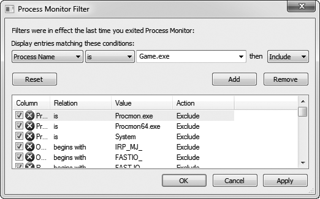
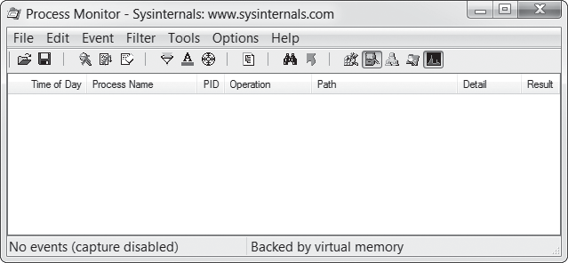
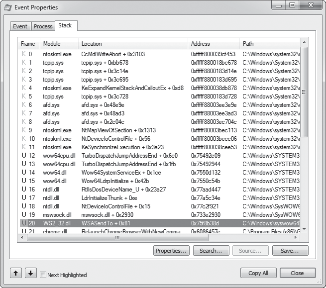
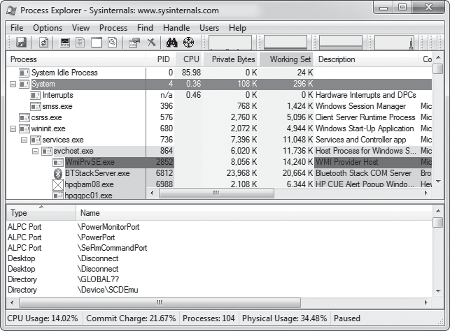
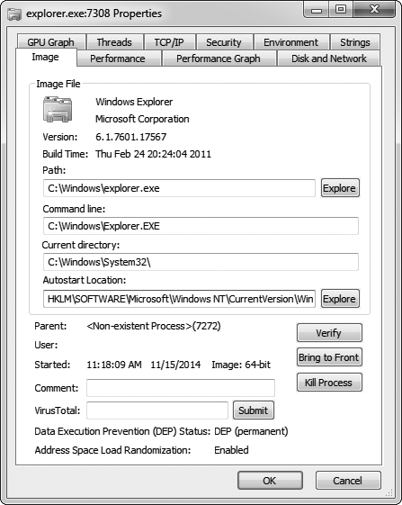

# Capitulo 3 - Reconhecimento com Process Monitor e Process Explorer

> Titulo original: *Reconnaissance with Process Monitor and Process Explorer*

> Navegacao: [Anterior](capitulo-02.md) | [Indice](README.md) | [Proximo](capitulo-04.md)

## Topicos

- Captura de eventos em jogo com Process Monitor
- Inspecao de logs e correlacao com estruturas de dados
- Uso de stack trace para integrar com debugger
- Interface e propriedades de processo no Process Explorer
- Manipulacao de handles e mutexes

## Abertura

Cheat Engine e OllyDbg ajudam a esmiucar a memoria e o codigo de um
game, mas voce tambem precisa entender como o game interage com
arquivos, valores de registry, conexoes de rede e outros processos.
Para aprender como essas interacoes funcionam, voce precisa de duas
ferramentas que monitoram acoes externas dos processos: Process
Monitor e Process Explorer. Com elas, da para mapear o game completo,
localizar save files, identificar registry keys de configuracoes e
enumerar IPs de game servers remotos.

Neste capitulo voce vai aprender a usar Process Monitor e Process
Explorer para registrar eventos do sistema e inspecionar como o game
participou deles. Uteis principalmente em reconhecimento inicial,
essas ferramentas dao um quadro claro e detalhado de como o game
interage com o seu sistema. Voce baixa as duas no site do Windows
Sysinternals (<https://technet.microsoft.com/en-us/sysinternals/>).

## Process Monitor

Voce aprende muito sobre um game so explorando como ele interage com
o registry, o filesystem e a rede. O Process Monitor e uma ferramenta
poderosa de monitoramento de sistema que loga esses eventos em tempo
real e se integra a uma sessao de debug. Ele entrega dados extensos
sobre a interacao do game com o ambiente externo. Com revisao
cuidadosa (e as vezes intuicao espontanea) da sua parte, esses dados
revelam detalhes sobre data files, conexoes de rede e eventos de
registry uteis para enxergar e manipular como o game funciona.

Esta secao mostra como usar o Process Monitor para registrar dados,
navegar nos logs e fazer chutes informados sobre os arquivos com que
um game interage. Apos o tour, voce pratica no exercicio "Encontrando
um arquivo de high score".

### Capturando eventos em jogo

Os logs do Process Monitor podem armazenar todo tipo de informacao,
mas o uso mais pratico e descobrir onde data files, como definicoes
de in-game items, sao armazenados. Quando voce abre o Process
Monitor, o primeiro dialog e o Process Monitor Filter (Figura 3-1).

> Figura 3-1: dialog Process Monitor Filter.




Esse dialog deixa voce mostrar ou suprimir eventos com base em varias
propriedades dinamicas. Para comecar a monitorar, escolha
**Process Name > Is > YourGameFilename.exe > Include**, depois
**Add**, **Apply** e **OK**. Isso instrui o Process Monitor a
mostrar eventos invocados por `YourGameFilename.exe`. Com os filtros
configurados, voce vai para a janela principal (Figura 3-2).

> Figura 3-2: janela principal do Process Monitor.




Para configurar as colunas exibidas no log, clique direito no header
e escolha **Select Columns**. Sao muitas opcoes, mas para games sete
sao mais que suficientes:

- **Time of Day**: deixa voce ver quando cada acao acontece.
- **Process Name**: util quando voce monitora varios processos, mas
  com o filtro single-process tipico de games, desabilitar economiza
  espaco.
- **Process ID**: igual ao Process Name, mas mostra o ID em vez do
  nome.
- **Operation**: mostra qual acao foi executada; obrigatoria.
- **Path**: mostra o path-alvo da acao; tambem obrigatoria.
- **Detail**: util em alguns casos, e habilitar nao atrapalha.
- **Result**: mostra quando acoes (como carregar arquivos) falham.

Quanto mais colunas, mais lotado o log. As opcoes acima ajudam a
manter o output enxuto.

Com o monitor rodando e as colunas escolhidas, ha cinco event class
filters (em destaque na Figura 3-2) que voce alterna para limpar
ainda mais os logs. Da esquerda para a direita:

- **Registry**: mostra toda atividade de registry. Tem muito ruido
  na criacao do processo, ja que games raramente usam o registry e
  bibliotecas do Windows usam constantemente. Manter desligado
  economiza espaco.
- **Filesystem**: mostra toda atividade de filesystem. E o mais
  importante, ja que entender onde os data files estao e como sao
  acessados e fundamental para escrever um bot eficaz.
- **Network**: mostra toda atividade de rede. A call stack dos
  eventos de rede ajuda a achar codigo relacionado a rede no game.
- **Process and thread activity**: mostra acoes de processos e
  threads. A call stack desses eventos da insight de como o game
  trata threads.
- **Process profiling**: mostra periodicamente uso de memoria e CPU
  por processo; raramente util para game hacker.

Se o filtro por classe nao for suficiente, clique direito em eventos
especificos para opcoes de filtro a nivel de evento. Com os filtros
ajustados, comece a navegar pelo log. A Tabela 3-1 lista hotkeys
uteis.

> Tabela 3-1: hotkeys do Process Monitor
>
> | Hotkey | Acao |
> |---|---|
> | `Ctrl-E` | Liga/desliga o logging. |
> | `Ctrl-A` | Liga/desliga o auto-scroll do log. |
> | `Ctrl-X` | Limpa o log. |
> | `Ctrl-L` | Abre o dialog Filter. |
> | `Ctrl-H` | Abre o dialog Highlight (parecido com Filter, mas indica quais eventos destacar). |
> | `Ctrl-F` | Abre o dialog Search. |
> | `Ctrl-P` | Abre o Event Properties do evento selecionado. |

A medida que voce navega o log, da para examinar as operacoes
registradas e ver detalhes finos de cada evento.

### Inspecionando eventos no log

O Process Monitor loga todos os data points possiveis sobre um
evento, permitindo entender muito alem dos arquivos envolvidos.
Inspecionar com calma colunas ricas como Result e Detail entrega
informacao bem interessante.

Por exemplo, e comum ver games lendo data structures, elemento por
elemento, direto de arquivos. Esse padrao fica obvio quando o log
tem varios reads no mesmo arquivo, com offsets sequenciais e tamanhos
variando. Considere a Tabela 3-2.

> Tabela 3-2: exemplo de event log
>
> | Operation | Path | Detail |
> |---|---|---|
> | Create File | `C:\file.dat` | Desired Access: Read |
> | Read File | `C:\file.dat` | Offset: 0, Size: 4 |
> | Read File | `C:\file.dat` | Offset: 4, Size: 2 |
> | Read File | `C:\file.dat` | Offset: 6, Size: 2 |
> | Read File | `C:\file.dat` | Offset: 8, Size: 4 |
> | Read File | `C:\file.dat` | Offset: 12, Size: 4 |
> | ... | ... | Continua lendo chunks de 4 bytes por um tempo |

Esse log indica que o game esta lendo uma estrutura do arquivo pedaco
por pedaco, dando pistas sobre o formato. Suponha que esses reads
refletem o seguinte data file:

```cpp
struct myDataFile
{
    int header;        // 4 bytes (offset 0)
    short effectCount; // 2 bytes (offset 4)
    short itemCount;   // 2 bytes (offset 6)
    int* effects;
    int* items;
};
```

Compare o log com a struct: primeiro o game le 4 bytes do `header`.
Depois le dois valores de 2 bytes: `effectCount` e `itemCount`. Em
seguida cria dois arrays de inteiros, `effects` e `items`, com os
respectivos tamanhos `effectCount` e `itemCount`. Por fim, preenche
os arrays com dados do arquivo, lendo `4` bytes
`effectCount + itemCount` vezes.

> NOTA: developers nao deveriam ler dados de arquivo desse jeito,
> mas e impressionante como acontece com frequencia. Sorte sua,
> porque essa ingenuidade facilita a sua analise.

Nesse caso, o event log identifica pequenas pecas de informacao
dentro do arquivo. Mas note que correlacionar reads com uma
estrutura conhecida e facil; reverter uma estrutura desconhecida so
com o event log e bem mais dificil. Em geral, game hackers usam um
debugger para conseguir mais contexto sobre cada evento
interessante, e os dados do Process Monitor se integram tranquilo a
sessao de debug, ligando os dois paradigmas poderosos de reverse
engineering.

### Debugando o game para coletar mais dados

Saindo do exemplo hipotetico, vamos ver como o Process Monitor leva
voce do logging de eventos para o debugging. Para cada evento, o
Process Monitor armazena uma stack trace completa, mostrando a
cadeia de execucao que disparou aquele evento. Voce ve essas stack
traces na aba **Stack** da janela Event Properties (duplo clique no
evento ou `Ctrl-P`), como na Figura 3-3.

> Figura 3-3: call stack de evento do Process Monitor.
> Elementos numerados: (1) Frame, (2) Module, (3) Location,
> (4) Address, (5) Path.




A stack trace e uma tabela. A coluna Frame (1) mostra o execution
mode e o indice do stack frame. Um `K` rosa significa kernel mode;
um `U` azul, user mode. Como game hackers tipicamente trabalham em
user mode, operacoes em kernel mode geralmente nao importam.

A coluna Module (2) mostra o modulo executavel onde o codigo
chamador estava. Cada modulo e o nome do binario que fez a chamada,
o que torna facil identificar quais calls sairam do binario do game.

A coluna Location (3) mostra o nome da funcao que fez cada call e o
offset da call. Esses nomes sao deduzidos da export table do modulo
e geralmente nao estao presentes para funcoes do binario do game.
Quando nao tem nome, a Location mostra o nome do modulo e o offset
da call (quantos bytes apos o endereco de origem a call esta na
memoria) a partir do base address do modulo.

> NOTA: no contexto de codigo, *offset* e quantos bytes de codigo
> assembly separam um item da sua origem.

A coluna Address (4) mostra o code address da call, muito util
porque voce consegue saltar para esse endereco no disassembler do
OllyDbg. Por fim, a coluna Path (5) mostra o path para o modulo que
fez a call.

Na minha opiniao, a stack trace e, de longe, o recurso mais poderoso
do Process Monitor. Ela revela todo o contexto que levou a um
evento, o que ajuda muito ao debugar um game. Voce usa para achar o
codigo exato que disparou o evento, subir pela call chain para ver
como chegou ali e ate determinar exatamente quais bibliotecas foram
usadas em cada acao.

A aplicacao irma do Process Monitor, o Process Explorer, nao tem
muitas capacidades alem do que ja existe no Process Monitor ou no
OllyDbg, mas expoe algumas delas de forma muito mais eficaz, sendo
ideal em certas situacoes.

> ### Exercicio: Encontrando um arquivo de high score
>
> Para testar suas skills com Process Monitor, abra o diretorio
> `GameHackingExamples/Chapter3_FindingFiles` e execute
> `FindingFiles.exe`. E um Pong, parecido com o do exercicio
> "Patching an if() Statement". Mas dessa vez o game e jogavel de
> verdade. Tambem mostra seu score atual e o all-time-high score.
>
> Reinicie o game disparando o Process Monitor antes da segunda
> execucao. Filtrando por filesystem activity e criando outros
> filtros que achar uteis, tente localizar onde o game guarda o
> arquivo de high score. Como bonus, tente modificar esse arquivo
> para mostrar o maior score possivel.

## Process Explorer

O Process Explorer e um task manager avancado (tem ate um botao para
torna-lo seu task manager padrao) e e bem util quando voce esta
comecando a entender como um game opera. Ele entrega dados complexos
sobre processos em execucao: parent e child processes, uso de CPU,
uso de memoria, modulos carregados, handles abertos, argumentos da
command line. Tambem permite manipular esses processos. Brilha em
mostrar informacao high-level: process trees, consumo de memoria,
file access e process IDs, todos uteis.

Claro que esses dados isolados nao tem tanto valor. Mas com olho
clinico voce correlaciona dados e tira conclusoes sobre quais
objetos globais (incluindo arquivos, mutexes e segmentos de shared
memory) o game tem acesso. Os dados do Process Explorer ficam mais
valiosos ainda quando cruzados com os de uma sessao de debug.

Esta secao apresenta a UI, discute as propriedades exibidas e
descreve como manipular handles (referencias a recursos do sistema).
Para praticar, faca o exercicio "Encontrando e fechando um mutex"
mais a frente.

### Interface e controles do Process Explorer

Quando voce abre o Process Explorer, ve uma janela em tres secoes
distintas (Figura 3-4).

> Figura 3-4: janela principal do Process Explorer.
> Elementos numerados: (1) toolbar, (2) painel superior,
> (3) painel inferior.




As tres secoes sao a toolbar (1), o painel superior (2) e o painel
inferior (3). O painel superior mostra a lista de processos em
estrutura de arvore com relacao parent/child. Processos diferentes
ficam destacados em cores diferentes; se voce nao gosta das cores,
**Options > Configure Colors** abre o dialog para mudar.

Igual ao Process Monitor, o display dessa tabela e bem versatil e
voce customiza com clique direito no header e **Select Columns**.
Sao mais de 100 opcoes, mas as defaults com a adicao de **ASLR
Enabled** funcionam bem.

> NOTA: Address Space Layout Randomization (ASLR) e um recurso de
> seguranca do Windows que aloca executable images em locais
> imprevisiveis. Saber se esta ligado e fundamental quando voce
> tenta alterar valores de game state na memoria.

O painel inferior tem tres estados: Hidden, DLLs e Handles. Hidden
esconde o painel; DLLs mostra a lista de Dynamic Link Libraries
carregadas no processo; Handles mostra os handles do processo
(visivel na Figura 3-4). Voce esconde/mostra o painel inteiro com
**View > Show Lower Pane** e troca o display com
**View > Lower Pane View > DLLs** ou
**View > Lower Pane View > Handles**.

Da para usar hotkeys para alternar o painel inferior sem afetar o
painel superior. Vide Tabela 3-3.

> Tabela 3-3: hotkeys do Process Explorer
>
> | Hotkey | Acao |
> |---|---|
> | `Ctrl-F` | Buscar valor nos data sets do painel inferior. |
> | `Ctrl-L` | Liga/desliga o painel inferior. |
> | `Ctrl-D` | Painel inferior para DLLs. |
> | `Ctrl-H` | Painel inferior para handles. |
> | `Spacebar` | Liga/desliga auto-refresh da lista de processos. |
> | `Enter` | Abre Properties do processo selecionado. |
> | `Del` | Mata o processo selecionado. |
> | `Shift-Del` | Mata o processo selecionado e todos os children. |

Pratique alternar modos. Quando estiver familiarizado com a janela
principal, vamos olhar outro dialog importante, o Properties.

### Examinando Process Properties

Igual ao Process Monitor, o Process Explorer aposta em coleta agil
de dados, e o resultado e um espectro amplo e detalhado de
informacoes. De fato, ao abrir o Properties (Figura 3-5) de um
processo, voce ve uma tab bar gigante com 10 abas.

> Figura 3-5: dialog Properties do Process Explorer.




A aba **Image**, selecionada por padrao, mostra o nome do
executavel, versao, build date e path completo. Tambem mostra o
working directory atual e o status de ASLR. ASLR e a informacao mais
importante aqui, ja que afeta diretamente como um bot le memoria do
game. Voltamos ao tema no Capitulo 6.

As abas **Performance**, **Performance Graph**, **Disk and Network**
e **GPU Graph** mostram metricas de CPU, memoria, disco, rede e GPU
do processo. Para um bot que injeta no game, isso ajuda a medir o
impacto de performance que o seu bot causa.

A aba **TCP/IP** mostra conexoes TCP ativas, util para descobrir IPs
de game servers que o game conecta. Para testar velocidade de
conexao, encerrar conexoes ou pesquisar o protocolo de rede do game,
e critico.

A aba **Strings** mostra strings encontradas no binario ou na
memoria do processo. Diferente da lista do OllyDbg, que mostra so
strings referenciadas pelo assembly, a do Process Explorer inclui
qualquer ocorrencia de tres ou mais caracteres legiveis seguidos de
um null terminator. Quando o binario do game e atualizado, da para
usar uma ferramenta de diff sobre essa lista entre versoes para
identificar novas strings que valem investigar.

A aba **Threads** lista as threads em execucao no processo e permite
pausar, retomar ou matar cada uma; **Security** exibe os privilegios
do processo; **Environment** mostra as variaveis de ambiente
conhecidas ou definidas pelo processo.

> NOTA: ao abrir Properties para um processo .NET, aparecem duas
> abas extras: **.NET Assemblies** e **.NET Performance**. Os dados
> sao auto-explicativos. Lembre que a maioria das tecnicas deste
> livro nao funciona em games escritos em .NET.

### Manipulacao de handles

Como voce viu, o Process Explorer entrega muita informacao sobre um
processo. Mas nao para por ai: ele tambem manipula partes do
processo. Por exemplo, voce ve e manipula handles abertos pelo
painel inferior (Figura 3-4). So por isso ja vale botar o Process
Explorer no toolbox. Fechar um handle e tao simples quanto clicar
direito nele e escolher **Close Handle**. Isso ajuda quando voce
quer, por exemplo, fechar mutexes (essencial para certos tipos de
hack).

> NOTA: clique direito no header do painel inferior e
> **Select Columns** para customizar. Uma coluna especialmente util
> e **Handle Value**, que ajuda quando voce ve um handle sendo
> passado em OllyDbg e quer descobrir o que ele e.

### Fechando mutexes

Games costumam permitir apenas um client por vez; isso e chamado
*single-instance limitation*. Da para implementar de varios jeitos,
mas usar um system mutex e comum porque mutexes sao session-wide e
acessiveis por nome. Limitar instancias com mutexes e trivial e,
gracas ao Process Explorer, remover essa limitacao tambem e trivial,
permitindo rodar varias instancias simultaneamente.

Veja como um game poderia fazer single-instance limitation com um
mutex em C++:

```cpp
int main(int argc, char *argv[]) {
    // cria o mutex
    HANDLE mutex = CreateMutex(NULL, FALSE, "onlyoneplease");
    if (GetLastError() == ERROR_ALREADY_EXISTS) {
        // o mutex ja existia, encerra
        ErrorBox("An instance is already running.");
        return 0;
    }
    // mutex nao existia; foi recem criado, deixa o game rodar
    RunGame();
    // game terminou; fecha o mutex para liberar
    // para futuras instancias
    if (mutex)
        CloseHandle(mutex);
    return 0;
}
```

Esse codigo cria um mutex chamado `onlyoneplease`. Em seguida, a
funcao chama `GetLastError()` para ver se o mutex ja existia; se
sim, encerra o game. Se nao, o game cria a primeira instancia,
bloqueando futuros clients. No final, `CloseHandle()` libera o mutex
para futuras instancias.

Voce usa o Process Explorer para fechar mutexes de instance
limitation e rodar varias instancias ao mesmo tempo. Para isso,
mude o painel inferior para **Handles**, procure handles do tipo
`Mutant`, identifique qual esta limitando instancias e feche.

> AVISO: mutexes tambem sao usados para sincronizar dados entre
> threads e processos. Feche apenas se voce tem certeza que o
> proposito do mutex e o que voce quer subverter.

Multiclient hacks costumam ter alta demanda, entao saber
desenvolve-los rapidamente para games novos e crucial para o
sucesso de um bot developer. Como mutexes sao das formas mais
comuns de single-instance limitation, o Process Explorer e
fundamental para prototipar esse tipo de hack.

### Inspecionando file accesses

Diferente do Process Monitor, o Process Explorer nao mostra uma
lista de filesystem calls. Por outro lado, o **Handles** view do
painel inferior mostra todos os file handles atualmente abertos pelo
game, revelando quais arquivos estao em uso continuo sem precisar
montar filtros avancados no Process Monitor. Procure handles com
type `File` para ver tudo que o game esta usando.

Util quando voce procura logfiles ou save files. Da ate para
localizar named pipes usados em interprocess communication (IPC):
sao arquivos com prefixo `\Device\NamedPipe\`. Ver um desses pipes
costuma indicar que o game esta conversando com outro processo.

> ### Exercicio: Encontrando e fechando um mutex
>
> Para colocar suas skills do Process Explorer em pratica, va para
> `GameHackingExamples/Chapter3_CloseMutex` e execute
> `CloseMutex.exe`. O game se comporta exatamente como o do
> exercicio "Encontrando um arquivo de high score", mas impede que
> voce rode varias instancias ao mesmo tempo. Como deu para imaginar,
> ele faz isso usando um single-instance-limitation mutex. Pelo
> **Handles** view do painel inferior, encontre o mutex responsavel
> e feche-o. Se conseguir, vai dar para abrir uma segunda instancia.

## Fechando

Para ser eficaz com Process Monitor e Process Explorer voce precisa,
acima de tudo, de familiaridade profunda com os dados que essas
aplicacoes mostram e com as interfaces que usam. Esta visao geral e
um bom baseline, mas as nuances so se aprendem na pratica. Mexa nas
duas no seu sistema.

Voce nao vai usar essas ferramentas todo dia, mas em algum momento
elas vao salvar o dia: enquanto voce sua para entender como um
trecho de codigo funciona, vai lembrar de algo obscuro que viu numa
sessao anterior do Process Monitor ou do Process Explorer. E por
isso que considero ambas ferramentas excelentes de reconhecimento.
