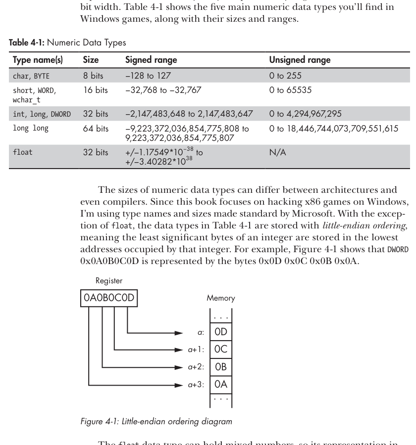
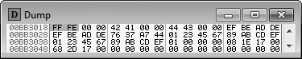
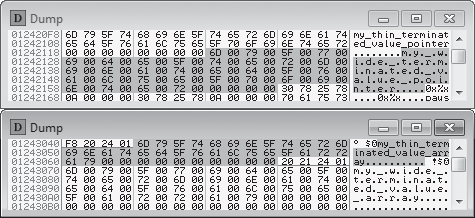
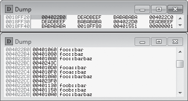
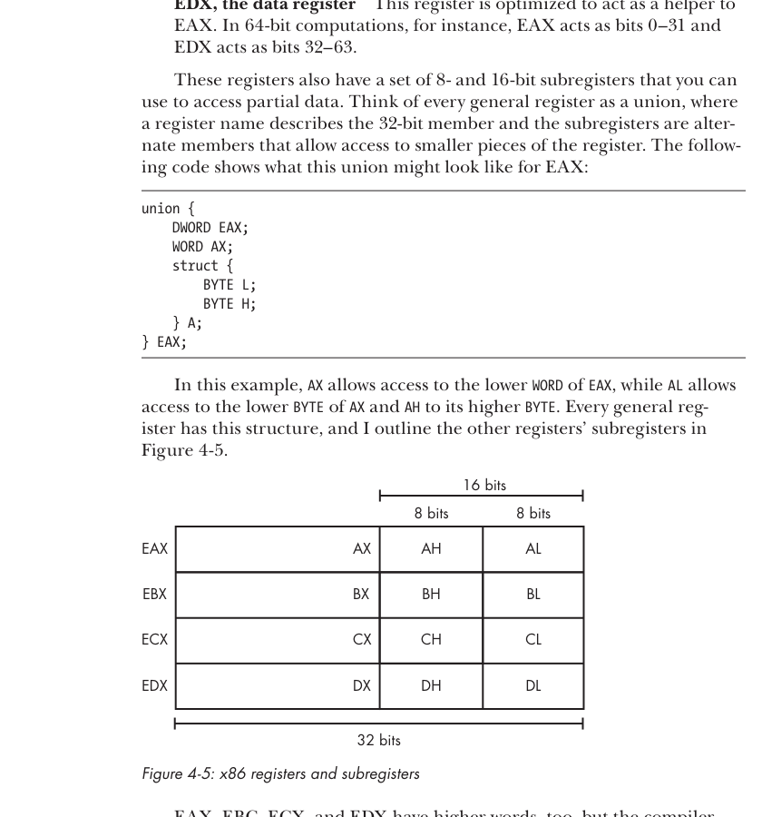
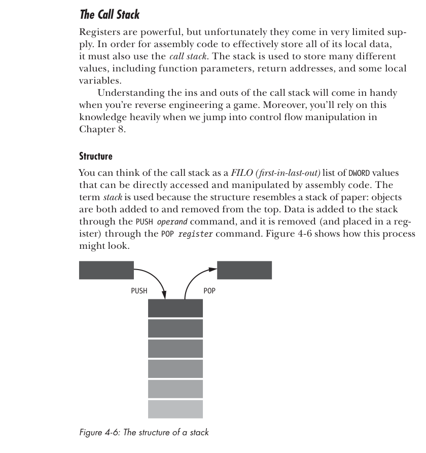
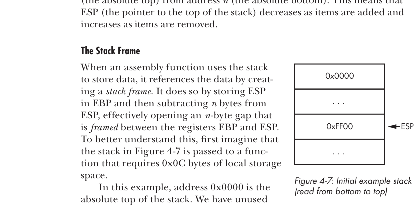
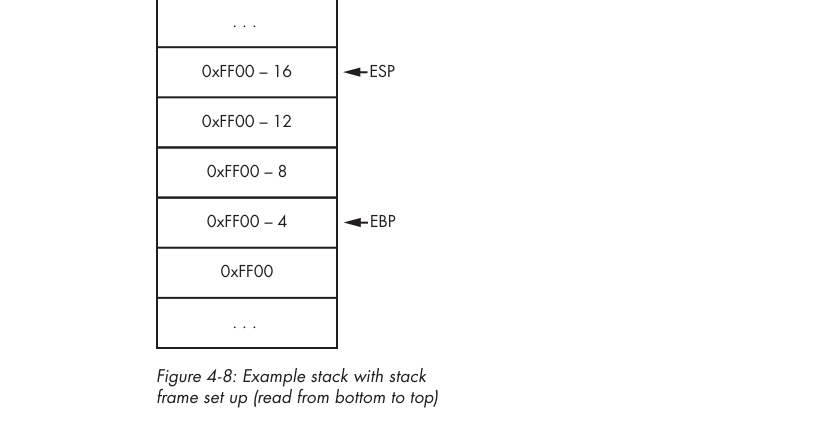

# Capitulo 4 - Do codigo a memoria: base geral

> Titulo original: *From Code to Memory: A General Primer*

> Navegacao: [Anterior](capitulo-03.md) | [Indice](README.md) | [Proximo](capitulo-05.md)

## Topicos

- Como variaveis e dados aparecem na memoria
- Dados numericos, strings, structs e unions
- Classes e VF tables
- Crash course de assembly x86
- Instrucoes x86 importantes para game hacking

## Abertura

No nivel mais baixo, codigo, dados, input e output de um game sao
abstracoes complexas de bytes que mudam o tempo todo. Muitos desses
bytes representam variaveis ou machine code gerado por um compilador
a partir do source code do game. Outros representam imagens, models e
sons. Outros existem so por um instante, postados pelo hardware como
input e destruidos quando o game termina de processa-los. Os bytes
que sobram informam o player do estado interno do game. Mas humanos
nao pensam em bytes, entao o computador precisa traduzir esses bytes
em algo que a gente entenda.

Existe uma desconexao gigante na direcao oposta tambem. O computador
nao entende high-level code nem conteudo visceral de game, entao
isso precisa ser traduzido do abstrato para bytes. Algum conteudo,
como imagens, sons e textos, e armazenado sem perda, pronto para ser
apresentado ao player num piscar. Codigo, logica e variaveis, no
entanto, perdem qualquer legibilidade humana e sao compilados ate
machine data.

Manipulando os dados de um game, game hackers obtem vantagens
humanamente improvaveis. Para isso, precisam entender como o codigo
do developer se manifesta apos compilado e executado. Em essencia,
precisam pensar como o computador.

Para te colocar a pensar como computador, este capitulo comeca
ensinando como numeros, texto, structs simples e unions sao
representados em memoria no nivel de byte. Depois, como instances
de classes ficam na memoria e como abstract instances sabem qual
virtual function chamar em runtime. Na segunda metade, voce vai
fazer um crash course de assembly x86 cobrindo sintaxe,
registradores, operandos, call stack, operacoes aritmeticas,
branching, function calls e calling conventions.

O capitulo e bem tecnico. Nao tem tanta coisa diretamente conectada
a hackear games, mas o conhecimento aqui e central para os capitulos
seguintes, quando vamos falar de ler/escrever memoria
programaticamente, code injection e manipulacao de control flow.

Como C++ e o padrao de fato tanto para games quanto para bots, o
capitulo explica a relacao entre codigo C++ e a memoria que o
representa. A maioria das linguagens nativas tem estrutura e
comportamento low-level muito parecidos (as vezes identicos), entao
da para aplicar o que voce aprende aqui em quase qualquer software.

Todo exemplo de codigo deste capitulo esta em
`GameHackingExamples/Chapter4_CodeToMemory` nos arquivos do livro.
Os projetos compilam com Visual Studio 2010 mas tambem devem
funcionar em qualquer outro compilador C++. Baixe em
<https://www.nostarch.com/gamehacking/>.

## Como variaveis e outros dados aparecem na memoria

Manipular o estado de um game pode ser bem dificil, e achar os
dados que controlam esse estado nem sempre e tao simples quanto
clicar em **Next Scan** torcendo para o Cheat Engine ajudar. Muitos
hacks precisam manipular dezenas de valores relacionados ao mesmo
tempo. Encontrar esses valores e suas relacoes muitas vezes exige
identificar estruturas e padroes analiticamente. Alem disso,
desenvolver game hacks normalmente significa recriar as estruturas
originais dentro do codigo do bot.

Para tudo isso, voce precisa de um entendimento profundo de como
variaveis e dados ficam dispostos na memoria do game. Com codigo de
exemplo, memory dumps do OllyDbg e algumas tabelas de apoio, esta
secao cobre como diferentes tipos de dado aparecem na memoria.

### Dados numericos

A maioria dos valores que game hackers procuram (vida, mana,
posicao, level) sao numeric data types. Como tipos numericos sao
tambem o building block dos demais tipos, entender eles e essencial.
Felizmente, eles tem representacoes relativamente diretas em
memoria: alinhamento previsivel e largura fixa em bits. A Tabela 4-1
mostra os cinco tipos numericos principais que voce vai encontrar em
games Windows.

> Tabela 4-1: numeric data types
>
> | Nome(s) do tipo | Tamanho | Faixa signed | Faixa unsigned |
> |---|---|---|---|
> | `char`, `BYTE` | 8 bits | -128 a 127 | 0 a 255 |
> | `short`, `WORD`, `wchar_t` | 16 bits | -32.768 a 32.767 | 0 a 65.535 |
> | `int`, `long`, `DWORD` | 32 bits | -2.147.483.648 a 2.147.483.647 | 0 a 4.294.967.295 |
> | `long long` | 64 bits | -9,22e18 a 9,22e18 | 0 a 1,84e19 |
> | `float` | 32 bits | +/-1.17549e-38 a +/-3.40282e+38 | N/A |

Os tamanhos podem variar entre arquiteturas e ate compiladores. Como
o livro foca em hackear games x86 no Windows, usamos os nomes e
tamanhos padrao da Microsoft. Excecao feita ao `float`, todos os
tipos da Tabela 4-1 sao armazenados em little-endian, ou seja, os
bytes menos significativos do inteiro ficam nos enderecos mais
baixos ocupados por ele. A Figura 4-1 mostra que o `DWORD`
`0x0A0B0C0D` e representado pelos bytes `0x0D 0x0C 0x0B 0x0A`.

> Figura 4-1: diagrama de ordenacao little-endian.




O tipo `float` armazena numeros mistos, entao a representacao em
memoria nao e tao simples. Se voce ve `0x0D 0x0C 0x0B 0x0A` em
memoria e o valor e um `float`, nao da para simplesmente converter
para `0x0A0B0C0D`. Em vez disso, valores `float` tem tres
componentes: sinal (bit 0), expoente (bits 1-8) e mantissa
(bits 9-31).

O sinal define se o numero e negativo ou positivo, o expoente define
quantas casas mover o ponto decimal (comecando antes da mantissa) e
a mantissa carrega uma aproximacao do valor. O valor armazenado e
recuperado avaliando `mantissa * 10^n` (onde `n` e o expoente) e
multiplicando por `-1` se o sinal estiver setado.

Vamos ver tipos numericos em memoria. A Listagem 4-1 inicializa nove
variaveis em C++.

```cpp
unsigned char ubyteValue = 0xFF;
char byteValue = 0xFE;
unsigned short uwordValue = 0x4142;
short wordValue = 0x4344;
unsigned int udwordValue = 0xDEADBEEF;
int dwordValue = 0xDEADBEEF;
unsigned long long ulongLongValue = 0xEFCDAB8967452301;
long long longLongValue = 0xEFCDAB8967452301;
float floatValue = 1337.7331;
```

> Listagem 4-1: variaveis de tipos numericos em C++.

Esse exemplo tem variaveis dos tipos `char`, `short`, `int`,
`long long` e `float`. Quatro sao unsigned e cinco sao signed.
(Em C++, `float` nao pode ser unsigned.) Compare a Listagem 4-1 com
o memory dump da Figura 4-2, supondo que as variaveis estao em
escopo global.

> Figura 4-2: memory dump no OllyDbg dos dados numericos.




Voce talvez note que alguns valores parecem espacados de maneira
arbitraria. Como o processador acessa muito mais rapido valores em
enderecos multiplos do tamanho do endereco (32 bits no x86), o
compilador faz padding nos valores para alinha-los. Por isso o
padding tambem e chamado de *alignment*. Valores de 1 byte nao tem
padding, ja que operacoes de acesso tem o mesmo custo
independentemente do alinhamento.

Veja a Tabela 4-2, que mapeia memoria para codigo entre o dump da
Figura 4-2 e as variaveis da Listagem 4-1.

> Tabela 4-2: memory-to-code crosswalk para Listagem 4-1 e Figura 4-2
>
> | Address | Size | Data | Object |
> |---|---|---|---|
> | `0x00BB3018` | 1 byte | `0xFF` | `ubyteValue` |
> | `0x00BB3019` | 1 byte | `0xFE` | `byteValue` |
> | `0x00BB301A` | 2 bytes | `0x00 0x00` | Padding antes de `uwordValue` |
> | `0x00BB301C` | 2 bytes | `0x42 0x41` | `uwordValue` |
> | `0x00BB301E` | 2 bytes | `0x00 0x00` | Padding antes de `wordValue` |
> | `0x00BB3020` | 2 bytes | `0x44 0x43` | `wordValue` |
> | `0x00BB3022` | 2 bytes | `0x00 0x00` | Padding antes de `udwordValue` |
> | `0x00BB3024` | 4 bytes | `0xEF 0xBE 0xAD 0xDE` | `udwordValue` |
> | `0x00BB3028` | 4 bytes | `0xEF 0xBE 0xAD 0xDE` | `dwordValue` |
> | `0x00BB302C` | 4 bytes | `0x76 0x37 0xA7 0x44` | `floatValue` |
> | `0x00BB3030` | 8 bytes | `0x01 0x23 0x45 0x67 0x89 0xAB 0xCD 0xEF` | `ulongLongValue` |
> | `0x00BB3038` | 8 bytes | `0x01 0x23 0x45 0x67 0x89 0xAB 0xCD 0xEF` | `longLongValue` |

A coluna Address mostra locais em memoria, Data mostra exatamente o
que esta armazenado, Object liga ao item da Listagem 4-1. Note que
`floatValue` aparece em memoria antes de `ulongLongValue`, mesmo
sendo a ultima variavel da listagem. Como sao globais, o compilador
pode posicionar como quiser. Esse rearranjo costuma vir de
alinhamento ou otimizacao.

### Dados de string

Muitos developers usam *string* como sinonimo de texto, mas texto e
apenas o uso mais comum. No nivel baixo, strings sao apenas arrays
de objetos numericos arbitrarios, lineares e nao alinhados em
memoria. A Listagem 4-2 mostra quatro declaracoes de string em C++.

```cpp
// char => 1 byte por caractere
char* thinStringP = "my_thin_terminated_value_pointer";
char thinStringA[40] = "my_thin_terminated_value_array";

// wchar_t => 2 bytes por caractere
wchar_t* wideStringP = L"my_wide_terminated_value_pointer";
wchar_t wideStringA[40] = L"my_wide_terminated_value_array";
```

> Listagem 4-2: declarando strings em C++.

No contexto de texto, strings guardam objetos do tipo `char` (8 bits)
ou `wchar_t` (16 bits), e o fim de cada string e marcado por um
*null terminator* (caractere igual a `0x0`). Veja na Figura 4-3 a
memoria dessas variaveis.

> Figura 4-3: memory dump do OllyDbg dos dados de string. Texto
> legivel na coluna ASCII bate com o que armazenamos na Listagem 4-2.
> Painel (1) e (2).




A Tabela 4-3 detalha o crosswalk entre Listagem 4-2 e Figura 4-3.

> Tabela 4-3: memory-to-code crosswalk para Listagem 4-2 e Figura 4-3
>
> | Address | Size | Data | Object |
> |---|---|---|---|
> | _Pane 1_ | | | |
> | `0x012420F8` | 32 bytes | `0x6D 0x79 0x5F ... 0x74 0x65 0x72` | caracteres de `thinStringP` |
> | `0x01242118` | 4 bytes | `0x00 0x00 0x00 0x00` | terminator e padding de `thinStringP` |
> | `0x0124211C` | 4 bytes | `0x00 0x00 0x00 0x00` | dados nao relacionados |
> | `0x01242120` | 64 bytes | `0x6D 0x00 0x79 ... 0x00 0x72 0x00` | caracteres de `wideStringP` |
> | `0x01242160` | 4 bytes | `0x00 0x00 0x00 0x00` | terminator e padding de `wideStringP` |
> | _Pane 2_ | | | |
> | `0x01243040` | 4 bytes | `0xF8 0x20 0x24 0x01` | ponteiro para `thinStringP` em `0x012420F8` |
> | `0x01243044` | 30 bytes | `0x6D 0x79 0x5F ... 0x72 0x61 0x79` | caracteres de `thinStringA` |
> | `0x01243062` | 10 bytes | `0x00` repetido 10 vezes | terminator e fill de `thinStringA` |
> | `0x0124306C` | 4 bytes | `0x20 0x21 0x24 0x01` | ponteiro para `wideStringP` em `0x01242120` |
> | `0x01243070` | 60 bytes | `0x6D 0x00 0x79 ... 0x00 0x79 0x00` | caracteres de `wideStringA` |
> | `0x012430AC` | 20 bytes | `0x00` repetido 10 vezes | terminator e fill de `wideStringA` |

Na Figura 4-3, o painel 1 mostra que os valores armazenados onde
`thinStringP` (`0x01243040`) e `wideStringP` (`0x0124306C`) ficam
em memoria sao apenas 4 bytes e nao contem dado de string. E porque
essas variaveis sao na verdade *ponteiros* para o primeiro caractere
dos respectivos arrays. Por exemplo, `thinStringP` contem
`0x012420F8`, e no painel 2 voce ve
`"my_thin_terminated_value_pointer"` em `0x012420F8`.

Olhe os dados entre esses ponteiros no painel 1 e voce ve o texto
de `thinStringA` e `wideStringA`. Note tambem que `thinStringA` e
`wideStringA` tem padding alem do null terminator, ja que foram
declaradas como arrays de tamanho 40, sendo preenchidas ate 40
caracteres.

### Data structures

Diferente dos tipos discutidos antes, *structures* sao containers
que guardam varias pecas de dado simples e relacionado. Game hackers
que conseguem identificar structs em memoria conseguem replica-las
no proprio codigo. Isso reduz muito a quantidade de enderecos que
precisam achar, ja que basta o endereco do inicio da struct, nao de
cada item.

> NOTA: esta secao trata structs como containers simples sem member
> functions e contendo apenas dados simples. Objetos que ultrapassem
> esses limites sao discutidos em "Classes e VF tables".

#### Ordem dos elementos e alinhamento

Como structs sao apenas um agrupamento de objetos, elas nao se
manifestam visivelmente em memory dumps. O dump mostra os objetos
contidos. Parece com os outros dumps deste capitulo, mas com
diferencas importantes em ordem e alinhamento. Veja a Listagem 4-3.

```cpp
struct MyStruct {
    unsigned char ubyteValue;
    char byteValue;
    unsigned short uwordValue;
    short wordValue;
    unsigned int udwordValue;
    int dwordValue;
    unsigned long long ulongLongValue;
    long long longLongValue;
    float floatValue;
};

MyStruct& m = 0;
printf("Offsets: %d,%d,%d,%d,%d,%d,%d,%d,%d\n",
       &m->ubyteValue, &m->byteValue,
       &m->uwordValue, &m->wordValue,
       &m->udwordValue, &m->dwordValue,
       &m->ulongLongValue, &m->longLongValue,
       &m->floatValue);
```

> Listagem 4-3: uma struct C++ e codigo para inspecionar offsets.

O codigo declara `MyStruct` e cria `m` apontando supostamente para
uma instancia em endereco `0`. Nao existe instancia em `0`, mas o
truque permite usar o `&` no `printf()` para pegar o endereco de
cada membro. Como a struct esta em `0`, o endereco impresso de cada
membro e o offset desde o inicio da struct.

A saida desse codigo e:

```text
Offsets: 0,1,2,4,8,12,16,24,32
```

Os membros aparecem em ordem exatamente como definidos. Esse layout
sequencial e propriedade obrigatoria de structs. Compare com o
exemplo da Listagem 4-1: na Figura 4-2, o compilador colocou alguns
valores fora de ordem na memoria.

Note tambem que os membros nao tem o mesmo padding que as variaveis
globais da Listagem 4-1; se tivessem, haveria 2 bytes de padding
antes de `uwordValue`. Isso porque membros de struct sao alinhados
em enderecos divisiveis pelo *struct member alignment* (opcao do
compilador entre 1, 2, 4, 8 ou 16 bytes; aqui 4) ou pelo tamanho do
membro, o que for menor. Eu organizei `MyStruct` para o compilador
nao precisar adicionar padding.

Se colocassemos um `char` logo apos `ulongLongValue`, o `printf()`
imprimiria:

```text
Offsets: 0,1,2,4,8,12,16,28,36
```

Comparando:

```text
Original:  Offsets: 0,1,2,4,8,12,16,24,32
Modificado: Offsets: 0,1,2,4,8,12,16,28,36
```

Na versao modificada, os dois ultimos offsets (de `longLongValue` e
`floatValue`) mudaram. Por causa do alinhamento, `longLongValue`
deslocou 4 bytes (1 do `char` e 3 de padding apos ele) para cair em
endereco multiplo de 4.

#### Como structs funcionam

Replicar structs do game no seu proprio codigo e bem util. Voce
pode ler ou escrever a struct inteira numa unica operacao. Imagine
um game que declara health atual e maxima assim:

```cpp
struct {
    int current;
    int max;
} vital;
vital health;
```

Um game hacker iniciante que queira ler isso da memoria pode escrever:

```cpp
int currentHealth = readIntegerFromMemory(currentHealthAddress);
int maxHealth     = readIntegerFromMemory(maxHealthAddress);
```

Esse hacker nao percebeu que ver os valores juntos em memoria pode
ser mais que coincidencia, e usou duas variaveis separadas. Mas
voce, conhecendo structs, conclui que como esses valores estao
relacionados e adjacentes, da para usar uma struct:

```cpp
struct {
    int current;
    int max;
} _vital;

_vital health = readTypeFromMemory<_vital>(healthStructureAddress);  // (1)
```

Como o codigo agora replica a struct corretamente, da para pegar
ambos os campos numa linha so (1). Mais detalhes em como ler
memoria voce ve no Capitulo 6.

### Unions

Diferente de structs, que encapsulam varias pecas de dado
relacionado, *unions* contem uma unica peca de dado exposta atraves
de varias variaveis. Tres regras:

- O tamanho de um union e igual ao do seu maior membro.
- Todos os membros referenciam o mesmo bloco de memoria.
- O union herda o alinhamento do maior membro.

O `printf()` a seguir ilustra as duas primeiras regras:

```cpp
union {
    BYTE byteValue;
    struct {
        WORD first;
        WORD second;
    } words;
    DWORD value;
} dwValue;

dwValue.value = 0xDEADBEEF;
printf("Size %d\nAddresses 0x%x,0x%x\nValues 0x%x,0x%x\n",
       sizeof(dwValue), &dwValue.value, &dwValue.words,
       dwValue.words.first, dwValue.words.second);
```

Saida:

```text
Size 4
Addresses 0x2efda8,0x2efda8
Values 0xbeef,0xdead
```

A primeira regra aparece em `Size`: mesmo `dwValue` tendo tres
membros que somam 9 bytes, o tamanho e 4 bytes. A segunda regra
aparece em `Addresses`: `dwValue.value` e `dwValue.words` apontam
para o mesmo endereco `0x2efda8`. Tambem, `dwValue.words.first` e
`dwValue.words.second` contem `0xbeef` e `0xdead`, que faz sentido
ja que `dwValue.value == 0xdeadbeef`. A terceira regra nao aparece
neste exemplo por falta de contexto, mas se voce colocasse esse
union dentro de uma struct ele sempre alinharia como `DWORD`.

## Classes e VF tables

Como structs, *classes* sao containers que guardam e isolam varias
pecas de dado, mas tambem podem conter funcoes.

### Uma classe simples

Classes com funcoes normais, como `bar` na Listagem 4-4, seguem o
mesmo layout em memoria de structs.

```cpp
class bar {
public:
    bar() : bar1(0x898989), bar2(0x10203040) {}
    void myfunction() { bar1++; }
    int bar1, bar2;
};

bar _bar = bar();
printf("Size %d; Address 0x%x : _bar\n", sizeof(_bar), &_bar);
```

> Listagem 4-4: uma classe C++.

Saida:

```text
Size 8; Address 0x2efd80 : _bar
```

Mesmo `bar` tendo duas member functions, ela ocupa apenas os 8 bytes
necessarios para `bar1` e `bar2`. A classe `bar` nao guarda
abstracao das funcoes; o programa as chama diretamente.

> NOTA: niveis de acesso (`public`, `private`, `protected`) nao
> aparecem em memoria. Independentemente desses modificadores, os
> membros sao ordenados conforme definidos.

### Uma classe com virtual functions

Quando a classe inclui *virtual functions* (abstratas), o programa
precisa saber qual versao chamar. Veja a Listagem 4-5:

```cpp
class foo {
public:
    foo() : myValue1(0xDEADBEEF), myValue2(0xBABABABA) {}
    int myValue1;
    static int myStaticValue;
    virtual void bar() { printf("call foo::bar()\n"); }
    virtual void baz() { printf("call foo::baz()\n"); }
    virtual void barbaz() {}
    int myValue2;
};
int foo::myStaticValue = 0x12121212;

class fooa : public foo {
public:
    fooa() : foo() {}
    virtual void bar() { printf("call fooa::bar()\n"); }
    virtual void baz() { printf("call fooa::baz()\n"); }
};

class foob : public foo {
public:
    foob() : foo() {}
    virtual void bar() { printf("call foob::bar()\n"); }
    virtual void baz() { printf("call foob::baz()\n"); }
};
```

> Listagem 4-5: as classes `foo`, `fooa` e `foob`.

A classe `foo` tem tres virtual functions: `bar`, `baz` e `barbaz`.
`fooa` e `foob` herdam de `foo` e fazem overload de `bar` e `baz`.
Como `fooa` e `foob` tem `foo` como base publica, um ponteiro `foo*`
pode apontar para elas, mas o programa precisa chamar a versao
correta. Voce ve isso executando:

```cpp
foo* _testfoo = (foo*)new fooa();
_testfoo->bar(); // chama fooa::bar()
```

Saida:

```text
call fooa::bar()
```

A saida mostra que `_testfoo->bar()` invoca `fooa::bar()` mesmo com
`_testfoo` sendo `foo*`. O programa sabe qual versao chamar porque
o compilador colocou uma *VF (virtual function) table* na memoria
de `_testfoo`. VF tables sao arrays de enderecos de funcao que
abstract class instances usam para dizer ao programa onde estao as
funcoes overloaded.

### Class instances e VF tables

Para entender a relacao entre instances e VF tables, veja o memory
dump dos tres objetos:

```cpp
foo  _foo  = foo();
fooa _fooa = fooa();
foob _foob = foob();
```

> Figura 4-4: memory dump dos dados das classes.
> Painel (1) e (2).




O painel 1 mostra que cada instance armazena seus membros igual a
uma struct, mas precedidos por um `DWORD` que aponta para a VF table
da classe. O painel 2 mostra as VF tables das tres instancias. A
Tabela 4-4 detalha o crosswalk.

> Tabela 4-4: memory-to-code crosswalk para Listagem 4-5 e Figura 4-4
>
> | Address | Size | Data | Object |
> |---|---|---|---|
> | _Pane 1_ | | | |
> | `0x0018FF20` | 4 bytes | `0x004022B0` | inicio de `_foo` e ponteiro para a `foo` VF table |
> | `0x0018FF24` | 8 bytes | `0xDEADBEEF 0xBABABABA` | `_foo.myValue1` e `_foo.myValue2` |
> | `0x0018FF2C` | 4 bytes | `0x004022C0` | inicio de `_fooa` e ponteiro para a `fooa` VF table |
> | `0x0018FF30` | 8 bytes | `0xDEADBEEF 0xBABABABA` | `_fooa.myValue1` e `_fooa.myValue2` |
> | `0x0018FF38` | 4 bytes | `0x004022D0` | inicio de `_foob` e ponteiro para a `foob` VF table |
> | `0x0018FF3C` | 8 bytes | `0xDEADBEEF 0xBABABABA` | `_foob.myValue1` e `_foob.myValue2` |
> | _Pane 2_ | | | |
> | `0x004022B0` | 4 bytes | `0x00401060` | inicio da VF table de `foo`; endereco de `foo::bar` |
> | `0x004022B4` | 4 bytes | `0x00401080` | endereco de `foo::baz` |
> | `0x004022B8` | 4 bytes | `0x004010A0` | endereco de `foo::barbaz` |
> | `0x004022C0` | 4 bytes | `0x004010D0` | inicio da VF table de `fooa`; endereco de `fooa::bar` |
> | `0x004022C4` | 4 bytes | `0x004010F0` | endereco de `fooa::baz` |
> | `0x004022C8` | 4 bytes | `0x004010A0` | endereco de `foo::barbaz` |
> | `0x004022D0` | 4 bytes | `0x00401130` | inicio da VF table de `foob`; endereco de `foob::bar` |
> | `0x004022D4` | 4 bytes | `0x00401150` | endereco de `foob::baz` |
> | `0x004022D8` | 4 bytes | `0x004010A0` | endereco de `foo::barbaz` |

Cada VF table e gerada pelo compilador na criacao do binario e
permanece constante. Para economizar espaco, instances da mesma
classe apontam para a mesma VF table; por isso a VF table nao fica
inline com a classe.

Como temos tres VF tables, voce pode se perguntar como cada instance
sabe qual usar. O compilador coloca codigo parecido com este
assembly em cada construtor de classe virtual:

```nasm
MOV DWORD PTR DS:[EAX], VFADDR
```

Isso pega o endereco estatico da VF table (`VFADDR`) e coloca como
primeiro membro da classe.

Olhe os enderecos `0x004022B0`, `0x004022C0` e `0x004022D0` na
Tabela 4-4: comecam as VF tables de `foo`, `fooa` e `foob`. Note
que `foo::barbaz` aparece nas tres VF tables; e porque ele nao foi
overloaded por nenhuma subclasse, entao instances delas chamam a
implementacao original direto.

Note tambem que `foo::myStaticValue` nao aparece. Como o valor e
estatico, ele nao precisa pertencer a classe `foo`; foi colocado la
so por organizacao. Na pratica e tratado como variavel global e
fica em outro lugar.

Aqui termina o passeio pela memoria. Se voce tiver duvida no
futuro sobre algum chunk de dado, volta aqui de referencia. A
seguir, como o computador entende source code high-level em
primeiro lugar.

> ### Boxe: VF tables e Cheat Engine
>
> Lembra a opcao **First element of pointerstruct must point to
> module** dos pointer scans (Figura 1-4)? Agora que voce ja viu um
> pouco de VF tables, da para entender: ela faz o Cheat Engine
> ignorar todo heap chunk cujo primeiro membro nao seja um ponteiro
> para uma VF table valida. Acelera scans, mas so funciona se cada
> passo do pointer path for parte de uma abstract class instance.

## Crash course de assembly x86

Quando o source code e compilado em binario, ele e despido de
artefatos desnecessarios e traduzido em *machine code*. Esse machine
code, feito so de bytes (os bytes de comando se chamam *opcodes*,
mas tem tambem bytes de operandos), vai direto para o processador
e diz exatamente como ele deve se comportar. Esses 1s e 0s controlam
transistores e sao bem dificeis de ler. Para facilitar, engenheiros
usam *assembly language*, uma especie de taquigrafia que representa
opcodes com nomes abreviados (mnemonics) e sintaxe simples.

Saber assembly e importante porque muitos hacks poderosos so sao
viaveis pela manipulacao direta do assembly do game, via metodos
como NOPing ou hooking. Esta secao cobre o basico de x86 assembly
de 32 bits. Como assembly e extenso, focamos no subset mais util
para game hacking.

> NOTA: por todo este capitulo, varios snippets de assembly trazem
> comentarios apos `;` para explicar cada instrucao em mais detalhe.

### Sintaxe de comando

Assembly descreve machine code, entao a sintaxe e bem simplistica.
Isso facilita entender comandos individuais, mas dificulta
compreender blocos complexos. Ate algoritmos legiveis em high-level
parecem ofuscados em assembly. Por exemplo, este pseudocodigo:

```cpp
if (EBX > EAX)
    ECX = EDX;
else
    ECX = 0;
```

vira em x86 assembly:

```nasm
    CMP EBX, EAX
    JG  label1
    MOV ECX, 0
    JMP label2
label1:
    MOV ECX, EDX
label2:
```

> Listagem 4-6: alguns comandos x86.

Por isso, entender funcoes triviais em assembly leva pratica. Mas
entender comandos individuais e simples, e ate o fim desta secao
voce vai conseguir interpretar os comandos acima.

#### Instrucoes

A primeira parte de um comando assembly e a *instrucao*. Equivalendo
um comando assembly a um comando de terminal, a instrucao e o
programa a executar. No nivel de machine code, instrucoes sao
tipicamente o primeiro byte do comando; tem instrucoes de 2 bytes
onde o primeiro byte e `0x0F`. Em qualquer caso, a instrucao diz
ao processador o que fazer. Em `Listagem 4-6`, `CMP`, `JG`, `MOV` e
`JMP` sao instrucoes.

#### Operandos

Algumas instrucoes sao comandos completos, mas a maioria precisa de
operandos (parametros). Cada comando da Listagem 4-6 tem ao menos um
operando, como `EBX`, `EAX` e `label1`. Operandos vem em tres formas:

- **Immediate value**: um inteiro declarado inline (valores hex tem
  `h` no final).
- **Register**: um nome que se refere a um registrador do processador.
- **Memory offset**: uma expressao em colchetes que representa o
  endereco de memoria de um valor. Pode ser immediate, register, ou
  soma/subtracao de register e immediate (ex.: `[REG+Ah]` ou
  `[REG-10h]`).

Cada instrucao x86 pode ter zero a tres operandos, separados por
virgula. Quando uma instrucao tem dois operandos, geralmente sao
*source* e *destination*. A ordem depende da sintaxe. A Listagem 4-7
mostra pseudo-comandos na sintaxe Intel (usada no Windows).

```nasm
MOV R1, 1          ; coloca 1 (immediate) em R1 (register)
MOV R1, [BADF00Dh] ; coloca o valor em [BADF00Dh] em R1   ; (1)
MOV R1, [R2+10h]   ; coloca valor em [R2+10h] em R1
MOV R1, [R2-20h]   ; coloca valor em [R2-20h] em R1
```

> Listagem 4-7: sintaxe Intel.

Na sintaxe Intel, o destination vem primeiro e o source depois,
entao em (1) `R1` e o destination e `[BADF00Dh]` e o source.
Compiladores como GCC usam a sintaxe AT&T (UNIX):

```nasm
MOV $1, %R1          ; R1 = 1
MOV 0xBADF00D, %R1   ; R1 = [0xBADF00D]
MOV 0x10(%R2), %R1   ; R1 = [%R2+0x10]
MOV -0x20(%R2), %R1  ; R1 = [%R2-0x20]
```

A AT&T inverte a ordem dos operandos, exige prefixos e formata
operandos de memoria de outro jeito.

#### Comandos assembly

Com instrucoes e operandos formatados, da para escrever comandos.
O snippet a seguir e uma funcao assembly que essencialmente nao faz
nada:

```nasm
PUSH EBP      ; coloca EBP na stack
MOV EBP, ESP  ; salva o topo da stack em EBP
PUSH -1       ; coloca -1 na stack
ADD ESP, 4    ; desfaz o PUSH -1 (PUSH subtrai 4 de ESP)
MOV ESP, EBP  ; restaura ESP a partir de EBP
POP EBP       ; restaura EBP do topo da stack (volta ao valor original)
XOR EAX, EAX  ; EAX = 0 (mais rapido que MOV EAX, 0)
RETN          ; retorna; EAX em geral guarda o return value
```

As duas primeiras linhas montam um stack frame. A terceira poe -1
na stack, e o `ADD ESP, 4` desfaz isso. Depois o stack frame e
desmontado, o return value (em `EAX`) e zerado com `XOR` e a funcao
retorna.

### Processor registers

Diferente de linguagens high-level, assembly nao tem nomes de
variavel definidos pelo usuario. Ele acessa dados pelo endereco em
memoria. Mas durante computacao intensa, o overhead de ler/escrever
RAM constantemente e alto. Para mitigar, x86 oferece um conjunto
pequeno de variaveis temporarias chamadas *processor registers*,
pequenos espacos dentro do proprio processador. Como acessar
registradores tem overhead minimo comparado com RAM, assembly usa
eles para descrever estado interno, passar dados volateis e guardar
variaveis context-sensitive.

#### General registers

Quando assembly precisa armazenar ou operar dados arbitrarios, usa
um subconjunto chamado *general registers*. Cada um tem 32 bits e
funciona como `DWORD`. Eles sao otimizados para fins especificos:

- **EAX, accumulator**: otimizado para computacoes matematicas.
  Multiplicacao e divisao so podem rolar em `EAX`.
- **EBX, base register**: usado arbitrariamente. O predecessor de 16
  bits, `BX`, era o unico que podia referenciar enderecos. No x86
  todos podem, deixando `EBX` sem proposito real.
- **ECX, counter**: otimizado para ser o counter (`i` em high-level)
  em loops.
- **EDX, data register**: otimizado para ajudar `EAX`. Em
  computacoes de 64 bits, `EAX` e bits 0-31 e `EDX` e bits 32-63.

Esses registradores tem subregistradores de 8 e 16 bits. Pense em
cada general register como uma union, em que o nome e o membro de
32 bits e os subregistradores acessam pedacos menores. Para `EAX`,
a union seria:

```cpp
union {
    DWORD EAX;
    WORD AX;
    struct {
        BYTE L;
        BYTE H;
    } A;
} EAX;
```

`AX` acessa o lower `WORD` de `EAX`, `AL` o lower `BYTE` de `AX`,
`AH` o higher. Todos os general registers tem essa estrutura. A
Figura 4-5 mostra os subregistradores.

> Figura 4-5: registradores e subregistradores x86.




`EAX`, `EBX`, `ECX` e `EDX` tambem tem higher words, mas o
compilador raramente acessa, ja que pode usar a lower word quando
precisa apenas de armazenamento word.

#### Index registers

x86 tem quatro *index registers* para acessar streams, referenciar
a call stack e guardar info local. Sao 32 bits, mas com propositos
mais rigorosos:

- **EDI, destination index**: indexa memoria-alvo de write
  operations. Sem writes, o compilador pode usar `EDI` arbitrariamente.
- **ESI, source index**: indexa memoria-alvo de read operations.
  Tambem pode ser arbitrario.
- **ESP, stack pointer**: aponta para o topo da call stack. Toda
  operacao de stack acessa esse registrador. Use apenas para stack;
  precisa apontar para o topo.
- **EBP, stack base pointer**: marca o fundo do stack frame.
  Funcoes usam para referenciar parametros e variaveis locais. Em
  codigo compilado com a opcao de omitir esse comportamento, `EBP`
  pode ser arbitrario.

Cada um tem contraparte de 16 bits: `DI`, `SI`, `SP`, `BP`. Nao tem
subregistradores de 8 bits.

#### Execution Index register (EIP)

`EIP` aponta para o endereco do codigo em execucao. Como controla o
fluxo, e incrementado pelo processador e fora dos limites do
assembly modificar diretamente. Para mexer em `EIP`, o codigo usa
operacoes como `CALL`, `JMP` e `RETN`.

> ### Boxe: Por que registradores x86 tem subregistradores?
>
> Razao historica. A arquitetura x86 estende os registradores de 16
> bits `AX`, `BX`, `CX`, `DX`, `DI`, `SI`, `SP` e `BP`. As versoes
> estendidas mantem os nomes, prefixadas com `E` de "extended". As
> versoes de 16 bits ficaram para backward compatibility. Por isso,
> tambem, index registers nao tem subregistradores de 8 bits: sao
> usados como offsets de endereco, e nao faz sentido pratico
> conhecer parte de um byte desses valores.

#### EFLAGS

Diferente de high-level, assembly nao tem operadores de comparacao
binarios como `==`, `>` ou `<`. Em vez disso, usa `CMP` para comparar
dois valores e armazena info no `EFLAGS`. O codigo entao muda o
control flow com operacoes especiais que olham bits de `EFLAGS`.

Comparacoes sao as unicas operacoes user-mode que acessam `EFLAGS`,
e usam apenas bits de status: 0, 2, 4, 6, 7 e 11. Bits 8-10 sao
control flags, 12-14 e 16-21 sao system flags, e o resto e
reservado. A Tabela 4-5 lista os bits.

> Tabela 4-5: bits de EFLAGS
>
> | Bit | Tipo | Nome | Descricao |
> |---|---|---|---|
> | 0 | Status | Carry | Setado se houve carry/borrow do bit mais significativo na instrucao anterior. |
> | 2 | Status | Parity | Setado se o least significant byte do resultado tem numero par de bits setados. |
> | 4 | Status | Adjust | Igual ao Carry mas considerando os 4 bits menos significativos. |
> | 6 | Status | Zero | Setado se o resultado anterior foi `0`. |
> | 7 | Status | Sign | Setado se o sign bit (mais significativo) do resultado esta setado. |
> | 8 | Control | Trap | Quando setado, o processador envia interrupt para o kernel apos a proxima instrucao. |
> | 9 | Control | Interrupt | Quando nao setado, o sistema ignora interrupcoes mascaravel. |
> | 10 | Control | Direction | Quando setado, `ESI` e `EDI` sao decrementados pelas operacoes que mexem neles automaticamente. Senao, sao incrementados. |
> | 11 | Status | Overflow | Setado quando ha overflow na instrucao anterior. |

Quando voce esta debugando, lembre que `EFLAGS` ajuda a entender se
um jump vai ser tomado. Por exemplo, em um breakpoint num `JE` (jump
if equal), olhe o bit 0 (`Carry`)? Errado: olhe o bit 6 (`Zero`)
para ver se o jump sera tomado.

#### Segment registers

Por fim, assembly tem um conjunto de registradores de 16 bits
chamados *segment registers*. Diferente dos outros, nao guardam
dados; eles localizam dados. Em teoria apontam para segmentos
isolados de memoria, permitindo armazenar tipos diferentes de dado
em segmentos completamente separados. A implementacao da
segmentacao fica por conta do SO. Os segment registers e seus
propositos:

- **CS, code segment**: aponta para a memoria que guarda o codigo da
  aplicacao.
- **DS, data segment**: aponta para a memoria que guarda dados da
  aplicacao.
- **ES, FS, GS, extra segments**: apontam para segmentos
  proprietarios usados pelo SO.
- **SS, stack segment**: aponta para a call stack dedicada.

No assembly, segment registers sao prefixos de operandos memory
offset. Quando nenhum e especificado, `DS` e o padrao. Ou seja,
`PUSH [EBP]` equivale a `PUSH DS:[EBP]`. Mas `PUSH FS:[EBP]` e
diferente: le do segmento `FS`, nao de `DS`.

Olhando a implementacao Windows x86 de segmentacao, da para ver que
esses registradores nao foram exatamente usados como pretendido. No
command line plug-in do OllyDbg, com um processo pausado, voce pode
rodar:

```text
? CALC (DS==SS && SS==GS && GS==ES)
? 1
? CALC DS-CS
? 8
? CALC FS-DS
; retorna nonzero (e muda entre threads)
```

Tres conclusoes: primeira, so tem tres segmentos em uso pelo
Windows: `FS`, `CS` e o resto (porque `DS`, `SS`, `GS` e `ES` sao
iguais). Segunda, como sao iguais, da para usar todos
intercambiavelmente. Terceira, como `FS` muda por thread, ele e
thread-dependent. `FS` aponta para dados especificos de thread. Em
"Bypassing ASLR in Production" (Capitulo 6), vamos ver como dados
em `FS` ajudam a contornar ASLR.

Em assembly gerado pelo compilador para Windows, voce so ve `DS`,
`FS` e `SS` em uso. `CS` parece manter offset constante de `DS`,
mas nao tem proposito real em codigo user-mode. Em Windows, na
pratica, ha apenas dois segmentos em uso: `FS` e o resto.

Esses dois segmentos apontam para locais diferentes na mesma
memoria, ou seja, Windows nao usa segmentacao real e sim um *flat
memory model*. Resumo: `DS`, `SS`, `GS` e `ES` sao intercambiaveis,
mas use `DS` para acessar dados e `SS` para acessar a stack. `CS`
pode ser esquecido. `FS` e o unico com proposito especial; deixa
quieto por enquanto.

### A call stack

Registradores sao poderosos mas escassos. Para o assembly armazenar
todos os dados locais, ele usa a *call stack*. A stack guarda muita
coisa, incluindo parametros de funcao, return addresses e algumas
variaveis locais.

Entender a call stack e fundamental para reverter games e essencial
para a manipulacao de control flow do Capitulo 8.

#### Estrutura

Pense na call stack como uma lista FILO (first-in-last-out) de
`DWORD` que o assembly acessa e manipula diretamente. O termo *stack*
vem da metafora de pilha de papel: voce adiciona e remove pelo topo.
`PUSH operand` adiciona, `POP register` remove (e coloca em
registrador). A Figura 4-6 ilustra.

> Figura 4-6: estrutura de uma stack.




No Windows, a stack cresce de enderecos altos para baixos. Ela
ocupa um bloco finito de memoria, empilhando ate `0x00000000` (topo
absoluto) a partir de `n` (fundo absoluto). Ou seja, `ESP` (ponteiro
para o topo) *decrementa* quando voce empilha e *incrementa* quando
voce desempilha.

#### O stack frame

Quando uma funcao usa a stack para guardar dado, ela cria um *stack
frame*. Para isso, salva `ESP` em `EBP` e subtrai `n` bytes de `ESP`,
abrindo um gap de `n` bytes entre `EBP` e `ESP`. Imagine a stack da
Figura 4-7 sendo passada a uma funcao que precisa de `0x0C` bytes
locais.

> Figura 4-7: stack inicial de exemplo (ler de baixo para cima).




`0x0000` e o topo absoluto. Memoria livre de `0x0000` ate
`0xFF00 - 4`, e no momento da call, `0xFF00` e o topo da stack
(`ESP` aponta ai). Memoria de `0xFF00` ate `0xFFFF` esta em uso por
funcoes anteriores. A primeira coisa que a funcao faz e:

```nasm
PUSH EBP        ; salva o fundo do stack frame anterior
MOV EBP, ESP    ; guarda o fundo do frame atual em EBP (4 bytes acima do anterior)
SUB ESP, 0x0C   ; abre 0x0C bytes; topo do frame atual
```

Apos isso, a stack se parece com a Figura 4-8.

> Figura 4-8: stack apos montar o stack frame.




Com a stack assim, a funcao usa os locais como quiser. Se ela chama
outra funcao, esta monta o proprio stack frame (eles literalmente
empilham). Quando termina, a funcao restaura a stack:

```nasm
MOV ESP, EBP  ; demole o frame, ESP volta para 4 bytes acima do original
POP EBP       ; restaura EBP da stack; tambem soma 4 a ESP
```

Atencao: para mudar parametros passados a uma funcao, NAO procure
no stack frame dela. Os parametros ficam no stack frame da funcao
*caller* e sao referenciados por `[EBP+8h]`, `[EBP+Ch]`, etc.
Comecam em `[EBP+8h]` porque `[EBP+4h]` guarda o return address.
(Mais detalhes em "Function calls".)

> NOTA: codigo pode ser compilado com stack frames desabilitados.
> Nesse caso, funcoes nao comecam com `PUSH EBP` e referenciam tudo
> relativo a `ESP`. Em codigo de game compilado, geralmente os
> stack frames estao habilitados.

### Instrucoes x86 importantes para game hacking

Embora x86 tenha centenas de instrucoes, game hackers bem munidos
entendem so um subset, coberto aqui. Este subset tipicamente engloba
instrucoes de modificar dados, chamar funcoes, comparar valores ou
pular dentro do codigo.

#### Modificacao de dados (MOV)

Modificar dados acontece em varias operacoes, mas o resultado vai
para memoria ou registrador, em geral via `MOV`. `MOV` recebe dois
operandos: destination e source. A Tabela 4-6 mostra combinacoes.

> Tabela 4-6: operandos de MOV
>
> | Sintaxe | Resultado |
> |---|---|
> | `MOV R1, R2` | Copia valor de `R2` para `R1`. |
> | `MOV R1, [R2]` | Copia valor referenciado por `R2` para `R1`. |
> | `MOV R1, [R2+Ah]` | Copia valor em `R2+0xA` para `R1`. |
> | `MOV R1, [DEADBEEFh]` | Copia valor em `0xDEADBEEF` para `R1`. |
> | `MOV R1, BADF00Dh` | `R1 = 0xBADF00D`. |
> | `MOV [R1], R2` | Copia valor de `R2` para a memoria em `R1`. |
> | `MOV [R1], BADF00Dh` | Coloca `0xBADF00D` em `[R1]`. |
> | `MOV [R1+4h], R2` | `[R1+0x4] = R2`. |
> | `MOV [R1+4h], BADF00Dh` | `[R1+0x4] = 0xBADF00D`. |
> | `MOV [DEADBEEFh], R1` | Coloca `R1` em `[0xDEADBEEF]`. |
> | `MOV [DEADBEEFh], BADF00Dh` | Coloca `0xBADF00D` em `[0xDEADBEEF]`. |

Algumas combinacoes nao sao permitidas. Primeiro, o destination nao
pode ser immediate; precisa ser registrador ou endereco. Segundo,
nao da para copiar valor diretamente entre dois enderecos de
memoria. Voce precisa de duas operacoes:

```nasm
MOV EAX, [EBP+10h]    ; EAX = [EBP+0x10]
MOV [DEADBEEFh], EAX  ; [0xDEADBEEF] = EAX
```

#### Aritmetica

Como em high-level, x86 tem aritmetica unaria e binaria. Unarias
recebem um unico operando que e fonte e destino. Tabela 4-7.

> Tabela 4-7: instrucoes aritmeticas unarias
>
> | Sintaxe | Resultado |
> |---|---|
> | `INC operando` | Soma 1. |
> | `DEC operando` | Subtrai 1. |
> | `NOT operando` | Negacao logica (inverte todos os bits). |
> | `NEG operando` | Negacao two's-complement (inverte bits e soma 1; multiplica por -1). |

Binarias (a maioria) sao parecidas com `MOV`. Recebem dois
operandos. Diferente de `MOV`, o destination tambem e o left-hand da
operacao. Exemplo: `ADD EAX, EBX` equivale a `EAX = EAX + EBX` ou
`EAX += EBX` em C++. Tabela 4-8.

> Tabela 4-8: instrucoes aritmeticas binarias
>
> | Sintaxe | Funcao | Notas |
> |---|---|---|
> | `ADD destination, source` | `destination += source` | |
> | `SUB destination, source` | `destination -= source` | |
> | `AND destination, source` | `destination &= source` | |
> | `OR destination, source` | `destination \|= source` | |
> | `XOR destination, source` | `destination ^= source` | |
> | `SHL destination, source` | `destination = destination << source` | `source` deve ser `CL` ou immediate de 8 bits. |
> | `SHR destination, source` | `destination = destination >> source` | Igual a `SHL`. |
> | `IMUL destination, source` | `destination *= source` | `destination` deve ser registrador; `source` nao pode ser immediate. |

`IMUL` e especial porque aceita um terceiro operando immediate.
Nesse formato, o destination nao entra no calculo, que ocorre entre
os outros dois. Exemplo: `IMUL EAX, EBX, 4h` equivale a
`EAX = EBX * 0x4`.

`IMUL` tambem aceita um unico operando (memoria ou registrador).
Dependendo do tamanho do source, usa partes diferentes de `EAX` para
input e output (Tabela 4-9).

> Tabela 4-9: operandos do IMUL com 1 registrador
>
> | Tamanho do source | Input | Output |
> |---|---|---|
> | 8 bits | `AL` | 16 bits em `AH:AL` (que e `AX`) |
> | 16 bits | `AX` | 32 bits em `DX:AX` (bits 0-15 em `AX`, 16-31 em `DX`) |
> | 32 bits | `EAX` | 64 bits em `EDX:EAX` (bits 0-31 em `EAX`, 32-63 em `EDX`) |

Mesmo o input sendo 1 registrador, o output usa dois (multiplicacao
gera resultado maior que os inputs).

Exemplo com operando de 32 bits:

```nasm
IMUL [BADF00Dh] ; operando 32 bits em 0xBADF00D
```

Pseudocodigo:

```cpp
EDX:EAX = EAX * [BADF00Dh];
```

Operando de 16 bits:

```nasm
IMUL CX
```

```cpp
DX:AX = AX * CX;
```

Operando de 8 bits:

```nasm
IMUL CL
```

```cpp
AX = AL * CL;
```

x86 tambem tem divisao via `IDIV`, com regras parecidas a `IMUL`.
Tabela 4-10.

> Tabela 4-10: operandos do IDIV
>
> | Tamanho do source | Input | Output |
> |---|---|---|
> | 8 bits | 16 bits em `AH:AL` (que e `AX`) | resto em `AH`; quociente em `AL` |
> | 16 bits | 32 bits em `DX:AX` | resto em `DX`; quociente em `AX` |
> | 32 bits | 64 bits em `EDX:EAX` | resto em `EDX`; quociente em `EAX` |

Em divisao, o input e geralmente maior que o output, entao usa dois
registradores de input. Tambem precisa armazenar o resto, no
primeiro registrador de input. Exemplo de `IDIV` 32 bits:

```nasm
MOV EDX, 0          ; nao tem high-order DWORD, EDX zerado
MOV EAX, inputValue ; valor 32 bits
IDIV ECX            ; divide EDX:EAX por ECX
```

Pseudocodigo:

```cpp
EAX = EDX:EAX / ECX; // quociente
EDX = EDX:EAX % ECX; // resto
```

Esses detalhes de `IMUL` e `IDIV` sao importantes; o comportamento
fica obscuro se voce so olha os comandos.

#### Branching

Apos avaliar uma expressao, programas decidem o que executar a
seguir baseado no resultado, em geral via `if()` ou `switch()`.
Esses construtos nao existem em assembly. Em vez disso, o assembly
usa `EFLAGS` e jumps; isso e *branching*.

Para popular `EFLAGS`, o assembly usa `TEST` ou `CMP`. Os dois
comparam dois operandos, setam status bits de `EFLAGS` e descartam
o resultado. `TEST` compara via AND logico; `CMP` via subtracao
signed do segundo operando do primeiro.

Logo apos a comparacao, vem um jump. Cada tipo aceita um operando
com o endereco-destino. O comportamento de cada jump depende dos
status bits de `EFLAGS`. Tabela 4-11.

> Tabela 4-11: jump instructions x86 comuns
>
> | Instrucao | Nome | Comportamento |
> |---|---|---|
> | `JMP dest` | Unconditional | Pula para `dest` (`EIP = dest`). |
> | `JE dest` | Jump if equal | Pula se `ZF == 1`. |
> | `JNE dest` | Jump if not equal | Pula se `ZF == 0`. |
> | `JG dest` | Jump if greater (signed) | Pula se `ZF == 0` e `SF == OF`. |
> | `JGE dest` | Jump if greater or equal (signed) | Pula se `SF == OF`. |
> | `JA dest` | Unsigned JG | Pula se `CF == 0` e `ZF == 0`. |
> | `JAE dest` | Unsigned JGE | Pula se `CF == 0`. |
> | `JL dest` | Jump if less (signed) | Pula se `SF != OF`. |
> | `JLE dest` | Jump if less or equal (signed) | Pula se `ZF == 1` ou `SF != OF`. |
> | `JB dest` | Unsigned JL | Pula se `CF == 1`. |
> | `JBE dest` | Unsigned JLE | Pula se `CF == 1` ou `ZF == 1`. |
> | `JO dest` | Jump if overflow | Pula se `OF == 1`. |
> | `JNO dest` | Jump if not overflow | Pula se `OF == 0`. |
> | `JZ dest` | Jump if zero | Igual a `JE`. |
> | `JNZ dest` | Jump if not zero | Igual a `JNE`. |

Decorar quais flags controlam quais jumps incomoda, mas o nome ja
diz tudo. Regra pratica: um jump apos um `CMP` equivale ao operador
high-level. `JE` apos `CMP` e como `==`; `JGE` e `>=`; `JLE` e
`<=`; e por ai vai.

Considere a Listagem 4-8.

```cpp
// ...
if (EBX > EAX)
    ECX = EDX;
else
    ECX = 0;
// ...
```

> Listagem 4-8: condicional simples.

Em assembly:

```nasm
    ; ...
    CMP EBX, EAX  ; if (EBX > EAX)
    JG  label1    ; pula para label1 se EBX > EAX
    MOV ECX, 0    ; else: ECX = 0
    JMP label2    ; pula sobre o if-block
label1:
    MOV ECX, EDX  ; if-block: ECX = EDX  ; (1)
label2:
    ; ...
```

O assembly comeca com `CMP` e branca se `EBX > EAX`. Se branca,
`EIP` vai para o if-block em (1) via `JG`. Se nao, executa
linearmente e cai no else logo apos `JG`. Quando o else acaba, um
`JMP` incondicional vai para `label2`, pulando o if-block.

#### Function calls

Em assembly, funcoes sao blocos isolados de comandos executados via
`CALL`. `CALL` recebe um endereco como unico operando, empilha um
return address na stack e seta `EIP` ao operando. O pseudocodigo
mostra `CALL` em acao (enderecos a esquerda em hex):

```text
0x1: CALL EAX
0x2: ...
```

Quando `CALL EAX` executa, o proximo endereco vai para a stack e
`EIP` vira `EAX`. Em essencia, `CALL` e um `PUSH` + `JMP`:

```text
0x1: PUSH 3h
0x2: JMP EAX
0x3: ...
```

Tem um endereco extra entre o `PUSH` e o codigo a executar, mas o
resultado e o mesmo: antes do bloco em `EAX` rodar, o endereco do
codigo apos o branch vai para a stack para o callee saber para
onde voltar.

Funcao sem parametros precisa so de `CALL`. Com parametros, eles
sao empilhados em ordem reversa antes:

```nasm
PUSH 300h   ; arg3
PUSH 200h   ; arg2
PUSH 100h   ; arg1
CALL ECX
```

Quando o callee executa, o topo da stack e o return address. O
primeiro parametro `0x100` esta logo abaixo, depois `0x200` e
`0x300`. O callee monta o stack frame e referencia parametros via
offsets de `EBP`. Quando termina, restaura o stack frame do caller
e executa `RET`, que desempilha o return address e pula para ele.

Como os parametros nao sao parte do stack frame do callee, eles
permanecem na stack apos `RET`. Se a *cleaning convention* coloca o
caller como responsavel, ele soma 12 (3 parametros de 4 bytes) a
`ESP` apos `CALL ECX`. Se for o callee, ele usa `RET 12` no lugar de
`RET`. Isso e definido pela *calling convention*.

A calling convention diz como o assembly deve passar parametros,
guardar instance pointers, comunicar return value e limpar a stack.
Diferentes compiladores tem convencoes diferentes. As que voce vai
encontrar como game hacker estao na Tabela 4-12.

> Tabela 4-12: calling conventions importantes para game hacking
>
> | Diretiva | Cleaner | Notas |
> |---|---|---|
> | `__cdecl` | caller | Convencao default no Visual Studio. |
> | `__stdcall` | callee | Convencao da Win32 API. |
> | `__fastcall` | callee | Os primeiros dois parametros `DWORD` (ou menores) vao em `ECX` e `EDX`. |
> | `__thiscall` | callee | Usada em member functions. O ponteiro para a instance vai em `ECX`. |

A coluna Cleaner diz quem limpa a stack. Nessas quatro, parametros
sao sempre empilhados da direita para a esquerda e o return value
fica em `EAX`. E padrao, mas nao regra; outras convencoes podem
diferir.

## Fechando

Voce viu como dados manifestam em memoria, como classes usam VF
tables para suportar polimorfismo e como o assembly x86 expressa
control flow, aritmetica, manipulacao de stack e function calls.
Esses fundamentos sao o alicerce dos proximos capitulos: forense de
memoria avancada, leitura/escrita de memoria, code injection e
manipulacao de control flow. Para fixar, leia codigo assembly de
games reais no OllyDbg, refazendo o exercicio mental de mapear cada
trecho ao seu equivalente em C++.
