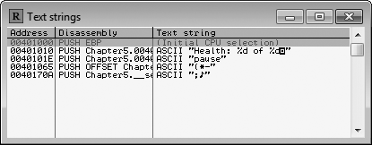
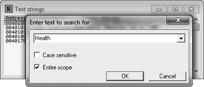
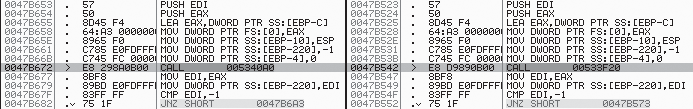
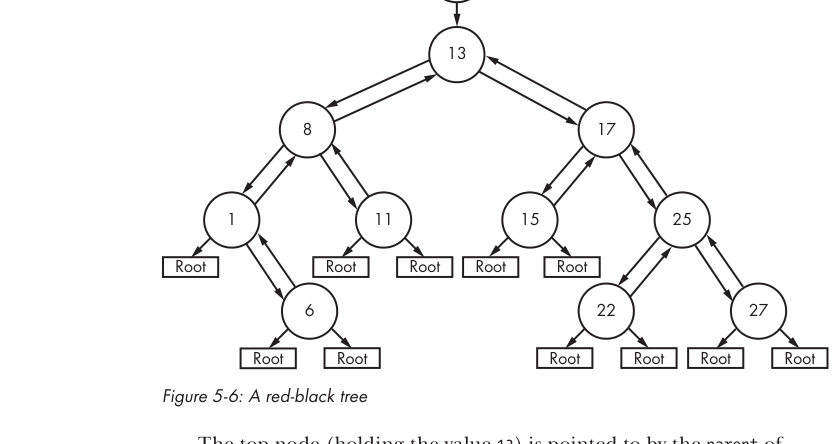

# Capitulo 5 - Memory forensics avancado

> Titulo original: *Advanced Memory Forensics*

> Navegacao: [Anterior](capitulo-04.md) | [Indice](README.md) | [Proximo](capitulo-06.md)

## Topicos

- Memory scanning avancado por proposito do dado
- Localizar enderecos novos apos game updates
- Identificar estruturas complexas em memoria
- std::string, std::vector, std::list, std::map

## Abertura

Voce hackeie games por hobby ou por dinheiro, em algum momento vai
estar entre a cruz e... um memory dump indecifravel. Seja numa
corrida com um bot developer rival para lancar uma feature pedida,
seja uma batalha contra updates frequentes, seja uma luta para
localizar uma data structure complexa em memoria, voce vai precisar
de skills top de memory forensics.

Bot development bom e um equilibrio precario entre velocidade e
habilidade. Hackers tenazes precisam encarar o desafio liberando
features rapido, respondendo a updates rapidamente e procurando ate
os pedacos mais elusivos de dado. Para isso, e indispensavel
entender padroes comuns de memoria, data structures avancadas e a
*finalidade* dos diferentes pedacos de dado.

Esses tres aspectos sao talvez as armas mais eficazes do seu
arsenal, e este capitulo te ensina a usa-las. Primeiro, tecnicas
avancadas de memory scanning focadas em buscar dado pelo seu
proposito e uso. Depois, como usar memory patterns para encarar
updates e ajustar bots sem ter que relocalizar tudo do zero. Para
fechar, vamos dissecar as quatro estruturas dinamicas mais comuns
da C++ Standard Library (`std::string`, `std::vector`, `std::list`
e `std::map`) para voce reconhece-las em memoria e enumerar seus
conteudos.

## Memory scanning avancado

No source code de um game, cada peca de dado tem definicao fria e
calculada. Quando o game roda, todos esses dados se juntam e criam
algo novo. Players so sentem a paisagem, os sons e a aventura; o
dado por tras some.

Imagine o Hacker A acabou de comecar a fucar o seu game preferido,
querendo automatizar tarefas chatas. Ele ainda nao entende memoria
profundamente. Pra ele, dado e so suposicao: "tenho 500 de health,
entao mando o Cheat Engine procurar inteiro de 4 bytes com valor
500." O Hacker A tem entendimento correto: dado e info (valores)
guardada em locais (enderecos) usando estruturas (tipos).

Imagine agora a Hacker B, que ja conhece o game por dentro e por
fora. Ela sabe como o gameplay altera o estado em memoria, e o
dado nao tem mais segredos. Ela sabe que toda propriedade do dado
pode ser deduzida pelo proposito. Diferente do Hacker A, a Hacker B
tem entendimento que ultrapassa a declaracao de variavel: ela
considera o *proposito* e o *uso* do dado.

Cada peca de dado tem proposito, e o assembly do game tem que, em
algum ponto, referenciar esse dado. Achar o codigo unico que usa
aquele dado significa achar um marker version-agnostic que persiste
entre updates ate o dado ser removido ou ter seu proposito mudado.

### Deduzindo o proposito

Ate aqui, eu so mostrei como buscar memoria as cegas por um valor
sem considerar como ele e usado. Funciona, mas nem sempre e
eficiente. Em muitos casos, e bem mais rapido deduzir o proposito,
inferir qual codigo usa o dado e localizar esse codigo para chegar
ao endereco do dado.

Pode parecer dificil, mas tambem nao e trivial "scaneie a memoria
do game por valor X do tipo Y, e filtre o resultado por mudancas".
Vamos achar o endereco da health pelo proposito. Veja a Listagem 5-1.

```cpp
struct PlayerVital {
    int current, maximum;
};
PlayerVital health;
// ...
printString("Health: %d of %d\n", health.current, health.maximum);
```

> Listagem 5-1: uma estrutura com os vitals do player e a funcao que
> os exibe.

Pretendendo que `printString()` e uma funcao para desenhar texto na
UI, esse codigo e bem proximo do que voce encontraria em um game.
A `PlayerVital` tem `current` e `maximum`. A variavel `health` e do
tipo `PlayerVital`. Pelo nome, `health` existe para mostrar info de
health do player, e o proposito se cumpre quando `printString()`
usa o dado.

Mesmo sem o codigo, da para chegar a conclusoes parecidas so
olhando o texto na UI: o computador nao faz nada sem codigo. Para
exibir esse texto, alem da variavel `health`, precisa existir
alguma funcao que desenha texto, e as strings `Health` e `of`
precisam estar por perto.

> NOTA: por que assumir que o texto esta dividido em duas strings
> separadas em vez de uma so? A UI mostra o valor de health entre
> os dois textos, mas isso pode acontecer de varias formas (format
> string, `strcat()`, ou texto alinhado por varias chamadas de
> draw). Ao analisar dados, mantenha as suposicoes amplas para
> cobrir todas as possibilidades.

#### Achando a health do player com OllyDbg

Vou guiar voce ate a struct de health, mas o binario analisado vem
nos arquivos do livro: `Chapter5_AdvancedMemoryForensics_Scanning.exe`.

Abra o OllyDbg e anexe ao executavel. Em **Executable modules**, de
duplo clique no main module (no exemplo, e o unico `.exe` da
janela). A CPU window aparece. Clique direito no Disassembler pane
e escolha **Search for > All referenced text strings**. Abre a
janela References (Figura 5-1).

> Figura 5-1: References window do OllyDbg mostrando uma lista de
> strings. Em um game real, teria muito mais.




Clique direito e escolha **Search for text**. Digite a string que
voce procura (Figura 5-2), desabilite **Case sensitive** e habilite
**Entire scope** para deixar amplo.

> Figura 5-2: pesquisando strings no OllyDbg.




Clique OK. A janela References volta ao foco com o primeiro match
em destaque. Duplo clique no match para ver o assembly que usa a
string na CPU window. O Disassembler foca na linha em `0x401030`,
que faz `PUSH` da format string para `printString()`. Veja a
Figura 5-3.

> Figura 5-3: visualizando a chamada de `printString()` na CPU
> window. Numerados (1) `EAX`, (2) `ECX`, (3) format string.


Lendo o assembly, voce entende exatamente o que o game faz. A chave
preta a esquerda mostra que a string `Health` esta dentro de uma
function call. Os argumentos, em ordem, sao `EAX` (1), `ECX` (2) e
a format string em `0x4020D0` (3). `EAX` e o valor em `0x40301C`,
`ECX` e o valor em `0x403018`, e a format string contem `Health`.
Como tem dois placeholders, voce assume que os outros dois
parametros sao para esses placeholders.

Sabendo que parametros sao empilhados em ordem reversa, da para
voltar e concluir que o codigo original era parecido com a
Listagem 5-2.

```cpp
int currentHealth; // valor em 0x403018
int maxHealth;     // valor em 0x40301C
// ...
someFunction("Health: %d of %d\n",
             currentHealth, maxHealth);
```

> Listagem 5-2: como um game hacker pode interpretar o assembly que
> a Figura 5-3 compila.

Os valores em `EAX` e `ECX` estao adjacentes em memoria, o que
sugere que podem ser parte de uma struct. Por simplicidade, mostro
como variaveis isoladas. Esses sao os dois numeros que mostram a
health do player. Por estarem na UI, foi facil deduzir o codigo.
Quando voce conhece o proposito, voce acha rapido o codigo
responsavel; aqui isso nos deu os dois enderecos.

Em muitos casos achar enderecos e tao simples assim, mas alguns
dados tem proposito complexo demais para chutar o que procurar.
Achar map data ou character locations no OllyDbg, por exemplo,
exige mais.

Strings nao sao os unicos markers para localizar dado, mas sao os
mais didaticos sem inventar exemplos artificiais. Alem disso,
alguns games tem strings de logging ou erro embutidas no binario.
Familiarizar-se com as praticas de logging do game facilita ainda
mais.

> ### Boxe: Achar `currentHealth` e `maxHealth` automaticamente
>
> Em "Searching for Assembly Patterns" (pag 19) e "Searching for
> Strings" (pag 21), do livro, alguns Cheat Engine Lua scripts
> mostraram como funcionam. Usando `findString()`, voce localiza
> automaticamente o endereco da format string que achamos a mao no
> OllyDbg. Em seguida, escreva uma funcao para procurar esse
> endereco apos o byte `0x68` (que e o opcode do `PUSH`, visivel ao
> lado em `0x401030` na Figura 5-3) para localizar o endereco do
> codigo que faz o push. Por fim, leia 4 bytes em
> `pushAddress - 5` e em `pushAddress - 12` para localizar
> `currentHealth` e `maxHealth`.
>
> Pode parecer inutil ja que achamos os enderecos, mas em um game
> real esses enderecos mudam apos updates. Automatizar essa busca
> ajuda muito.

### Localizando enderecos novos apos game updates

Quando o codigo de uma aplicacao muda e e recompilado, um binario
novo e produzido. Esse binario pode ser muito parecido com o
anterior ou completamente diferente. A diferenca correlaciona com
a complexidade das mudancas. Mudancas pequenas (strings ou
constantes alteradas) deixam binarios quase identicos e em geral
nao afetam enderecos de codigo ou dados. Mudancas complexas
(features novas, UI nova, refactor, conteudo novo) costumam mexer
nos enderecos importantes.

Por causa de bug fixes, melhorias e novas features, online games
sao dos softwares que evoluem mais rapido. Alguns updatam toda
semana, e game hackers gastam boa parte do tempo revertendo o
binario novo para atualizar seus bots.

Bots avancados ficam cada vez mais apoiados em uma fundacao de
enderecos. Quando vem update, redescobrir todos os enderecos e a
parte mais demorada. As "dicas para vencer a corrida do update"
ajudam, mas nao localizam os enderecos. Da para automatizar com
Cheat Engine scripts, mas nem sempre funciona. As vezes, e mao na
massa.

Reinventar a roda e refazer do zero e desperdicio. Voce ja tem uma
grande vantagem: o binario antigo e os enderecos antigos. Com
isso, da para achar todos os enderecos novos numa fracao do tempo.

A Figura 5-4 mostra duas disassemblies: o binario novo a esquerda e
a versao anterior a direita. Tirei de um game real (sem nome) para
um exemplo realista.

> Figura 5-4: disassemblies side-by-side de duas versoes de um game.




Meu bot modificava o codigo em `0x047B542` (direita), e eu
precisava do correspondente na nova versao, que descobri em
`0x047B672` (esquerda). Essa function call invoca um packet-parsing
function quando um pacote chega. Originalmente (uns 100 updates
antes), eu achei esse endereco entendendo o protocolo de rede do
game, colocando breakpoints em API calls de rede e debugando ate
achar algo coerente.

> ### Boxe: Dicas para vencer a corrida do update
>
> Em mercados saturados, ser o primeiro a lancar um bot estavel
> apos um update e critico. A corrida comeca no segundo do patch.
> Hackers determinados gastam centenas de horas se preparando.
> Os melhores costumam:
>
> - **Criar update alarms**: software que avisa assim que o game e
>   patcheado, para voce comecar logo.
> - **Automatizar instalacao do bot**: games agendam updates em
>   horarios de baixo trafego. Quem usa bot odeia acordar e ter que
>   baixar tudo manualmente; ama acordar com o bot ja instalado em
>   silencio durante o patch.
> - **Usar menos enderecos**: menos coisa para atualizar e melhor.
>   Consolidar dado relacionado em structs e eliminar enderecos
>   desnecessarios poupa tempo.
> - **Bons test cases**: dado muda e hackers erram. Conseguir
>   testar cada feature rapido e a diferenca entre um bot estavel e
>   um que crasha, mata o usuario no game ou leva ele a ser banido.
>
> Essas praticas dao vantagem, mas nem sempre bastam. Acima de
> tudo, busque entender reverse engineering profundamente.

Em vez de refazer cada update do zero, eu uso patterns do codigo
antigo para achar a function call no codigo novo. Por exemplo,
considere este chunk:

```nasm
PUSH EDI
PUSH EAX
LEA EAX, DWORD PTR SS:[EBP-C]
MOV DWORD PTR FS:[0], EAX
MOV DWORD PTR SS:[EBP-10], ESP
MOV DWORD PTR SS:[EBP-220], -1
MOV DWORD PTR SS:[EBP-4], 0
```

Familiar? Compare com a Figura 5-4: esse codigo aparece logo acima
da function call destacada nas duas versoes. Independentemente do
que faz, a combinacao de operacoes parece bem distinta; pelo numero
de offsets relativos a `EBP`, e improvavel que outro chunk
identico exista no binario.

Toda vez que preciso atualizar esse endereco, abro o binario antigo
no OllyDbg, seleciono o chunk, clique direito,
**Asm2Clipboard > Copy fixed asm to clipboard**. Abro o binario
novo, vou na CPU window, `Ctrl-S`, colo o assembly, **Find**.
9.5 em 10 vezes isso me coloca direto acima da function call
correspondente na nova versao.

Voce pode usar o mesmo metodo para quase todos os enderecos
conhecidos. Funciona para qualquer endereco que voce encontre
facil em assembly. Cuidados:

- O OllyDbg limita a busca a 8 operacoes; ache markers desse
  tamanho ou menores.
- As operacoes nao podem conter outros enderecos (que provavelmente
  mudaram).
- Se partes do game que usam o endereco mudaram, o codigo pode ser
  diferente.
- Se o game troca de compilador ou flags de otimizacao, quase todo
  codigo muda.

Como dito no boxe sobre `currentHealth` e `maxHealth`, escrever
scripts que automatizem essas tarefas vale ouro. Game hackers
serios investem para localizar o maximo de enderecos
automaticamente, e os melhores bots se autoconfiguram em runtime.
Trabalho inicial pesado, retorno alto.

## Identificando estruturas complexas em game data

O Capitulo 4 mostrou como games guardam dado em structs estaticas.
E suficiente para dado simples, mas nao para dado em estruturas
*dinamicas*. Estruturas dinamicas podem estar espalhadas em
diferentes regioes de memoria, seguir pointer chains longas ou
exigir algoritmos complexos para extrair o dado.

Esta secao explora structs dinamicas comuns em games e como ler
dado delas. Para cada uma, vamos ver: composicao subjacente,
algoritmos para ler o dado e dicas para reconhecer quando o valor
que voce procura esta encapsulado nessa estrutura. Foco em C++,
ja que sua natureza orientada a objeto e a Standard Library
costumam ser responsaveis por essas estruturas.

> NOTA: algumas estruturas podem variar entre maquinas (compilador,
> opcoes de otimizacao, implementacao da std lib). Os conceitos
> base permanecem. Para encurtar, partes irrelevantes (custom
> allocators, comparators) sao omitidas. Codigo de exemplo nos
> arquivos do Capitulo 5 do livro.

### A classe std::string

Instancias de `std::string` estao entre as principais culpadas por
storage dinamico. Essa classe da STL abstrai operacoes de string
com eficiencia, e por isso aparece em todo tipo de software. Um
game pode usar `std::string` para qualquer dado de string, como
nomes de creature.

#### Estrutura de um std::string

Tirando member functions e outros componentes nao-data, sobra a
estrutura:

```cpp
class string {
    union {
        char* dataP;
        char dataA[16];
    };
    int length;
};

string* _str = (string*)stringAddress;
```

A classe reserva 16 caracteres para guardar a string in place. Ela
declara que os primeiros 4 bytes podem ser um ponteiro para
caractere. Pode parecer estranho, mas e otimizacao: 15 caracteres
(mais null terminator) cobrem muitas strings, e da para economizar
alocacoes/desalocacoes reservando 16 bytes na propria classe. Para
strings maiores, os primeiros 4 bytes viram um ponteiro para um
buffer alocado.

> NOTA: em 64 bits, sao 8 (nao 4) bytes para o ponteiro. Aqui
> assumimos enderecos de 32 bits e que `int` tem o tamanho de um
> endereco.

Acessar essa string tem overhead. A funcao para localizar o buffer
correto e parecida com:

```cpp
const char* c_str() {
    if (_str->length <= 15)
        return (const char*)&_str->dataA[0];
    else
        return (const char*)_str->dataP;
}
```

A natureza dual de `std::string` torna essa estrutura bem chata
para game hackers. Alguns games guardam strings que raramente
ultrapassam 15 caracteres; voce pode escrever um bot que confia
nelas sem perceber que a estrutura e mais complicada que um array
simples.

#### Ignorar um std::string pode arruinar a diversao

Considere que voce esta tentando entender como um game guarda dado
de creature. Voce acha que cada creature esta em um array de
structs como na Listagem 5-3.

```cpp
struct creatureInfo {
    int uniqueID;
    char name[16];
    int nameLength;
    int healthPercent;
    int xPosition;
    int yPosition;
    int modelID;
    int creatureType;
};
```

> Listagem 5-3: como voce poderia interpretar dado de creature em
> memoria.

Os primeiros 4 bytes sao unicos para cada creature, entao voce
chama de `uniqueID`. O nome vem logo depois, com 16 bytes. Em
seguida vem `nameLength`; estranho ter `length` em string
null-terminated, mas voce ignora. Continua a analise, define a
struct e escreve um bot que ataca creatures por nome.

Voce testa por semanas com `Dragon`, `Cyclops`, `Giant`, `Hound`.
Da o bot para os amigos. No primeiro dia, voce reune o time para
matar `Super Bossman Supreme`. Configura o bot para atacar o boss
e fallback em criaturas menores como `Demon` ou `Grim Reaper`. Ao
chegar no covil... voces sao obliterados.

O que deu errado? O game guarda nomes em `std::string`. Os campos
`name` e `nameLength` da `creatureInfo` sao parte de um campo
`std::string`, e o array `name` e o union de `dataA` e `dataP`.
`Super Bossman Supreme` tem mais de 15 caracteres, entao o nome
real fica em outro buffer. O bot nao conhece `std::string`, nao
reconhece o boss e fica re-targetando os `Demon` summonados,
deixando o boss te dreemar.

#### Como saber se o dado esta em std::string

Quando achar uma string como `name` em memoria, nao assuma array
simples. Pergunte:

- Por que tem `length` em string null-terminated? Se nao tem boa
  resposta, talvez seja `std::string`.
- Algumas creatures tem nome com mais de 16 caracteres mas voce so
  ve espaco para 16 em memoria? Quase certeza que e `std::string`.
- O nome esta in place, exigindo `strcpy()` para modificar?
  Provavel `std::string`, ja que mexer com C strings cruas assim e
  bad practice.

Lembre que existe `std::wstring` para wide strings. Implementacao
parecida com `wchar_t` no lugar de `char`.

### A classe std::vector

Games gerenciam muitos arrays dinamicos de dado, mas implementar
arrays dinamicos e chato. Por velocidade e flexibilidade, devs
costumam usar `std::vector` da STL em vez de array bruto.

#### Estrutura

A classe e parecida com a Listagem 5-4.

```cpp
template<typename T>
class vector {
    T* begin;
    T* end;
    T* reservationEnd;
};
```

> Listagem 5-4: `std::vector` abstraido.

Para deixar concreto, vamos com um `std::vector<DWORD>`:

```cpp
std::vector<DWORD> _vec;
```

Em memoria, da para reescrever a estrutura como na Listagem 5-5.

```cpp
class vector {
    DWORD* begin;
    DWORD* end;
    DWORD* tail;
};

vector* _vec = (vector*)vectorAddress;
```

> Listagem 5-5: `std::vector` de `DWORD`.

`begin` aponta para o primeiro elemento, igual array bruto. Nao tem
campo `length`; voce calcula pelo `begin` e `end` (o `end` aponta
logo apos o ultimo elemento):

```cpp
int length() {
    return ((DWORD)_vec->end - (DWORD)_vec->begin) / sizeof(DWORD);
}
```

Subtrai os enderecos e divide pelo tamanho do tipo. Acesso seguro
via `length()`:

```cpp
DWORD at(int index) {
    if (index >= _vec->length())
        throw new std::out_of_range();
    return _vec->begin[index];
}
```

Adicionar valores seria caro sem reservar memoria; por isso o
`std::vector` tem `reserve()`. A capacidade total (capacity) e
medida via `tail`:

```cpp
int capacity() {
    return ((DWORD)_vec->tail - (DWORD)_vec->begin) / sizeof(DWORD);
}
```

E o numero de slots livres:

```cpp
int freeSpace() {
    return ((DWORD)_vec->tail - (DWORD)_vec->end) / sizeof(DWORD);
}
```

Com funcoes de read/write de memoria, da para acessar e manipular
vectors do game. Detalhes de leitura no Capitulo 6.

#### Como saber se o dado esta em std::vector

Apos achar um array em memoria, alguns passos:

- Se o array tem endereco estatico, nao e `std::vector` (vectors
  exigem pointer paths).
- Se o array exige pointer path, um final offset `0` indica
  `std::vector`. Para confirmar, mude o final offset para `4` e
  veja se aponta para o ultimo elemento em vez do primeiro. Se sim,
  voce confirmou `begin` e `end`.

### A classe std::list

Igual ao `std::vector`, `std::list` armazena uma colecao, mas como
linked list. Diferencas: nao precisa de espaco contiguo, nao
permite indexacao direta e cresce sem mexer nos elementos
anteriores. Por overhead de acesso, e raro em games, mas aparece em
casos especiais.

#### Estrutura

```cpp
template<typename T>
class listItem {
    listItem<T>* next;
    listItem<T>* prev;
    T value;
};

template<typename T>
class list {
    listItem<T>* root;
    int size;
};
```

> Listagem 5-6: `std::list` abstraido.

Concretizando para `DWORD`:

```cpp
class listItem {
    listItem* next;
    listItem* prev;
    DWORD value;
};

class list {
    listItem* root;
    int size;
};

list* _lst = (list*)listAddress;
```

> Listagem 5-7: `std::list` de `DWORD`.

`list` e o header; `listItem` e cada valor. Os items nao sao
contiguos, sao independentes. Cada um tem `next` (proximo) e `prev`
(anterior). O `root` marca o fim da lista: `next` do ultimo aponta
para `root`, `prev` do primeiro tambem. O proprio `root` aponta
para o primeiro (`root->next`) e o ultimo (`root->prev`).

> Figura 5-5: fluxograma de um `std::list`.


Iterando:

```cpp
// para frente
listItem* it = _lst->root->next;
for (; it != _lst->root; it = it->next)
    printf("Value is %d\n", it->value);

// para tras
listItem* it = _lst->root->prev;
for (; it != _lst->root; it = it->prev)
    printf("Value is %d\n", it->value);
```

Como nao e contiguo, nao tem calculo rapido para size. A classe
guarda `size` como membro, e o conceito de capacity nao se aplica.

#### Como saber se o dado esta em std::list

- Items em `std::list` nao tem endereco estatico, entao se o seu
  alvo e estatico, esta livre.
- Items que parecem parte de uma colecao mas nao sao contiguos em
  memoria podem ser de `std::list`.
- Items podem ter pointer chains infinitamente longas
  (`it->prev->next->prev->next...`); pointer scanning no Cheat
  Engine mostra muitos resultados se **No Looping Pointers**
  estiver desligado.

Da para detectar com script. A Listagem 5-8 e um Cheat Engine Lua
que faz isso.

```cpp
// Equivalente em C++: tentar reconstituir um candidato a no de
// std::list e verificar pointer integrity.

bool _verifyLinkedList(uintptr_t address) {
    uintptr_t nextItem = readInteger(address);
    uintptr_t previousItem = readInteger(address + 4);
    uintptr_t nextItemBack = readInteger(nextItem + 4);
    uintptr_t previousItemForward = readInteger(previousItem);
    return (address == nextItemBack
            && address == previousItemForward);
}

uintptr_t isValueInLinkedList(uintptr_t valueAddress) {
    for (uintptr_t address = valueAddress - 8;
         address >= valueAddress - 48;
         address -= 4) {
        if (_verifyLinkedList(address))
            return address;
    }
    return 0;
}

uintptr_t node = isValueInLinkedList(addressOfSomeValue);
if (node > 0)
    printf("Value in LL, top of node at 0x%x\n", node);
```

> Listagem 5-8: verificando se o dado esta em `std::list` (em C++,
> equivalente ao script Lua original).

A logica e simples. `isValueInLinkedList()` recebe o endereco do
valor e olha 40 bytes para tras (10 ints, caso o valor esteja
dentro de uma struct maior), comecando 8 bytes acima (precisam
existir dois ponteiros, 4 bytes cada). Por causa do alinhamento, o
loop anda em passos de 4.

A cada iteracao, `_verifyLinkedList()` faz a magia. Em termos da
estrutura definida aqui, equivale a:

```cpp
return (node->next->prev == node && node->prev->next == node);
```

Se essa identidade vale, e no de linked list. Caso contrario, nao.
O script nao te da o `root`, so o no que contem o valor. Para
percorrer a lista corretamente, voce vai ter que scanar uma pointer
path valida ate o root.

Achar o root pode exigir busca em dumps, tentativa e erro e dor de
cabeca. Comece seguindo `prev` e `next` ate cair em um no com dado
em branco, sem sentido ou cheio de `0xBAADF00D` (alguns
implementations usam para marcar root). Saber quantos nos a lista
tem ajuda. Mesmo sem o header, da para contar:

```cpp
int countLinkedListNodes(uintptr_t nodeAddress) {
    int counter = 0;
    uintptr_t next = readInteger(nodeAddress);
    while (next != nodeAddress) {
        counter++;
        next = readInteger(next);
    }
    return counter;
}
```

> Listagem 5-9: contando o tamanho de um `std::list`.

Cria um contador, segue `next` ate voltar ao no inicial, retorna o
contador.

> ### Boxe: Achar o root node com script
>
> Da para escrever um script que ache o root, mas e exercicio
> opcional. Como? O root precisa estar na cadeia de nos, o header
> aponta para o root, e o `size` da lista aparece logo apos o root
> em memoria. Com isso, voce monta um script que procura por
> qualquer memoria que contenha um ponteiro para um dos nos
> seguidos do `size`. Em geral, esse pedaco de memoria e o header,
> e o no apontado e o root.

### A classe std::map

Como `std::list`, `std::map` usa links entre elementos. Diferente:
cada elemento guarda dois dados (key e value), e a estrutura
mantem ordenacao via *red-black tree*. Uma versao simplificada:

```cpp
template<typename keyT, typename valT>
struct mapItem {
    mapItem<keyT, valT>* left;
    mapItem<keyT, valT>* parent;
    mapItem<keyT, valT>* right;
    keyT key;
    valT value;
};

template<typename keyT, typename valT>
struct map {
    DWORD irrelevant;
    mapItem<keyT, valT>* rootNode;
    int size;
};
```

Red-black tree e uma binary search tree auto-balanceada. Cada no
tem tres ponteiros: `left`, `parent`, `right`. Tambem `key` e
`value`. A organizacao e por comparacao de keys: `left` aponta para
key menor, `right` para key maior, `parent` para o no acima. O
primeiro no e `rootNode`; nos sem filho apontam para ele.

#### Visualizando

A Figura 5-6 mostra um `std::map` com keys 1, 6, 8, 11, 13, 15, 17,
22, 25 e 27.

> Figura 5-6: red-black tree.




O top node (valor 13) e apontado pelo `parent` do `rootNode`. Tudo
a esquerda tem key menor, tudo a direita tem key maior. Vale para
qualquer no e habilita busca eficiente por key. (Nao mostrado:
`left` do root aponta para o leftmost (1) e `right` para o
rightmost (27).)

#### Acessando dado num std::map

Concretizando:

```cpp
typedef int keyInt;
typedef int valInt;
std::map<keyInt, valInt> myMap;

struct mapItem {
    mapItem* left;
    mapItem* parent;
    mapItem* right;
    keyInt key;
    valInt value;
};

struct map {
    DWORD irrelevant;
    mapItem* rootNode;
    int size;
};

map* _map = (map*)mapAddress;
```

Iteracao recursiva sobre todos os items:

```cpp
void iterateMap(mapItem* node) {
    if (node == _map->rootNode) return;
    iterateMap(node->left);
    printNode(node);
    iterateMap(node->right);
}

iterateMap(_map->rootNode->parent);
```

Busca por key (search algorithm da arvore):

```cpp
mapItem* findItem(keyInt key, mapItem* node) {
    if (node != _map->rootNode) {
        if (key == node->key)
            return node;
        else if (key < node->key)
            return findItem(key, node->left);
        else
            return findItem(key, node->right);
    } else {
        return NULL;
    }
}

mapItem* ret = findItem(someKey, _map->rootNode->parent);
if (ret)
    printNode(ret);
```

Recursa para esquerda se a key atual for maior que a procurada,
para direita se menor. Igual retorna o no. Chegou no fundo sem
achar, retorna `NULL`.

#### Como saber se o dado esta em std::map

So considere `std::map` apos descartar array, `std::vector` e
`std::list`. Se descartar os tres, olhe os tres inteiros antes do
valor e cheque se apontam para memoria que poderia ser nos do
mapa. Da para automatizar com script. A Listagem 5-10 mostra a
funcao de verificacao em pseudo-C++ (equivalente ao script Lua do
livro):

```cpp
bool _verifyMap(uintptr_t address) {
    uintptr_t parentItem = readInteger(address + 4);
    uintptr_t parentLeftItem = readInteger(parentItem + 0);
    uintptr_t parentRightItem = readInteger(parentItem + 8);

    bool validParent =                                   // (1)
        parentLeftItem == address || parentRightItem == address;
    if (!validParent) return false;

    int tries = 0;
    uintptr_t lastChecked = parentItem;
    uintptr_t parentsParent = readInteger(parentItem + 4);
    while (readInteger(parentsParent + 4) != lastChecked && tries < 200) {  // (2)
        tries++;
        lastChecked = parentsParent;
        parentsParent = readInteger(parentsParent + 4);
    }
    return readInteger(parentsParent + 4) == lastChecked;
}
```

> Listagem 5-10: verificando se o dado esta em `std::map`.

A funcao recebe `address` e checa se ele esta em uma estrutura de
map. Primeiro, valida o parent: se ele aponta de volta para
`address` por `left` ou `right` (1). Se passa, sobe pela linha de
parents ate achar um no que e parent do proprio parent (2),
tentando 200 vezes. Se conseguir, e no de map. Funciona porque, no
topo de todo map, existe um root cujo `parent` aponta para o
primeiro no, e o `parent` desse aponta de volta para o root.

> NOTA: nem espere pegar o paradoxo do avo numa leitura de game
> hacking.

E a busca:

```cpp
uintptr_t isValueInMap(uintptr_t valueAddress) {
    for (uintptr_t address = valueAddress - 12;
         address >= valueAddress - 52;
         address -= 4) {
        if (_verifyMap(address))
            return address;
    }
    return 0;
}

uintptr_t node = isValueInMap(addressOfSomeValue);
if (node > 0)
    printf("Value in map, top of node at 0x%x\n", node);
```

A diferenca para a busca de linked list e que comeca 12 bytes
antes do valor (mapa tem 3 ponteiros, list tem 2). Bonus do mapa:
quando `_verifyMap` retorna `true`, `parentsParent` ja contem o
endereco do root node. Com pequenas modificacoes, da para
retornar isso e ja ter tudo num lugar so para ler dados do mapa.

## Fechando

Memory forensics e a parte mais demorada de hackear games, e os
obstaculos vem em todas as formas e tamanhos. Usando *proposito*,
*patterns* e entendimento profundo de structs complexas, voce
vence rapido. Se ainda esta confuso, baixe e brinque com o codigo
de exemplo, que tem proofs of concept de tudo o que vimos.

No Capitulo 6, comecamos a por a mao no codigo: ler e escrever
memoria do game a partir dos seus proprios programas para colocar
em pratica esse conhecimento sobre estruturas, enderecos e dados.
