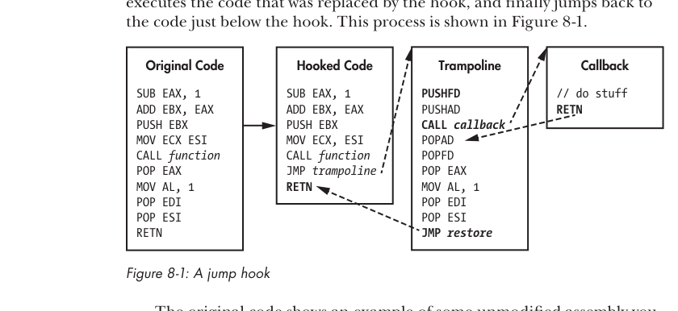

# Capitulo 8 - Manipulando control flow no game

> Titulo original: *Manipulating Control Flow in a Game*

> Navegacao: [Anterior](capitulo-07.md) | [Indice](README.md) | [Proximo](capitulo-09.md)

## Topicos

- NOPing para remover codigo indesejado
- Call hooks e VF table hooks
- IAT hooks e jump hooks
- Aplicacao a Adobe AIR (call hooks)
- Aplicacao ao Direct3D (jump + VF hooks)

## Abertura

Forcar um game a executar codigo estrangeiro e poderoso, mas e se
voce conseguisse alterar a forma como o proprio codigo do game e
executado? E se voce pudesse forcar o game a pular o codigo que
desenha o fog of war, fazer inimigos aparecerem atraves de
paredes, ou manipular argumentos de funcoes? *Control flow
manipulation* permite isso, mudando o que um processo faz ao
interceptar a execucao e monitorar, modificar ou impedir.

Quase todas as tecnicas exigem modificar o assembly do processo.
Dependendo do objetivo: ou voce remove codigo (NOPing) ou redireciona
para funcoes injetadas (hooking). Comecamos com NOPing e varios
tipos de hooking; depois aplicamos a libs comuns como Adobe AIR e
Direct3D.

> Codigo de exemplo em `GameHackingExamples/Chapter8_ControlFlow`.

## NOPing para remover codigo indesejado

O Capitulo 7 mostrou como injetar codigo. O oposto, *remover*
codigo, tambem e util. Alguns hacks exigem impedir que parte do
codigo original execute, e isso significa elimina-lo. Uma forma e o
*NOPing*: sobrescrever o assembly original com instrucoes `NOP`
(no-operation).

### Quando usar NOP

Considere um game que nao mostra a health bar de inimigos
encobertos (cloaked). Veria-los facilmente daria vantagem. O codigo
que desenha health bar tipicamente parece com a Listagem 8-1.

```cpp
for (int i = 0; i < creatures.size(); i++) {
    auto c = creatures[i];
    if (c.isEnemy && c.isCloaked) continue;
    drawHealthBar(c.healthBar);
}
```

> Listagem 8-1: loop de `drawCreatureHealthBarExample()`.

Se tivesse o source, bastava remover o `if (c.isEnemy &&
c.isCloaked) continue;`. Como game hacker, voce so tem o assembly:

```nasm
startOfLoop:                          ; for
    MOV i, 0
    JMP condition
increment:
    ADD i, 1
condition:
    CMP i, creatures.Size()
    JNB endOfLoop
body:
    MOV c, creatures[i]
    TEST c.isEnemy, c.isEnemy
    JZ drawHealthBar
    TEST c.isCloaked, c.isCloaked
    JZ drawHealthBar
    JMP increment                     ; (1) continue
drawHealthBar:
    CALL drawHealthBar(c.healthBar)
    JMP increment
endOfLoop:
```

Para forcar o game a desenhar todas as barras, basta remover o
`JMP increment` em (1) que executa quando
`c.isEnemy && c.isCloaked` e verdade. Em assembly, substituir por
instrucoes que nao fazem nada e mais facil que apagar. Entra o
`NOP` (`0x90`, 1 byte). Voce sobrescreve os 2 bytes do `JMP`
com dois `NOP`. O processador rola por eles e cai em
`drawHealthBar`.

### Como aplicar NOP

Primeiro, deixar o chunk writable. Como o codigo da mesma page
pode ser executado enquanto voce escreve, mantenha tambem
executavel: use `PAGE_EXECUTE_READWRITE`. Tecnicamente nao machuca
deixar writable apos, mas e boa pratica restaurar a protecao
original. Listagem 8-2:

```cpp
template<int SIZE>
void writeNop(DWORD address)
{
    auto oldProtection =
        protectMemory<BYTE[SIZE]>(address, PAGE_EXECUTE_READWRITE);
    for (int i = 0; i < SIZE; i++)
        writeMemory<BYTE>(address + i, 0x90);
    protectMemory<BYTE[SIZE]>(address, oldProtection);
}
```

> Listagem 8-2: NOPing com mudanca de protection.

`writeNop()` recebe o numero de NOPs como parametro de template,
ja que as funcoes de memoria precisam de tipo correto em compile
time. Para tamanho dinamico em runtime, troque o loop e use
`protectMemory<BYTE>` com `address` e `address + SIZE`. Desde que
o tamanho nao passe de uma page (e voce nunca deve NOPar uma page
inteira), isso garante a protecao certa mesmo na fronteira da
page.

Uso:

```cpp
writeNop<2>(0xDEADBEEF);
```

Atencao: o numero de NOPs deve casar com o tamanho em bytes do
comando que voce remove.

> ### Boxe: Pratique NOPing
>
> Abra `NOPExample.cpp` nos arquivos do livro. Tem
> `writeNop()` funcional e `getAddressforNOP()` que escaneia a
> memoria do programa de exemplo para descobrir onde colocar o NOP.
> Para ver em acao, rode no debugger do Visual Studio com
> breakpoints no inicio e no fim de `writeNop()`. No primeiro
> breakpoint, `Alt-8` abre a janela de disassembly; digite
> `address`, `Enter`, voce ve o codigo intacto. `F5` segue para o
> segundo breakpoint, e voltando ao `address` voce ve os NOPs.
>
> Brinque com variantes: NOP em comparacoes em vez de jump,
> alteracao do tipo ou destino do jump. Mas note: cada variante
> introduz mais espaco para erro do que sobrescrever um unico
> `JMP` com NOPs. Faca o minimo de mudancas necessarias.

## Hooking para redirecionar a execucao

Ate aqui, voce viu como adicionar codigo, hijack threads, criar
threads novas e remover codigo. Combinando, surge um metodo bem
mais poderoso: *hooking*. Hooking deixa voce interceptar branches
precisos da execucao e redireciona-los para codigo injetado que
voce escreveu, ditando o que o game faz a seguir. Vamos cobrir
quatro tecnicas: *call hooking*, *VF table hooking*, *IAT
hooking* e *jump hooking*.

### Call hooking

Um *call hook* modifica diretamente o alvo de uma operacao `CALL`
para apontar para outro codigo. Existem variacoes do `CALL` em
x86, mas call hooks geralmente sao usados em apenas um: o *near
call*, que recebe um endereco immediate.

#### Anatomia de um near call em memoria

Um near call em assembly fica:

```nasm
CALL 0x0BADF00D
```

Representado pelo byte `0xE8`. Voce pode achar que fica em memoria
assim:

```text
0xE8 0x0BADF00D
```

ou em little-endian:

```text
0xE8 0x0D 0xF0 0xAD 0x0B
```

Mas a anatomia real nao e essa. O near call nao guarda o endereco
absoluto da callee; guarda um *offset* relativo ao endereco
imediatamente apos a call. Como o near call tem 5 bytes, esse
endereco fica 5 bytes adiante. Logo:

```text
calleeAddress - (callAddress + 5)
```

Se `CALL 0x0BADF00D` mora em `0xDEADBEEF`:

```text
0x0BADF00D - (0xDEADBEEF + 5) = 0x2D003119
```

Em memoria:

```text
0xE8 0x19 0x31 0x00 0x2D
```

Para hookar um near call, modifique o offset de 4 bytes apos
`0xE8`.

#### Hooking de near call

Aplicando as mesmas regras de protection da Listagem 8-2:

```cpp
DWORD callHook(DWORD hookAt, DWORD newFunc)
{
    DWORD newOffset = newFunc - hookAt - 5;
    auto oldProtection =
        protectMemory<DWORD>(hookAt + 1, PAGE_EXECUTE_READWRITE);
    DWORD originalOffset = readMemory<DWORD>(hookAt + 1);  // (1)
    writeMemory<DWORD>(hookAt + 1, newOffset);
    protectMemory<DWORD>(hookAt + 1, oldProtection);
    return originalOffset + hookAt + 5;                    // (2)
}
```

Recebe o endereco do `CALL` (`hookAt`) e o endereco de destino
(`newFunc`), calcula o offset, escreve em `hookAt + 1` (1) e
retorna o endereco original da callee (2). Uso:

```cpp
DWORD origFunc = callHook(0xDEADBEEF, (DWORD)&someNewFunction);
```

#### Limpando a stack

A nova callee tem que tratar stack, registradores e return value
corretamente. No minimo, casar a calling convention e o numero de
argumentos da original. Considere:

```nasm
PUSH 1
PUSH 456
PUSH 321
CALL 0x0BADF00D
ADD ESP, 0x0C
```

A funcao usa `__cdecl` (caller limpa a stack). Os `0x0C` bytes
limpos indicam tres argumentos
(`0x0C / sizeof(DWORD) = 3`). Da para confirmar pelos tres `PUSH`.

#### Escrevendo a callback do call hook

A nova `someNewFunction` precisa ser `__cdecl` com tres
argumentos:

```cpp
DWORD __cdecl someNewFunction(DWORD arg1, DWORD arg2, DWORD arg3)
{
}
```

No Visual Studio, `__cdecl` e default em programas C++. Da para
omitir, mas e bom ser explicito. Se o caller espera return value,
o tipo de retorno tambem precisa bater. Esse exemplo assume return
de tamanho `DWORD` ou menor (passado em `EAX`).

Geralmente o hook termina chamando a original e propagando o
return value:

```cpp
typedef DWORD (__cdecl _origFunc)(DWORD arg1, DWORD arg2, DWORD arg3);

_origFunc* originalFunction =
    (_origFunc*)hookCall(0xDEADBEEF, (DWORD)&someNewFunction);

DWORD __cdecl someNewFunction(DWORD arg1, DWORD arg2, DWORD arg3)
{
    return originalFunction(arg1, arg2, arg3);
}
```

Por enquanto so chama a original. Mas voce pode modificar
parametros, interceptar para uso futuro ou, se sabe o caller nao
espera return (ou sabe spoofar), trocar/replicar/melhorar
funcionalidade inteira.

### VF table hooking

Diferente de call hooks, *VF table hooks* nao mexem em assembly.
Modificam os enderecos de funcao guardados na VF table das classes
(refresher no Capitulo 4). Como todas as instances da mesma classe
compartilham a mesma VF table estatica, VF hooks interceptam todas
as chamadas a uma member function, nao importa de que instance.
Pode ser util e tambem cabuloso.

> ### Boxe: A verdade sobre VF tables
>
> Para simplificar, eu menti um pouco quando disse "todas as
> chamadas". Na pratica, a VF table so e percorrida quando uma
> virtual function e chamada de forma que deixa o compilador com
> ambiguidade plausivel sobre o tipo. Por exemplo, `inst->function()`
> percorre a VF table. `inst.function()` ou similar nao percorre,
> ja que o compilador sabe o tipo direto. Mas `inst.function()` em
> escopo onde `inst` foi recebido por referencia gera traversal.
> Antes de fazer VF hooking, garanta que as chamadas alvo tem
> ambiguidade.

#### Escrevendo um VF table hook

Member functions usam `__thiscall`. O nome vem do `this` que cada
member function usa para referenciar a instance ativa. `this` e
passado como pseudo-parametro em `ECX`.

Da para casar o prototipo de `__thiscall` declarando uma classe
container, mas prefiro usar inline assembly. Considere:

```cpp
class someBaseClass {
    public:
        virtual DWORD someFunction(DWORD arg1) {}
};

class someClass : public someBaseClass {
    public:
        virtual DWORD someFunction(DWORD arg1) {}
};
```

Para hookar `someClass::someFunction`, replique o prototipo:

```cpp
DWORD __stdcall someNewVFFunction(DWORD arg1)
{
    static DWORD _this;            // (1)
    __asm MOV _this, ECX
}
```

> Listagem 8-3: inicio de um VF table hook.

`__thiscall` so difere de `__stdcall` pelo `this` em `ECX`. O
callback usa inline assembly (`__asm`) para copiar `this` de `ECX`
para uma variavel estatica (1). Como `static` e inicializada como
global, o unico codigo que executa antes de `MOV _this, ECX` e o
setup de stack frame, e ele nao toca em `ECX`.

> NOTA: se varias threads chamam a mesma VF function ao mesmo
> tempo, o hook quebra: uma chamada modifica `_this` enquanto outra
> ainda esta usando. Eu nunca cai nisso (games nao costumam jogar
> instances criticas entre threads), mas o remedio eficiente e
> guardar `_this` em thread-local storage.

Antes de retornar, restaure `ECX` para manter `__thiscall`:

```cpp
DWORD __stdcall someNewVFFunction(DWORD arg1)
{
    static DWORD _this;
    __asm MOV _this, ECX
    // codigo do hack aqui
    __asm MOV ECX, _this           // (1) restaura
}
```

Diferente de `__cdecl`, nao chame `__thiscall` puro com ponteiro
+ `typedef` (como em call hook). Use inline assembly para garantir
que `_this` e passado corretamente:

```cpp
DWORD __stdcall someNewVFFunction(DWORD arg1)
{
    static DWORD _this, _ret;
    __asm MOV _this, ECX
    // pre-call
    __asm {
        PUSH arg1
        MOV ECX, _this
        CALL [originalVFFunction]   // (1)
        MOV _ret, EAX               // (2)
    }
    // pos-call
    __asm MOV ECX, _this            // (3)
    return _ret;
}
```

Guarda `this`, executa codigo, chama a original (1), guarda return
(2), restaura `ECX` (3) e retorna `_ret`. Em `__thiscall`, o
callee limpa a stack, entao o argumento empurrado nao precisa ser
removido manualmente.

> NOTA: se voce precisa remover um unico argumento empurrado em
> qualquer ponto, use `ADD ESP, 0x4` (4 bytes por argumento).

#### Aplicando um VF table hook

O ponteiro para a VF table de uma classe e o primeiro membro de
toda instance, entao colocar um hook precisa apenas do endereco da
instance e do indice da funcao na VF table:

```cpp
DWORD hookVF(DWORD classInst, DWORD funcIndex, DWORD newFunc)
{
    DWORD VFTable = readMemory<DWORD>(classInst);              // (1)
    DWORD hookAt  = VFTable + funcIndex * sizeof(DWORD);
    auto oldProtection =
        protectMemory<DWORD>(hookAt, PAGE_READWRITE);
    DWORD originalFunc = readMemory<DWORD>(hookAt);
    writeMemory<DWORD>(hookAt, newFunc);
    protectMemory<DWORD>(hookAt, oldProtection);
    return originalFunc;
}
```

Le o primeiro membro da instance (1) e armazena em `VFTable`. A VF
table e array de enderecos `DWORD`, entao multiplica `funcIndex`
por 4 e soma. Dali, age igual a um call hook: protege, salva
endereco original, escreve novo, restaura protection.

Uso:

```cpp
DWORD origVFFunction =
    hookVF(classInstAddr, 0, (DWORD)&someNewVFFunction);
```

VF table hooks tem casos de uso bem nichados, e e dificil achar
class pointers e funcoes adequadas. Voltamos a eles em "Aplicando
jump hooks e VF hooks ao Direct3D" mais a frente.

### IAT hooking

IAT hooks substituem enderecos em uma VF table especifica chamada
*Import Address Table* (IAT). Cada modulo carregado num processo
tem uma IAT no PE header. A IAT lista os modulos dos quais o
modulo depende e as funcoes usadas de cada um. Pense numa IAT como
uma lookup table.

Quando um modulo e carregado, suas dependencias tambem sao,
recursivamente. Quando cada dependencia e carregada, o SO acha as
funcoes usadas pelo modulo dependente e preenche a IAT com os
enderecos. Quando o modulo chama uma funcao da dependencia,
resolve o endereco lendo a IAT.

#### Pagando pela portabilidade

Como enderecos sao resolvidos da IAT em tempo real, hookar IAT e
parecido com hookar VF tables. Como os ponteiros estao ao lado dos
nomes da API, nao precisa reverter ou escanear memoria; sabendo o
nome, voce hookea. Tambem permite hookar Windows API por modulo,
isolando hooks no main module do game.

Custa: o codigo e bem mais complexo. Primeiro, ache o PE header do
main module. Como ele e a primeira estrutura no binario, esta no
base address.

```cpp
DWORD baseAddr = (DWORD)GetModuleHandle(NULL);
```

> Listagem 8-4: pegando o base address.

Em seguida, valide o PE header. Alguns games tentam impedir esses
hooks scrambleando partes nao essenciais apos load. Um PE header
valido e prefixado por um DOS header, identificado pelo magic
`0x5A4D`. Um membro `e_lfanew` aponta para o optional header,
identificado pelo magic `0x10B`.

```cpp
auto dosHeader = pointMemory<IMAGE_DOS_HEADER>(baseAddr);
if (dosHeader->e_magic != 0x5A4D)
    return 0;

auto optHeader =
    pointMemory<IMAGE_OPTIONAL_HEADER>(baseAddr + dosHeader->e_lfanew + 24);
if (optHeader->Magic != 0x10B)
    return 0;
```

> Listagem 8-5: validando DOS e optional headers.

Referencias a IAT no assembly sao hardcoded; nao percorrem o PE
header. Cada call tem location estatica para o endereco. Por isso,
sobrescrever o PE header dizendo que nao tem imports e uma
protecao viavel; alguns games tem isso. Cheque se a IAT existe:

```cpp
auto IAT = optHeader->DataDirectory[IMAGE_DIRECTORY_ENTRY_IMPORT];
if (IAT.Size == 0 || IAT.VirtualAddress == 0)
    return 0;
```

> Listagem 8-6: confirmando que a IAT existe.

O `DataDirectory` e array de directory headers. A constante
`IMAGE_DIRECTORY_ENTRY_IMPORT` e o indice do header da IAT.

#### Percorrendo a IAT

A IAT e array de *import descriptors*. Um por dependencia. Cada
descriptor aponta para array de *thunks*, cada thunk representa
uma funcao importada. A Windows API expoe `IMAGE_IMPORT_DESCRIPTOR`
e `IMAGE_THUNK_DATA`. Listagem 8-7:

```cpp
auto impDesc =
    pointMemory<IMAGE_IMPORT_DESCRIPTOR>(baseAddr + IAT.VirtualAddress); // (1)
while (impDesc->FirstThunk) {                                             // (2)
    auto thunkData =
        pointMemory<IMAGE_THUNK_DATA>(baseAddr + impDesc->OriginalFirstThunk); // (3)
    int n = 0;
    while (thunkData->u1.Function) {                                      // (4)
        // hook acontece aqui
        n++;
        thunkData++;
    }
    impDesc++;
}
```

Cria `impDesc` apontando para o primeiro descriptor (1). Os
descriptors ficam em sequencia, e um com `FirstThunk` `NULL`
indica fim, entao loop while em (2). Para cada descriptor, cria
`thunkData` apontando para o primeiro thunk (3). Outro while em
(4) varre thunks ate `Function == NULL`. `n` guarda o indice
atual.

#### Aplicando o IAT hook

Encontre o nome da funcao no thunk:

```cpp
char* importFunctionName =
    pointMemory<char>(baseAddr + (DWORD)thunkData->u1.AddressOfData + 2);
```

> Listagem 8-8: pegando o nome da funcao.

O nome esta em `thunkData->u1.AddressOfData + 2` bytes dentro do
modulo. Compare com `strcmp()`:

```cpp
if (strcmp(importFuncName, funcName) == 0) {
    // ultimo passo aqui
}
```

Apos achar, sobrescreva o endereco. Diferente de nomes, enderecos
ficam em array no inicio do descriptor:

```cpp
auto vfTable = pointMemory<DWORD>(baseAddr + impDesc->FirstThunk);
DWORD original = vfTable[n];
auto oldProtection =
    protectMemory<DWORD>((DWORD)&vfTable[n], PAGE_READWRITE);            // (1)
vfTable[n] = newFunc;                                                    // (2)
protectMemory<DWORD>((DWORD)&vfTable[n], oldProtection);
```

> Listagem 8-9: aplicando o hook.

Localiza a VF table do descriptor, usa `n` como indice. Funciona
igual VF hook: protege (1), grava (2), restaura.

A funcao IAT hooking completa, juntando 8-4 a 8-9:

```cpp
DWORD hookIAT(const char* funcName, DWORD newFunc)
{
    DWORD baseAddr = (DWORD)GetModuleHandle(NULL);

    auto dosHeader = pointMemory<IMAGE_DOS_HEADER>(baseAddr);
    if (dosHeader->e_magic != 0x5A4D)
        return 0;

    auto optHeader =
        pointMemory<IMAGE_OPTIONAL_HEADER>(baseAddr + dosHeader->e_lfanew + 24);
    if (optHeader->Magic != 0x10B)
        return 0;

    auto IAT = optHeader->DataDirectory[IMAGE_DIRECTORY_ENTRY_IMPORT];
    if (IAT.Size == 0 || IAT.VirtualAddress == 0)
        return 0;

    auto impDesc =
        pointMemory<IMAGE_IMPORT_DESCRIPTOR>(baseAddr + IAT.VirtualAddress);
    while (impDesc->FirstThunk) {
        auto thunkData =
            pointMemory<IMAGE_THUNK_DATA>(baseAddr + impDesc->OriginalFirstThunk);
        int n = 0;
        while (thunkData->u1.Function) {
            char* importFuncName = pointMemory<char>(
                baseAddr + (DWORD)thunkData->u1.AddressOfData + 2);
            if (strcmp(importFuncName, funcName) == 0) {
                auto vfTable =
                    pointMemory<DWORD>(baseAddr + impDesc->FirstThunk);
                DWORD original = vfTable[n];
                auto oldProtection =
                    protectMemory<DWORD>((DWORD)&vfTable[n], PAGE_READWRITE);
                vfTable[n] = newFunc;
                protectMemory<DWORD>((DWORD)&vfTable[n], oldProtection);
                return original;
            }
            n++;
            thunkData++;
        }
        impDesc++;
    }
    return 0;
}
```

> Listagem 8-10: IAT hooking completo.

#### Usando IAT para sync com a thread do game

Com a Listagem 8-10, hookar qualquer Windows API e so saber o
nome e o prototipo. `Sleep()` e comum: bots sincronizam com o
main loop hookando `Sleep()`.

```cpp
VOID WINAPI newSleepFunction(DWORD ms)
{
    // operacoes thread-sensitive
    originalSleep(ms);
}

typedef VOID (WINAPI _origSleep)(DWORD ms);
_origSleep* originalSleep =
    (_origSleep*)hookIAT("Sleep", (DWORD)&newSleepFunction);
```

No fim do main loop, o game costuma chamar `Sleep()` ate o proximo
frame. Como esta dormindo, da para fazer qualquer coisa. Alguns
games nao fazem isso, ou chamam `Sleep()` de varias threads;
nesses, use outra abordagem.

Alternativa portatil: hookar `PeekMessageA()`, geralmente chamada
do main loop esperando input. Voce pode tambem hookar `send()` e
`recv()` para um packet sniffer simples.

> ### Boxe: Sincronizando com thread sync
>
> Codigo injetado *precisa* sincronizar com o main loop. Quando
> voce le ou escreve dado maior que 4 bytes, ficar fora de sync
> permite que o game mexa ao mesmo tempo, levando a race conditions
> e corrupcao. Tambem se chamar uma funcao do game de uma thread
> sua, sem ser thread-safe, pode crashar.
>
> Como IAT hooks sao modificacoes thread-safe no PE header, podem
> ser aplicados de qualquer thread. Hookando funcao chamada antes
> ou apos o main loop, voce sincroniza com a thread principal.
> Coloque o hook e execute codigo thread-sensitive a partir do
> callback.

### Jump hooking

*Jump hooks* permitem hookar codigo em locais sem branching para
manipular. Substitui o codigo por um jump incondicional para uma
*trampoline function*. A trampoline guarda registradores e flags,
chama uma callback, restaura, executa o codigo que o jump
substituiu e pula de volta. A Figura 8-1 ilustra.

> Figura 8-1: jump hook. Mostra codigo original, codigo hooked
> (com `JMP trampoline` no lugar de instrucoes), trampoline (com
> `PUSHFD`, `PUSHAD`, `CALL callback`, `POPAD`, `POPFD`, restauro
> das instrucoes substituidas e `JMP restore`) e callback.




O codigo original mostra um trecho que voce poderia encontrar num
game; o hooked code mostra o trecho hookado por jump hook. Em
seguida o trampoline (assembly) e o callback (codigo que voce quer
executar).

> NOTA: se sua callback for simples, da para integrar no
> trampoline. Tambem nem sempre e necessario salvar/restaurar
> registradores e flags, mas e boa pratica.

#### Aplicando o jump

O byte code de jump incondicional e parecido com o de near call,
mas o primeiro byte e `0xE9` em vez de `0xE8`. Quando voce coloca
um jump, talvez precise substituir varias operacoes consecutivas
para acomodar os 5 bytes. Se o tamanho ultrapassa 5, preencha o
resto com NOPs. Listagem 8-11:

```cpp
DWORD hookWithJump(DWORD hookAt, DWORD newFunc, int size)
{
    if (size > 12) // nunca deveria substituir 12+ bytes
        return 0;

    DWORD newOffset = newFunc - hookAt - 5;                              // (1)
    auto oldProtection =
        protectMemory<DWORD[3]>(hookAt + 1, PAGE_EXECUTE_READWRITE);

    writeMemory<BYTE>(hookAt, 0xE9);                                     // (2)
    writeMemory<DWORD>(hookAt + 1, newOffset);                           // (3)
    for (unsigned int i = 5; i < size; i++)
        writeMemory<BYTE>(hookAt + i, 0x90);

    protectMemory<DWORD[3]>(hookAt + 1, oldProtection);
    return hookAt + 5;
}
```

> Listagem 8-11: aplicando jump hook.

`hookAt` (endereco a hookar), `newFunc` (callback) e `size` (em
bytes) sao argumentos. Calcula offset (1), aplica protection,
escreve `0xE9` (2) e o endereco (3), preenche bytes orfaos com
NOP, restaura protection.

A checagem de `size > 12` evita bugs (ex.: bot detectando size
errado). 12 e flexivel mas seguro: jump tem 5 bytes, podendo
substituir ate 5 comandos de 1 byte. Limite alto demais (tipo
500 milhoes) NOParia o universo.

#### Escrevendo a trampoline

Replicando a Figura 8-1:

```cpp
DWORD restoreJumpHook = 0;

void __declspec(naked) myTrampoline()
{
    __asm {
        PUSHFD                       // (1)
        PUSHAD                       // (2)
        CALL jumpHookCallback        // (3)
        POPAD                        // (4)
        POPFD                        // (5)
        POP EAX                      // (6) instrucoes substituidas...
        MOV AL, 1
        POP EDI
        POP ESI                      // (7)
        JMP [restoreJumpHook]        // (8) volta apos o jump+NOPs
    }
}
```

Salva flags (1) e registradores (2), chama o callback (3),
restaura registradores (4) e flags (5), executa o codigo
substituido (6 a 7) e pula de volta para apos o jump (8).

> NOTA: para garantir que o compilador nao adicione codigo extra,
> use `__declspec(naked)`.

#### Finalizando o jump hook

Defina o callback e arme:

```cpp
void jumpHookCallback() {
    // codigo do hack
}

restoreJumpHook = hookWithJump(0xDEADBEEF, &myTrampoline, 5);
```

Para ler/escrever os registradores como estavam no momento do
hook, voce tem sorte: `PUSHAD` empilha em ordem `EAX`, `ECX`,
`EDX`, `EBX`, `original ESP`, `EBP`, `ESI`, `EDI`. A trampoline
chama `PUSHAD` antes do `CALL jumpHookCallback`, entao o callback
recebe os valores na stack e da para acessar como argumentos:

```cpp
void jumpHookCallback(DWORD EDI, DWORD ESI, DWORD EBP, DWORD ESP,
                      DWORD EBX, DWORD EDX, DWORD ECX, DWORD EAX) {
    // codigo do hack
}

restoreJumpHook = hookWithJump(0xDEADBEEF, &myTrampoline, 5);
```

Como `POPAD` restaura os registradores a partir desses valores
empilhados, qualquer modificacao nesses parametros vai bater nos
registradores reais.

> ### Boxe: Bibliotecas profissionais de API hooking
>
> Existem libs prontas, como Microsoft Detours e MadCHook, que so
> usam jump hooks. Detectam e seguem outros hooks, sabem quantas
> instrucoes substituir e geram trampoline. Conseguem porque
> entendem desassemblar e percorrer instrucoes para calcular
> tamanhos, destinos de jump, etc. Para hooks com esse poder, em
> geral e melhor usar uma dessas libs do que escrever do zero.

## Aplicando call hooks ao Adobe AIR

Adobe AIR e um framework usado para games cross-platform em
ambiente similar ao Adobe Flash. Comum em online games, ja que os
devs escrevem em ActionScript (high-level). Como ActionScript e
interpretado e o AIR roda numa virtual machine, hookar o codigo
especifico do game e inviavel; mais facil hookar o proprio AIR.

> Codigo de exemplo em
> `GameHackingExamples/Chapter8_AdobeAirHook`. Trata-se de um
> projeto antigo do autor, funcional para `Adobe AIR.dll` versao
> 3.7.0.1530. Trate como case study.

### Acessando a mina de ouro do RTMP

Real Time Messaging Protocol (RTMP) e um protocolo text-based
usado pelo ActionScript para serializar e enviar objetos pela
rede. RTMP roda sobre HTTP; RTMPS sobre HTTPS. RTMPS deixa devs
mandarem instances inteiras com seguranca, fazendo dele o
protocolo preferido em games sobre AIR.

> NOTA: dados em RTMP/RTMPS sao serializados via Action Message
> Format (AMF). Parsear AMF foge do escopo do livro; pesquise
> "AMF3 Parser".

Os pacotes contem info sobre tipos, nomes e valores de objetos.
Mina de ouro: interceptando, voce reage a mudanca de estado,
colhe info critica sem ler memoria e descobre dados que nem sabia
que existiam.

Em um projeto, eu precisava de muita info do estado do game.
Buscar tudo em memoria seria muito dificil. O game usava RTMPS,
entao precisei hookar as funcoes criptograficas do AIR. Achei
online o `airlog`, projeto antigo de outro hacker, que ja hookava
exatamente as funcoes que eu precisava. Mas o codigo estava
desatualizado, bagunca e nao funcionava na minha versao do AIR.

Mesmo assim, util: o `airlog` localiza as funcoes scaneando byte
patterns dentro do `Adobe AIR`. Os patterns tinham 3 anos de
defasagem. Os bytes mudaram, mas o codigo em volta nao.

Em inline assembly, voce pode emitir bytes raw com:

```nasm
_emit BYTE
```

Substituindo `BYTE` por `0x03`, por exemplo, o compilador trata
como byte de assembly. Compilei os byte arrays como funcoes dummy,
anexei OllyDbg, inspecionei e o disassembly veio limpo.

Os bytes representavam o codigo em volta das funcoes que eu
precisava. Esse codigo nao parecia mudar entre versoes, mas alguns
constantes (offsets) mudavam. Ajustei o algoritmo de pattern
matching do `airlog` para suportar wildcards, atualizei os
patterns marcando constantes como wildcards. Apos alguns ajustes,
localizei as funcoes; chamei de `encode()` e `decode()`.

### Hookando RTMPS encode()

`encode()`, que cifra dados de saida, e um `__thiscall` nao
virtual chamado por near call dentro de um loop:

```nasm
loop:
    MOV EAX, [ESI+3C58]
    SUB EAX, EDI
    PUSH EAX
    LEA EAX, [ESI+EDI+1C58]    ; (1)
    PUSH EAX
    MOV ECX, ESI
    CALL encode                ; (2)
    CMP EAX, -1
    JE SHORT endLoop           ; (3)
    ADD EDI, EAX
    CMP EDI, [ESI+3C58]        ; (4)
    JL loop
endLoop:
```

> Listagem 8-12: loop do `encode()`.

Com analise e ajuda do `airlog`, descobri que `encode()` recebe um
buffer de bytes e o tamanho (chamemos `buffer` e `size`). Retorna
`-1` se falha, ou `size` se sucesso. Opera em chunks de 4096
bytes; por isso o loop. Em pseudocodigo:

```cpp
for (EDI = 0; EDI < [ESI+3C58]; ) {     // (4)
    EAX = encode(&[ESI+EDI+1C58],       // (1)
                 [ESI+3C58] - EDI);     // (2)
    if (EAX == -1) break;               // (3)
    EDI += EAX;
}
```

Eu nao queria saber o que `encode()` faz; queria o buffer inteiro
sobre o qual ele iterava. Usar hook em `encode()` foi o caminho.
Pelo loop, o buffer completo do object instance esta em
`ESI+0x1C58`, o tamanho total em `ESI+0x3C58`, e `EDI` e o
contador. Hook em duas partes.

Parte 1: `reportEncode()` que loga o buffer inteiro na primeira
iteracao:

```cpp
DWORD __stdcall reportEncode(
    const unsigned char* buffer,
    unsigned int size,
    unsigned int loopCounter)
{
    if (loopCounter == 0)
        printBuffer(buffer, size);
    return origEncodeFunc;
}
```

Recebe `buffer`, `size`, `loopCounter` e retorna o endereco da
funcao original `encode()`.

Parte 2: `myEncode()` que pega `buffer`, `size` e `loopCounter`:

```cpp
void __declspec(naked) myEncode()
{
    __asm {
        MOV EAX, DWORD PTR SS:[ESP + 0x4]    // pega buffer
        MOV EDX, DWORD PTR DS:[ESI + 0x3C58] // pega tamanho total
        PUSH ECX                              // guarda ECX
        PUSH EDI                              // pos atual (loopCounter)
        PUSH EDX                              // size
        PUSH EAX                              // buffer
        CALL reportEncode                     // reporta
        POP ECX                               // restaura ECX
        JMP EAX                               // pula para encode
    }
}
```

Substitui o `CALL encode` original via near call hook. Apos
chamar `reportEncode()`, restaura `ECX` e pula direto para
`encode()`, fazendo a original executar e retornar normalmente.

Como `myEncode()` limpa tudo o que usou da stack, sobra a stack
original com parametros e return address corretos. Por isso o
`JMP EAX` em vez de `CALL`: a stack ja esta arrumada e `encode()`
nem percebe.

### Hookando RTMPS decode()

`decode()`, que decifra dados de entrada, tambem e `__thiscall`
chamado em loop, opera em chunks de 4096 bytes e recebe `buffer`
+ `size`. O loop e mais complexo (function calls aninhadas, loops
internos), mas hookar e parecido. Abstraindo a complexidade,
`decode()` e o `encode()` ao contrario.

`reportDecode()`:

```cpp
void __stdcall reportDecode(const unsigned char* buffer, unsigned int size)
{
    printBuffer(buffer, size);
}
```

Loga cada packet. Sem loop index na epoca; logo todo packet
parcial.

`myDecode()`:

```cpp
void __declspec(naked) myDecode()
{
    __asm {
        MOV EAX, DWORD PTR SS:[ESP + 0x4] // buffer
        MOV EDX, DWORD PTR SS:[ESP + 0x8] // size
        PUSH EDX                          // size
        PUSH EAX                          // buffer
        CALL [origDecodeFunc]              // (1) chama original primeiro
        MOV EDX, DWORD PTR SS:[ESP + 0x4]
        PUSH EAX                          // guarda return value
        PUSH ECX
        PUSH EAX                          // size para reportDecode
        PUSH EDX                          // buffer
        CALL reportDecode
        POP ECX
        POP EAX                           // (2) restaura return value
        RETN 8                            // (3) retorna e limpa stack
    }
}
```

`buffer` e decriptado in place, ou seja, apos a `decode()` o
chunk vira plain text. Por isso `myDecode()` chama original
*primeiro* (1), so depois reporta. Mantem o return de `decode()`
(2) e limpa a stack (3).

### Aplicando os hooks

Os hooks sao em codigo dentro de `Adobe AIR.dll` (nao no main
module). Tambem precisei funcionar em varias versoes. Em vez de
ter todas as versoes, escrevi um pattern scanner. Para escanear,
precisava do base address e do size de `Adobe AIR.dll`:

```cpp
MODULEENTRY32 entry;
entry.dwSize = sizeof(MODULEENTRY32);
HANDLE snapshot = CreateToolhelp32Snapshot(TH32CS_SNAPMODULE, NULL);

DWORD base, size;
if (Module32First(snapshot, &entry) == TRUE) {
    while (Module32Next(snapshot, &entry) == TRUE) {                  // (1)
        std::wstring binaryPath = entry.szModule;
        if (binaryPath.find(L"Adobe AIR.dll") != std::wstring::npos) { // (2)
            size = (DWORD)entry.modBaseSize;
            base = (DWORD)entry.modBaseAddr;
            break;
        }
    }
}
CloseHandle(snapshot);
```

Itera os modulos (1) ate achar `Adobe AIR.dll` (2) e pega
`modBaseSize`/`modBaseAddr`.

Em seguida, sequencias de bytes para identificar as funcoes,
evitando constantes para portabilidade:

```cpp
const char encodeSeq[16] = {
    0x8B, 0xCE,                   // MOV ECX, ESI
    0xE8, 0xA6, 0xFF, 0xFF, 0xFF, // CALL encode
    0x83, 0xF8, 0xFF,             // CMP EAX, -1
    0x74, 0x16,                   // JE SHORT endLoop
    0x03, 0xF8,                   // ADD EDI, EAX
    0x3B, 0xBE                    // parte de CMP EDI, [ESI+0x3C58]
};

const char decodeSeq[12] = {
    0x8B, 0xCE,                   // MOV ECX, ESI
    0xE8, 0x7F, 0xF7, 0xFF, 0xFF, // CALL decode
    0x83, 0xF8, 0xFF,             // CMP EAX, -1
    0x89, 0x86                    // parte de MOV [ESI+0x1C54], EAX
};
```

> Listagem 8-13: byte sequences de `encode()` e `decode()`.

```cpp
DWORD findSequence(
    DWORD base, DWORD size,
    const char* sequence,
    unsigned int seqLen)
{
    for (DWORD adr = base; adr <= base + size - seqLen; adr++) {
        if (memcmp((LPVOID)sequence, (LPVOID)adr, seqLen) == 0)
            return adr;
    }
    return 0;
}
```

E os enderecos a hookar:

```cpp
DWORD encodeHookAt = findSequence(base, size, encodeSeq, 16) + 2;
DWORD decodeHookAt = findSequence(base, size, decodeSeq, 12) + 2;
```

Como o `CALL` esta 2 bytes apos o inicio do pattern, soma 2.
Apos isso, basta colocar os hooks com call hooking.

Com o hook pronto, eu enxergava todo dado entre client e server.
Como RTMPS manda objetos serializados, o conteudo era praticamente
auto-documentado: cada peca de informacao com nome de variavel,
cada variavel como member de objeto descrito, cada objeto com nome
consistente. Mina de ouro.

## Aplicando jump hooks e VF hooks ao Direct3D

Diferente do Adobe AIR, hooks em Direct3D (3D do DirectX) sao
muito comuns e bem documentados. Direct3D e ubiquo em PC games:
hookar abre uma porta poderosa para interceptar dados e manipular
graficos. Da para usar hooks Direct3D para detectar inimigos
escondidos, aumentar iluminacao, exibir info grafica extra. Faz
parte estudar a API a fundo, mas o livro te poe na trilha.

> Codigo de exemplo:
> `GameHackingExamples/Chapter8_Direct3DApplication` (app que
> roda Direct3D 9) e `Chapter8_Direct3DHook` (o hook). O foco e
> Direct3D 9, unico ainda comum no Windows XP.

> NOTA: mesmo com XP em fim de vida, ainda tem muito gamer em
> paises menos desenvolvidos usando como sistema principal.
> Direct3D 9 funciona em todas as versoes do Windows e e
> proximo dos sucessores em poder; muitas empresas preferem por
> compatibilidade.

### O drawing loop

Dentro de um game Direct3D, voce acha um loop infinito que
processa input e renderiza graficos. Cada iteracao e um *frame*.
Skeleton:

```cpp
int WINAPI WinMain(args)
{
    // setup do Direct3D + init do game

    MSG msg;
    while (TRUE) {
        // tratamento de mouse/teclado
        drawFrame(); // o que importa aqui
    }

    // cleanup
}
```

`drawFrame()` redesenha a tela toda:

```cpp
void drawFrame()
{
    device->Clear(0, NULL, D3DCLEAR_TARGET, D3DCOLOR_XRGB(0, 0, 0), 1.0f, 0); // (1)
    device->BeginScene();
    // codigo de drawing
    device->EndScene();
    device->Present(NULL, NULL, NULL, NULL);
}
```

Apos `Clear` (1), `BeginScene()` libera a cena para drawing,
executa o desenho (irrelevante para nos), `EndScene()` trava e
`Present()` renderiza. Tudo via `device`, a Direct3D device do
game. Tomar controle dele te da acesso a estado processado,
parseado e renderizado, e poder de modificar.

### Encontrando a Direct3D device

Para tomar controle, hookea os member functions da VF table dela.
Mas instanciar sua propria device do mesmo tipo nao da a mesma VF
table; cada device tem VF table propria, e devices as vezes
reescrevem a VF table apagando hooks. Solucao:

1. Crie uma device sua e percorra a VF table para localizar o
   endereco real de `EndScene()`.
2. Aplique um jump hook temporario em `EndScene()`.
3. Quando o callback rodar, guarde o endereco da device usada na
   call, remova o hook e siga normal.
4. Use VF hooks na device descoberta para hookar qualquer member
   function.

### Jump hook em EndScene()

Toda device chama `EndScene()` ao fim de cada frame. Hookando com
jump hook e capturando a device que chama, voce tem o ponteiro.
Diferentes devices, mesma VF table conceitual: o endereco da
funcao em si e o mesmo. Crie uma device:

```cpp
LPDIRECT3D9 pD3D = Direct3DCreate9(D3D_SDK_VERSION);
if (!pD3D) return 0;

D3DPRESENT_PARAMETERS d3dpp;
ZeroMemory(&d3dpp, sizeof(d3dpp));
d3dpp.Windowed     = TRUE;
d3dpp.SwapEffect   = D3DSWAPEFFECT_DISCARD;
d3dpp.hDeviceWindow = hWnd;

LPDIRECT3DDEVICE9 device;
HRESULT res = pD3D->CreateDevice(
    D3DADAPTER_DEFAULT,
    D3DDEVTYPE_HAL,
    hWnd,
    D3DCREATE_SOFTWARE_VERTEXPROCESSING,
    &d3dpp, &device);
if (FAILED(res)) return 0;
```

`EndScene()` esta no indice 42 da VF table dessa device:

```cpp
DWORD getVF(DWORD classInst, DWORD funcIndex)
{
    DWORD VFTable = readMemory<DWORD>(classInst);
    DWORD hookAddress = VFTable + funcIndex * sizeof(DWORD);
    return readMemory<DWORD>(hookAddress);
}

DWORD EndSceneAddress = getVF((DWORD)device, 42);
```

Apos pegar o endereco, libere a device de descoberta:

```cpp
pD3D->Release();
device->Release();
```

> ### Boxe: O significado de Device, Direct3D e VF hooks
>
> De onde tirei o indice 42? `Direct3D 9` tem header publico
> `d3d9.h`. Procure por `EndScene` ali e voce cai no meio de uma
> classe definida com macros C, base de todas as implementacoes
> de Direct3D 9 device. A VF table e construida na ordem em que
> as funcoes sao declaradas no codigo. No header da minha
> versao, a primeira funcao e na linha 429 e `EndScene()` na 473.
> Subtraindo as linhas em branco/comentario (2 no meu caso):
> 473 - 429 - 2 = 42. Logo `EndScene()` e a 43a (indice 42).
> Outra vantagem: voce ve o nome, tipos de argumento, nomes e
> tipo de retorno de cada funcao do device. Bom material para
> hookar com seguranca.

### Aplicando e removendo o jump hook

Como voce so vai usar o hook uma vez (para descobrir a device),
ele e removido logo. Sem necessidade de trampoline restaurar
instrucoes substituidas, sem NOPs. Versao adaptada de
`hookWithJump()`:

```cpp
unsigned char* hookWithJump(DWORD hookAt, DWORD newFunc)
{
    DWORD newOffset = newFunc - hookAt - 5;
    auto oldProtection =
        protectMemory<BYTE[5]>(hookAt, PAGE_EXECUTE_READWRITE);   // (1)

    unsigned char* originals = new unsigned char[5];
    for (int i = 0; i < 5; i++)
        originals[i] = readMemory<unsigned char>(hookAt + i);     // (2)

    writeMemory<BYTE>(hookAt, 0xE9);                              // (3)
    writeMemory<DWORD>(hookAt + 1, newOffset);

    protectMemory<BYTE[5]>(hookAt, oldProtection);
    return originals;
}
```

Faz writable (1), guarda os 5 bytes originais (2), grava o jump
(3), restaura protection.

Para remover:

```cpp
void unhookWithJump(DWORD hookAt, unsigned char* originals)
{
    auto oldProtection =
        protectMemory<BYTE[5]>(hookAt, PAGE_EXECUTE_READWRITE);
    for (int i = 0; i < 5; i++)
        writeMemory<BYTE>(hookAt + i, originals[i]);
    protectMemory<BYTE[5]>(hookAt, oldProtection);
    delete[] originals;
}
```

Coloca os 5 bytes originais de volta. Aplicacao:

```cpp
auto originals = hookWithJump(EndSceneAddress, (DWORD)&endSceneTrampoline);
unhookWithJump(EndSceneAddress, originals);
```

### Callback e trampoline

Apesar de pegarmos `EndScene()` da VF table, ela nao e `__thiscall`.
Classes Direct3D sao wrappers em torno de uma C API; member
functions sao `__stdcall` recebendo a instance como primeiro
parametro. Logo, a trampoline so precisa pegar a device da stack,
passar para a callback e voltar:

```cpp
LPDIRECT3DDEVICE9 discoveredDevice;

DWORD __stdcall reportInitEndScene(LPDIRECT3DDEVICE9 device)
{
    discoveredDevice = device;
    unhookWithJump(EndSceneAddress, originals);
    return EndSceneAddress;
}

__declspec(naked) void endSceneTrampoline()
{
    __asm {
        MOV EAX, DWORD PTR SS:[ESP + 0x4]
        PUSH EAX
        CALL reportInitEndScene           // (1)
        JMP EAX                           // (2) pula para EndScene
    }
}
```

A callback (1) guarda o ponteiro em `discoveredDevice`, remove o
hook e devolve o endereco de `EndScene()`. A trampoline pula (2)
para `EAX`.

> NOTA: dumb jump hooks em APIs muito hookadas costumam dar
> instabilidade. Para resultado bom consistente, use libs
> profissionais. Mas o livro prefere te ensinar a fazer no zero.

Agora basta hookar a VF table de `discoveredDevice`. Vamos cobrir
hooks em `EndScene()` e `Reset()`, necessarios para hooks
estaveis.

### Hook em EndScene() (VF)

Util para interceptar um frame completo antes de renderizar; voce
executa drawing proprio. `EndScene()` esta no indice 42:

```cpp
typedef HRESULT (WINAPI* _endScene)(LPDIRECT3DDEVICE9 pDevice);
_endScene origEndScene =
    (_endScene)hookVF((DWORD)discoveredDevice, 42, (DWORD)&myEndScene);

HRESULT WINAPI myEndScene(LPDIRECT3DDEVICE9 pDevice)
{
    // drawing custom
    return origEndScene(pDevice);
}
```

A device as vezes "repatcheia" a propria VF table, restaurando
funcoes originais (geralmente dentro de `EndScene()`). Refaca o
hook depois:

```cpp
_endScene origEndScene = NULL;

void placeHooks()
{
    auto ret = hookVF((DWORD)discoveredDevice, 42, (DWORD)&myEndScene);
    if (ret != (DWORD)&myEndScene)
        origEndScene = (_endScene)ret;
}

placeHooks();

HRESULT WINAPI myEndScene(LPDIRECT3DDEVICE9 pDevice)
{
    // drawing custom
    auto ret = origEndScene(pDevice);
    placeHooks(); // re-aplica
    return ret;
}
```

> Listagem 8-14: hook final em `EndScene()`.

`placeHooks()` so atualiza `origEndScene` quando o retorno do
`hookVF()` nao e o proprio callback (evita infinite loop e permite
coexistencia com outros hooks).

### Hook em Reset() (VF)

Em producao, voce vai criar Direct3D objects associados a device
(fontes, sprites, imagens). Quando a device e resetada via
`Reset()`, voce precisa atualizar esses objects via
`OnLostDevice()`. `Reset()` esta no indice 16:

```cpp
auto ret = hookVF((DWORD)discoveredDevice, 16, (DWORD)&myReset);
if (ret != (DWORD)&myReset)
    origReset = (_reset)ret;
```

```cpp
typedef HRESULT (WINAPI* _reset)(
    LPDIRECT3DDEVICE9 pDevice,
    D3DPRESENT_PARAMETERS* pPresentationParameters);
_reset origReset = NULL;

HRESULT WINAPI myReset(
    LPDIRECT3DDEVICE9 pDevice,
    D3DPRESENT_PARAMETERS* pPresentationParameters)
{
    auto result = origReset(pDevice, pPresentationParameters);
    if (result == D3D_OK) {
        // chamar OnLostDevice() para todos os seus objects
    }
    return result;
}
```

### O que vem agora

O codigo de exemplo `Chapter8_Direct3DHook` traz:

- `DirectXHookCallbacks.h`: callbacks de `EndScene()`, `Reset()`,
  outras funcoes comuns, trampoline e reporter para o jump hook
  temporario.
- `DirectXHook.h`/`.cpp`: classe singleton que gerencia tudo
  (cria a discovery device, coloca hooks, desenha texto, lida
  com resets, exibe imagens, expoe API para callbacks
  customizados).
- `main.cpp`: callbacks customizados (texto, imagens, troca de
  textura de modelos).

> ### Boxe: Correcoes opcionais para estabilidade
>
> Os hooks em `Reset()` e `EndScene()` aqui funcionam para games
> Direct3D 9, mas com instabilidade leve: se o game tentar
> executar `EndScene()` no momento exato em que o jump hook esta
> sendo aplicado, crasha porque os bytes mudam. Duas correcoes:
>
> 1. Aplicar o jump hook de dentro de um IAT hook em
>    `PeekMessage()`. Como IAT hook e thread-safe, funciona,
>    desde que `PeekMessage()` so seja chamada da mesma thread
>    que faz drawing.
> 2. Mais seguro mas mais complexo: iterar todas as threads do
>    game (igual ao thread hijacking) e usar `SuspendThread()` em
>    todas (menos a sua). Antes de pausar uma thread, garantir
>    que `EIP` nao esta nos primeiros 5 bytes de `EndScene()`.
>    Apos aplicar o hook, `ResumeThread()`.

## Fechando

Manipulacao de control flow e skill central em game hacking, e
muitos hacks do livro dependem dela. Nos proximos dois capitulos,
voce vai construir hacks comuns sobre o hook Direct3D e ganhar
mais familiaridade com hooking. Mesmo se ainda estiver inseguro,
siga em frente: o codigo do Capitulo 9 puxa muito desse
conhecimento.
