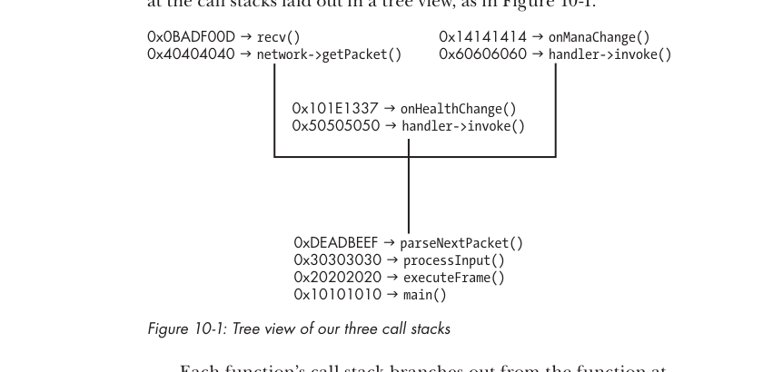
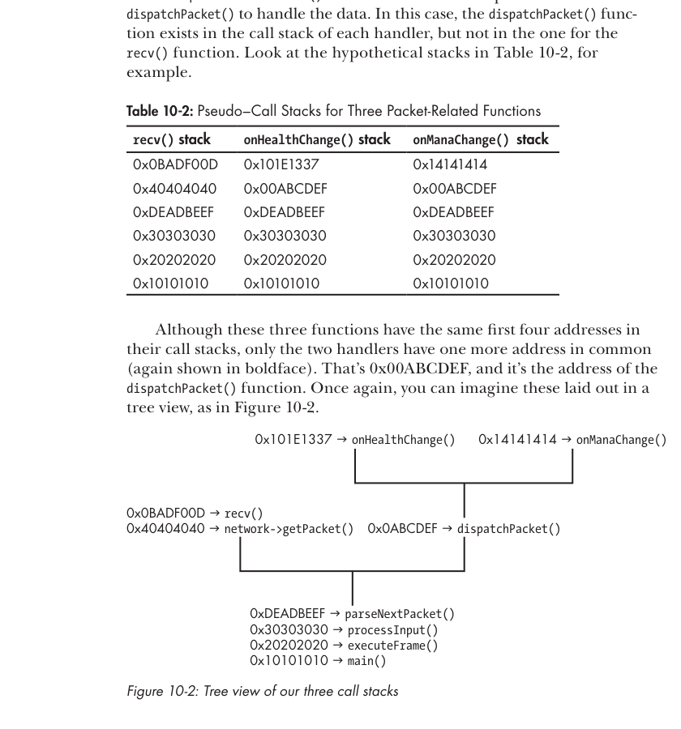

# Capitulo 10 - Hacks responsivos

> Titulo original: *Responsive Hacks*

> Navegacao: [Anterior](capitulo-09.md) | [Indice](README.md) | [Proximo](capitulo-11.md)

## Topicos

- Observando game events (memoria, visual, network)
- Localizando a parser function
- Executando acoes (`SendInput`, `SendMessage`, actor functions)
- Combinando tudo: autoheal, anti-CC, spell trainer

## Abertura

O gamer medio reage em 250ms (1/4 de segundo). Profissionais
chegam a 1/5 de segundo, alguns a 1/6. Esses numeros vem de testes
online que medem reacao a eventos isolados e previsiveis. Em jogo
real, o player precisa reagir a dezenas de coisas
simultaneamente: perda de health, skill shots vindo, abilities
saindo do cooldown, ataques inimigos, etc. So um jogador muito
hardcore mantem 1/4-1/5 nesse ambiente; mais rapido que isso, so
um computador.

Neste capitulo voce vai aprender a fazer bots que reagem mais
rapido que qualquer humano. Primeiro, padroes para detectar
eventos. Depois, como mover o personagem, healar e cast spells
sozinho. Por fim, como amarrar tudo em hacks responsivos comuns.

## Observando game events

Em segundos jogando, o humano consegue observacoes essenciais:
ve missiles vindo, sente quando a vida esta baixa, percebe
abilities prontas. Para um bot, essas observacoes "intuitivas"
nao sao tao faceis. Precisa detectar cada evento por mudancas em
memoria, dicas visuais, ou trafego de rede.

### Monitorando memoria

Para eventos simples, ler periodicamente o valor e comparar.
Listagem 10-1:

```cpp
// rodar a cada 10 ms (100 vezes por segundo)
auto health = readMemory<int>(HEALTH_ADDRESS);
if (health <= 500) {
    // codigo de reacao
}
```

A cada 10ms e uma boa taxa. Quando passa o threshold, dispare
healing/potion. Para reagir a *qualquer* mudanca (nao so o
threshold), compare com o valor anterior:

```cpp
// ainda a cada 10 ms
static int previousHealth = 0;
auto health = readMemory<int>(HEALTH_ADDRESS);
if (health != previousHealth) {
    if (health > previousHealth) {
        // reagir a aumento
    } else {
        // reagir a queda
    }
    previousHealth = health;
}
```

Uma `static` `previousHealth` guarda o valor da iteracao anterior.
Diferindo, o bot reage e ainda diferencia aumento de queda. Padrao
mais simples e comum para reagir a mudancas de game state. Vale
para health, mana, cooldowns e qualquer info critica.

### Detectando dicas visuais

Health e numero, facil. Mas alguns elementos so se manifestam como
indicador na tela (ex.: status ailment, buff). Para esses, hookar o
graphics engine e esperar o modelo certo aparecer. Lembre dos
hooks Direct3D do Capitulo 8 e do wallhack do Capitulo 9. Quando
o modelo desenha, voce enfileira a reacao para apos o frame:

```cpp
// callback de drawIndexedPrimitive
void onDrawIndexedPrimitive(...) {
    if (numVertices == EVENT_VERT && primCount == EVENT_PRIM) {
        // reagir, de preferencia apos o desenho
    }
}
```

Mesmo trick de fingerprint do wallhack. Mas isso reage *todo
frame*, e o game vira injogavel. Coloque um cooldown interno. Se o
indicator e desenhado persistentemente (nao pisca), da para
rastrear entre frames para detectar quando aparece e some:

```cpp
bool eventActive = false;
bool eventActiveLastFrame = false;

// callback drawIndexedPrimitive
void onDrawIndexedPrimitive(...) {
    if (numVertices == EVENT_VERT && primCount == EVENT_PRIM)
        eventActive = true;
}

// callback endScene
void onDrawFrame(...) {
    if (eventActive) {
        if (!eventActiveLastFrame) {
            // reagir ao modelo aparecer
        }
        eventActiveLastFrame = true;
    } else {
        if (eventActiveLastFrame) {
            // reagir ao modelo sumir
        }
        eventActiveLastFrame = false;
    }
    eventActive = false;
}
```

Excelente para indicadores visuais de stuns, slows, snares,
poisons. Tambem da para detectar inimigos aparecendo/sumindo em
MOBA/RTS, ja que esses jogos so desenham inimigos no sight range
de aliados.

### Interceptando trafego de rede

Uma das formas mais confiaveis de observar eventos e como o
proprio client faz: esperar o server avisar. O server manda byte
arrays (*packets*) por sockets. Em geral cifrados e em formato
proprietario.

#### Funcao tipica de packet parsing

Antes de desenhar um frame, o client roda algo como Listagem 10-2:

```cpp
void parseNextPacket() {
    if (!network->packetReady()) return;
    auto packet = network->getPacket();
    auto data   = packet->decrypt();
    switch (data->getType()) {
        case PACKET_HEALTH_CHANGE:
            onHealthChange(data->getMessage());
            break;
        case PACKET_MANA_CHANGE:
            onManaChange(data->getMessage());
            break;
        // outros tipos
    }
}
```

> Listagem 10-2: parse de packets simplificado.

O codigo varia por jogo, mas a sequencia e sempre: receber pacote,
decifrar, classificar tipo, despachar para handler. Alguns hackers
interceptam pacotes raw e replicam tudo no bot. Funciona, mas
exige saber a criptografia, formato interno, fazer
man-in-the-middle e descobrir as keys.

Hookar os handlers (apos parse) e abordagem bem melhor. Em
Listagem 10-2, sao `onHealthChange()` e `onManaChange()`. O bot
delega ao game o trabalho de parse e fica ignorante quanto ao
network. Tambem da discrecao para escolher quais handlers hookar.

> NOTA: interceptar pacotes inteiros pode ser vantajoso em casos
> com Adobe AIR usando RTMPS. Como RTMPS e bem documentado, nao
> precisa reverter formato/cripto. Capitulo 8 cobre RTMPS hooking.

Trick para achar a parser: breakpoint em `recv()` e analise da call
stack. No OllyDbg, com o game atachado, na command line digite
`bp recv`. Quando dispara, suba a stack com `Ctrl-F9` (execute
until return) seguido de `F8` (step over). A cada nivel, inspecione
o caller ate achar um com um `switch()` grande - tipicamente o
parser.

#### Parser mais espinhoso

Dependendo da arquitetura, achar nao e simples. Considere:

```cpp
packetHandlers[PACKET_HEALTH_CHANGE] = onHealthChange;
packetHandlers[PACKET_MANA_CHANGE]   = onManaChange;

void parseNextPacket()
{
    if (!network->packetReady()) return;
    auto packet  = network->getPacket();
    auto data    = packet->decrypt();
    auto handler = packetHandlers[data->getType()];
    handler->invoke(data->getMessage());
}
```

Sem `switch()`, sem como reconhecer em memoria. Voce passa direto
pelo parser quando sobe a stack do `recv()`. Solucao: liste todos
os callees na stack do `recv()`. No painel de stack do OllyDbg,
todo endereco marcado como `RETURN` abaixo de `ESP` e o return
para um caller. Va a cada um na pane de disassembly e anote o
topo da funcao. Voce monta a lista das funcoes ate o `recv()`.

Repita o processo a partir de breakpoints colocados em handlers
do game. Para achar handler, monitore a memoria que ele
inevitavelmente atualiza: ex.: o handler de health change vai
escrever no endereco da health. Coloque memory on-write
breakpoint. Quando dispara, e um handler. Funciona para qualquer
valor controlado pelo server (health, mana, level, items).

Com a stack do `recv()` e de uns handlers em mao, correlate.
Considere as tres call stacks da Tabela 10-1:

| recv() stack | onHealthChange() stack | onManaChange() stack |
|---|---|---|
| `0x0BADF00D` | `0x101E1337` | `0x14141414` |
| `0x40404040` | `0x50505050` | `0x60606060` |
| **`0xDEADBEEF`** | **`0xDEADBEEF`** | **`0xDEADBEEF`** |
| `0x30303030` | `0x30303030` | `0x30303030` |
| `0x20202020` | `0x20202020` | `0x20202020` |
| `0x10101010` | `0x10101010` | `0x10101010` |

Cada chamada vem de uma cadeia de quatro funcoes em comum (em
negrito). O endereco comum mais profundo, `0xDEADBEEF`, e o do
parser. Em vista de arvore (Figura 10-1):

```text
                 0x10101010 -> main()
                      |
                 0x20202020 -> executeFrame()
                      |
                 0x30303030 -> processInput()
                      |
                 0xDEADBEEF -> parseNextPacket()
                  /     |     \
        recv()         0x50.. -> handler->invoke()       0x60.. -> handler->invoke()
        (0x0BAD..)     0x101E.. -> onHealthChange()      0x1414.. -> onManaChange()
        0x40.. -> network->getPacket()
```

> Figura 10-1: tree view das tres call stacks.



> NOTA: na pratica, as stacks tem mais funcoes; comparar nao e
> tao limpo.

#### Sistema hibrido

Terceira variacao: hibrido com `switch()` *apos* uma chamada de
funcao:

```cpp
void processNextPacket()
{
    if (!network->packetReady()) return;
    auto packet = network->getPacket();
    auto data   = packet->decrypt();
    dispatchPacket(data);
}

void dispatchPacket(data)
{
    switch (data->getType()) {
    case PACKET_HEALTH_CHANGE:
        processHealthChangePacket(data->getMessage());
        break;
    case PACKET_MANA_CHANGE:
        processManaChangePacket(data->getMessage());
        break;
    }
}
```

`processNextPacket()` pega o pacote e chama
`dispatchPacket()`. Aqui `dispatchPacket()` aparece na stack dos
handlers, mas nao na do `recv()`. Tabela 10-2:

| recv() stack | onHealthChange() stack | onManaChange() stack |
|---|---|---|
| `0x0BADF00D` | `0x101E1337` | `0x14141414` |
| `0x40404040` | **`0x00ABCDEF`** | **`0x00ABCDEF`** |
| `0xDEADBEEF` | `0xDEADBEEF` | `0xDEADBEEF` |
| `0x30303030` | `0x30303030` | `0x30303030` |
| `0x20202020` | `0x20202020` | `0x20202020` |
| `0x10101010` | `0x10101010` | `0x10101010` |

Os tres tem os mesmos quatro enderecos no fundo, mas so os dois
handlers tem mais um em comum: `0x00ABCDEF`, o
`dispatchPacket()`.

Em vista de arvore, fica como na segunda figura (mesmo formato que
Figura 10-1, mas com esse layout de stacks):

> Figura 10-2: tree view das tres call stacks (variante apos dispatch).



#### Hack do parser

Achado o dispatcher, voce tem todos os handlers possiveis. Para
deduzir o que cada um faz, breakpoint nele e veja que valores
mudam. Hookea os que precisam reagir (ver Capitulo 8).

Existem infinitas formas de network behavior; nao da para cobrir
todas. Mas o trio de tecnicas acima geralmente cobre a metodologia.
Em qualquer caso, comece com breakpoint em `recv()`.

## Executando acoes in-game

Antes de reagir, o bot precisa saber jogar: cast, andar, ativar
items. Bots nao sao tao diferentes de humanos: voce diz quais
botoes apertar. Pressionar tecla resolve em muitos casos; em
situacoes mais complexas, o bot pode precisar mandar pacotes
diretos pro server.

> Codigo de exemplo:
> `GameHackingExamples/Chapter10_ResponsiveHacks/`.

### Emulando o teclado

Os botoes mais usados sao do teclado. Duas abordagens.

#### A funcao SendInput()

Forma comum: `SendInput()`. Manda input para a topmost window:

```cpp
UINT SendInput(UINT inputCount, LPINPUT inputs, int size);
```

`inputCount`: quantos inputs (vamos usar `1` sempre). `inputs`:
ponteiro para `INPUT` (ou array). `size`:
`inputCount * sizeof(INPUT)`.

Para configurar o press de F1:

```cpp
INPUT input = {0};
input.type   = INPUT_KEYBOARD;
input.ki.wVk = VK_F1;
```

Para um press completo:

```cpp
SendInput(1, &input, sizeof(input));
input.ki.dwFlags |= KEYEVENTF_KEYUP; // muda para key up
SendInput(1, &input, sizeof(input));
```

A primeira call e o press, a segunda o release (`KEYEVENTF_KEYUP`).
O motivo nao e ter mandado duas vezes; e a flag. Listagem 10-3
encapsula:

```cpp
void sendKeyWithSendInput(WORD key, bool up)
{
    INPUT input = {0};
    input.type       = INPUT_KEYBOARD;
    input.ki.wVk     = key;
    input.ki.dwFlags = 0;
    if (up)
        input.ki.dwFlags |= KEYEVENTF_KEYUP;
    SendInput(1, &input, sizeof(input));
}

sendKeyWithSendInput(VK_F1, false); // press
sendKeyWithSendInput(VK_F1, true);  // release
```

> Listagem 10-3: wrapper para `SendInput()`.

Voce precisa chamar duas vezes (press + release) porque
combinacoes com modifier (Shift, Alt, Ctrl) exigem ordem
especifica: modifier press *antes* do key press, e modifier
release *depois* do key release. Exemplo Shift+F1:

```cpp
sendKeyWithSendInput(VK_LSHIFT, false); // press shift
sendKeyWithSendInput(VK_F1, false);     // press F1
sendKeyWithSendInput(VK_F1, true);      // release F1
sendKeyWithSendInput(VK_LSHIFT, true);  // release shift
```

#### A funcao SendMessage()

Alternativa: `SendMessage()`. Envia input para qualquer janela
(mesmo minimizada/oculta), postando no message queue. Vantagem:
voce pode fazer outras coisas enquanto o bot joga em background.
Prototipo:

```cpp
LRESULT SendMessage(
    HWND   window,
    UINT   message,
    WPARAM wparam,
    LPARAM lparam);
```

`window`: handle da janela alvo. `message`: tipo de input
(`WM_KEYUP`, `WM_KEYDOWN`, `WM_CHAR`). `wparam`: key code.
`lparam`: `0` para `WM_KEYDOWN` e `1` para os outros.

Pegue o handle pela janela com `FindWindow()`:

```cpp
auto window = FindWindowA(NULL, "Title Of Game Window");
```

Pressionar F1:

```cpp
SendMessageA(window, WM_KEYDOWN, VK_F1, 0);
SendMessageA(window, WM_KEYUP,   VK_F1, 0);
```

Mas isso so vale para teclas que nao geram texto (F1, Insert,
Tab). Para teclas de texto, mande tambem `WM_CHAR` no meio. Para
digitar `W`:

```cpp
DWORD key = (DWORD)'W';
SendMessageA(window, WM_KEYDOWN, key, 0);
SendMessageA(window, WM_CHAR,    key, 1);
SendMessageA(window, WM_KEYUP,   key, 1);
```

> NOTA: tecnicamente da para mandar so `WM_CHAR`, mas e boa
> pratica mandar os tres. Devs podem detectar e banir bots
> ignorando `WM_CHAR` que nao venham apos `WM_KEYDOWN`.

Wrapper:

```cpp
void sendKeyWithSendMessage(HWND window, WORD key, char letter)
{
    SendMessageA(window, WM_KEYDOWN, key, 0);
    if (letter != 0)
        SendMessageA(window, WM_CHAR, letter, 1);
    SendMessageA(window, WM_KEYUP, key, 1);
}
```

Diferente do wrapper de `SendInput()`, esse manda press e release
juntos: `SendMessage()` nao serve bem para modifiers, entao nao
precisa intercalar codigo. Uso para F1 seguido de W:

```cpp
sendKeyWithSendMessage(window, VK_F1, 0);
sendKeyWithSendMessage(window, 'W', 'W');
```

> NOTA: ha varias formas de games checarem modifiers. Em alguns
> da para mandar modifier por `SendMessage()`, depende da
> deteccao.

Para ser 100% correto com `SendMessage()`, ha varios bits em
`lparam`:

- 16 bits inferiores: numero de auto-repeats por hold.
- Proximos 8 bits: scan code.
- Bit 24: setado se a tecla esta na parte estendida (ex.:
  num pad).
- 4 bits seguintes: undocumented.
- Bit seguinte: setado se Alt estava down quando a mensagem
  origina.
- Ultimos 2 bits: previous state e transition state. Previous
  state setado se a tecla estava down antes; transition setado
  se a tecla mudou de estado em relacao ao anterior.

Felizmente, o game medio nao olha isso. Se voce esta tendo que
preencher tudo certinho para o bot funcionar, esta na direcao
errada. Existe coisa mais simples: o proprio `SendInput()`.

Voce tambem pode controlar o mouse com `SendInput()`/`SendMessage()`,
mas evite. Comandos de mouse vao colidir com movimentos
legitimos do jogador. O mesmo vale para teclado, mas problemas
sao bem mais raros.

### Mandando packets

Antes de desenhar um frame, o game checa input. Ao receber um que
gera acao (mover, cast), confere se e possivel e, se sim, avisa o
server. Codigo tipico:

```cpp
void processInput() {
    do {
        auto input = getNextInput();
        if (input.isKeyboard())
            processKeyboardInput(input);
        // outros tipos (mouse)
    } while (!input.isEmpty());
}

void processKeyboardInput(input) {
    if (input.isKeyPress()) {
        if (input.getKey() == 'W')
            step(FORWARD);
        else if (input.getKey() == 'S')
            step(BACKWARD);
    }
}

void step(int direction) {
    if (!map->canWalkOn(player->position))
        return;
    playerMovePacket packet(direction);
    network->send(packet);
}
```

`step()` e a *actor function* (executa a acao). Chamar uma actor
function diretamente do bot e *actuation* e contorna a camada de
input.

Para chamar, voce precisa do endereco. Atache o OllyDbg, abra
command line, digite `bp send`. Toda vez que voce dar um passo,
cast, etc., o breakpoint dispara. Anote a call stack.

> NOTA: o game chama `send()` quase em qualquer acao. Note o que
> voce fez antes de cada disparo: ajuda a deduzir o que cada call
> esta comunicando, e qual actor voce achou.

Comparando varias call stacks, descubra os actors:

```text
        0x10101010 -> main()
              |
        0x20202020 -> doFrame()
              |
        0x30303030 -> processInput()
              |
        0x40404040 -> processKeyboardInput()
            /            \
   0x0BADF00D -> castSpell()    0xDEADBEEF -> step()
            \                  /
          0x70707070 -> send()
                 |
          0x60606060 -> connection->send()
                 |
          0x50505050 -> network->send()
```

> Figura 10-3: tree view das call stacks ate `send()`.


As stacks devem ser identicas no topo (camadas genericas de
network) e no fundo (origem comum em `processInput()`). No meio,
sao as actors. Tipicamente fica logo abaixo das chamadas de
network. Aqui, `step()` e `castSpell()`.

Apos hackear o mesmo game por um tempo, voce sabe quao acima do
`send()` os actors estao. Em Figura 10-3, tres calls. Sabendo
disso, ao disparar `bp send`, suba a stack tres vezes
(`Ctrl-F9`+`F8` cada vez) e voce esta na actor.

Achada uma actor, chame de uma DLL injetada. Para `step()` em
`0xDEADBEEF`:

```cpp
typedef void _step(int direction);
auto stepActor = (_step*)0xDEADBEEF;
stepActor(FORWARD);
```

O bot nao sabe o nome da funcao no game, mas atribui o conteudo
do endereco a uma variavel batizada por voce e chama como
qualquer outra. Com endereco, prototipo e parametros corretos,
funciona belamente; voce automatiza acoes como se tivesse o
source.

Importante: chame as actors *da mesma thread* do game para evitar
threading issues. Melhor jeito e chamar de dentro de um hook em
funcao critica como `EndScene()` (Direct3D) ou `PeekMessage()`
(Windows API), que sao chamadas da main thread.

> ### Boxe: usando `this` para chamar `__thiscall`
>
> Se a actor e member nao-static de classe, ela e `__thiscall` e
> voce precisa passar a instance em `ECX`. Refresh em
> "Function Calls" no Capitulo 4. Para localizar um pointer chain
> ate a instance: breakpoint na actor, pegue `ECX` quando
> dispara, joga no Cheat Engine pointer scan. Para chamar:
> percorra o chain, pegue o endereco atual da instance, use inline
> assembly para preparar `ECX` e chamar. O processo e parecido
> com VF hook callbacks chamando a original (Capitulo 8).

## Juntando as pecas

Com framework para observar eventos e executar acoes, voce monta
hacks responsivos. Variantes existem aos montes; algumas comuns.

### O healer perfeito

*Autohealing* e o queridinho: cast healing automatico quando a
vida cai bruscamente ou abaixo de threshold. Com deteccao de
mudanca de vida e actor para cast:

```cpp
void onHealthDecrease(int health, int delta) {
    if (health <= 500)        // vida abaixo de 500
        castHealing();
    else if (delta >= 400)    // queda grande
        castHealing();
}
```

Simples e funciona. Versoes avancadas tem varios niveis de
healing e aprendem com o tempo (no Capitulo 11, "Control Theory
and Game Hacking").

### Resistindo a crowd-control inimigo

*Anti-crowd-control hacks* detectam CC vindo e cast spells para
reduzir/anular. Detectando model Direct3D ou pacote incoming, e
com actor para cast:

```cpp
void onIncomingCrowdControl() {
    // shield para bloquear o CC
    castSpellShield();
}

void onReceiveCrowdControl() {
    // cleanse para CC ja aplicado
    castCleanse();
}
```

`onIncomingCrowdControl()` tenta impedir o CC de te acertar.
Falhando, `onReceiveCrowdControl()` remove o efeito.

### Evitando desperdicio de mana

*Spell trainers* esperam o player ter full mana e cast spell para
aumentar magic level/stats. Voce nunca desperdica mana
regeneration por estar full. Com deteccao de mudanca de mana e
actor para cast:

```cpp
void onManaIncrease(int mana, int delta) {
    if (delta >= 100)        // usando mana potion: o jogador precisa,
        return;              // aborta
    if (mana >= MAX_MANA - 10)  // mana quase cheia, queima
        castManaWasteSpell();
}
```

Outros responsive hacks comuns: *autoreload* (recarrega instant),
*autododge* (esquiva projetil), *autocombo* (ataca o mesmo alvo
de um aliado proximo). O limite e quantos eventos seu bot
observa, vezes quantas reacoes valid/uteis ele consegue mandar
para cada um.

## Fechando

Com hooks, manipulacao de memoria e simulacao de teclado, voce
constroi seus primeiros responsive hacks. Sao a porta para
autonomia, mas so um lampejo do que da. O Capitulo 11 e o pico:
juntando tudo e construindo sobre responsive hacks, voce vai
automatizar acoes complexas e criar um bot autonomo de verdade.

Se nao se sente pronto, revise material anterior e pratique em
ambiente isolado na sua maquina. Implementar bots assim e mais
facil do que parece e e satisfatorio. Quando estiver confortavel
com autohealers e responsive basicos, esta pronto para automatizar
gameplay completa.
