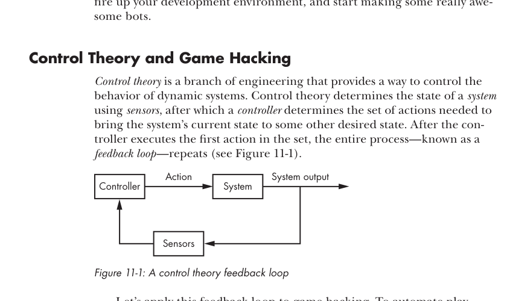
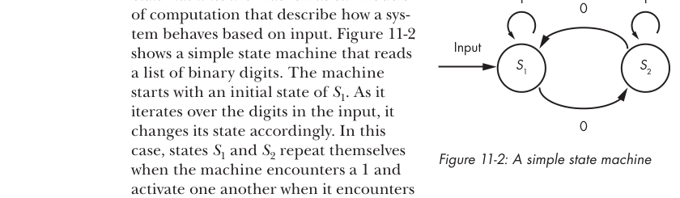
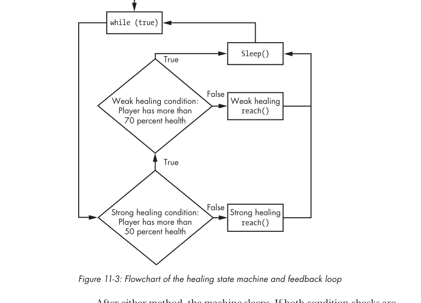
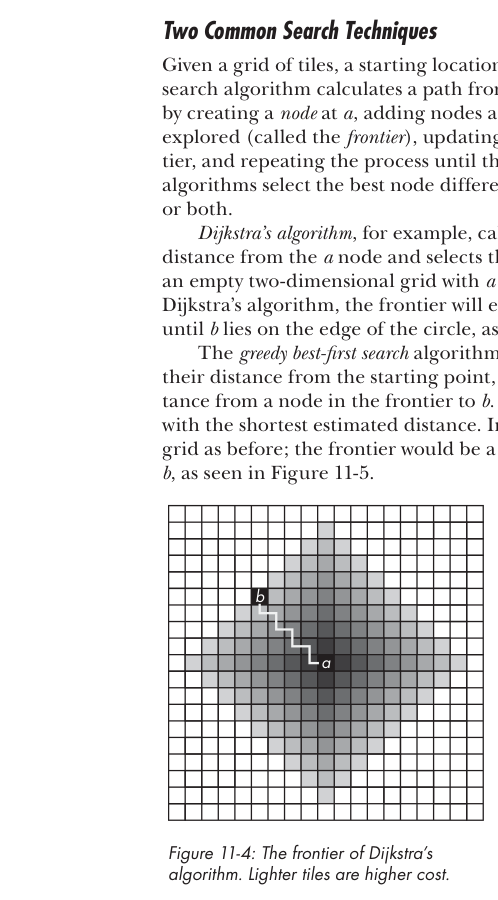
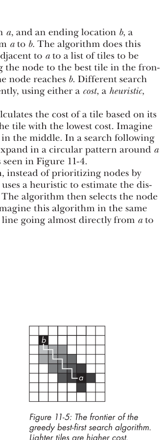

# Capitulo 11 - Juntando tudo: escrevendo bots autonomos

> Titulo original: *Putting It All Together: Writing Autonomous Bots*

> Navegacao: [Anterior](capitulo-10.md) | [Indice](README.md) | [Proximo](capitulo-12.md)

## Topicos

- Control theory aplicada a game hacking
- State machines como controllers
- Error correction
- Pathfinding com search algorithms (Dijkstra, greedy best-first, A*)
- Cavebots e warbots

## Abertura

O objetivo final do game hacking e construir um bot completo capaz
de jogar por horas seguidas. Esses bots fazem heal, drink potion,
farmam monstros, lootam corpses, andam, vendem, compram supplies e
mais. Para chegar la, voce combina hooks e memory reads com
control theory, state machines e search algorithms.

Vamos tambem ver hacks automatizados comuns e como devem se
comportar em alto nivel. Apos teoria e codigo, dois tipos de bots:
*cavebots* (exploram caves e trazem o loot) e *warbots* (lutam
contra inimigos).

## Control theory e game hacking

*Control theory* e um ramo da engenharia que controla o
comportamento de sistemas dinamicos. Determina o estado do
sistema usando *sensors*; um *controller* decide o conjunto de
acoes para mover o estado atual para o desejado. Apos a primeira
acao, todo o processo (*feedback loop*) se repete (Figura 11-1):

```text
        +--------+   acao    +---------+   output
        | Cont-  | --------> | Sistema | -----+
        | roller |           |         |     |
        +--------+ <-------- | Sensors | <----+
                    leitura  +---------+
```

> Figura 11-1: feedback loop de control theory.




Aplicando ao game hacking: para automatizar a gameplay (o
sistema), o bot implementa algoritmos (controller) que sabem jogar
em qualquer estado observado por memory reads, network hooks etc.
(sensors). O controller costuma receber inputs humanos (path,
creatures alvo, loot a pegar). Para alcancar o estado desejado,
ele executa um subconjunto de acoes possiveis.

Por exemplo: sem creatures na tela e sem corpses para lootar, o
estado desejado e atingir o proximo *waypoint*. O controller
move o player um passo a cada iteracao. Encontrando uma creature,
no primeiro frame ataca; nos seguintes, alterna entre fugir
(*kiting*) e cast spells. Apos o kill, executa loot e segue.

Parece muita coisa para codar, mas ha design patterns que
simplificam.

## State machines

State machines sao modelos matematicos que descrevem o
comportamento de um sistema baseado em input. A Figura 11-2 mostra
uma simples que le digitos binarios. Comeca em S1; os estados
S1 e S2 se repetem ao ver `1` e se trocam ao ver `0`. Para
`11000111`, transicoes: S1, S1, S2, S1, S2, S2, S2, S2.

```text
              1                       1
            -----                   -----
            |   |                   |   |
            v   |          0        v   |
        +-------+ <----------------+-------+
        |  S1   |                  |  S2   |
        +-------+ ----------------> +-------+
                          0
```

> Figura 11-2: state machine simples.




Com um pequeno twist na teoria classica, da para usar uma state
machine como controller num feedback loop. Essa versao e uma
lista de estados, com a *condicao* que define cada um e as *acoes*
para alcanca-los.

> ### Boxe: state machines e game hacking
>
> Uma state machine de game hacking precisa nao so manter estado
> interno, como atuar (actuate) sobre o ambiente. Esse ambiente
> muda por causa do bot, de outros players e de eventos
> imprevisiveis. Por isso, tentar percorrer uma state machine
> classica baseada no ambiente observado e perda de tempo: nao da
> para criar transicoes para toda observacao possivel. Faz mais
> sentido a state machine reavaliar o ambiente a cada iteracao
> como pagina em branco: a *atuacao* sobre o ambiente e o que
> aciona o proximo estado. State machines classicas conseguem
> isso, mas vamos achata-las e usar de forma mais simples e
> poderosa.
>
> Pode parecer estranho se voce ja conhece state machines
> classicas, mas a combinacao com control theory abaixo vai
> fechar.

Diferenca-chave: em vez de um estado meramente *ativar* outro,
para cada estado da game automation state machine o bot executa
*acoes in-game* que mudam o estado geral do game e, portanto, o
estado detectado na proxima iteracao. Em codigo, um estado:

```cpp
class StateDefinition {
public:
    StateDefinition() {}
    ~StateDefinition() {}
    bool condition();
    void reach();
};
```

Voce monta a state machine com `std::vector`:

```cpp
std::vector<StateDefinition> stateMachine;
```

Pronto, voce tem o esqueleto. Junto com o feedback loop, define
o fluxo de automacao.

Crie a lista ordenada por importancia. Cada `StateDefinition` usa
info dos sensors no `condition()` para decidir se o estado deve
ser ativado. Um controller percorre a lista chamando o `reach()`
do primeiro estado cujo `condition()` retorna `false`. O
controller fica dentro do feedback loop.

> NOTA: pense no `condition()` como requisito para *transicionar*
> ao proximo estado. `true`: nao precisa atuar, segue iterando.
> `false`: alguma atuacao precisa acontecer antes da transicao.

> Codigo de exemplo: `GameHackingExamples/Chapter11_StateMachines`
> e `Chapter11_SearchAlgorithms` adiante. Compilam em Visual
> Studio 2010 (e qualquer compilador C++ recente). Download em
> https://www.nostarch.com/gamehacking/.

## Combinando control theory e state machines

Para amarrar estados num feedback loop, precisa dar a cada
`StateDefinition` acesso a sensors e actuators:

```cpp
class StateDefinition {
public:
    StateDefinition() {}
    ~StateDefinition() {}
    bool condition(GameSensors* sensors);
    void reach(GameSensors* sensors, GameActuators* actuators);
};
```

`GameSensors` e `GameActuators` sao classes suas: a primeira tem
resultados de memory reads, network hooks etc.; a segunda, actor
functions que executam acoes.

Para definir cada estado, da para criar uma classe filha por estado,
mas cabe melhor em livro com `std::function`:

```cpp
class StateDefinition {
public:
    StateDefinition() {}
    ~StateDefinition() {}
    std::function<bool(GameSensors*)> condition;
    std::function<void(GameSensors*, GameActuators*)> reach;
};
```

Cria-se uma instance e atribui-se as funcoes.

### State machine de healer basico

Suponha um auto-healer com dois niveis: *strong heal* se vida
<= 50%, *weak heal* se entre 51% e 70%.

```cpp
std::vector<StateDefinition> stateMachine(2);
```

Strong heal e mais critico (impede a morte), entao vem primeiro.

```cpp
auto curDef = stateMachine.begin();
curDef->condition = [](GameSensors* sensors) {
    return sensors->getHealthPercent() > 50;        // (1)
};
curDef->reach = [](GameSensors* sensors, GameActuators* actuators) {
    actuators->strongHeal();                        // (2)
};
```

> Listagem 11-1: codigo do strong healing.

Iterator `curDef` aponta para o primeiro `StateDefinition`.
Condicao (1): "estado satisfeito se vida > 50%". Senao, `reach()`
chama `strongHeal()` em (2).

```cpp
curDef++;
curDef->condition = [](GameSensors* sensors) {
    return sensors->getHealthPercent() > 70;        // (1)
};
curDef->reach = [](GameSensors* sensors, GameActuators* actuators) {
    actuators->weakHeal();                          // (2)
};
```

> Listagem 11-2: codigo do weak healing.

Aponta para o segundo, condicao em 70%, `reach()` em
`weakHeal()`.

Controller:

```cpp
for (auto state = stateMachine.begin(); state != stateMachine.end(); state++) {
    if (!state->condition(&sensors)) {              // (1)
        state->reach(&sensors, &actuators);
        break;
    }
}
```

Itera, executa o `reach()` do primeiro com `condition()` `false`
(1) e sai. Por fim, embrulha no feedback loop:

```cpp
while (true) {
    for (auto state = stateMachine.begin();
         state != stateMachine.end();
         state++) {
        if (!state->condition(&sensors)) {
            state->reach(&sensors, &actuators);
            break;
        }
    }
    Sleep(FEEDBACK_LOOP_TIMEOUT);
}
```

> Listagem 11-3: state machine de healer + feedback loop.

> Figura 11-3: fluxo do exemplo de healing com strong/weak heal.



O `Sleep()` permite que o server processe a atuacao anterior e o
client receba o resultado antes da proxima iteracao.

A Figura 11-3 mostra o fluxo: checa strong condition; se `true`,
vai para weak condition; se `false`, faz strong heal. Se weak
condition `false`, faz weak heal. Apos qualquer um, dorme. Se
ambas `true`, ninguem precisa de heal: dorme.

### Uma state machine hipoteticamente complexa

Para um bot mais real, juntando "walk, attack, loot" com healing,
voce teria por exemplo:

- **Strong healing** - condicao: vida > 50%. Reach: cast strong
  healing spell.
- **Weak healing** - condicao: vida > 70%. Reach: cast weak
  healing spell.
- **Attack spell** - condicao: sem alvo OU spell em cooldown.
  Reach: cast attack spell no alvo.
- **Kite monster** - condicao: sem alvo OU distancia adequada do
  alvo. Reach: passo de afastamento.
- **Target monster** - condicao: nenhuma criatura para atacar.
  Reach: ataca uma criatura.
- **Loot item** - condicao: nenhum corpse aberto OU corpse aberto
  vazio. Reach: pega item do corpse aberto.
- **Approach corpse** - condicao: nenhum corpse para abrir OU ja
  adjacente a um. Reach: passo em direcao a um corpse.
- **Open corpse** - condicao: nao adjacente a um corpse abrivel.
  Reach: abre o adjacente.
- **Follow path** - condicao: nao consegue mover ate o waypoint
  OU ja esta sobre ele. Reach: passo em direcao ao waypoint.
- **Advance waypoint** - condicao: sem waypoints restantes. Reach:
  avanca para o proximo. Se o personagem nao conseguir alcancar
  o waypoint atual (por exemplo, preso), esse estado evita travar.

Ja sao 23 objetos no diagrama, com 33 caminhos de controle.
Comparado a Figura 11-3 (7 objetos, 9 caminhos), e bem mais
complexo.

Da para hardcodar com `if()` aninhados ou `if()/return()`
empilhados, mas voce perde *runtime flexibility*. State machines
podem mover, remover e adicionar estados dinamicamente. Voce pluga
e despluga comportamentos.

Para mais flexibilidade, exponha sensors/actuators a um ambiente
Lua, crie funcoes Lua que mexam na state machine, e adapte
`StateDefinition` para chamar funcoes Lua. O core do bot fica em
C++, e a automacao em Lua (high-level, dinamica).

> NOTA: para embutir Lua, inclua headers e linke a lib. Foge do
> escopo, veja Capitulo 24 de "Programming in Lua" de Roberto
> Ierusalimschy.

## Error correction

Outra peca util: *error correction*. O mecanismo observa o
resultado da atuacao, compara com o esperado e ajusta calculos
futuros. Util em sistemas estocasticos.

Games sao estocasticos no todo, mas as acoes em geral sao
deterministicas. No healer, voce sabe quanto cada spell cura. Mas
imagine um healer que precisa funcionar em varios characters de
varios levels sem input humano. Error correction permite o bot
aprender.

### Ajustando para um ratio constante

Se o heal e ratio constante de vida, basta um unico ajuste apos
o primeiro heal. Modificacao da Listagem 11-2:

```cpp
curDef->condition = [](GameSensors* sensors) -> bool {
    static float healAt    = 70;
    static bool  hasLearned = false;
    if (!hasLearned && sensors->detectedWeakHeal()) {
        hasLearned = true;
        healAt     = 100 - sensors->getWeakHealIncrease();
    }
    return sensors->getHealthPercent() > healAt;
};
```

`healAt` substitui o `70` hardcoded. `hasLearned` indica se ja
aprendemos. Detectando o primeiro weak heal, atualiza `healAt`
para que o cast deixe a vida em 100%. Se o heal ganha 20% de
vida, `healAt` vira 80% (em vez de 70%).

### Error correction adaptavel

E se o poder de cura aumentar com level? Bot iniciado em level 10
e jogando ate level 40 vai overheal absurdo ou morrer. Atualize
o threshold continuamente. Listagem 11-4 (modifica Listagem 11-1):

```cpp
curDef->condition = [](GameSensors* sensors) -> bool {
    static float healAt = 50;
    if (sensors->detectedStrongHeal()) {                    // (1)
        auto newHealAt = 100 - sensors->getStrongHealIncrease();
        healAt = (healAt + newHealAt) / 2.00f;              // (2)
        sensors->clearStrongHealInfo();                     // (3)
    }
    return sensors->getHealthPercent() > healAt;
};
```

Sem flag `hasLearned`: aprende sempre. Em (1) verifica se houve
strong heal. Atualiza `healAt` para a *media* (2) entre o atual e
o ideal observado. Limpa info do sensor (3) para nao contar o
mesmo evento varias vezes.

Cuidado importante: o `clearStrongHealInfo()` impede iteracao em
falso. E note que `healAt` *desliza* gradualmente para o otimo,
suportando aleatoriedade de cura. Se quiser deslizar mais rapido:

```cpp
healAt = (healAt + newHealAt * 2) / 3.00f;
```

Media ponderada para o `newHealAt`. Pontos a considerar:

- E se o heal "transbordar"? Em alguns jogos, com vida em 85% e
  spell de 30%, o sensor pode reportar 30% (ideal) ou 15% (so o
  que de fato curou). Caso reporte 15%, voce precisa de logica
  para ajustar para baixo:

```cpp
curDef->condition = [](GameSensors* sensors) -> bool {
    static float healAt = 50;
    if (sensors->detectedStrongHeal()) {
        if (sensors->getStrongHealMaxed()) {                // (1)
            healAt--;
        } else {
            auto newHealAt = 100 - sensors->getStrongHealIncrease();
            healAt = (healAt + newHealAt) / 2.00f;
        }
        sensors->clearStrongHealInfo();
    }
    return sensors->getHealthPercent() > healAt;
};
```

(1) decrementa `healAt` se o sensor detectou max heal (vida
chegou a 100%). Caso contrario, age como Listagem 11-4.

Healing e caso simples. Casos mais sofisticados: ajustar
*skillshots* a partir do padrao de movimento do inimigo. Cada
player tem padrao para esquivar; medindo direcao e distancia,
o controller ajusta onde o bot mira inicialmente. Tambem ajuda a
contornar latencia, velocidade do personagem etc.

Boa pratica: deixe a logica de error correction em modulos
externos a `StateDefinition`, com book-keeping interno em vez de
`static`. Codigo mais limpo e portavel.

## Pathfinding com search algorithms

Desafio comum: calcular um path. Alem de fazer sensor para ler
quais coordenadas no map sao bloqueantes, ha o desafio
algoritmico. Calcular path e *pathfinding*; usa-se search
algorithms.

### Duas tecnicas comuns

Dado um grid, ponto inicial *a* e final *b*, um search algorithm
calcula um path. Cria um node em *a*, adiciona vizinhos numa lista
(*frontier*), elege o melhor da frontier como novo node atual,
repete ate chegar em *b*. A escolha do "melhor" varia: pode ser
*cost*, *heuristic* ou ambos.

> Figura 11-4: expansion da frontier tipo Dijkstra num grid sem obstaculos.



**Dijkstra** calcula o cost pela distancia ate *a* e escolhe o
menor. Num grid 2D vazio com *a* no centro, a frontier expande
em circulo ate *b* cair na borda.

**Greedy best-first** usa heuristic para estimar a distancia de
um node ate *b* e escolhe o de menor estimativa. A frontier vira
quase uma linha de *a* a *b*.

> Figura 11-5: frontier do greedy best-first (linha quase-reta).



### Como obstaculos atrapalham

Com obstaculos (ex.: parede entre *a* e *b*), Dijkstra acha o
path otimo, mas com um custo enorme: o raio do circulo da frontier
em torno de *a* e igual ao tamanho do path final. Se for 50, abre
cerca de:

```text
pi * 50^2 = 7854 tiles
```

Greedy best-first abre muito menos, mas acha um path subotimo.
Dois mundos opostos.

Solucao: fundir Dijkstra com greedy best-first. Resultado: **A***
(*A-star*).

A* usa a *soma* de custo `g` e heuristic `h`, chamada *score*:
`score = g + h`. Como Dijkstra, calcula o path otimo. Como
greedy best-first, faz isso rapido.

### Implementando A*

Vamos codar A* em grid 2D, sem movimento diagonal a principio.

> Codigo: `GameHackingExamples/Chapter11_SearchAlgorithms`. O
> binario abre uma grid 20x20 onde voce define obstaculos e ve o
> algoritmo trabalhar.

#### Criando um node A*

```cpp
typedef std::shared_ptr<class AStarNode> AStarNodePtr;

class AStarNode
{
public:
};
```

Membros:

```cpp
int x, y;
int g, score;
AStarNodePtr parent;
```

Construtor:

```cpp
AStarNode(int x, int y, int cost, AStarNodePtr p, int score = 0)
    : x(x), y(y), g(cost), score(score), parent(p)
{}
```

Helper estatico para criar smart pointers:

```cpp
static AStarNodePtr makePtr(
    int x, int y, int cost,
    AStarNodePtr p,
    int score = 0)
{
    return AStarNodePtr(new AStarNode(x, y, cost, p, score));
}
```

Heuristic (Manhattan distance, para grids sem diagonal):

```cpp
int heuristic(const int destx, int desty) const
{
    int xd = destx - x;
    int yd = desty - y;
    return abs(xd) + abs(yd);                       // (1)
}
```

```text
| dx | + | dy |
```

Para diagonal, troque para Euclidean:

```text
sqrt(dx*dx + dy*dy)
```

(no codigo, geralmente `(dx*dx + dy*dy)` sem sqrt para acelerar
comparacoes proporcionais).

Update do score:

```cpp
#define TILE_COST 1

void updateScore(int endx, int endy)
{
    auto h = this->heuristic(endx, endy) * TILE_COST;
    this->score = g + h;
}
```

Filhos do node atual:

```cpp
AStarNodePtr getCopy()
{
    return AStarNode::makePtr(x, y, g, parent, score);
}

std::vector<AStarNodePtr> getChildren(int width, int height)
{
    std::vector<AStarNodePtr> ret;
    auto copy = getCopy();
    if (x > 0)
        ret.push_back(AStarNode::makePtr(x - 1, y, g + TILE_COST, copy));   // (1)
    if (y > 0)
        ret.push_back(AStarNode::makePtr(x, y - 1, g + TILE_COST, copy));   // (2)
    if (x < width - 1)
        ret.push_back(AStarNode::makePtr(x + 1, y, g + TILE_COST, copy));   // (3)
    if (y < height - 1)
        ret.push_back(AStarNode::makePtr(x, y + 1, g + TILE_COST, copy));   // (4)
    return ret;
}
```

Cria filhos em (x-1, y), (x, y-1), (x+1, y), (x, y+1). Cada filho
tem `parent = copy` e `g = parent->g + TILE_COST`.

Para diagonal, adicione (x-1, y-1), (x+1, y-1), (x+1, y+1), (x-1,
y+1). Se diagonal custa mais (ex.: 1.5x):

1. Mude `TILE_COST` para `10`.
2. Defina `DIAG_TILE_COST = TILE_COST * fator` (ex.: `15`).
3. `g` dos filhos diagonais = `parent->g + DIAG_TILE_COST`.

Operadores fora da classe:

```cpp
bool operator<(const AStarNodePtr &a, const AStarNodePtr &b)        // (1)
{
    return a.score > b.score;
}

bool operator==(const AStarNodePtr &a, const AStarNodePtr &b)       // (2)
{
    return a.x == b.x && a.y == b.y;
}
```

(1) `std::priority_queue` ordena pelo score. (2) `std::find`
identifica node por posicao.

#### Search function

```cpp
template<int WIDTH, int HEIGHT, int BLOCKING>
bool doAStarSearch(
    int map[WIDTH][HEIGHT],
    int startx, int starty,
    int endx,   int endy,
    int path[WIDTH][HEIGHT])
{
}
```

Templates: dimensoes do map e o valor que indica tile bloqueante.

> NOTA: na pratica, o map vem dinamico do game. Aqui usamos
> templates para passar dimensoes em compile time.

Frontier ordenada por score e container global de nodes (para
poder atualizar score/parent caso o node seja revisitado por
outro pai):

```cpp
std::vector<AStarNodePtr> allNodes;
std::priority_queue<AStarNodePtr> frontier;
```

Primeiro node:

```cpp
auto node = AStarNode::makePtr(startx, starty, 0, nullptr);
node->updateScore(endx, endy);
allNodes.push_back(node);
```

Loop principal:

```cpp
while (true) {
}
```

Goal check:

```cpp
if (node->x == endx && node->y == endy) {
    makeList<WIDTH, HEIGHT>(node, allNodes, path);
    return true;
}
```

Expansao dos filhos:

```cpp
auto children = node->getChildren(WIDTH, HEIGHT);
for (auto c = children.begin(); c != children.end(); c++) {
    if (map[(*c)->x][(*c)->y] == BLOCKING) continue;       // (1)

    auto found = std::find(allNodes.rbegin(), allNodes.rend(), *c);
    if (found != allNodes.rend()) {                         // (2)
        if (*found > *c) {                                  // (3)
            (*found)->g = (*c)->g;
            (*found)->parent = (*c)->parent;
            (*found)->updateScore(endx, endy);
        }
    } else {
        (*c)->updateScore(endx, endy);
        frontier.push(*c);                                  // (4)
        allNodes.push_back(*c);                             // (5)
    }
}
```

Ignora tile bloqueante (1). Para cada filho, ve se ja existe node
nas mesmas coordenadas (2); se ja existe e o score do existente e
maior (3), atualiza para o caminho mais barato. Senao, novo node
vai para frontier (4) e para `allNodes` (5).

`std::find` usa reverse iterators (rbegin/rend) porque novos
nodes sao adicionados ao fim e duplicatas costumam estar perto
do fim.

Quando a frontier esgota:

```cpp
if (frontier.size() == 0) return false;
node = frontier.top();                                       // (1)
frontier.pop();                                              // (2)
```

Aponta `node` para o mais barato (1), retira da frontier (2),
loop continua. Se a frontier zera sem achar goal, retorna `false`.

#### Construindo a lista do path

```cpp
template<int WIDTH, int HEIGHT>
void makeList(
    AStarNodePtr end,
    std::vector<AStarNodePtr> nodes,
    int path[WIDTH][HEIGHT])
{
    for (auto n = nodes.begin(); n != nodes.end(); n++)
        path[(*n)->x][(*n)->y] = 2;                          // (1)

    auto node = end;
    while (node.get() != nullptr) {
        path[node->x][node->y] = 1;                          // (2)
        node = node->parent;
    }
}
```

Marca todos os nodes fechados como `2` (1) e o caminho real como
`1` (2), seguindo `parent` do goal ate o orfao (start).

### Quando A* brilha

Em games modernos, geralmente da para mandar pacote com destino
ou clicar no map. Mas em situacoes que precisam de path:

- **Selecao de targets**: cheque se o personagem pode chegar.
  Caso o inimigo esteja numa sala isolada, voce nao trava
  tentando target.
- **Selecao de corpses**: lootar o mais proximo primeiro.
- **Mouse emulation**: em jogos paranoicos que correlacionam acao
  com movimento de mouse, A* sobre a tela (sem blocking, com
  custo levemente randomizado) gera paths "humanos".
- **Kiting de monsters**: goal e estar a N unidades de toda
  creature. Heuristic com custo maior em nodes proximos a
  creatures. Pratica leva a kiters melhores que humanos.
- **Predicao de movimento de inimigos**: se o inimigo foge,
  presuma que volta para a base, calcule a rota e atrapalhe (cast
  spell ou teleporte na frente).

> ### Boxe: outros usos de A*
>
> A* nao e so para path. Com abstracoes em cima de `AStarNode`,
> serve para qualquer search problem. E uma iteracao ponderada
> sobre dataset multidimensional ate achar um goal. Aplicacoes:
> xadrez, damas, e (combinado com Manhattan 3D + DFS) ate cubo
> magico. Veja online.

## Hacks automatizados comuns

Padroes de design e algoritmos vistos, vamos olhar dois tipos de
bots em alto nivel.

### Lootando com cavebots

Cavebots matam creatures, pegam loot e percorrem caves. As
capacidades variam muito.

#### Depositar e reabastecer

Para deixar um personagem botando dias, voce precisa de
*depositor* e *refiller*. Seis estados basicos:

- **Leave spawn** - condicao: no spawn/cave, sem nada para
  depositar e com supplies suficientes. Reach: sair do
  spawn/cave.
- **Walk to town** - condicao: no spawn/cave. Reach: andar ate a
  town.
- **Deposit** - condicao: no spawn/cave OU em town sem nada para
  depositar. Reach: deposita no banco/vault.
- **Withdraw cash** - condicao: no spawn/cave OU em town sem
  supplies para comprar OU com gold suficiente. Reach: saca gold.
- **Purchase supplies** - condicao: no spawn/cave OU com supplies
  suficientes. Reach: compra supplies.
- **Enter spawn** - condicao: no spawn/cave. Reach: andar ate o
  spawn/cave.

Esses estados vem antes dos relacionados a waypoints (vistos em
"Uma state machine hipoteticamente complexa") no vector. Assim
ganham prioridade. Talvez voce queira que os estados de targeting
nao ataquem creatures fora do spawn, ou adicione um estado extra
(entre walk to town e os outros) que so ataca quem bloqueia o
caminho. Ganho de eficiencia.

#### Usando o personagem como isca

Outros features: *lure mode* e *dynamic lure*. Nao sao estados na
state machine; informam targeting/walking states.

*Lure mode* e ligado/desligado por waypoints especiais. Quando
ligado, o targeting so ataca se o bot esta preso (parecido com
walk to town). Voce atrai mobs para um ponto otimo de farm antes
de atacar.

*Dynamic lure* nao depende de waypoint: ativa lure mode
automaticamente quando ha poucas creatures. Por exemplo, nao
ataca ate ter 5 monstros na tela. Apos kill todos, volta ao
modo lure ate juntar mob de novo.

Se o personagem corre mais que o monstro, modifique walking
states: ande devagar quando lure mode esta ligado e ha creatures
proximas. Caso contrario, voce deixa as creatures para tras sem
matar.

#### Permitindo scripts de jogadores

Quase todo cavebot tem interface de scripting para players
adicionarem comportamentos: waypoints custom, spells, items para
loot. Em bots avancados, targeting/looting/walking/luring sao tao
dinamicos que players adicionam feature inteira nova. Implementando
em Lua, terceiros podem evoluir seu bot por conta. Ha mercado:
profissionais vendem scripts.

### Automacao de combate com warbots

*Warbots* (ou *PvP bots*) focam em combate jogador-contra-jogador.
Muitas features se categorizam como responsive ou ESP, ja que
respondem a damage/spells incoming, revelam inimigos escondidos e
dao vantagem informacional.

Bots completamente automaticos para PvP sao raros, mas ja vimos
healers mais inteligentes, skillshots mais precisos e predicao de
path. Algumas ideias:

- **Autowall bots**: se voce tem spell de wall temporaria, o bot
  bloqueia inimigos em corredores. Com error correction aprende a
  distancia ideal a frente do inimigo. Da para detectar quem
  pula sobre a wall.
- **Autosnipe bots**: para skillshot longo ou execute global,
  detecte quando inimigo distante esta low e cast. Error
  correction afina a mira e estima dano.
- **Autokite bots**: para *carry*, kita inimigo automaticamente
  ao atacar. Set de estados igual ao kiting de cavebot. A* refina
  para evitar varios inimigos ou guiar ate base segura.

> NOTA: em games puramente PvP (battlegrounds, RTS), pessoal
> chama esses warbots simplesmente de *bots*.

## Fechando

A esta altura, voce pode comecar a fazer bots bem competentes.
Nao se preocupe se ainda nao se sente 100% confortavel: a melhor
forma de aprender e mergulhar e hackear. Use os milhares de linhas
de codigo de exemplo e divirta-se.

No proximo capitulo, vamos discutir como bots se escondem de
*anti-cheat software* (suites usadas pelos games para detectar e
banir botters).
