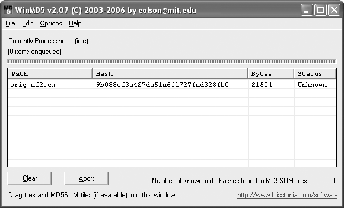
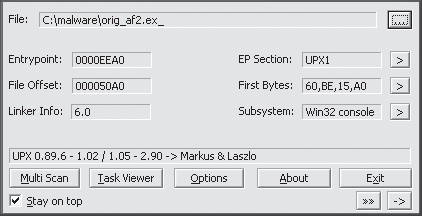
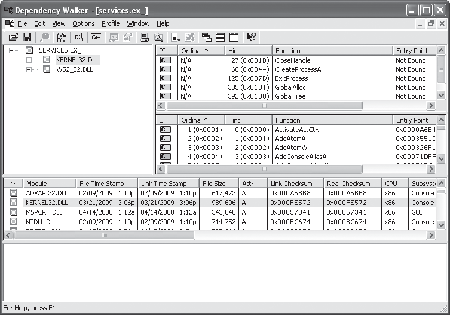
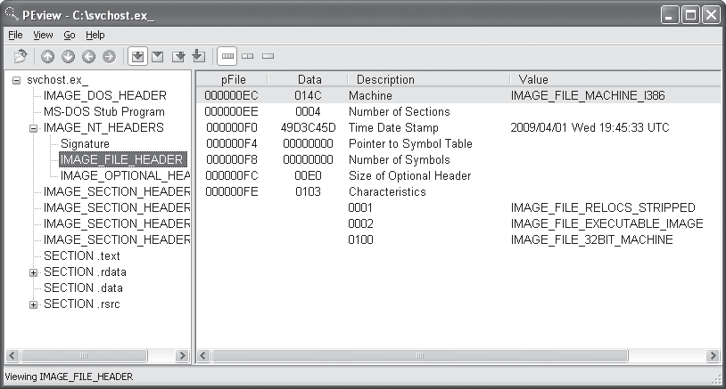
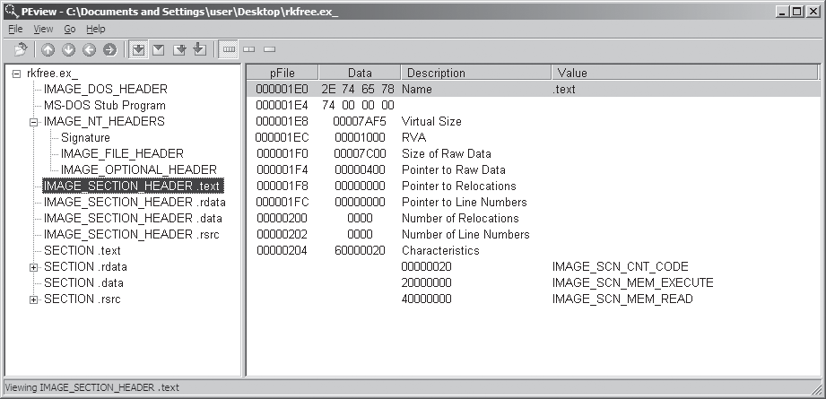
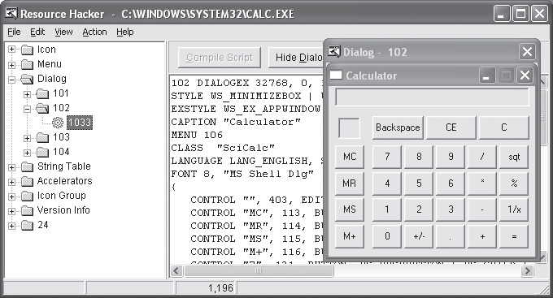

# Capitulo 1 - Tecnicas estaticas basicas

> Titulo original: *Basic Static Techniques*

> Navegacao: [Anterior](capitulo-00.md) | [Indice](README.md) | [Proximo](capitulo-02.md)

## Topicos

- Uso de ferramentas antivirus para confirmar natureza maliciosa
- Uso de hashes para identificar malware
- Extracao de informacao a partir de strings, funcoes e cabecalhos do ficheiro

## Texto principal

**BASIC STATIC TECHNIQUES**

Comecamos a explorar analise de malware com analise estatica, que costuma ser o primeiro passo ao estudar malware. Analise estatica e o processo de estudar codigo ou estrutura de um programa para inferir a sua funcao. O programa em si nao e executado nesse momento. Em contraste, na analise dinamica o analista executa o programa de facto, como vera no Capitulo 3.

Este capitulo cobre diversas formas de extrair informacao util de executaveis. Aqui tratamos as seguintes tecnicas:

- Uso de ferramentas antivirus para confirmar natureza maliciosa
- Uso de hashes para identificar malware
- Colheita de informacao a partir de strings, funcoes e cabecalhos do arquivo

Cada tecnica pode revelar dados distintos; as que usar dependem dos objetivos. Normalmente combina-se varias tecnicas para reunir quanto mais informacao melhor.

### Antivirus Scanning: A Useful First Step

Ao analisar pela primeira vez um candidato a malware, um bom passo inicial e passar o arquivo por varios produtos antivirus; algum motor pode ja ter catalogado esse binario. Contudo, ferramentas antivirus nao sao infaliveis. Dependem sobretudo de uma base de dados de fragmentos de codigo malicioso conhecido (assinaturas de arquivo), de analise comportamental e de heuristica, para marcar candidatos duvidosos. Escritores de malware alteram o codigo com facilidade, mudando a assinatura e evitando deteccao. Malware raro pode nao constar na base de nenhum motor. Por fim, heuristicas, embora muitas vezes acertem em codigo malicioso desconhecido, podem ser contornadas por malware novo e unico.

Como cada motor usa assinaturas e heuristicas diferentes, convem submeter a amostra a mais de um. Sites como VirusTotal permitem carregar um arquivo para analise simultanea por diversos antivirus. O site gera um relatorio com o numero de motores que classificaram o arquivo como malicioso, o nome atribuido ao malware e, quando existir, informacao complementar.

### Hashing: A Fingerprint for Malware

Hashes sao uma forma comum de identificar de modo unico um malware; o programa malicioso passa por um programa de hashing que gera valor unico ligado a esse exemplar (especie de impressao digital). A funcao de hash MD5 (`Message-Digest Algorithm 5`) e a mais usada em analise de malware embora SHA-1 (`Secure Hash Algorithm 1`) tambem seja popular.

Por exemplo, usando o programa gratuito md5deep para calcular hash do programa Solitaire do Windows aparece resultado como:

```text
C:\>md5deep c:\WINDOWS\system32\sol.exe
373e7a863a1a345c60edb9e20ec32311  c:\WINDOWS\system32\sol.exe
```

O hash e `373e7a863a1a345c60edb9e20ec32311`.

A ferramenta grafica WinMD5, na Figura 1-1, calcula e mostra hashes de varios arquivos de uma vez.

> Interface WinMD5 mostrando calculo e lista de hashes dos arquivos selecionados.



Com hash unico pode:

- usar o hash como etiqueta
- partilhar esse hash com outros analistas para ajudarem a nomear o specimen
- procurar o hash na Internet para saber se o arquivo ja foi identificado antes

### Finding Strings

Num programa, uma string e uma sequencia de caracteres legiveis, por exemplo `"the."`. Um programa inclui strings se imprimir mensagens, ligar a URLs ou copiar um arquivo para um caminho fixo.

Percorrer strings e um modo simples de obter pistas sobre a funcionalidade: se o codigo acede a um URL, esse URL costuma aparecer como string no binario. Pode usar o utilitario Strings (<http://bit.ly/ic4plL>) para extrair strings de um executavel, em geral em ASCII ou Unicode.

**NOTE**

A Microsoft usa o termo *wide character string* para a sua implementacao de Unicode, que difere um pouco do padrao Unicode puro. Ao longo deste livro, "Unicode" significa essa implementacao Microsoft.

Tanto ASCII quanto Unicode armazenam caracteres em sequencias terminadas por NULL. ASCII usa 1 byte por caractere; Unicode (wide) costuma usar 2 bytes por caractere.

Figura 1-2 ilustra a string `BAD` em ASCII armazenada nos bytes `0x42`, `0x41`, `0x44` e `0x00`; `0x42` ASCII e letra B maiuscula etc. Os `0x00` finais funcionam terminador NULL.

Figura 1-3 mostra mesma string em Unicode: bytes como `0x42`, `0x00`, `0x41` etc., B maior com dois bytes como `0x42` e `0x00`, terminador dois `0x00` seguidos.

> Diagrama de bytes ASCII mostrando B, A, D e terminador NULL.



> Diagrama paralelo Unicode com pares bytes por carater e terminador de dois bytes zero.



O utilitario Strings vasculha o executavel em ASCII e Unicode sem respeitar contexto nem formatacao, o que permite analisar qualquer tipo de arquivo e encontrar sequencias em todo o binario (tambem gera falsos positivos: bytes aleatorios podem parecer texto). Por padrao, o programa exige sequencias de tres ou mais caracteres ASCII ou wide, seguidas de terminador.

Por vezes o que aparece nem e texto real; por exemplo bytes `0x56`, `0x50`, `0x33`, `0x00` leem-se como "VP3" mesmo que venham de dados ou de instrucoes. Cabe ao analista filtrar ruido.

Felizmente a maior parte das strings falsas esta obvia por nao ler como texto legitimo. Trecho seguinte surge ao correr Strings sobre `bp6.ex_`:

```text
C:>strings bp6.ex_
VP3
VW3
t$@
D$4
99.124.22.1 
e-@
GetLayout 
GDI32.DLL 
SetLayout 
M}C
Mail system DLL is invalid.!Send Mail failed to send message. 
```

Aqui pode ignorar as strings que parecem ruido. Normalmente quando string curta e nao lembra vocabulario comum sera sem significado.

Pelo outro lado, as strings GetLayout (no texto ingles marca U na margem) e SetLayout (marca seguinte na margem inglesa) sao funcoes Windows usadas pela biblioteca grafica Windows; conseguimos ver que fazem sentido porque nomes de API Windows costumam comecar em maiuscula e palavras compostas tambem capitalizam.

`GDI32.DLL` (marcado no original com simbolo de nota seguinte ao nome) e nome de DLL comum de graficos (DLL contem codigo executavel partilhado por varias aplicacoes).

O numero `99.124.22.1` (outro marcador de nota ao longo das linhas de Strings) e um endereco IP provavelmente usado pelo malware de algum modo.

Por fim, na marca de erro apontada no original apos esse bloco, `Mail system DLL is invalid.!Send Mail failed to send message.` e mensagem de erro; muitas vezes a informacao mais util de Strings esta em erros. Essa mensagem revela que o malware envia mensagens (provavelmente email) e depende de DLL de correio. Vale procurar logs de correio suspeitos e considerar outra DLL associada. Nota: a DLL em falta nao e por si so maliciosa; malware reutiliza bibliotecas legitimas.

### Packed and Obfuscated Malware

Autores de malware empacotam ou ofuscam arquivos para dificultar deteccao ou analise. Programas ofuscados sao aqueles cuja execucao o autor tentou esconder. Programas packed sao subconjunto de ofuscados em que o codigo malicioso vem comprimido e nao pode ser analisado diretamente. Ambas tecnicas limitam fortemente analise estatica.

Programas legitimos quase sempre contem muitas strings. Malware packed ou ofuscado mostra muito poucas. Se analisar com Strings e quase nada aparecer, provavelmente esta ofuscado ou packed, sugerindo necessidade de ir alem da estatica basica.

**NOTE**

Codigo packed e ofuscado inclui muitas vezes pelo menos `LoadLibrary` e `GetProcAddress`, usados para carregar e aceder a funcoes adicionais.

#### Packing Files

Quando um programa packed corre, um pequeno *stub* descomprime o arquivo e depois executa o codigo desempacotado, como na Figura 1-4. Na analise estatica so consegue dissecar o wrapper (Capitulo 18 aprofunda packing e unpacking).

> Ilustracao comparando executavel original com strings e imports visiveis versus executavel packed com informacao comprimida e invisivel a ferramentas estaticas comuns.


#### Detecting Packers with PEiD

Uma forma de detetar arquivos packed e usar o PEiD. O PEiD identifica o packer ou o compilador usado na build, o que simplifica a analise. A Figura 1-5 mostra informacao sobre `orig_af2.ex_` no PEiD.

> Janela PEiD mostrando assinatura de packer e metadados do arquivo.


**NOTE**

Suporte desenvolvimento de PEiD terminou desde abril 2011 mas permanece forte ferramenta para deteccao de packer compilador e muitas vezes indica packer exato empregado.

O PEiD identifica o arquivo como empacotado com UPX num intervalo de versoes mostrado no ecra (ignore o resto por agora; o Capitulo 18 aprofunda).

Quando programa esta packed deve descompactar antes de analisar. Processo pode ser complexo (Capitulo 18); UPX e tao comun que mencionamos ja: transfira UPX (<http://upx.sourceforge.net/>) e corra assim:

```text
upx -d PackedProgram.exe
```

**NOTE**

Muitos plugins PEiD executam malware sem aviso previo (veja Capitulo 2 para ambiente seguro). Tal como outros programas especialmente ferramentas de analise, PEiD pode ter vulnerabilidades (exemplo: versao 0.92 buffer overflow executavel pelo atacante contra maquina do analista); use sempre versao atualizada.

### Portable Executable File Format

Ate agora tratamos ferramentas que estudam binarios sem olhar formato. Contudo formato revela bastante sobre funcoes do programa.

O formato PE (`Portable Executable`) serve executaveis Windows, codigo objeto e DLLs; e estrutura dados com informacao que o loader do Windows precisa para gerir codigo envolvido. Quase todos os arquivos com codigo carregados pelo Windows usam PE, embora formatos legacy raros aparecam em malware.

Arquivos PE comecam por um cabecalho com metadados sobre codigo, tipo de aplicacao, bibliotecas necessarias e layout em memoria; esses campos dao ao analista uma visao muito util.

### Linked Libraries and Functions

Entre informacao mais util que recolhemos esta lista de funcoes importadas. Imports sao funcoes que um programa usa mas que moram noutro modulo, por exemplo bibliotecas de codigo comum. Bibliotecas ligam-se ao executavel principal por *linking*.

Programadores ligam imports para nao reimplementar funcionalidade identica em varios programas. Bibliotecas podem ligar-se estaticamente em tempo de execucao ou dinamicamente. Saber tipo de ligacao e critico porque detalhe visivel no cabecalho PE depende de como ligacao foi feita. Varias ferramentas apresentamos para ver imports.

### Static, Runtime, and Dynamic Linking

Ligacao estatica e menos habitual em mundo Windows mas comum em UNIX Linux. Ao ligar estaticamente, codigo inteiro da biblioteca copia-se ao executavel, aumentando tamanho. Na analise dificulta diferenciar codigo da biblioteca do codigo original porque cabecalho PE nao aponta claramente blocos externos.

Mesmo sendo raro em software benigno linking em tempo runtime e comum em malware especialmente quando packed ou ofuscado. Neste modelo biblioteca so encaixa quando funcao especifica precisa em vez logo arranque.

Varias APIs Microsoft permitem importar funcoes nao listadas no header; as mais vistas sao `LoadLibrary` e `GetProcAddress` com `LdrGetProcAddress` e `LdrLoadDll`. `LoadLibrary` e `GetProcAddress` deixam qualquer programa chamar funcao de qualquer biblioteca no sistema, logo estaticamente nao sabe quais funcoes se ligarao ao candidato malicioso.

De todos modos ligacao dinamica e predominante para analistas. Ao carregar programa SO procura DLLs precisas; quando chamada corre codigo na biblioteca.

O cabecalho PE guarda a biblioteca a carregar e cada funcao usada. Essa lista e muitas vezes o coracao do programa: identificar imports ajuda a adivinhar comportamento. Se importa `URLDownloadToFile`, pode descarregar conteudo da Internet para um arquivo local.

### Exploring Dynamically Linked Functions with Dependency Walker

Dependency Walker (<http://www.dependencywalker.com/>), por vezes incluido no Visual Studio, lista apenas funcoes dinamicamente ligadas.

A Figura 1-6 mostra a analise de `SERVICES.EX_` (extensao tipica de instalador). O painel esquerdo lista o programa e as DLLs importadas, por exemplo `KERNEL32.DLL` e `WS2_32.DLL`.

> Janela Dependency Walker com arvore de modulos e lista de imports.


Clicar `KERNEL32.DLL` mostra funcoes importadas no painel superior direito; destaca-se `CreateProcessA` indicando que programa provavelmente cria outro processo (devendo observar lancamentos adicionais em analise dinamica).

Painel medio direito enumera todas funcoes exportadas pela DLL disponiveis mas informacao menos critica diretamente. Coluna Ordinal permite imports por ordinal quando nome nunca aparece no executavel; malware que importe por ordinal forca-o a mapear numero para nome na lista grande.

Os paineis inferiores mostram metadados adicionais, versao e erros de carregamento se tentar executar o programa a partir da ferramenta.

Lista de DLL revela papel geral aplicacao conforme quadro seguinte:

**Table 1-1: Common DLLs**

| DLL | Descricao breve |
|-----|----------------|
| Kernel32.dll | Nucleo do sistema: memoria, arquivos e hardware. |
| Advapi32.dll | Servicos avancados: SCM, Registry e seguranca. |
| User32.dll | IU: janelas, botoes, barras e entrada do usuario. |
| Gdi32.dll | Graficos raster vetor janelas. |
| Ntdll.dll | Interface modo kernel Windows; executavel raro importar direto (Kernel32 faz proxy). Import direto sugere uso de APIs nao disponiveis a programacao normal e tarefas que escondem funcionalidade manipulacoes processos. |
| WSock32.dll / Ws2_32.dll | Bibliotecas rede; aparecem quando programa conecta ou opera rede. |
| Wininet.dll | Funcoes alto nivel redes protocolos FTP HTTP NTP entre outros |

#### FUNCTION NAMING CONVENTIONS

Ao avaliar funcoes novas vale notar convencoes Microsoft. Funcoes atualizadas recebem suffixo Ex (`CreateWindowEx`). Quando segunda revisao maior acrescenta dois Ex quando necessario compatibilidade com versao antiga.

Strings nos parametros muitas vezes veem suffixo `A` ou `W` (`CreateDirectoryW`): letra nao faz parte oficial documentacao apenas distingue variante ANSI de wide Unicode; procure na MSDN sem suffixo quando pesquisar.

### Imported Functions

O cabecalho PE tambem inclui informacao sobre funcoes especificas usadas por um executavel. Os nomes dessas funcoes Windows dao uma boa ideia do que o programa faz. A Microsoft documenta a Win32 API na MSDN (`Microsoft Developer Network`). Veja tambem [appendice-a.md](appendice-a.md) e o Appendix A do livro oficial para uma lista habitual de APIs em malware.

### Exported Functions

Tal como *imports*, DLLs e EXEs **exportam** funcoes para outros modulos. Tipicamente uma DLL implementa uma ou mais funcoes e exporta-as para um EXE importar. O arquivo PE indica quais funcoes sao exportadas. Como as DLLs existem sobretudo para oferecer servicos a outros modulos, *exported functions* aparecem quase sempre em DLLs. EXEs raramente sao escritos para expor funcionalidade a outros EXEs, por isso **exports em EXE sao raros**; quando aparecem, muitas vezes sao uteis.

Por vezes os autores nomeiam exports de forma a ajudarem analistas. Um padrao comum e copiar a nomenclatura Microsoft: para correr como servico define-se `ServiceMain`; um export chamado `ServiceMain` sugere execucao como servico.

Infelizmente, embora a Microsoft documente `ServiceMain`, o nome real pode ser qualquer um. Exports sao **pistas fracas** contra malware sofisticado: o autor pode omitir exports ou usar nomes enganadores.

Para ver *exports* com o Dependency Walker (secao *Exploring Dynamically Linked Functions* no livro em ingles, p. 16): selecione o modulo na arvore da esquerda. Na Figura 1-6, o painel central-direito lista os *exports* do modulo selecionado.

### Static Analysis in Practice

Agora que cobrimos o basico, vejamos dois exemplos: um possivel keylogger e um programa empacotado.

#### PotentialKeylogger.exe: An Unpacked Executable

A Table 1-2 apresenta uma lista resumida de imports obtida com o Dependency Walker. Como ha muitos imports, conclui-se de imediato que o arquivo nao esta empacotado.

Como na maioria dos programas de tamanho medio, este executavel importa um grande numero de APIs. Para fins de seguranca, interessa sobretudo um subconjunto delas; ao longo do livro aprende-se a priorizar simbolos relevantes para malware.

Quando nao souber o que uma funcao faz, pesquise na MSDN. O [appendice-a.md](appendice-a.md) e o Appendix A do livro oficial agrupam muitos nomes uteis.

Analistas novos gastam tempo com rotinas secundarias, mas com pratica separam rapido sinal de ruido. Neste exemplo, apesar da lista longa, o treino e ler com olho de seguranca e destacar apenas as pistas decisivas.

**Table 1-2: An Abridged List of DLLs and Functions Imported from PotentialKeylogger.exe**

```text
Kernel32.dll          User32.dll              User32.dll (continued)
CreateDirectoryW      BeginDeferWindowPos     ShowWindow
CreateFileW           CallNextHookEx          ToUnicodeEx
CreateThread          CreateDialogParamW      TrackPopupMenu
DeleteFileW           CreateWindowExW        TrackPopupMenuEx
ExitProcess           DefWindowProcW         TranslateMessage
FindClose             DialogBoxParamW        UnhookWindowsHookEx
FindFirstFileW        EndDialog              UnregisterClassW
FindNextFileW        GetMessageW            UnregisterHotKey
GetCommandLineW       GetSystemMetrics
GetCurrentProcess     GetWindowLongW         GDI32.dll
GetCurrentThread       GetWindowRect          GetStockObject
GetFileSize            GetWindowTextW         SetBkMode
GetModuleHandleW       InvalidateRect         SetTextColor
GetProcessHeap         IsDlgButtonChecked
GetShortPathNameW       IsWindowEnabled        Shell32.dll
HeapAlloc              LoadCursorW            CommandLineToArgvW
HeapFree               LoadIconW              SHChangeNotify
IsDebuggerPresent      LoadMenuW              SHGetFolderPathW
MapViewOfFile           MapVirtualKeyW         ShellExecuteExW
OpenProcess             MapWindowPoints       ShellExecuteW
ReadFile                MessageBoxW
SetFilePointer          RegisterClassExW      Advapi32.dll
WriteFile               RegisterHotKey       RegCloseKey
                        SendMessageA         RegDeleteValueW
                        SetClipboardData     RegOpenCurrentUser
                        SetDlgItemTextW      RegOpenKeyExW
                        SetWindowsHookExW    RegQueryValueExW
                        SetWindowTextW       RegSetValueExW
```

Sem saber de antemao que e um keylogger, procura-se nas importacoes funcoes que revelem o papel do binario. Focamo-nos nas que dao pistas de comportamento. Pelos imports de `Kernel32.dll` na Table 1-2, o programa trabalha com processos (`OpenProcess`, `GetCurrentProcess`, `GetProcessHeap`) e com arquivos (`ReadFile`, `CreateFile`, `WriteFile`, `FindFirstFileW`, `FindNextFileW`), o que sugere percorrer arvores de pastas.

Pelos imports de `User32.dll`, ha muitas APIs de interface, por exemplo `RegisterClassEx`, `SetWindowText`, `ShowWindow`, o que indica uma GUI forte (as janelas podem estar escondidas).

`SetWindowsHookEx` e usado por *spyware* e por keyloggers para receber entrada de teclado; tambem tem usos legitimos, mas em contexto suspeito aponta para captura de teclas.

`RegisterHotKey` registra um atalho (por exemplo CTRL+SHIFT+P): quando o usuario o prime, a aplicacao e notificada e pode voltar ao primeiro plano mesmo com outras apps activas.

Imports de `GDI32.dll` confirmam desenho grafico; `Shell32.dll` mostra capacidade de arrancar outros programas (comum a software benigno e malicioso). `Advapi32.dll` aponta para Registry: procure strings em disco com caminhos como `Software\Microsoft\Windows\CurrentVersion\Run`, chave classica de persistencia.

Os exports `LowLevelKeyboardProc` e `LowLevelMouseProc` sao, segundo a Microsoft, *callbacks* usados com `SetWindowsHookEx` para eventos de teclado e rato de baixo nivel; nomes bem escolhidos ajudam o analista.

Em conjunto, imports e exports sugerem um keylogger local com `SetWindowsHookEx`, uma GUI ou atalho via `RegisterHotKey`, e possivel arranque automatico via `Software\Microsoft\Windows\CurrentVersion\Run`.

#### PackedProgram.exe: A Dead End

**Table 1-3: DLLs and Functions Imported from PackedProgram.exe**

```text
Kernel32.dll       User32.dll
GetModuleHandleA   MessageBoxA
LoadLibraryA
GetProcAddress
ExitProcess
VirtualAlloc
VirtualFree
```

A Table 1-3 lista todos os imports desse segundo exemplar. A lista curta sugere arquivo empacotado ou ofuscado, coerente com poucas strings visiveis. Um compilador Windows tipico nao gera um executavel tao despido: ate um "Hello World" traz mais superficie de analise. Saber que ha packing ja ajuda, mas a estatica basica nao chega: sao precisas tecnicas avancadas, *unpacking* (Capitulo 18) e observacao dinamica (Capitulo 3).

### The PE File Headers and Sections

O cabecalho PE diz muito mais do que os imports. O formato divide-se em cabecalho (metadados) e seccoes (dados e codigo uteis). Mais adiante o livro aprofunda ferramentas e seccoes; aqui ficam exemplos classicos:

**.text**: Instrucoes CPU executadas; habitualmente unica zona codigo permissao execucao.

**.rdata**: Import export read-only combinado dados constantes quando nao aparece `.idata` `.edata`.

**.data**: Dados globais acessiveis por todo o programa; dados locais de funcoes nao ficam no arquivo PE (detalhes no Capitulo 6).

**.rsrc**: Recursos nao codigo menus icones linhas lingua.

Nomes compilador podem diferir Delphi usa `CODE`; Windows usa metadados outras estruturas nao apenas nome log string ofuscada rara mas possivel maior parte mantem nomes canon.

**Table 1-4: Sections of a PE File for a Windows Executable**

| Seccao | Descricao breve |
|--------|----------------|
| .text | Codigo executavel |
| .rdata | Dados read-only globais |
| .data | Dados globais mutaveis |
| .idata | Opcional import table |
| .edata | Opcional export table |
| .pdata | Apenas 64-bit info excepcoes |
| .rsrc | Recursos |
| .reloc | Informacao relocalizacao |

### Examining PE Files with PEview

O PEview explora o cabecalho PE (Figura 1-7). O painel esquerdo lista blocos como `IMAGE_DOS_HEADER` (legado, pouco interessante), `IMAGE_NT_HEADERS` (assinatura fixa), `IMAGE_FILE_HEADER` (informacao basica do arquivo e *timestamp* de compilacao) e `IMAGE_OPTIONAL_HEADER` (por exemplo subsistema consola vs GUI).

> PEview com `IMAGE_FILE_HEADER` em destaque: caracteristicas do arquivo e *timestamp* de compilacao.



Campo Time Date Stamp indica compilacao importante IR antigo sugere arsenal antigo assinatura conhecido timestamp recente inverso. Contudo Delphi antigo marca fixa junho 1992; autores podem falsificar valores sem sentido.

`IMAGE_OPTIONAL_HEADER` inclui campo Subsystem `IMAGE_SUBSYSTEM_WINDOWS_CUI` consoles `IMAGE_SUBSYSTEM_WINDOWS_GUI` janelado subsistemas raros existem tambem.

Secoes aparecem em `IMAGE_SECTION_HEADER` (Figura 1-8): `Virtual Size` espaco memoria `Size of Raw Data` tamanho disco normalmente valores proximos discrepancias alinhamentos.

> PEview destacando entrada .text com campos Virtual Size e Size Of Raw Data.



Se `Virtual Size` muito maior que disco especialmente `.text`, suspeito packed.

**Table 1-5: Section Information for PotentialKeylogger.exe**

| Section | Virtual size | Size of raw data |
|---------|--------------|-------------------|
| .text | 7AF5 | 7C00 |
| .data | 17A0 | (valor bruto segundo extracao pode variar revisao hexadecimal) |
| .rdata | 1AF5 | 1C00 |
| .rsrc | 72B8 | valor associado segundo extracao original |

(Material original misturava celulas vazio; reorganize usando hex editor oficial se precisao.)

**Table 1-6: Section Information for PackedProgram.exe**

| Name | Virtual size | Size of raw data |
|------|--------------|-------------------|
| Dijfpds | 3313F | valores conforme arquivo |
| .sdfuok | ... | ... |
| Kijijl | ... | ... |
| .text | A000 | 0 |
| .data | valores atipicos segundo extracao | |
| .rdata | | |
| .rsrc | | |

Nomes nonsense e `.text` tamanho zero disco confirmam unpacking runtime.

### Viewing the Resource Section with Resource Hacker

Para `.rsrc` sem conhecimento avancado bastam ferramentas Resource Hacker (<http://www.angusj.com/>). Figura 1-9 mostra `calc.exe`.

> Painel Resource Hacker com arvore de recursos e dialogo Calculadora ilustrativo.



Painel raiz agrupa tipo recurso cada pasta util:

- **Icon** imagens listagem explorer
- **Menu** texto menus arquivo editar vista
- **Dialog** aparencia janelas
- **String Table**
- **Version Info**

**NOTE**

Malware as vezes inclui segundo executavel ou driver dentro recursos antes correr extrai recurso pode analisa-lo isoladamente com Resource Hacker.

### Using Other PE File Tools

Alternativas: PEBrowse Professional apresentacao bytes crus parse similar PEview forte em `.rsrc`. PE Explorer GUI rico edicao algumas areas com editor recursos incluso custo licenca.

### PE Header Summary

**Table 1-7: Information in the PE Header**

| Field | Informacao |
|-------|-----------|
| Imports | Funcoes externas usadas |
| Exports | Funcoes disponiveis externos |
| Time Date Stamp | Momento compilacao |
| Sections | Nomes tamanhos memoria disco |
| Subsystem | Console GUI |
| Resources | Strings menus icones outros |

### Conclusion

Com um conjunto de ferramentas simples consegue fazer uma analise estatica inicial e extrair pistas funcionais uteis. Por norma esse passo so abre o trabalho seguinte: em seguida monte um ambiente seguro, execute a amostra com cuidado e faca analise dinamica inicial, como mostram os Capitulos 2 e 3.

## Laboratorios

Objetivo: praticar as tecnicas do capitulo em binarios com nomes genericos que simulam amostras reais. Cada laboratorio traz perguntas de resposta curta e, por vezes, analise mais longa. Gabaritos: livro oficial (Appendix C) e orientacao em [appendice-c.md](appendice-c.md); nao copiamos solucoes longas aqui.

### Lab 1-1

Trabalhar com `Lab01-01.exe` e `Lab01-01.dll` usando apenas metodos capitulo atual.

#### Questoes

1. Envie os arquivos a <http://www.VirusTotal.com/> e revise os relatorios. Algum motor coincide com assinaturas conhecidas?
2. Quando foram compilados?
3. Existem indicadores packing ofuscacao? Quais?
4. Algum import sugere comportamento especifico? Quais imports?
5. Que outros arquivos ou indicadores baseados no hospedeiro procuraria em sistemas infectados?
6. Que indicadores rede ajudariam encontrar mesmo malware na rede hospedeiros?
7. Qual supoe ser a finalidade destes arquivos?

### Lab 1-2

Analisar `Lab01-02.exe`.

#### Questoes

1. Carregar amostra em VirusTotal. Deteccoes conhecidas?
2. Sinais packing ou ofuscacao? Se packed descompactavel?
3. Imports relevantes comportamento programa?
4. Indicadores host ou rede uteis identificacao?

### Lab 1-3

Analisar `Lab01-03.exe`.

#### Questoes

1. VirusTotal resultado?
2. Indicadores packing ofuscacao e possibilidade unpacking?
3. Imports que funcionam como pistas?
4. Que indicadores baseados hospedeiros ou rede procuraria?

### Lab 1-4

Analisar `Lab01-04.exe`.

#### Questoes

1. VirusTotal deteccoes?
2. Packing ofuscacao sinais e unpacking?
3. Timestamp compilacao?
4. Imports pistas comportamento ?
5. Indicadores hospedeiros rede ?
6. O arquivo contem algum recurso embutido? Use o Resource Hacker para extrair: o que o recurso revela?

## Exercicios e desafios

- Resuma em tres linhas o que verificaria primeiro num EXE desconhecido (veja [Texto principal](#texto-principal) e laboratorios acima).
- **Desafio:** sem executar malware real, use apenas hashes, strings e imports num binario de treino do [PracticalMalwareAnalysis-Labs](https://github.com/mikesiko/PracticalMalwareAnalysis-Labs) e redija hipoteses falsaveis.
- Gabaritos oficiais do livro: orientacao em [appendice-c.md](appendice-c.md).
