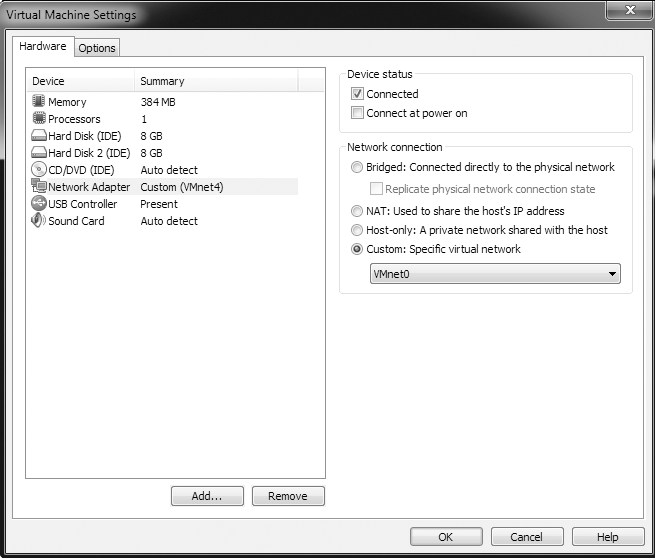
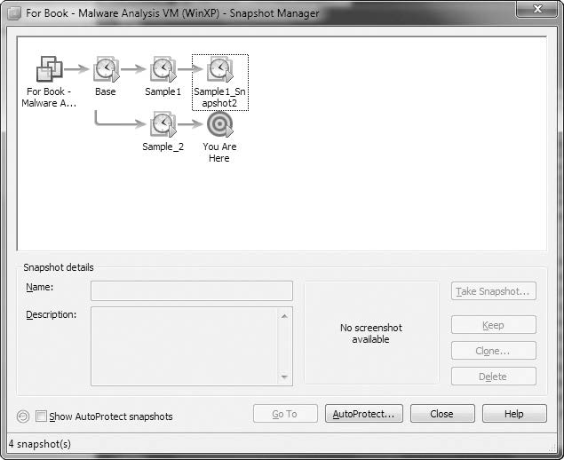

# Capitulo 2 - Analise de malware em maquinas virtuais

> Titulo original: *Malware Analysis in Virtual Machines*

> Navegacao: [Anterior](capitulo-01.md) | [Indice](README.md) | [Proximo](capitulo-03.md)

## Topicos

- Por que criar um ambiente seguro antes da analise dinamica
- Redes fisicas isoladas versus maquinas virtuais e trade-offs habituais
- Estrutura de uma VM (hospedeiro, convidado, aplicacoes)
- VMware Player, Workstation e alternativas; criar disco e SO convidado
- Instalacao de VMware Tools
- Opcoes de rede: sem NIC, apenas-hospedeiro, varias VMs no mesmo VMNet (Figura 2-4), servicos
- Liga Internet com bridged ou NAT quando fizer sentido e risco aceite
- Perifericos, USB automatico, snapshots e gestor de snapshots
- Transferencia de dados para o hospedeiro
- Anti-VM, falhas no proprio VMware, record/replay e conclusao

## Texto principal

Antes de correr malware para fazer analise dinamica, voce precisa de um ambiente seguro. Codigo novo pode surpreender: numa maquina de producao pode espalhar-se rapido pela rede e ser muito trabalhoso limpar por completo. Um ambiente segregado permite investigar malware sem meter a sua estacao nem sistemas vizinhos em risco dispensavel.

Pode usar fisicas isoladas ou maquinas virtuais. Um cenario classico sobre metal e a rede isolada por *air-gap*, sem ligacao a Internet nem a outras redes, para impedir que o programa se propague para fora do laboratorio.

Redes assim permitem testar comportamento relativamente realistico sem contaminar infraestrutura real. Custos aparecem de imediato: sem Internet grande parte das amostras nao conseguira descarregar modulos externos, comunicar comando e controlo ou receber payloads adicionais.

Depois dos testes, restaurar fisica limpa tambem incomoda mais do que regressar uma VM ao snapshot. Por esse motivo muitos profissionais usam imagens disco tipo Norton Ghost e restauracao automatica quando insistem em metal.

Motivo forte para trabalhar sobre hardware real: algumas familias comportam-se de forma diferente quando detetam virtualizacao. Na VM pode haver deteccao explicita ou heuristica suficiente para alterar o fluxo da amostra e despistar o observador.

Tudo somado, o padrao do livro e a analise dinamica dentro de VMs. Os paragrafos seguintes tratam esse fluxo sobre produtos VMware, por ser o exemplo central do texto original; o raciocinio aplica-se a outros hipervidores parecidos.

### A estrutura de uma VM

Uma maquina virtual e um computador simulado a correr por cima do SO hospedeiro, como sugere a Figura 2-1. Dentro existe um SO convidado com as suas aplicacoes. O codigo do convidado nao deve, em condicoes normais, atingir arquivos do hospedeiro. Se o convidado ficar ilegivel, reinstala o sistema dentro da VM ou carrega novamente uma imagem pronta.

> Figura 2-1: A esquerda, aplicacao a correr diretamente sobre a maquina fisica; a direita, aplicacoes do convidado dentro da VM, isoladas relativamente ao SO hospedeiro.
>
> 

A VMware oferece linha VMware Player gratuita suficiente para experimentar, mas faltam recursos indispensaveis a analistas serios. VMware Workstation, na geracao mencionada no livro original, cobre snapshots clonacao e gestao refinada pelo preco habitual de menos de duzentos dolares americanos. Ha alternativas como Parallels, Microsoft Virtual PC, Hyper-V e Xen conforme combinacao de sistemas hospedeiro e convidado e recurso tecnico disponivel.

Este capitulo assume que ja sabe iniciar instalacao de hipervidor quando precisar, os detalhes de cada ecra ficam ao encargo das guias da VMware. Ao aceitar parametros recomendados, normalmente ficara bem servido um disco dinamico de cerca de 20 GB: o ficheiro cresce a medida que enche o convidado. Instale primeiro o sistema operativo habitualmente uma variante Windows porque o mundo do malware estudado pelo livro ainda gravitava forte em torno Windows XP.

Depois de instalar o sistema, instalam-se as ferramentas de analise. O Apendice B lista ferramentas uteis. Em seguida instale VMware Tools pelo menu VMware e a opcao de instalar ferramentas: melhora rato teclado e integracao com pastas partilhadas e arrastar-e-largar, assunto que regressa quando falamos snapshots.

Malware habitualmente comunica pela rede. Para observar comportamento precisa configurar NIC de acordo com o cenario, ou bloqueando tudo ao exterior ou expondo apenas o estricamente util. Todas essas combinacoes aparecem num painel da VMware registrado pela Figura 2-2.

> Figura 2-2: Opcoes de configuracao rede para adaptadores virtuais.
>
> 

Pode configurar a VM sem qualquer conectividade de rede, mas na pratica isso so e aceitavel quando quer cortar trafego por completo: sem rede nao observa actividade maliciosa na interface. Para desligar na VMware, retire o adaptador de rede da VM ou use VM > Removable Devices para desligar o adaptador virtual.

Quando precisar de NIC mas sem WAN, use as opcoes da Figura 2-2. Pode ainda controlar se o adaptador liga automaticamente ao arranque com a caixa *Connect at power on*.

Rede apenas-hospedeiro cria uma LAN privada entre o SO hospedeiro e as VMs com essa opcao selecionada. E o modelo mais habitual em laboratorio: o specimen comunica apenas dentro dessa zona e nao envia pacotes pela interface fisica do desktop.

> NOTA: ao configurar o hospedeiro, mantenha o sistema atualizado caso o malware tente propagar-se. Configure um firewall restritivo entre hospedeiro e convidado para dificultar saltos para fora da VM. O firewall incluido no Windows XP a partir do Service Pack 2 e bem documentado e oferece protecao suficiente na maior parte dos casos. Mesmo com patches em dia, a propagacao ainda e possivel via zero-day contra o SO hospedeiro.

A Figura 2-3 resume o modelo apenas-hospedeiro: a VMware acrescenta NIC virtuais no hospedeiro e nos convidados, formando uma LAN interna ao trabalho experimental. A interface fisica do desktop pode manter ligacao a redes externas enquanto o trafego do convidado permanece no segmento apenas-hospedeiro.

> Figura 2-3: Rede apenas-hospedeiro na VMware (diagrama conforme texto original).

> _(Sem extraccao raster neste repositorio; consulte o PDF oficial.)_

Para coordenar varias VMs ao mesmo tempo agrupe-as num VMware Team (menus File e New Team). Com maquinas num team pode gerir energia e rede em bloco.

#### Varias VMs e rede isolada (Figura 2-4)

Arranjo frequente no texto: varias VMs ligadas ao mesmo VMNet interno, sem Internet nem ligacao direta ao hospedeiro, de modo que o malware comunica numa rede local que nao toca em sistemas importantes.

> Figura 2-4: Rede personalizada no VMware (duas VMs no mesmo VMNet)

> _(Sem extraccao raster neste repositorio; consulte o PDF oficial.)_

Em configuracao tipica ha duas maquinas virtuais ligadas entre si: uma para analisar o specimen, outra a fornecer servicos (DNS, HTTP, etc.) de que a amostra depende. O Capitulo seguinte apresenta ferramentas para simular esses servicos.

Para exercitar o specimen ao maximo, imite todos os servicos de rede de que ele depende. Por exemplo, malware que descarrega mais codigo por HTTP precisa de DNS para resolver o servidor e de um HTTP que responda; na VM de servicos correm os servicos necessarios para o dialogo que quer observar.

Por vezes faz sentido dar Internet ao convidado para observar comportamentos que so aparecem com WAN. Principais riscos: a maquina realizar accoes abusivas (infectar terceiros, integrar DDoS ou enviar spam) ou o autor notar ligacoes ao servidor de comando e controlo. Nunca ligue a Internet sem analise previa em modo offline; avance so se aceitar o risco.

Modo *bridged* faz a NIC do convidado aparecer na mesma rede Ethernet fisica que o adaptador do hospedeiro. Modo NAT faz o hospedeiro funcionar como router: partilha o seu acesso a Internet e traduz pedidos do convidado para que pareçam vir do IP do hospedeiro. E util quando a rede Wi Fi exige WPA ou WEP e o convidado nao consegue associar-se diretamente, ou quando a infraestrutura so autoriza certas placas: o trafego segue o adaptador do hospedeiro ja aceite.

Perifericos como CD-ROM e armazenamento USB em geral so podem estar ligados ao fisico ou ao convidado, nunca aos dois em simultaneo. Com a janela do convidado activa, dispositivos USB novos tendem a montar no convidado; isso e problematico com vermes USB. Em VM > Settings > USB Controller desmarque *Automatically connect new USB devices* para o hardware novo nao entrar no convidado sem confirmacao.

Snapshots capturam o estado completo num instante e permitem regressoes posteriores, analogas a um ponto de restauracao Windows. Na cronologia da Figura 2-5, as 08:00 tira um snapshot, corre malware ate cerca das 10:00 e reverte: o SO e aplicacoes voltam ao estado das 08:00 e tudo no meio desaparece como se nunca tivesse ocorrido.

Depois de instalar SO, ferramentas e rede, guarde um snapshot *baseline* limpo; use-o como referencia antes de cada sessao de analise.

Se estiver a meio de uma analise e quiser experimentar outra amostra sem perder o trabalho actual, o Snapshot Manager permite voltar a qualquer snapshot em qualquer altura, mesmo com ramificacoes. Exemplo do livro:

1. Ao analisar a amostra 1, frustra-se e quer testar outra.
2. Tira snapshot do estado da analise da amostra 1.
3. Volta a imagem base.
4. Comeca a analisar a amostra 2.
5. Tira snapshot para fazer uma pausa.

Ao regressar, pode abrir qualquer um dos snapshots; os estados sao independentes e so o espaco em disco limita quantos guarda.

> Figura 2-5: Cronologia ilustrativa de snapshots

> _(Sem extraccao raster neste repositorio; consulte o PDF oficial.)_

> Figura 2-6: VMware Snapshot Manager

> _(Sem extraccao raster neste repositorio; consulte o PDF oficial.)_

Antes de reverter, transfira para o hospedeiro o que precisa de conservar. Com VMware Tools em dois Windows, arrastar-e-largar entre convidado e hospedeiro e o metodo mais simples. Alternativa: pastas partilhadas VMware, visiveis nos dois lados como uma pasta Windows partilhada.

Ha material publico abundante sobre malware que deteta VMware. A empresa nao cataloga anti-virtualizacao como vulnerabilidade de produto; mesmo assim amostras podem mudar comportamento para frustrar analistas. O Capitulo 17 detalha tecnicas anti-VM.

Como qualquer software VMware ja teve vulnerabilidades exploraveis capazes de derrubar hospedeiro ou executar codigo hospedeiro; exemplos historico envolvem partilhas e arrastar-soltar. Mantenha produto corrigido com patches oficiais.

Mesmo com todas precaucoes risco residual permanece: nunca analise malware em estacoes criticas de producao.

Record/replay no Workstation grava a execucao ao nivel da CPU e reproduz depois com fidelidade total: cada instrucao da gravacao original volta a correr no *replay*, incluindo condicoes de corrida raras. Nao e apenas captura de video: pode interromper o *replay* e interagir. O livro volta a este tema no Capitulo 8.

### Conclusao

Fluxo que o livro associa a VMware:

1. Comecar com snapshot limpa sem specimen activo na VM.
2. Copiar specimen para o convidado.
3. Correr analise apenas dentro do convidado.
4. Transportar notas, capturas de ecra e dados para o hospedeiro fisico.
5. Reverter o convidado ao snapshot limpo.

Quando atualizar ferramentas ou sistema convidado, instale patches e capture um novo snapshot baseline. Ao longo deste livro, sempre que se fala em executar malware pressupoe-se que corre dentro de uma maquina virtual segura.

## Laboratorios

Este capitulo do livro em papel ajuda sobretudo a montar infraestrutura virtualizada; enunciados de laboratorio com ficheiros dedicados ficam nos materiais oficiais ou na edicao original. O Apendice C neste Markdown permanece apenas como orientacao resumida, sem gabaritos longos, conforme politica do projeto.

## Exercicios e desafios

- Releia a conclusao deste capitulo e escreva tres perguntas que faria a um colega sobre o tema.
- Opcional: laboratorios oficiais em VM isolada usando [PracticalMalwareAnalysis-Labs](https://github.com/mikesiko/PracticalMalwareAnalysis-Labs); gabaritos em [appendice-c.md](appendice-c.md).
- **Desafio:** ligue um conceito do capitulo a um IOC ou artefacto de disco/rede que procuraria num incidente real (sem executar malware nao confiavel).

