# Capitulo 3 - Analise dinamica basica

> Titulo original: *Basic Dynamic Analysis*

> Navegacao: [Anterior](capitulo-02.md) | [Indice](README.md) | [Proximo](capitulo-04.md)

## Topicos

- Analise **dinamica**: exame **apos** executar malware; segundo passo do processo; monitorizar durante a execucao ou inspecionar o sistema depois
- Quando usar: apos estatica basica esbarrar em ofuscacao, packing ou esgotamento de tecnicas estaticas; **riscos** para rede e sistema
- **Sandboxes** (GFI, Norman, ThreatExpert, etc.): relatorios PDF; submissao publica pode ser inaceitavel; limitacoes (CLI, C2, Sleep, anti-VM, DLL, OS)
- **Correr DLLs:** `rundll32.exe`, ordinais `#5`, flag PE DLL, servicos `InstallService` / `sc` / registro
- **Process Monitor (ProcMon):** captura, filtros, botoes de categoria, boot logging
- **Process Explorer:** arvore, cores, Properties, Verify, strings disco vs memoria, Dependency Walker, documentos PDF/Word
- **Regshot** (Listagem 3-1): comparacao de snapshots do registro
- **Rede falsa:** ApateDNS, Netcat (Listagem 3-2), Wireshark, **INetSim** (Listagem 3-3)
- **Walkthrough** `msts.exe` com diagrama de rede (Fig. 3-12 a 3-16)

## Texto principal

A **analise dinamica** e qualquer exame efetuado **depois** de executar o malware. No fluxo deste livro e o **segundo** grande passo: em geral realiza-se **depois** da analise estatica basica, quando esta atinge um **beco sem saida** (ofuscacao, packing, ou porque o analista ja esgotou as tecnicas estaticas disponiveis). Pode consistir em **monitorizar** o malware enquanto corre ou em **examinar** o sistema depois da execucao.

Ao contrario da analise estatica, a dinamica permite observar a **funcionalidade real** do malware: a existencia de uma string no binario **nao** garante que o ramo correspondente execute. Para um keylogger, a dinamica ajuda a localizar o arquivo de log, o tipo de registros e para onde os dados sao enviados; com **so** estatica basica isso e muito mais trabalhoso.

Apesar do poder da dinamica, deve ser feita **somente depois** de concluida a estatica basica adequada, porque **poe em risco** a rede e o sistema. A dinamica tambem tem **limitacoes**: nem todos os caminhos de codigo executam numa unica corrida. Malware com **linha de comandos** pode ativar funcionalidades diferentes por argumento; sem conhecer as opcoes, nao se examina dinamicamente **tudo**. A solucao passa por tecnicas dinamicas ou estaticas **avancadas** para forcar a execucao completa. Este capitulo cobre apenas **analise dinamica basica**.

### Sandboxes: abordagem rapida

Existem produtos **tudo-em-um** para dinamica basica; os mais populares usam tecnologia **sandbox**: mecanismo de seguranca para correr programas **nao** confiaveis num ambiente **seguro**, sem danificar sistemas "reais". Sandboxes sao ambientes **virtualizados** que muitas vezes **simulam** servicos de rede para o software testado se comportar de forma proxima do normal.

Sandboxes de malware citadas no livro incluem **Norman SandBox**, **GFI Sandbox** (antigo CWSandbox), **Anubis**, **Joe Sandbox**, **ThreatExpert**, **BitBlaze** e **Comodo Instant Malware Analysis**. Entre profissionais, Norman e GFI eram dos mais usados na epoca da obra.

Estas sandboxes produzem saida **facil de ler** e servem para **triage** inicial, desde que se aceite **submeter** o malware aos sites. Mesmo sendo automatizadas, pode ser **inaceitavel** enviar amostras com **informacao da empresa** para um site publico.

**NOTA:** Ha sandboxes **comerciais** para uso interno, mas sao **caras**. O capitulo mostra como obter informacao semelhante com ferramentas **gratuitas**. Se o volume diario de amostras for muito alto, pode valer a pena investir num pacote interno configuravel.

A maior parte das sandboxes funciona de forma parecida; o livro usa **GFI Sandbox** como exemplo. A **Figura 3-1** mostra o indice de um relatorio PDF gerado ao analisar um ficheiro; o relatorio inclui actividade de rede, ficheiros criados, resultado VirusTotal, etc.

> Figura 3-1: Resultados exemplo GFI Sandbox para `win32XYZ.exe`

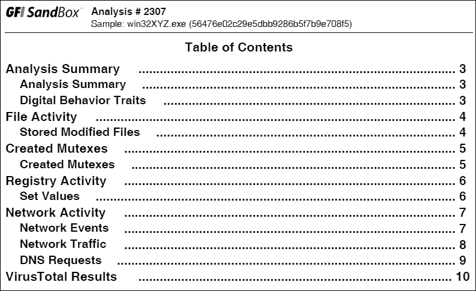

O numero de seccoes do relatorio **varia** consoante o que a analise encontra. Na figura aparecem **seis** blocos frequentes:

- **Analysis Summary:** informacao estatica e panorama de alto nivel da dinamica
- **File Activity:** ficheiros abertos, criados ou removidos por processo afetado
- **Created Mutexes:** mutex criados pelo malware
- **Registry Activity:** alteracoes ao registo
- **Network Activity:** actividade de rede (porta em escuta, pedidos DNS, etc.)
- **VirusTotal Results:** resultado de varrimento VirusTotal

#### Limitacoes das sandboxes

A sandbox **executa** o binario **sem** argumentos de linha de comandos. Se o malware precisar de opcoes, codigo que so corre com uma opcao **nao** executa. Se o specimen **espera** um pacote do servidor de comando e controlo antes de abrir um backdoor, o backdoor **nao** arranca na sandbox. O analista ou a sandbox podem **nao** esperar tempo suficiente: se o malware fizer `Sleep` por um dia, o evento perde-se. (Muitas sandboxes fazem hook a `Sleep` e encurtam o tempo; ha **mais** do que uma forma de "dormir", e as sandboxes nao cobrem todas.)

Outras limitacoes:

- Malware **detecta** maquina virtual e **para** ou **muda** comportamento; nem todas as sandboxes tratam disso
- Alguns specimen precisam de **chaves de registo** ou **ficheiros** especificos (dados legitimos, comandos, chaves de cifra)
- **DLLs** nao correm como `.exe`; exportacoes podem nao ser invocadas correctamente
- **SO** da sandbox pode nao ser o alvo (crash no XP, sucesso no Windows 7)
- A sandbox **nao** explica **semanticamente** o malware (ex.: dizer que e um dump de hashes SAM ou um backdoor com keylogger cifrado); essas **conclusoes** sao do analista

### Correr malware

Sem conseguir **iniciar** o specimen, a dinamica basica e inutil. Aqui focamos **EXE** e **DLL**. EXE costuma ser bastante **duplo clique** ou linha de comandos. **DLLs** sao mais dificeis porque o Windows **nao** sabe executar automaticamente (detalhe no Capitulo 7).

#### `rundll32.exe`

Incluido no Windows moderno; sintaxe:

```text
C:\> rundll32.exe DLLname,Export arguments
```

`Export` deve ser **nome** de funcao exportada ou **ordinal** da tabela de exportacao (PEview, PE Explorer, Capitulo 1). Exemplo:

```text
C:\> rundll32.exe rip.dll, Install
```

Funcoes exportadas **so** por ordinal chamam-se com `#` antes do numero:

```text
C:\> rundll32.exe xyzzy.dll, #5
```

Malware em DLL muitas vezes concentra logica em **`DllMain`** (ponto de entrada da DLL), executado ao **carregar** a DLL; por isso `rundll32` pode ja revelar comportamento. Alternativa extrema: limpar o bit **`IMAGE_FILE_DLL (0x2000)`** no campo `Characteristics` de `IMAGE_FILE_HEADER`, mudar extensao para `.exe` e forçar o Windows a tratar como executavel. Isto **nao** corre imports como num EXE normal; pode crashar, mas se o payload malicioso em `DllMain` correr, ainda obtem IOCs.

#### Instalacao como servico

Algumas DLLs instalam-se como servico, por vezes com export tipo `InstallService` (exemplo `ipr32x.dll`):

```text
C:\> rundll32 ipr32x.dll,InstallService ServiceName
C:\> net start ServiceName
```

`ServiceName` deve corresponder ao que o malware espera. `net start` inicia o servico no Windows de teste.

**NOTA:** Se existir `ServiceMain` mas **nao** haja `Install` / `InstallService` conveniente, instale manualmente com **`sc`** ou edite o registo para um servico **nao** usado e depois `net start`. Entradas em `HKLM\SYSTEM\CurrentControlSet\Services`.

### Monitorizacao com Process Monitor (ProcMon)

O **Process Monitor** (ProcMon) monitoriza registo, sistema de ficheiros, rede, processo e thread. Combina **FileMon** e **RegMon**. Apesar de captar muitos dados, **nao** captura tudo: por exemplo pode falhar comunicacao user-mode com rootkit via **IOCTL**, e certas chamadas GUI como `SetWindowsHookEx`. Para **rede**, o livro recomenda **nao** depender so do ProcMon; usar **Wireshark** etc., porque o comportamento **varia** entre versoes do Windows.

**WARNING:** Use sempre **maquina virtual** isolada (Capitulo 2).

O ProcMon registra chamadas de sistema logo ao iniciar; numa maquina Windows podem ocorrer **dezenas de milhares** de eventos por minuto. O ProcMon guarda eventos em **RAM** ate parar; pode **esgotar** a memoria da VM. **Corra** por periodos **limitados**; **File - Capture Events** para parar. Antes da analise: **Edit - Clear Display** para limpar ruido; ligue captura, execute o malware, apos **alguns minutos** pare a captura.

#### Vista principal

Colunas configuraveis: sequencia, tempo, processo, operacao, caminho, resultado. **Duplo clique** numa linha mostra detalhe completo.

> Figura 3-2: Eventos ProcMon com `mm32.exe`

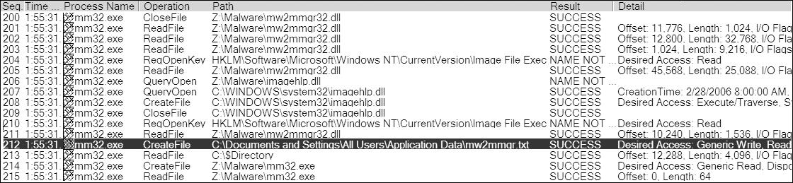

A coluna **Operation** mostra rapidamente acessos a registo e ficheiros. Um evento notavel: **CreateFile** para `C:\Documents and Settings\All Users\Application Data\mw2mmgr.txt` com **SUCCESS**.

#### Filtros

Filtrar **nao** apaga eventos da memoria; so altera a **vista**. Para filtrar: **Filter - Filter**. Escolha coluna (**Process Name**, **Operation**, **Detail**), comparador (Is, Contains, Less Than), include ou exclude. Por padrao quase tudo aparece; **reduza** o volume com filtros.

> Figura 3-3: Definir filtro no ProcMon

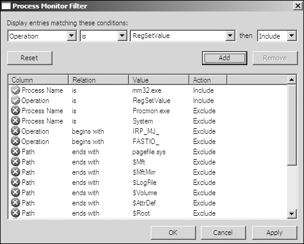

**NOTA:** Filtros Por padrao excluem `procmon.exe` e o **pagefile** (acesso frequente e pouco util).

Exemplo do livro: filtro em **Process Name** = `mm32.exe` e **Operation** = `RegSetValue` reduz milhares de eventos para poucas linhas e mostra escrita em `HKLM\SOFTWARE\Microsoft\Windows\CurrentVersion\Run\Sys32V2Controller`. **Duplo clique** no evento mostra os **dados** escritos (caminho do malware).

Se o specimen **extrair** outro executavel e o filho continuar a correr, os eventos **ainda** estao na captura; **mude** o filtro para o nome do filho e clique **Apply**.

> Figura 3-4: Botoes de filtro rapido (Registry, File system, Process, Network)

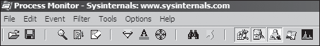

Os quatro icones filtram por categoria; Por padrao **todos** ativos; clique para **desligar** uma categoria e reduzir ruido.

**NOTA:** Se o malware actuar no **arranque**, use **boot logging** do ProcMon (driver de arranque) para captar eventos antes do login.

Interpretar a grelha exige **pratica**; muitos eventos sao arranque normal de executaveis.

### Process Explorer (`procexp`)

Ferramenta **gratuita** da Microsoft: gestor de processos poderoso que deve estar **aberto** durante a dinamica. Lista processos ativos, DLLs carregadas, propriedades, informacao global; permite terminar processo, explorar sistema, lancar e validar processos.

#### Vista em arvore

Mostra relacoes **pai-filho**. Na **Figura 3-5**, `services.exe` e filho de `winlogon.exe` (chaveta a esquerda).

> Figura 3-5: Process Explorer a examinar `svchost.exe` malicioso

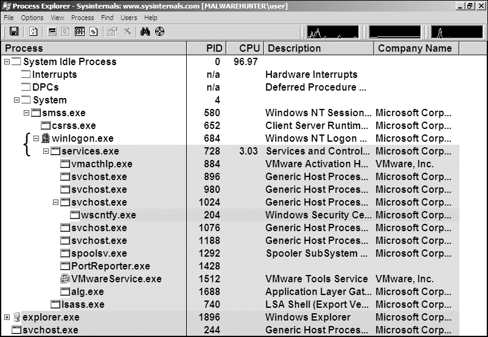

Colunas por padrao: **Process**, **PID**, **CPU**, **Description**, **Company**; atualizacao cerca de **uma vez por segundo**. Por padrao: servicos em **rosa**, processos normais em **azul**, processos **novos** em **verde**, terminados em **vermelho** (verde/vermelho sao **temporarios**). Durante analise de malware, **vigie** novos processos e investigue-os.

Com a janela de **DLLs** activa, ao clicar num processo ve-se todas as DLL carregadas. Pode mudar para a janela **Handles** (ficheiros, mutex, eventos, etc.).

**Duplo clique** no nome abre **Properties**: separador **Threads**, **TCP/IP** (ligacoes ou portas em escuta), **Image** (caminho no disco).

> Figura 3-6: Properties, separador Image

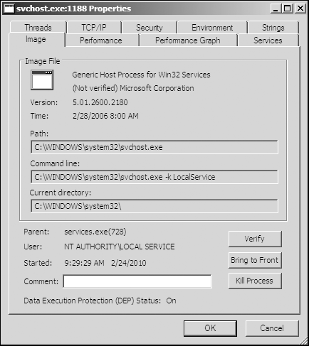

#### Opcao Verify

No separador **Image**, **Verify** confirma se o ficheiro no disco corresponde a binario **assinado pela Microsoft**. Util para detectar substituicao de ficheiros do sistema por malware.

**Verify** usa a imagem em **disco**, nao em **memoria**. Se o atacante usar **process replacement** (Capitulo 12), o processo legitimo corre mas a memoria e sobrescrita: o binario em memoria **diferente** do disco. O Verify pode passar **mesmo** quando o processo e malicioso em memoria.

#### Comparar strings (disco vs memoria)

No separador **Strings**, alterne entre strings da **imagem em disco** e strings na **memoria** do processo (botoes no canto inferior esquerdo, **Figura 3-7**). Listagens **muito** diferentes sugerem replacement. Exemplo: `FAVORITES.DAT` aparece varias vezes na **memoria** (`svchost.exe`) e **nao** no disco.

> Figura 3-7: Strings em disco (esquerda) vs memoria (direita) para `svchost.exe` activo

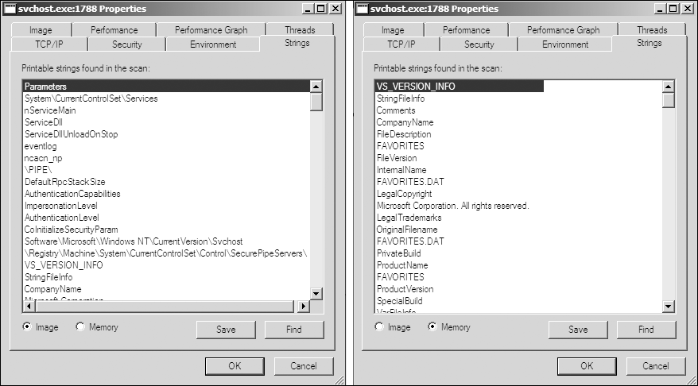

#### Dependency Walker

Botao direito no processo - **Launch Depends** abre `depends.exe` sobre o processo em execucao. **Find - Find Handle or DLL** ajuda a encontrar que processo usa uma **DLL** suspeita no disco. **Verify** valida o EXE no disco, **nao** cada DLL em tempo de execucao; compare a lista de DLLs no Process Explorer com os **imports** do Dependency Walker.

### Analisar documentos potencialmente maliciosos

Abra primeiro o **Process Explorer** e depois o **PDF** ou **Word** suspeito. Se o documento **lançar** processos, aparecem na lista; o separador **Image** indica o caminho do malware no disco.

**NOTA:** So **viewers vulneraveis** despoletam exploits; em laboratorio usam-se muitas vezes versoes **antigas** propositadas (Adobe Reader, Word). O metodo mais simples e **varios snapshots** da VM, cada um com versoes diferentes.

### Regshot: comparacao de snapshots do registo

O **Regshot** e uma ferramenta **open source** que tira dois snapshots do registo e **compara**. Fluxo: **1st Shot**, executar o malware e esperar alteracoes, **2nd Shot**, **Compare**.

> Figura 3-8: Janela do Regshot

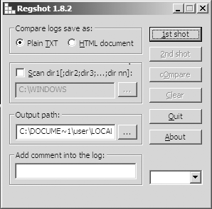

**Listagem 3-1:** extracto de resultados Regshot antes/depois do spyware `ckr.exe`

```text
Regshot
Comments:
Datetime: <date>
Computer: MALWAREANALYSIS
Username: username
----------------------------------
Keys added: 0
----------------------------------
----------------------------------
Values added:3
----------------------------------
HKLM\SOFTWARE\Microsoft\Windows\CurrentVersion\Run\ckr:C:\WINDOWS\system32\ckr.exe
...
----------------------------------
Values modified:2
----------------------------------
HKLM\SOFTWARE\Microsoft\Cryptography\RNG\Seed: 00 43 ...
...
----------------------------------
Total changes:5
----------------------------------
```

O valor em **Run** e **persistencia**. Alteracoes em **RNG\Seed** sao **ruido** habitual (gerador aleatorio). Como no ProcMon, e preciso **paciencia** para encontrar o que importa.

### Simular uma rede (falsa Internet)

Malware muitas vezes faz **beacon**; sem WAN real ainda assim se obtem indicadores (DNS, IP, assinaturas de pacotes). Combine as ferramentas abaixo com a rede virtual do Capitulo 2 e evite que o specimen detecte facilmente ambiente **demasiado** falso.

#### ApateDNS

Ferramenta **gratuita** (Mandiant): escuta **UDP 53** e responde a pedidos DNS com o **IP** que configurar; mostra pedidos em hex e ASCII. Defina o IP de resposta e a interface, **Start Server** (ajusta DNS para localhost), execute o malware e observe pedidos (ex.: **Figura 3-9**, dominio `evil.malwar3.com`).

Pode redireccionar para **127.0.0.1** ou para outra VM (ex.: servidor web Linux falso). A opcao **NXDOMAIN** ajuda quando o malware **percorre** varios dominios se o primeiro falhar.

> Figura 3-9: ApateDNS a responder a `evil.malwar3.com`

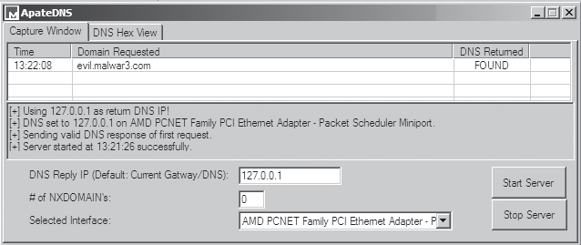

#### Netcat

**Listagem 3-2:** Netcat a escutar na porta 80 (exemplo **RShell** do livro; `nc -l` escuta; `-p 80` define a porta). O malware conecta porque o ApateDNS apontou o dominio para o host local. A sessao comeca como **HTTP POST** falso a `www.google.com` para **ofuscar**; depois aparece shell reversa.

```text
C:\> nc -l -p 80
POST /cq/frame.htm HTTP/1.1
Host: www.google.com
User-Agent: Mozilla/5.0 (Windows; Windows NT 5.1; TWFsd2FyZUh1bnRlcg==;
 rv:1.38)
Accept: text/html, application
...
Microsoft Windows XP [Version 5.1.2600]
(C) Copyright 1985-2001 Microsoft Corp.
Z:\Malware>
```

#### Wireshark

Sniffer **open source**: quatro areas na interface (**Figura 3-10**): caixa de **filtro** de visualizacao; **lista** de pacotes; **detalhe** do pacote seleccionado; **hex** ligado ao detalhe.

> Figura 3-10: Wireshark com DNS e HTTP

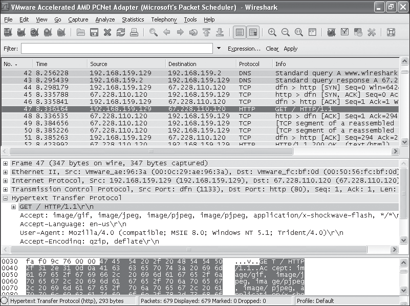

**Follow TCP Stream** (**Figura 3-11**) mostra a conversa completa com cores por lado.

> Figura 3-11: Follow TCP Stream

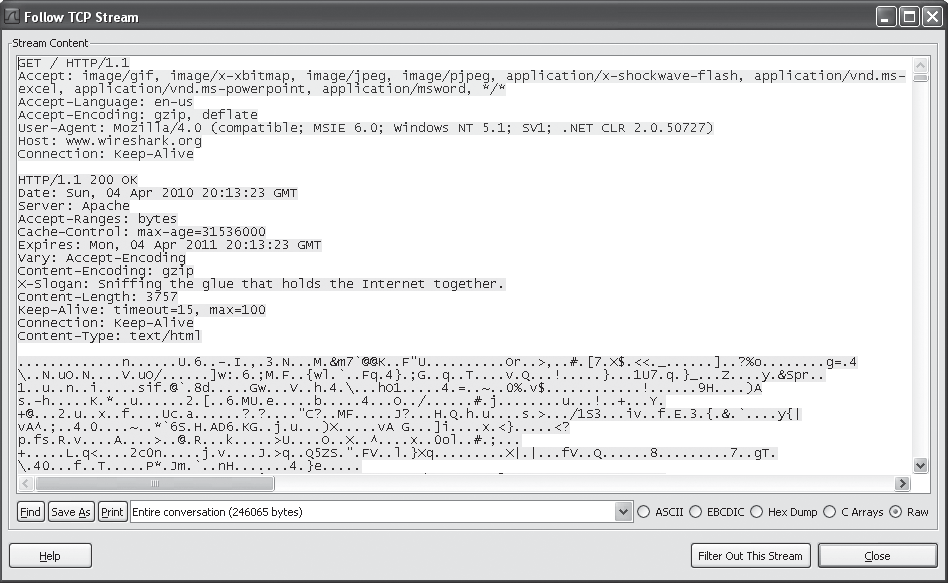

**Capture - Interfaces** escolhe interface; opcoes incluem modo **promiscuo** e **filtro** de captura.

**WARNING:** Wireshark teve muitas **vulnerabilidades**; corra apenas em ambiente **seguro**.

O Capitulo 14 aprofunda analise de protocolos e uso do Wireshark.

#### INetSim

Suite **Linux** gratuita que simula servicos Internet comuns. Instale numa **VM Linux** na mesma rede virtual que a VM Windows de analise.

**Listagem 3-3:** servicos Por padrao ao arrancar (extracto do livro)

```text
  * dns 53/udp/tcp - started (PID 9992)
  * http 80/tcp - started (PID 9993)
  * https 443/tcp - started (PID 9994)
  * smtp 25/tcp - started (PID 9995)
  * irc 6667/tcp - started (PID 10002)
  * smtps 465/tcp - started (PID 9996)
  * ntp 123/udp - started (PID 10003)
  * pop3 110/tcp - started (PID 9997)
  * finger 79/tcp - started (PID 10004)
  * syslog 514/udp - started (PID 10006)
  * tftp 69/udp - started (PID 10001)
  * pop3s 995/tcp - started (PID 9998)
  * time 37/tcp - started (PID 10007)
  * ftp 21/tcp - started (PID 9999)
  * ident 113/tcp - started (PID 10005)
  * dummy 1/udp - started (PID 10020)
  * dummy 1/tcp - started (PID 10019)
  ...
```

Por padrao pode devolver **banner** tipo **Microsoft IIS** se alguem fizer scan. **HTTP/HTTPS:** responde com ficheiros plausiveis (ex.: **JPEG** formatado) para pedidos arbitrarios, evitando **404** e mantendo o malware a correr. registra pedidos e ligacoes. **Dummy service:** registra dados recebidos em **qualquer** porta nao coberta por outro modulo; util para trafego para portas **nao** standard.

### Ferramentas basicas na pratica

Ordem sugerida:

1. ProcMon com filtro no nome do executavel; **Clear Display** antes de correr o specimen.
2. Process Explorer aberto.
3. Regshot: **primeiro** snapshot.
4. Rede: INetSim (Linux) + ApateDNS no Windows.
5. Wireshark a capturar.

> Figura 3-12: Diagrama de rede virtual (Windows 192.168.117.170, DNS 127.0.0.1, ApateDNS redirecciona para Linux 192.168.117.169 com INetSim em 80, 443, 21, etc.)

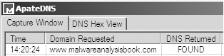

#### Walkthrough `msts.exe`

1. **ApateDNS:** pedido DNS a `www.malwareanalysisbook.com` (**Figura 3-13**).

> Figura 3-13: Pedido ApateDNS

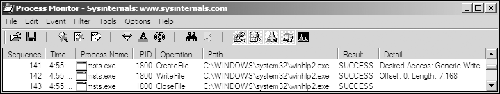

2. **ProcMon:** **CreateFile** / **WriteFile** copiam o binario para `C:\WINDOWS\system32\winhlp2.exe` (identico a `msts.exe`) - **Figura 3-14**.

> Figura 3-14: ProcMon com filtro `msts.exe`

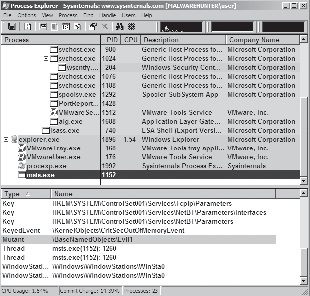

3. **Regshot:** valor **Run** `winhlp` apontando para `winhlp2.exe`.

4. **Process Explorer:** mutex **Evil1** (**Figura 3-15**); mutexes sao discutidos no Capitulo 7 e podem servir de **impressao digital**.

> Figura 3-15: Process Explorer com `msts.exe` activo

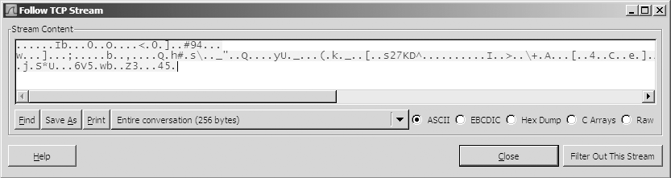

5. **INetSim:** log mostra ligacao a **443**; erros **SSL** indicam protocolo **nao** standard sobre a porta HTTPS:

```text
[https 443/tcp ...] connect
Error setting up SSL: SSL accept attempt failed ...
unknown protocol
```

6. **Wireshark:** fluxo TCP na 443 com dados aparentemente **aleatorios** - protocolo **proprietario** (Figura 3-16 no livro: **Follow TCP Stream**). Repetir execucoes para ver **padroes** nos primeiros pacotes; assinaturas de rede no Capitulo 14.

> Figura 3-16: Wireshark com protocolo de rede proprietario (ver PDF; raster opcional em `imagens/`).

## Conclusao

A analise dinamica basica **confirma** e **complementa** a estatica. As ferramentas deste capitulo sao em grande parte **gratuitas** e **faceis**, e fornecem muito detalhe.

As limitacoes sao claras: perceber **por completo** o componente de rede de `msts.exe` exigiria **engenharia reversa** do protocolo. O passo seguinte e **analise estatica avancada** com desassemblagem (Capitulo 4).

## Laboratorios (perguntas)

### Lab 3-1

Analise `Lab03-01.exe` com ferramentas de analise dinamica basica.

1. Quais sao os imports e as strings deste malware?
2. Quais sao os indicadores **baseados em host**?
3. Existem assinaturas **uteis baseadas em rede**? Se sim, quais?

### Lab 3-2

Analise `Lab03-02.dll` com analise dinamica basica.

1. Como pode fazer o malware **instalar-se**?
2. Como o faria **correr** apos a instalacao?
3. Como encontrar o **processo** sob o qual o malware esta a correr?
4. Que **filtros** configuraria no ProcMon para obter informacao?
5. Quais sao os indicadores baseados em host?
6. Existem assinaturas uteis baseadas em rede?

### Lab 3-3

Execute `Lab03-03.exe` em ambiente seguro com monitorizacao dinamica basica.

1. O que nota ao monitorizar com **Process Explorer**?
2. Consegue identificar **modificacoes em memoria** em tempo real?
3. Quais sao os indicadores baseados em host?
4. Qual e o **proposito** deste programa?

### Lab 3-4

Analise `Lab03-04.exe` com analise dinamica basica (aprofundado nos laboratorios do Capitulo 9).

1. O que acontece quando corre este ficheiro?
2. O que causa o **obstaculo** na analise dinamica?
3. Existem **outras** formas de correr este programa?

## Exercicios e desafios

- Releia a conclusao deste capitulo e escreva tres perguntas que faria a um colega sobre o tema.
- Opcional: laboratorios oficiais em VM isolada usando [PracticalMalwareAnalysis-Labs](https://github.com/mikesiko/PracticalMalwareAnalysis-Labs); gabaritos em [appendice-c.md](appendice-c.md).
- **Desafio:** ligue um conceito do capitulo a um IOC ou artefacto de disco/rede que procuraria num incidente real (sem executar malware nao confiavel).
