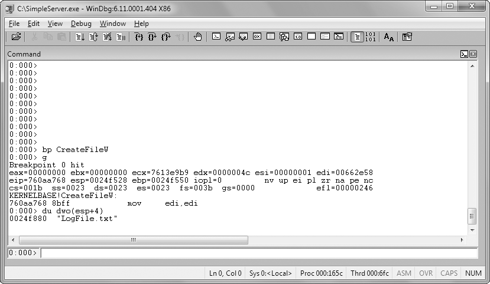
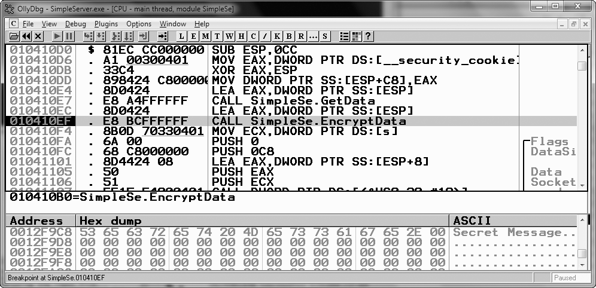

# Capitulo 8 - Debugging

> Titulo original: *Debugging*

> Navegacao: [Anterior](capitulo-07.md) | [Indice](README.md) | [Proximo](capitulo-09.md)

## Topicos

- Debugger: medir e controlar execucao, visao dinamica vs snapshot do disassembler
- Debuggers em nivel de codigo-fonte vs assembly; kernel vs user mode
- Iniciar no debugger ou anexar a processo; single-stepping; step-over e step-into
- Breakpoints: software (`INT 3`/`0xCC`), hardware (DRx, limite de quatro enderecos), condicionais
- Excepcoes: first-chance vs second-chance; INT 3, single-step (trap flag), falhas de memoria, instrucoes privilegiadas
- Alterar flags, EIP e patches em tempo de execucao; forcar caminhos (exemplo LCID / locale)

## Texto principal

Debugger e software ou hardware para testar ou examinar execucao de outro programa. Ajuda desenvolvimento (bugs iniciais) e oferece visao interna entre entrada e saida. Projetado para mensurar e controlar estado interno e fluxo da CPU.

Disassembler da snapshot estatico logo antes da primeira instrucao; debugger mostra programa em movimento, por exemplo valores de memoria mudando ciclo a ciclo. Em analise de malware, esse controle permite ver cada endereco/registo/argumento e ate alterar comportamento pontualmente (variavel, EIP, valores de retorno de API).

Nos dois proximos capitulos entram OllyDbg e WinDbg; aqui ficam conceitos comuns.

### Debuggers em nivel de codigo-fonte vs assembly

Source-level debugger (habitual em IDE) para em linhas de fonte, inspeciona variaveis internas, passo a passo sincrono com codigo alto nivel.

Assembly-level (low-level) opera sobre mnemonicos/enderecos; um passo por instrucao, breakpoints em enderecos especificos, dumping de locais arbitrarios. Analistas de malware usam muito porque nao existe fonte.

### Debugging kernel vs user mode

Kernel e mais arduo: em geral dois sistemas, um roda debugger e outro codigo sob teste (kernel unico; se kernel parado em breakpoint, aplicativos param). User mode usualmente mesmo host para debugger e para o processo-alvo isolado pelo OS.

Ha kernel debugger single-machine historicamente incomum (`SoftIce` abandonado ~2007). Ferramentas: `WinDbg` e o debugger popular tambem kernel; `OllyDbg` e padrao em user mode malware mas nao faz kernel debugging. `IDA Pro` inclui debugger, porem ergonomia menor que OllyDbg para esse fluxo.

### Usando um debugger

Dois fluxos:

1. Lancar programa ja sob debugger: carrega, para imediatamente antes do entry point, controle total.
2. Attach a processo em execucao: todas as threads pausam; util para processo contaminado ou ponto medio de ciclo.

### Single-stepping

Executar uma instrucao e devolver ao debugger. Revela todo detalhe, mas usar com selecao (!) em programa grande senao atravanca dias.

Listagem 8-1 (loop XOR decodifica string sobre `DWORD_00406904`, contador `0x0d`):

```
mov edi, DWORD_00406904
mov ecx, 0x0d
LOC_040106B2:
xor [edi], 0x9C
inc edi
loopw LOC_040106B2
...
DWORD:00406904: F8FDF3D0
```

> Listagem 8-1: Percorrer codigo com passo-a-passo

Sem contexto ASCII; passando loop no `WinDbg`/`OllyDbg` ve-se evolucao (Listagem 8-2, trecho SNIP intermediario omitido ate):

```
...
4C6F6164 4C696272 61727941 00 (LoadLibraryA.)
```

> Listagem 8-2: Memoria vista a cada volta do loop XOR

Um byte XOR revela texto `LoadLibraryA`, dificil de ver so com estatica.

### Step-over vs step-into

Step-into atravessa `call` ate primeira instrucao do filho; step-over faz `call` completo e pausa ja na instrucao seguinte ao `call`. Algumas chamadas nunca retornam; step-over perdido faz debugger nao recuperar (reinicie e entre com step-into nesse `call`). Step-into repetido descendente perde rumo (`LoadLibrary`: use step-out ate `ret` onde existir).

> NOTA: gravacao replay `VMware` ajuda quando step-over atravanca subrotina infinita: grave sessao desde o comeco, quando travar finalize gravacao, volte antes do step-over equivocado e repita entrando dentro.

### Breakpoints para pausar

Programa em breakpoint diz-se *broken*: registros e dumps em execucao plena ficam incompativeis porque mudam sempre.

Listagem 8-3 `call eax` anonimo ao disassembler estatico: breakpoint antes resolve destino pela imagem ao vivo de `EAX`.

```
00401008   mov     ecx, [ebp+arg_0]
0040100B   mov     eax, [edx]
0040100D   call    eax
```

> Listagem 8-3: Chamada indireta via EAX

Listagem 8-4 monta nome e chama `CreateFileW`; estaticamente rastrear filename e penoso mesmo com IDA.

```
...
00401055   call    CreateFileW ; CreateFileW(x,x,x,x,x,x,x)
```

> Listagem 8-4: Determinar arquivo com breakpoint em CreateFileW

Breakpoint no call deixa ler stack antes do thunk: primeiro parametro vira texto.

> Figura 8-1: Usar breakpoint em CreateFileW e examinar primeiro parametro na pilha com WinDbg (comandos no capitulo 10).



Exemplo arquivo `LogFile.txt`: debugger acelera descoberta frente IDA sozinho.

Cenario malware + PCAP cifrado: achar chamada send e rotina crypto; antes de XOR colocamos breakpoint ante `EncryptData` (marcador Listagem 8-5) e observamos plaintext no buffer:

```
...
004010EF   call    EncryptData
004010F4   mov     ecx, s
...
00401107   call    ds:Send
```

> Listagem 8-5: Ver dados antes de cifrar

> Figura 8-2: Dados em memoria antes da chamada a EncryptData na janela OllyDbg (ASCII mostra mensagem exemplo Secret Message).



### Tipos de breakpoint

Software execution breakpoint (padrao F2/`INT 3` substitui primeiro byte pela `0xCC`; OS despacha execao ao debugger). Self-modifying code ou scans de integridade apagam ou detectam `0xCC`. Ilimitados em user mode na pratica; kernel pode ter cortes extras.

**Tabela 8-1:** desmontagem e *dump* de memoria da mesma funcao com *breakpoint* activo (adaptado do livro).

| Vista de desmontagem | Dump de memoria |
|----------------------|-----------------|
| `00401130 55 push ebp` | `00401130 CC 8B EC 83 ...` (primeiro byte `0xCC` no dump real) |
| `00401131 8B EC mov ebp, esp` | continuacao dos bytes seguintes alinhados ao codigo |

O primeiro `push ebp` corresponde ao opcode `0x55`, mas com *breakpoint* por software o primeiro byte na RAM e `0xCC` (`INT 3`). A janela de desmontagem do debugger mostra muitas vezes a instrucao original (`push ebp`) para nao confundir; um *dump* feito por outro programa ou fora do debugger ve `0xCC`. Codigo auto-modificavel ou verificacao de integridade pode apagar o *breakpoint* ou detectar o patch.

Hardware via DR0-DR3 + DR7: nao mexe bytecode; permite break-on-access read/write/exec; apenas quatro enderecos; malicioso pode `mov` registros DR (mitigacao DR7 flag General Detect antes de outros `mov` que tocam registradores).

Condicionais: debugger recebe sempre a interrupcao, avalia expr (ex segundo arg `GetProcAddress` == `"RegSetValue"`), caso falso reinicia execucao silenciosa. Caro se instrucao quente (`GetProcAddress` global).

### Excecoes

Principal mecanismo do debugger recuperar fluxo: *breakpoints* tambem sao excepcoes; alem disso, acessos a memoria invalidos, divisao por zero, etc. Excepcoes nao sao exclusivas de malware: aparecem em bugs (por isso os debuggers as tratam), mas tambem em programas normais com SEH sem debugger.

**Primeira e segunda chance:** com debugger ligado, a excepcao para o programa e o debugger recebe **primeira oportunidade**. O debugger pode tratar ou passar ao programa; se existir *handler* registado (ex.: divisao por zero na calculadora com mensagem ao utilizador), esse codigo corre depois. Se a aplicacao nao tratar, o debugger recebe **segunda oportunidade**: sem debugger a app terminaria; com debugger deve decidir. Em malware, primeira chance e muitas vezes ruido intencional (anti-debug, capitulos 15 e 16). Segunda chance nao se ignora: ou ha bug, ou o *sample* nao tolera o ambiente.

### Excepcoes comuns

**INT 3:** tratamento especial no debugger; o SO trata como qualquer outra excecao. Programas podem ter *handler* proprio; com debugger, este ve primeiro.

**Single-step:** implementado com uma flag no registo de flags (*trap flag*): uma instrucao e depois excepcao.

**Violacao de acesso a memoria:** endereco invalido ou proteccao de acesso impede leitura/escrita/execucao.

**Instrucoes privilegiadas:** so em modo privilegiado; fora disso gera-se excepcao.

> NOTA: modo privilegiado e o mesmo que *kernel mode*; modo nao privilegiado e *user mode*. Em documentacao de CPU usam-se muitas vezes esses termos. Exemplos de instrucoes privilegiadas: escrever hardware ou alterar tabelas de paginas.

### Modificar execucao

Debuggers alteram flags, ponteiro de instrucao (`EIP`/`RIP`) ou o proprio codigo.

**Saltar uma chamada:** *breakpoint* no `call`, depois colocar `EIP` na instrucao seguinte. Se a funcao for essencial, o programa pode falhar; se nao, continua.

**Chamar funcao sem saber quem chama:** por exemplo `encodeString` - colocar em `esp+4` um ponteiro para `"Hello World"`, `EIP` na primeira instrucao da funcao, e *single-step*. Destroi a pilha para o resto do fluxo, mas serve para observar o comportamento isolado.

### Modificar execucao na pratica (LCID / locale)

Exemplo real de *virus*: comportamento depende do idioma do sistema. Chines simplificado: desinstala-se sem dano. Ingles: *popup* com mensagem. Japones ou indonesio: sobrescreve o disco com lixo.

LCIDs de referencia: ingles `0x0409`, japones `0x0411`, indonesio `0x0421`, chines simplificado `0x0C04`. Para analisar o ramo japones/indonesio numa VM inglesa sem mudar o locale do SO: *breakpoint* onde o retorno de `GetSystemDefaultLCID` e guardado (ver Listagem 8-6), alterar `EAX` para `0x411` antes dos *branches*, e continuar. Use apenas MV descartavel.

**Listagem 8-6:** assembly que distingue configuracoes de idioma (no texto ingles do livro a discussao refere-se a esta listagem; a numeracao do PDF coincide com **Listagem 8-6**).

```text
00411349   call    GetSystemDefaultLCID
0041134F   mov     [ebp+var_4], eax
00411352   cmp     [ebp+var_4], 409h
00411359   jnz     short loc_411360
0041135B   call    sub_411037
00411360   cmp     [ebp+var_4], 411h
00411367   jz      short loc_411372
00411369   cmp     [ebp+var_4], 421h
00411370   jnz     short loc_411377
00411372   call    sub_41100F
00411377   cmp     [ebp+var_4], 0C04h
0041137E   jnz     short loc_411385
00411380   call    sub_41100A
```

`sub_411037` corresponde ao caminho ingles; `sub_41100F` a japones/indonesio; `sub_41100A` a chines simplificado.

## Conclusao

Debugging complementa desassembly quando estado dinamico, nomes arquivo, plaintext pre-crypto e caminhos raros de locale devem aparecer ao vivo; dominio de stepping, breakpoints (software/hardware/condicional) e excepcoes primeira e segunda chance e pre-requisito para OllyDbg e WinDbg aprofundados.

## Laboratorios

A edicao do livro usada nesta traducao **nao inclui laboratorios numerados ao fim do Capitulo 8**; os laboratorios de debugging aparecem nos Capitulos 9 (OllyDbg) e 10 (WinDbg). Use os exemplos deste capitulo como exercicios guiados no debugger e, para pratica completa, os ficheiros em [PracticalMalwareAnalysis-Labs](https://github.com/mikesiko/PracticalMalwareAnalysis-Labs).

## Exercicios e desafios

- Releia a conclusao deste capitulo e escreva tres perguntas que faria a um colega sobre o tema.
- Opcional: laboratorios oficiais em VM isolada usando [PracticalMalwareAnalysis-Labs](https://github.com/mikesiko/PracticalMalwareAnalysis-Labs); gabaritos em [appendice-c.md](appendice-c.md).
- **Desafio:** ligue um conceito do capitulo a um IOC ou artefacto de disco/rede que procuraria num incidente real (sem executar malware nao confiavel).

