# Capitulo 9 - OllyDbg

> Titulo original: *OllyDbg*

> Navegacao: [Anterior](capitulo-08.md) | [Indice](README.md) | [Proximo](capitulo-10.md)

## Topicos

- Historico: Oleh Yuschuk, uso inicial cracking, papel em malware; Immunity Debugger (fork 1.1); OllyDbg 2.0 reescrita 2010 ainda menos adotado
- Abrir exe/DLL ou anexar a processo; argumentos apenas no Open; breakpoints de arranque (WinMain vs system breakpoint vs TLS callbacks na 2.0)
- Quatro paineis classicos mais Memory Map (`View Memory`)
- Rebasing PE / colisoes de DLL e discrepancia IDA vs runtime (`manual load`, capitulo 5)
- Threads, stacks multipainel, controlo granular de execucao (tabela de atalhos)
- Breakpoints: software F2, condicionais, hardware, memoria (um bloco por vez); armadilhas anti-debug em step-over oculto
- Carregar DLL com `loaddll.exe`; `Debug Call DLL Export` apos inicializar em `DllMain`
- Trace reverso +/- , call stack, run trace Poison Ivy EIP fora modulo imagem
- Excepcoes, patching em memoria, copiar modificacoes para ficheiro em disco (`Copy to Executable`)
- Shellcode paste em heap privado e `New Origin Here`
- Plugins (`OllyDump`, `Hide Debugger`, `Command Line`, Bookmarks); PyCommands no ImmDbg

## Texto principal

`OllyDbg` e debugger x86 gratuito criado por Oleh Yuschuk; popular em analistas por ser gratuito, interface rica e extensibilidade por plugins. Historia confusa comecando em cenarios warez; comunidade malware adotou de forma dominante ate ascensao de alternativas 64-bit. `Immunity Debugger` compra base OllyDbg 1.1, corrige bugs, cosmetiza GUI e adiciona interpretador Python (`immlib`); quase todos temas capitulo aplicam-se a ambos, mas alguns plugins puramente Olly nao migram ate serem portados. OllyDbg 2.0 (2010) reimplementado desde zero, visto frequentemente beta, livro PMA referencia recurso novo quando aparece apenas na serie 2.x.

### Carregar malware

Fluxo habitual `File Open` com caminho opcional `Arguments`; depois dessa primeira carga nao volta a aceitar argumentos CLI externos (definicao unica inicial). Ou `File Attach` a PID existente quando ja ha infecao ativa. Por defeito para em entrada `WinMain` se localizavel, senao entry point declarado pelo cabecamento PE.

> NOTA: `OllyDbg` 2.0 pode opcionalmente partir em callbacks TLS antes do entry point habitual; capitulo 16 descreve anti-debug TLS.

Se attach cair dentro de DLL sistema, coloque breakpoint ao acesso de seccao `.text` do binario maligno para voltar rapido ao codigo util.

> Figura 9-1: Abrir executavel com argumentos de linha de comandos.

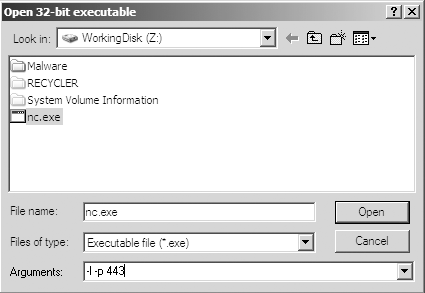

### Interface

Quatro janelas principais apos carga.

> Figura 9-2: Interface padrao OllyDbg.

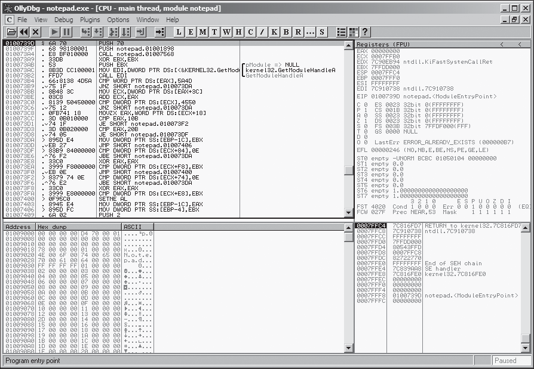

- Disassembler: instrucao corrente realcada; `Space` edita ou insere bytes/mnemonicos.
- Stack: topo da pilha thread actual; comentarios automaticos descrevendo argumentos empilhados antes de chamadas API.
- Registos: mudam de preto a vermelho quando instrucao anterior altera; `Modify` em contexto.

> Figura 9-3: Dialogo modificar registo.

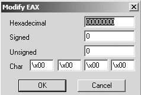

- Memory dump: `Ctrl-G` salta endereco; `Follow in Dump` desde disassembler; `Binary Edit` altera RAM.

Comentarios automaticos na janela da *stack* descrevem argumentos empilhados antes de chamadas API (ordem e nomes), o que poupa consultar manualmente a convencao de cada funcao.

### Memory Map e rebasing

`View Memory` lista blocos alocados (codigo, dados, DLLs empilhadas). Util para navegar layouts e etiquetas tipo stack thread principal (`Netcat nc.exe` exemplo livro).

> Figura 9-4: Memory map exemplo Netcat.

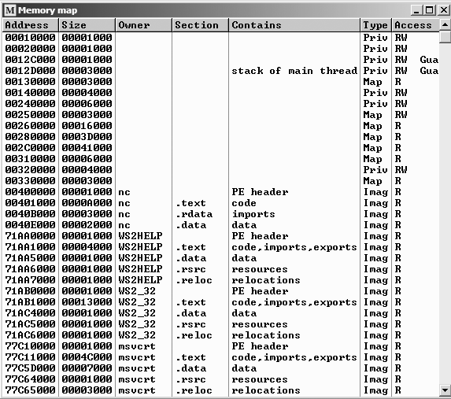

O *memory map* resume o *layout*: executavel com seccoes de codigo e dados, cada DLL com as suas seccoes, e pilhas de *thread* etiquetadas (ex.: *stack of main thread*). Duplo clique numa linha abre *dump* dessa regiao; menu contextual pode enviar para o disassembler.

PE possui imagem preferida `/ImageBase`; executaveis compiladores antigos muitos 0x00400000; DLLs terceiros frequentemente mesmo endereco pretendido causa relocacoes: loader move modulo e corrige ponteiros absolutos listados `.reloc`; instrucoes puramente relativas sobrevivem movimentacao.

```
mov eax, [ebp+var_8]
cmp [ebp+var_4], 0
jnz loc_0040120
mov eax, dword_40CF60      ; usa endereco absoluto - exige reloc
```

> Lista 9-1: Assembly que precisa entrada de relocacao.

Remover seccao reloc de DLL faz falha total se nao couber na base querida.

> Figura 9-5: DLL-B relocalizada porque colidiu DLL-A em 0x10000000.

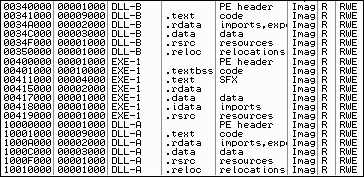

Quando IDA mostra RVA estatica diferente runtime OllyDbg, reprocesse IDA com carregamento manual (capitulo 5) ou aplique deltas mentais aos enderecos.

### Threads e pilhas

Malware multitarefa: `View Threads` lista estado (ativo, pausado, suspenso). OllyDbg single-thread UI: pause global, breakpoints, Play para filtrar caminho util. Menu contexto inclui `Kill Thread`.

> Figura 9-6: Janela Threads com cinco threads pausadas.

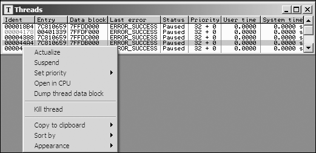

### Execucao e stepping

```text
Funcao            Menu                        Tecla    Botao
Run/Play          Debug Run                   F9
Pause             Debug Pause                 F12
Run to selection  Breakpoint Run to Selection F4
Run until return  Debug Execute till Return   Ctrl-F9
Run until user... Debug Execute till User...  Alt-F9
Step into         Debug Step Into             F7
Step over         Debug Step Over             F8
```

> Tabela 9-1: Atalhos frequentes execucao codigo.

`Execute till User Code` salta bibliotecas quando perdeu rumo no runtime importado. Step-over real coloca breakpoint oculto depois do `call`, corre ate `ret`. Se subrotina nunca retorna ou manipula endereco retorno (get-EIP trick), perde controlo; use cautela.

WARNING: codigo ofuscado raro pode sabotar stepping-over regressando estado errado ao debugger.

### Breakpoints OllyDbg

F2 toggle software breakpoints; persistem entre sessoes debug apos fechar programa alvo quando configurado assim; `View Breakpoints` lista estado.

Decryptores cordas: breakpoints finais antes de regressar cada chamada decoder permitem ler stack contendo texto claro apos varias iteracoes Play.

```
push offset "4NNpTNHLKIXoPm7iBhUAjvRKNaUVBlr"
call String_Decoder
...
```

> Lista 9-2: Padrao decoder com calls repetidos.

```text
Funcao                 Menu / atalho
Software               Breakpoint Toggle F2
Conditional            Breakpoint Conditional Shift-F2
Hardware execution     Breakpoint Hardware on Execution
Memory on access       Breakpoint Memory on Access (F2 em memoria)
Memory on write        Breakpoint Memory on Write
```

> Tabela 9-2: Tipos breakpoint suportados.

Condicional: expressao avaliada cada hit; zero continua execucao transparente.

Exemplo Poison Ivy: aloca grande shellcode com `VirtualAlloc`. Breakpoint entrada `VirtualAlloc`; expressao tipica `[ESP+8]>100` filtra apenas blocos grandes (tamanho segundo push na cdecl win32 mostrada na Figura pilha Fig 9-7 aplicada antes condicao Fig 9-8).

> Figura 9-7: Stack no inicio VirtualAlloc marcando parametros.

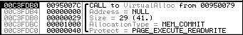

> Figura 9-8: Breakpoint condicional na primeira instrucao VirtualAlloc.

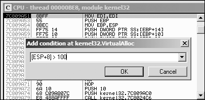

Hardware preserva opcode evitando patching 0xCC; apenas quatro registos DR disponiveis. Memoria: um breakpoint global (novo sobrescreve antigo); software altera permissoes pagina e pode ser pesado ou instavel; ideal para apanhar primeira execucao dentro seccao texto de DLL recem-mapeada (passos livro sobre Memory Map DLL).

### Carregar DLLs

`OllyDbg` usa `loaddll.exe` stub; por defeito quebra entry `DllMain`. Depois `Debug Call DLL Export` permite invocar exports com argumentos registados antes `Call`; `Pause after call` alternativa a breakpoints manuais; `Follow in Disassembler` segue corpo.

> Figura 9-9: Botao Play apos inicializar DllMain.

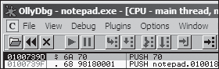

> Figura 9-10: Chamada export `ntohl` com argumento 0x7F000001.

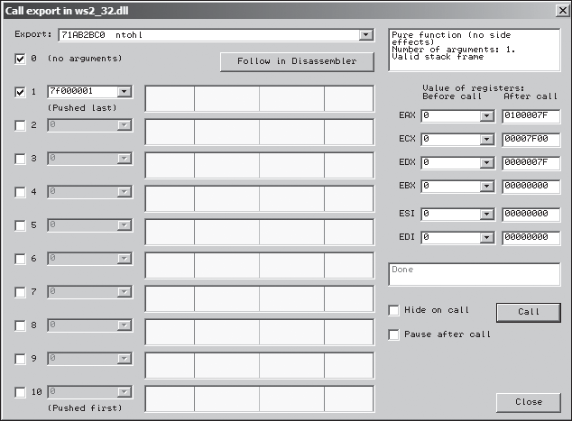

### Tracing

Teclas `-` e `+` retrocedem/avancam instrucoes gravadas durante Step Into/Over (limitado se nao entrou em caminhos). `View Call Stack` mostra cadeia chamadas; estado registos historico so fiavel com run trace activo.

Run trace grava sequencia completa com delta registos/flags. Metodos: seleccionar bloco disassembler `Run Trace Add Selection`; `Trace Into`/`Trace Over` ate breakpoint; `Debug Set Condition` para parar condicao e depois back trace.

WARNING: Trace Into/Over sem breakpoint tenta rastrear binario inteiro (memoria/tempo enormes).

Poison Ivy: condicao `EIP < 0x00400000` ou similar captura salto shellcode heap; depois `-` revela caminho preparacao.

> Figura 9-11: Tracing condicional capturando execucao heap.

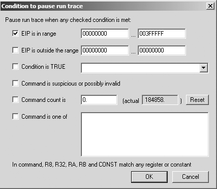

### Excepcoes e patching

Primeira oportunidade debugger: `Shift-F7` entra excepcao, `Shift-F8` step over, `Shift-F9` corre handler. Opcoes globais permitem repassar certas excepcoes directamente processo (util malware ruidoso).

> Figura 9-12: Opcoes tratamento excepcoes.

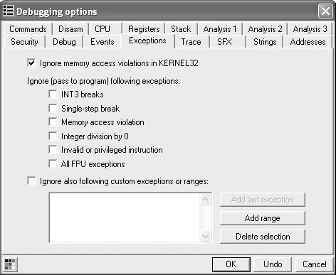

Patching: `Binary Edit` ou `Fill with NOPs` remove saltos indesejados (exemplo password JNZ). Alteracoes RAM temporarias; `Copy to Executable All Modifications` gera janela secundaria com `Save File` para persistir NOPs em disco.

> Figura 9-13: Preencher JNZ com NOPs via menu Binary.

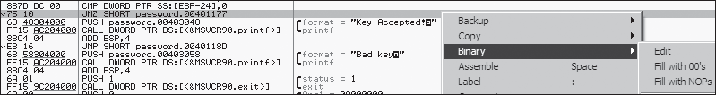

> Figura 9-14: Copiar patch vivo para ficheiro PE em dois passos.

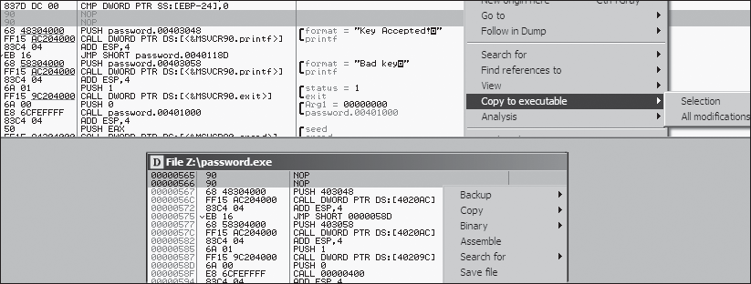

### Shellcode rapido

1. Copiar bytes shellcode editor hex.
2. Memory map escolher regiao Priv com zeros contiguos.
3. `Set Access Full Access` read/write/exec.
4. Memory dump seleccionar zeros suficientes `Binary Paste`.
5. `New Origin Here` no primeiro opcode shellcode.
6. Correr / single-step normalmente.

### Ajuda integrada e labels

`View Log` historico modulos carregados e hits BP. `View Watches` expressoes dinamicas (`Space`). Help descreve gramatica expressoes (ex `[EAX+ESP+4]`). Labels semelhantes IDA: `Label` renomeia endereco e propaga referencias.

> Figura 9-15: Label `password_loop` substituindo endereco simbolico.

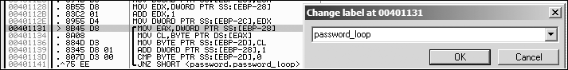

### Plugins e linha de comandos

Instalacao: copiar DLL para raiz Olly; aparecem em `Plugins`. Colecao legada `openrce.org` (URL livro). OllyDump reverte carregamento memoria para PE (unpacking capitulo 18).

> NOTA: escrever plugins nativos C pode ser moroso; preferir scripts Python ImmDbg conforme seccao seguinte.

`Hide Debugger` mascara `IsDebuggerPresent`, `FindWindow`, truques excepcao, `OutputDebugString` contra Olly.

`Command Line` plugin aproxima experiencia tipo WinDbg: `bp gethostbyname` exemplo Fig 9-17.

```text
Comando               Funcao breve
BP expr [,cond]       Software breakpoint condicional opcional
BC expr               Clear breakpoint
HW expr               Hardware exec
BPX label             Break todas chamadas etiqueta
STOP / PAUSE          Pausa
RUN                   Continua
G [expr]              Correr ate endereco
S / SO                Step into / Step over
D expr                Dump memoria
```

> Tabela 9-3: Comandos usuais linha comandos OllyDbg.

> Figura 9-16: Janela plugin OllyDump.

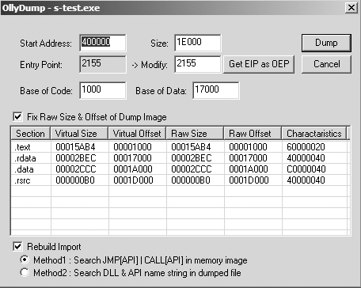

> Figura 9-17: `bp gethostbyname` revela hostname resolucao exemplo livro (`malwareanalysisbook.com`).

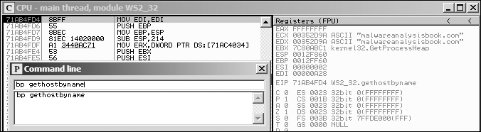

`Bookmarks`: `Bookmark Insert` contextual; navegacao rapida.

### Debugging scriptavel ImmDbg

`PyCommand` ficheiros pasta `PyCommands`; executar `!NomeScript`; `!lista` disponiveis.

```python
import immlib
def Patch_DeleteFileA(imm):
    delfileAddress = imm.getAddress("kernel32.DeleteFileA")
    if (delfileAddress <= 0):
        imm.log("No DeleteFile to patch")
        return
    imm.log("Patching DeleteFileA")
    patch = imm.assemble("XOR EAX, EAX \n Ret 4")
    imm.writeMemory(delfileAddress, patch)

def main(args):
    imm = immlib.Debugger()
    Patch_DeleteFileA(imm)
    return "DeleteFileA is patched..."
```

> Lista 9-3: PyCommand neutralizar `DeleteFileA`.

Referencia adicional: *Gray Hat Python* Justin Seitz (No Starch Press, 2009).

## Conclusao

OllyDbg entrega user-mode debugging completo: mapa memoria, breakpoints avancados, patch e tracing. Limitacao arquitectural kernel exige WinDbg capitulo seguinte para drivers e rootkits.

## Laboratorios (perguntas)

### Lab 9-1

Analise malware `Lab09-01.exe` com OllyDbg e IDA Pro (ja tocado labs capitulo 3).

1. Como instalar activamente esta amostra?
2. Que opcoes linha comandos existem e qual password exigida?
3. Como patch permanente OllyDbg remove exigencia password especial?
4. Indicadores baseados host?
5. Que accoes remotas comando-control pode receber?
6. Existem assinaturas rede uteis?

### Lab 9-2

Analise `Lab09-02.exe` so OllyDbg.

1. Que strings aparecem estaticamente?
2. Que acontece executar binario directo?
3. Como activar payload malicioso?
4. Que ocorre endereco 0x00401133?
5. Argumentos para subrotina 0x00401089?
6. Que dominio usa?
7. Que rotina encoding ofusca nome dominio?
8. Significado `CreateProcessA` em 0x0040106E?

### Lab 9-3

Analise `Lab09-03.exe` com OllyDbg e IDA; tres DLLs pedem mesmo image base simultaneo (`DLL1.dll` `DLL2.dll` `DLL3.dll`), enderecos diferem Olly vs IDA.

1. Que DLLs importa exe?
2. Base pedida cada DLL?
3. Bases efectivas quando debug OllyDbg para cada DLL?
4. Funcao importada `DLL1.dll` faz o que quando chamada pelo exe?
5. `WriteFile` grava que ficheiro?
6. Segundo argumento `NetScheduleJobAdd` vem de onde?
7. Tres dados misteriosos impressos: identificar dados `DLL1` `DLL2` `DLL3`.
8. Como carregar `DLL2.dll` IDA com mesmo endereco runtime OllyDbg?

## Exercicios e desafios

- Releia a conclusao deste capitulo e escreva tres perguntas que faria a um colega sobre o tema.
- Opcional: laboratorios oficiais em VM isolada usando [PracticalMalwareAnalysis-Labs](https://github.com/mikesiko/PracticalMalwareAnalysis-Labs); gabaritos em [appendice-c.md](appendice-c.md).
- **Desafio:** ligue um conceito do capitulo a um IOC ou artefacto de disco/rede que procuraria num incidente real (sem executar malware nao confiavel).

