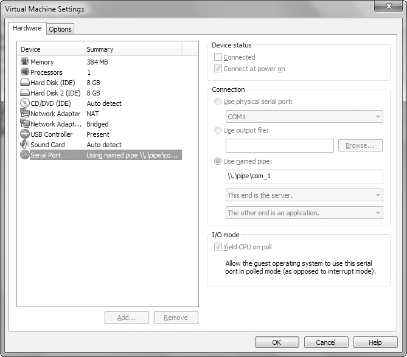
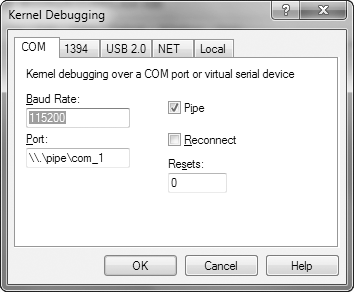
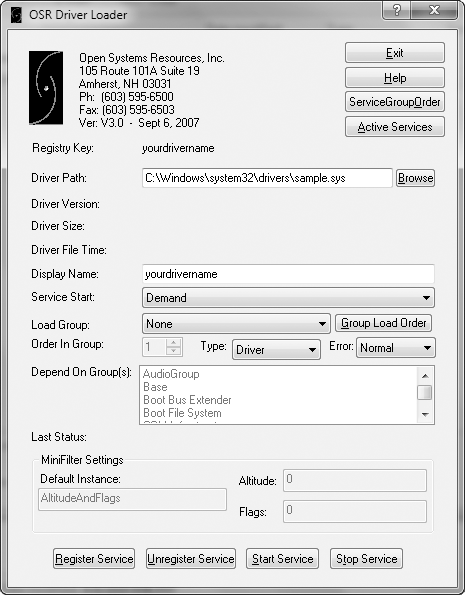

# Capitulo 10 - Kernel Debugging com WinDbg

> Titulo original: *Kernel Debugging with WinDbg*

> Navegacao: [Anterior](capitulo-09.md) | [Indice](README.md) | [Proximo](capitulo-11.md)

## Topicos

- Drivers kernel `DriverEntry`, objectos dispositivo, callbacks IRP (`DeviceIoControl`), caminho user-mode para kernel Fig 10-1
- Setup debugging dual-maquina (VM guest target + host WinDbg); porta serie virtual VMware; boot debug legacy vs BCDEdit moderno; carregar drivers teste (`OSR Driver Loader`)
- WinDbg comandos base: dumping memoria (`d`,`db`,`du`,`dwo`), breakpoints `bp`/`bu`/`$iment`, modulo `lm`, simbolos Microsoft `SRV*c:\websymbols*http://...`, pesquisas `x`/`ln`, estruturas `dt`
- Exemplo malware user installer servico kernel driver + comunicacao via `CreateFile` `\\.\...` + `DeviceIoControl`
- Rootkits SSDT hook `KeServiceDescriptorTable`; analise offsets fora modulo `ntoskrnl`; patching IRP MaiorDispatch inline hook exemplo livro
- Vetores interrupcao IDT e drivers suspeitos; ferramentas carregar driver sem assinatura (test signing / nointegritychecks contexto texto antigo Vista x64)

## Texto principal

`WinDbg`, debugger gratuito Microsoft, domina cenario kernel apesar de OllyDbg ganhar praticidade user-mode. Capitulo centra-se kernel (rootkits/drivers) mas muitos comandos servem user-mode remoto.

### Drivers e codigo kernel

Drivers executam no kernel, permanecem residentes, respondem pedidos aplicacionais indirectos via objectos dispositivo virtuais e filas IRP. Fluxo simplificado: aplicacao abre handle dispositivo (`F:` USB e objecto driver subjacente mesmo binary). `DriverEntry` primeiro callback (paralelo conceptual `DllMain`); regista tabelas funcoes em `DRIVER_OBJECT`; cria dispositivo nomeado user-space acessivel. Leitura arquivo user chama `ReadFile` eventualmente callback read do driver. Canal generico malware `DeviceIoControl` passa buffers input/output arbitrarios.

Calls user para driver atravessam varias camadas nucleo; tracing exige duas maquinas porque OS congelado quando kernel parado breakpoint.

> Figura 10-1: Fluxo pedido user-mode ate driver kernel.



> NOTA: alguns rootkits kernel nao expoem componente user significativo (sem device object publico) e executam solos.

Malware driver importa frequentemente `ntoskrnl.exe`/`hal.dll` para manipular estado interno mesmo sem hardware fisico.

### Configurar debugging kernel

Depurar o kernel e mais complexo que user-mode: quando o kernel esta parado no debugger, o SO fica congelado e nao pode correr um debugger na mesma maquina. Por isso o cenario habitual e **VMware** (ou equivalente) com duas maquinas logicas: **guest** (alvo) e **host** (WinDbg).

#### Boot com debug activo (exemplo Windows XP / boot.ini)

No guest, edite `C:\boot.ini` (ficheiro oculto; faca snapshot da VM antes). O livro mostra uma linha extra para arranque com kernel debugging:

**Listagem 10-1:** Exemplo de `boot.ini` modificado para activar kernel debugging

```text
[boot loader]
timeout=30
default=multi(0)disk(0)rdisk(0)partition(1)\WINDOWS
[operating systems]
multi(0)disk(0)rdisk(0)partition(1)\WINDOWS="Microsoft Windows XP Professional"
/noexecute=optin /fastdetect
multi(0)disk(0)rdisk(0)partition(1)\WINDOWS="Microsoft Windows XP Professional with Kernel Debugging"
/noexecute=optin /fastdetect /debug /debugport=COM1 /baudrate=115200
```

A ultima linha duplica a entrada de SO e acrescenta `/debug`, `/debugport=COM1` e `baudrate=115200`. No arranque seguinte o bootloader oferece as duas opcoes; deve escolher a entrada **with Kernel Debugging** quando quiser anexar o kernel debugger.

> NOTA: Arrancar com debug activo **nao** obriga a ligar o debugger; o SO deve funcionar sem debugger ligado.

Em sistemas modernos use `bcdedit` (ou equivalente) em vez de `boot.ini`; o principio e o mesmo: entrada de arranque com debug e porta COM virtual.

#### Porta serie virtual no VMware

1. VM - Settings para abrir definicoes.
2. Add - Serial Port.
3. Tipo: **Output to Named Pipe**.
4. Nome do pipe (exemplo livro): `\\.\pipe\com_1`; **This end is the server**; **The other end is an application**.
5. Activar **Yield CPU on poll**.

A sequencia exacta de menus varia com a versao do VMware (no livro: Workstation 7). A Figura 10-2 resume o resultado.

> Figura 10-2: Adicionar porta serie a uma maquina virtual.



#### Ligar o WinDbg no host

1. Abrir WinDbg.
2. File - Kernel Debug - separador **COM**: baud `115200` (ou o definido no boot), marcar **Pipe**, confirmar nome do pipe alinhado ao VMware.

> Figura 10-3: Iniciar sessao de kernel debugging com WinDbg.


Se o guest ja estiver a correr, a ligacao demora segundos; se nao, o debugger espera pelo arranque. Depois de ligado, convém **saida verbose** no kernel para ver drivers carregados e descarregados (ajuda a notar drivers maliciosos).

> NOTA: Em VMware para kernel debug e normal ver `KMixer.sys` a carregar e descarregar frequentemente; nao indica malware.

Snapshots da VM antes de editar boot; erros podem corromper o arranque.

### Comandos WinDbg uteis

A interface e sobretudo linha de comando; lista completa no Help do WinDbg.

#### Ler memoria

O comando `d` mostra memoria (dados ou stack). Sintaxe: `d` + *modo* + endereco.

**Tabela 10-1:** Opcoes comuns de leitura (WinDbg)

| Opcao | Descricao |
|-------|-----------|
| `da` | ASCII |
| `du` | Unicode |
| `dd` | palavras de 32 bits |

Exemplo: `da 0x401020` para ver string nesse offset.

O comando `e` altera memoria com a mesma convencao de tipos (`ea`, `eu`, etc.).

#### Operadores e `dwo`

Pode usar `+`, `-`, `*`, `/` em expressoes. O utilitario `dwo` desreferencia ponteiro 32-bit. Se o primeiro argumento de uma funcao for string wide, no breakpoint:

```text
du dwo(esp+4)
```

`esp+4` e o argumento; `dwo` obtem o ponteiro; `du` mostra a string.

#### Breakpoints

`bp` define breakpoints simples. Pode anexar comandos a executar ao bater o breakpoint, depois `g` (go) para continuar sem parar. Exemplo (imprime o segundo argumento de cada `GetProcAddress`):

```text
bp GetProcAddress "da dwo(esp+8); g"
```

Suporta scripts com `.if`, `.while`, etc.

> NOTA: O segundo argumento de `GetProcAddress` pode ser ordinal; o debugger tenta desreferenciar e mostra `????` em vez de crashar.

#### Listar modulos

`lm` lista modulos (EXE, DLL user, drivers kernel) com endereco inicial e final.

#### Simbolos Microsoft

Simbolos dao nomes a enderecos (funcoes e por vezes dados). Sem simbolos, `8050f1a2` e opaco; com simbolos pode aparecer como `MmCreateProcessAddressSpace`. Formato de referencia:

```text
modulo!NomeSimbolo
```

`ntoskrnl.exe` usa abreviatura **`nt`** (ex.: `u nt!NtCreateProcess`). `bu` permite **breakpoint diferido** em modulo ainda nao carregado, por exemplo `bu novoMod!funcaoExportada`. Com drivers: `bu $iment(nomeDriver)` coloca breakpoint no ponto de entrada antes do corpo do driver correr.

#### Pesquisa `x` e `ln`

`x nt!*CreateProcess*` lista simbolos com wildcard. `ln <endereco>` mostra o simbolo mais proximo de um endereco (util para saber para onde aponta uma chamada).

Exemplo de saida (livro):

```text
0:003> x nt!*CreateProcess*
805c736a nt!NtCreateProcessEx = ...
805c7420 nt!NtCreateProcess = ...
```

#### Estruturas: `dt`

**Listagem 10-2:** Informacao de tipo para `_DRIVER_OBJECT` (inicio da estrutura)

```text
0:000> dt nt!_DRIVER_OBJECT
   +0x000 Type             : Int2B
   +0x002 Size             : Int2B
   +0x004 DeviceObject     : Ptr32 _DEVICE_OBJECT
   +0x008 Flags            : Uint4B
   +0x00c DriverStart      : Ptr32 Void
   +0x010 DriverSize       : Uint4B
   ...
   +0x038 MajorFunction    : [28] Ptr32 long
```

O offset `DriverStart` indica onde o codigo do driver esta carregado na memoria.

**Listagem 10-3:** Sobrepor a estrutura a um endereco concreto (exemplo driver Beep do Windows)

```text
kd> dt nt!_DRIVER_OBJECT 828b2648
   +0x00c DriverStart      : 0xf7adb000
   +0x02c DriverInit       : 0xf7adb66c long Beep!DriverEntry+0
   ...
```

Se fosse malware, o analista inspeccionaria o codigo em `DriverInit` / `DriverEntry`, frequentemente o unico sitio sempre executado ao carregar.

#### Configurar simbolos (servidor Microsoft)

Path recomendado no livro:

```text
SRV*c:\websymbols*http://msdl.microsoft.com/download/symbols
```

`SRV` indica servidor; `c:\websymbols` e cache local; o URL e o servidor publico de simbolos. Sem Internet, pode baixar pacotes de simbolos para o SO/SP/arquitectura correctos (centenas de MB).

### Kernel debugging na pratica

Exemplo do livro: componente user instala um driver que le e escreve ficheiros **desde o kernel** (mais dificil de detectar; evita `CreateFile`/`WriteFile` obvios em user-mode). Em kernel usam-se `NtCreateFile` e `NtWriteFile` em vez das Win32.

#### Codigo user-space (IDA)

**Listagem 10-4:** Criar servico para carregar driver kernel (`CreateServiceA`; `dwServiceType` = 1 indica driver kernel)

```text
04001B42  push    [ebp+lpBinaryPathName]
04001B47  push    3               ; dwStartType
04001B49  push    1               ; dwServiceType  <- kernel driver
...
04001B59  call    ds:__imp__CreateServiceA@52
```

**Listagem 10-5:** Obter handle ao device object (`CreateFileA`; nome `\\.\FileWriterDevice`)

```text
040018A0  push    edi             ; lpFileName -> \\.\FileWriterDevice
040018A1  call    esi ; CreateFileA
```

**Listagem 10-6:** `DeviceIoControl` para enviar dados ao driver

```text
04001921  push    9C402408h       ; dwIoControlCode
04001926  push    [ebp+hObject]   ; hDevice
0400192C  call    ds:DeviceIoControl
```

#### Codigo kernel: driver object e tabela MajorFunction

Com WinDbg em kernel e **saida verbose**, ao carregar o driver aparece por exemplo `ModLoad: f7b0d000 f7b0e780 FileWriter.sys`.

**Listagem 10-7:** `!drvobj` para um driver carregado

```text
kd> !drvobj FileWriter
Driver object (827e3698) is for:
 \Driver\FileWriter
Device Object list:
826eb030
```

Se o nome do objecto driver falhar, use `!object \Driver` para percorrer o namespace (Capitulo 7).

Com o endereco do `DRIVER_OBJECT`, `dt nt!_DRIVER_OBJECT` mostra campos; para um endereco concreto:

**Listagem 10-8:** `DRIVER_OBJECT` no kernel (extracto)

```text
kd> dt nt!_DRIVER_OBJECT 0x827e3698
   +0x004 DeviceObject     : 0x826eb030 _DEVICE_OBJECT
   +0x00c DriverStart      : 0xf7b0d000
   +0x038 MajorFunction    : [28] 0xf7b0da06 long +0
```

A entrada `MajorFunction` aponta para a **tabela de funcoes maior** (uma por tipo de pedido IRP). Os indices estao em `wdm.h` com prefixo `IRP_MJ_`. Para saber que funcao trata `DeviceIoControl`, procure `IRP_MJ_DEVICE_CONTROL` (valor **0xe**). A tabela comeca em offset `0x38` do `DRIVER_OBJECT`. O deslocamento ate ao handler e:

`dd <endereco_DRIVER_OBJECT>+0x38+0xe*4 L1`

(0xe e o indice, `*4` porque cada entrada e ponteiro 32-bit; `L1` mostra um DWORD.)

**Listagem 10-9:** Localizar o handler de `IRP_MJ_DEVICE_CONTROL`

```text
kd> dd 827e3698+0x38+e*4 L1
827e3708  f7b0da66
kd> u f7b0da66
FileWriter+0xa66:
f7b0da66 6a68            push    68h
...
```

Pode analisar essa funcao no IDA ou por breakpoints no WinDbg.

**Listagem 10-10:** Trecho do handler (escrita de ficheiro com `ZwCreateFile` / `ZwWriteFile`)

```text
F7B0DCB1  push    offset aDosdevicesCSec ; "\\DosDevices\\C:\\secretfile.txt"
...
F7B0DCFC  call    ds:ZwCreateFile
...
F7B0DD18  call    ds:ZwWriteFile
```

No kernel usa-se `UNICODE_STRING`; `RtlInitUnicodeString` constroi strings kernel. O caminho para `ZwCreateFile` costuma ser `\\DosDevices\\C:\\...` (nome de objecto completo). `DeviceIoControl` nao e a unica via: `ReadFile` num handle de dispositivo invoca `IRP_MJ_READ` (indice **0x3**), pelo que o offset na tabela e `0x3*4` a partir do inicio de `MajorFunction`, nao `0xe*4`.

#### Encontrar driver objects a partir do user-space

Se nao tiver a certeza do driver, a aplicacao user identifica o **device** no `CreateFile`. Com `!devobj <nome>` obtem-se o device object e o ponteiro para o `DRIVER_OBJECT`.

```text
kd> !devobj FileWriterDevice
Device object (826eb030) is for:
 Rootkit \Driver\FileWriter DriverObject 827e3698
```

`!devhandles <handle_device_object>` percorre **todas** as tabelas de handles (demora) e lista processos user que tem handle ao device (ex.: `FileWriterApp.exe`).

#### Rootkits e hook da SSDT

Rootkits alteram o SO para esconder ficheiros, processos, rede, etc. A tecnica mais comum em malware antigo e **hook da System Service Descriptor Table (SSDT)** (tambem chamada dispatch table): a Microsoft usa-a para resolver chamadas ao kernel; indices vêm em `EAX` antes de `SYSENTER` / `INT 0x2E` (Capitulo 7).

**Listagem 10-11:** `NtCreateFile` em `ntdll` (extracto)

```text
mov     eax, 25h        ; NtCreateFile
mov     edx, 7FFE0300h
call    dword ptr [edx]
retn    2Ch
```

**Listagem 10-12:** Entradas da SSDT (extracto; `NtCreateFile` em 0x25)

```text
SSDT[0x25] = 8056d3ca (NtCreateFile)
```

Um rootkit **substitui** o ponteiro na SSDT para o seu codigo no driver; o handler filtra resultados (ex.: esconder ficheiros). Só hook em `NtCreateFile` pode nao esconder listagens de directorio; nos laboratorios aparecem rootkits mais realistas.

**Listagem 10-13:** SSDT com entrada fora de `nt` (hook)

```text
8050128c  8060be48 f7ad94a4 8056bc5c ...
```

Se o endereco nao cair dentro dos limites do modulo `nt`, e suspeito. `lm` mostra qual driver contem o endereco:

**Listagem 10-14:** `lm` para localizar modulo do hook

```text
kd> lm
...
f7ad9000 f7ada680   Rootkit    (deferred)
```

**Listagem 10-15:** Instalacao do hook (extracto; `MmGetSystemRoutineAddress`, procura de `NtCreateFile` na SSDT, escrita do novo ponteiro)

```text
push    offset aNtcreatefile
call    RtlInitUnicodeString
push    offset aKeservicedescr ; "KeServiceDescriptorTable"
...
call    MmGetSystemRoutineAddress
...
mov     dword ptr [ecx], offset sub_104A4
```

`MmGetSystemRoutineAddress` e o equivalente kernel a obter exports de `hal` e `ntoskrnl` (nao existe `GetProcAddress` em kernel).

**Listagem 10-16:** Funcao hook (extracto): chama filtro e depois salta para `NtCreateFile` original ou devolve erro

```text
call    sub_10486    ; avalia ObjectAttributes / nome ficheiro
test    eax, eax
jz      short
jmp     NtCreateFile
mov     eax, 0C0000034h   ; STATUS_OBJECT_NAME_NOT_FOUND
retn    2Ch
```

`0xC0000034` faz parecer que o ficheiro nao existe.

#### Interrupcoes e IDT

Drivers podem registar ISR com `IoConnectInterrupt`. A **IDT** guarda os handlers; `!idt` mostra para onde cada vector aponta.

**Listagem 10-17:** IDT normal (extracto)

```text
kd> !idt
37:   806cf728 hal!PicSpuriousService37
3d:   806d0b70 hal!HalpApcInterrupt
...
93:   826c315c i8042prt!I8042KeyboardInterruptService
```

Entradas para drivers **sem nome**, nao assinados ou suspeitos podem indicar rootkit.

#### Carregar drivers sem componente user

Se tiver apenas o `.sys`, use um carregador como **OSR Driver Loader** (Figura 10-4): registe o servico e arranque; requer registo no site OSR.

> Figura 10-4: Janela ferramenta OSR Driver Loader.



#### Vista, Windows 7 e x64

Desde **Vista** o arranque nao usa so `boot.ini`; **BCDEdit** configura debug de kernel e opcoes de arranque.

**PatchGuard** (x64, desde XP x64) impede patch ao codigo kernel, tabelas de servico, IDT, etc. Produtos de seguranca benignos tambem patchavam o kernel; por isso a funcao foi controversa. Se o debugger de kernel **liga no boot**, a proteccao nao activa o mesmo comportamento; anexar debugger **depois** do arranque em x64 pode causar crash.

Em **64-bit a partir de Vista**, drivers nao assinados nao carregam por defeito. Malware x64 kernel e raro; para laboratorio, `bcdedit` pode activar opcoes como `nointegritychecks` para permitir drivers nao assinados (ambiente de teste apenas).

### Conclusao

O WinDbg permite depurar o kernel e analisar drivers e rootkits quando o OllyDbg (user-mode) nao chega. Este capitulo cobriu funcionamento de drivers, ligacao do user ao kernel via IRP e tabela `MajorFunction`, comandos uteis, exemplos `ZwCreateFile`/`ZwWriteFile`, procura de device/driver com `!devobj` / `!devhandles`, hooks SSDT e vista da IDT, e notas sobre arranque moderno e x64. Os capitulos seguintes focam-se no comportamento do malware a nivel local e em rede.

## Laboratorios (perguntas)

### Lab 10-1

Executavel + driver `Lab10-01.exe` / `Lab10-01.sys`; driver deve residir `C:\Windows\System32` como maquina vitima.

1. Programa altera registo directamente? (confirmar com Procmon.)
2. Chamada user `ControlService`: consegue breakpoint WinDbg ver codigo kernel corrido por efeito dessa API?
3. O que programa faz globalmente?

### Lab 10-2

Ficheiro `Lab10-02.exe`.

1. Cria ficheiros? Quais?
2. Existe componente kernel?
3. Objectivo final?

### Lab 10-3

Par `Lab10-03.exe` + `Lab10-03.sys` com driver em `System32` original.

1. Funcionalidade?
2. Como parar apos executar?
3. Papel modulo kernel?

## Exercicios e desafios

- Releia a conclusao deste capitulo e escreva tres perguntas que faria a um colega sobre o tema.
- Opcional: laboratorios oficiais em VM isolada usando [PracticalMalwareAnalysis-Labs](https://github.com/mikesiko/PracticalMalwareAnalysis-Labs); gabaritos em [appendice-c.md](appendice-c.md).
- **Desafio:** ligue um conceito do capitulo a um IOC ou artefacto de disco/rede que procuraria num incidente real (sem executar malware nao confiavel).

