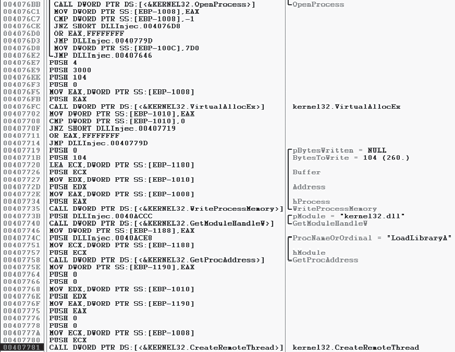
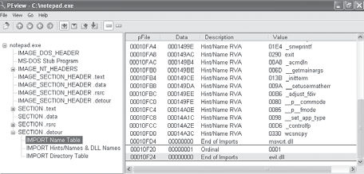

# Capitulo 12 - Lancamento encoberto de malware

> Titulo original: *Covert Malware Launching*

> Navegacao: [Anterior](capitulo-11.md) | [Indice](README.md) | [Proximo](capitulo-13.md)

## Topicos

- **Launchers:** recursos PE (`FindResource`, `LoadResource`, `SizeofResource`), privilegios de administrador
- **Injecao em processo:** `VirtualAllocEx`, `WriteProcessMemory`, `CreateRemoteThread`
- **Injecao de DLL:** enumeracao de processos, `OpenProcess`, padrao `LoadLibrary` (Listagem 12-1)
- **Injecao direta:** shellcode, duplo `VirtualAllocEx` / `WriteProcessMemory`
- **Substituicao de processo (process replacement):** `CREATE_SUSPENDED`, `ZwUnmapViewOfSection`, `SetThreadContext`, `ResumeThread` (Listagens 12-2, 12-3)
- **Injecao por hooks:** mensagens Windows, `SetWindowsHookEx`, `WH_CBT`, keyloggers (Listagem 12-4)
- **Detours:** seccao `.detours`, IAT, ferramenta `setdll`
- **Injecao APC:** `QueueUserAPC` / `LoadLibrary` (Listagem 12-5), kernel `KeInitializeApc` / `KeInsertQueueApc` (Listagem 12-6)

## Texto principal

A medida que sistemas e usuarios evoluiram, o malware tambem. Muita gente sabe listar processos no Gestor de Tarefas (onde o software malicioso costumava aparecer); por isso autores desenvolveram tecnicas para **misturar** o malware com o ambiente Windows normal e **esconde-lo**.

Este capitulo foca metodos de **lancamento encoberto**: reconhecer construcoes de codigo e padroes que ajudam a identificar formas comuns de arranque malicioso.

### Launchers

Como no capitulo anterior, um **launcher** (ou **loader**) prepara o malware proprio ou outro binario para execucao **imediata ou futura** e **encoberta**. O objetivo e que o comportamento malicioso nao seja visivel ao usuario.

Launchers **contem** muitas vezes o malware que carregam. O exemplo mais comum e um executavel ou DLL na **seccao de recursos** do PE.

A seccao de recursos do formato PE e usada pelo executavel e **nao** conta como parte "executavel" no sentido estrito. Conteudo normal: icones, imagens, menus, strings. Launchers guardam malware na seccao de recursos; ao correr, **extraem** executavel ou DLL embutido antes de lancar.

Se a seccao estiver **comprimida ou cifrada**, o malware extrai-a antes de carregar. Costuma aparecer uso de APIs de recursos como `FindResource`, `LoadResource` e `SizeofResource`.

Launchers muitas vezes precisam de **privilegios de administrador** ou **elevam-se** para os obter. Processos de usuario medio nao conseguem aplicar todas as tecnicas deste capitulo. A elevacao de privilegios foi tratada no capitulo 11; codigo de elevacao num launcher e outra pista para o identificar.

### Injecao em processo

A tecnica encoberta mais popular e **injecao em processo**: injecta codigo noutro processo em execucao e esse processo executa o codigo malicioso **sem o saber**. Serve para esconder comportamento e, por vezes, para contornar firewalls de host ou mecanismos de seguranca **por processo**.

Chamadas API comuns: `VirtualAllocEx` aloca espaco na memoria de um processo externo; `WriteProcessMemory` escreve dados nesse espaco. Este par e **essencial** as primeiras tres tecnicas de carregamento que se seguem.

### Injecao de DLL

**Injecao de DLL** e uma forma de injecao em processo em que um processo remoto e **forcado** a carregar uma DLL maliciosa. Injecta-se codigo que chama `LoadLibrary`, obrigando a DLL a carregar no contexto desse processo. Depois de carregada, o SO chama automaticamente `DllMain`, definida pelo autor da DLL. Essa funcao contem o codigo malicioso e tem o **mesmo** nivel de acesso que o processo comprometido. DLLs maliciosas muitas vezes tem pouco mais que `DllMain`; tudo o que fazem **parece** vir do processo vitima.

> Figura 12-1: Injecao de DLL - o launcher nao acede a Internet ate injectar em `iexplore.exe`.



Para injectar, o launcher precisa de um **handle** ao processo vitima. Forma mais comum: `CreateToolhelp32Snapshot`, `Process32First` e `Process32Next` para percorrer a lista de processos, obter o **PID** e depois `OpenProcess`.

`CreateRemoteThread` e muito usada: cria e executa uma **nova thread** no processo remoto. Parametros importantes: handle do processo (`hProcess`) de `OpenProcess`, ponto de entrada da thread injectada (`lpStartAddress`) e argumento (`lpParameter`). Por exemplo, `lpStartAddress` pode ser `LoadLibrary` e o argumento o nome da DLL maliciosa. Isso faz `LoadLibrary` correr no processo vitima com esse nome, carregando a DLL (desde que `LoadLibrary` exista no espaco do vitima e a **string** do caminho da DLL esteja **na mesma** memoria).

Autores usam normalmente `VirtualAllocEx` para criar espaco para a **string** do nome da DLL. `WriteProcessMemory` escreve essa string na memoria alocada. Antes de `CreateRemoteThread` falta ainda obter o endereco de `LoadLibrary` (por exemplo `GetModuleHandle("kernel32.dll")` e `GetProcAddress(..., "LoadLibraryA")`).

**Listagem 12-1:** pseudocodigo C para injecao de DLL

```text
hVictimProcess = OpenProcess(PROCESS_ALL_ACCESS, 0, victimProcessID);
pNameInVictimProcess = VirtualAllocEx(hVictimProcess, ..., sizeof(maliciousLibraryName), ...);
WriteProcessMemory(hVictimProcess, ..., maliciousLibraryName, sizeof(maliciousLibraryName), ...);
GetModuleHandle("Kernel32.dll");
GetProcAddress(..., "LoadLibraryA");
CreateRemoteThread(hVictimProcess, ..., LoadLibraryAddress, pNameInVictimProcess, ...);
```

Assume-se que o PID do vitima chega a `OpenProcess`. Com o handle, `VirtualAllocEx` e `WriteProcessMemory` alocam e escrevem o nome da DLL. `GetProcAddress` obtem `LoadLibrary`. `CreateRemoteThread` recebe o handle do vitima, o endereco de `LoadLibrary` e o ponteiro para o nome da DLL **no espaco do vitima**.

A forma mais simples de identificar injecao de DLL e reconhecer este **padrao** de chamadas API na desassemblagem do launcher.

O launcher **nunca** chama diretamente uma funcao "maliciosa": o codigo malicioso esta em `DllMain`, chamada pelo SO ao carregar a DLL. O objetivo do launcher e `CreateRemoteThread` para criar a thread remota `LoadLibrary` com o parametro da DLL.

> Figura 12-2: Vista de debugger com as seis chamadas do pseudocodigo (Listagem 12-1) visiveis na desassemblagem.


Quando encontra injecao de DLL, procure **strings** com o nome da DLL maliciosa e do **processo vitima**. Se nao aparecem junto ao bloco, foram referenciadas antes. O nome do processo costuma surgir numa funcao tipo `strncmp` ao determinar o PID. Para o nome da DLL pode definir-se breakpoint antes de `WriteProcessMemory` e inspeccionar a stack (ex.: valor de `Buffer`).

### Injecao direta

Semelhante a injecao de DLL: aloca e insere codigo na memoria remota, usando muitas das mesmas APIs. A diferenca e que **nao** ha DLL separada: o malware injecta **codigo diretamente** no processo remoto.

E mais **flexivel** que injecao de DLL, mas exige muito codigo personalizado para nao partir o processo hospedeiro. Pode injectar codigo compilado; com mais frequencia injecta **shellcode**.

Tres funcoes tipicas: `VirtualAllocEx`, `WriteProcessMemory`, `CreateRemoteThread`. Ha em geral **duas** chamadas a `VirtualAllocEx` e `WriteProcessMemory`: a primeira aloca e escreve os **dados** usados pela thread remota; a segunda aloca e escreve o **codigo** da thread. `CreateRemoteThread` recebe o endereco do codigo remoto (`lpStartAddress`) e os dados (`lpParameter`).

Como dados e funcoes usados pela thread remota tem de existir **no processo vitima**, compilacao normal nao basta: strings nao estao na `.data` habitual; pode ser preciso `LoadLibrary`/`GetProcAddress`. Ha outras restricoes. Injecao direta exige autores **habeis em assembly** ou shellcode **relativamente** simples.

Para analisar o codigo da thread remota, pode ser preciso depurar o malware e **despejar** todos os buffers escritos com `WriteProcessMemory` antes de analisar noutro desassemblador. Muitas vezes sao shellcode; competencias de analise de shellcode no Capitulo 19.

### Substituicao de processo (process replacement)

Em vez de injectar num programa hospede, algum malware **substitui** o espaco de memoria de um processo em execucao por um executavel malicioso. Usa-se quando o autor quer disfarçar o malware como processo legitimo **sem** o risco de "partir" o processo como em certas injeccoes.

O malware fica com os **mesmos** privilegios do processo substituido. Se atacar `svchost.exe`, o usuario ve `svchost.exe` a correr a partir de `C:\Windows\System32` e pode nao desconfiar (ataque frequente).

O ponto chave e criar o processo em estado **suspenso**: carregado em memoria, mas a thread primaria **suspensa** ate um programa externo a **retomar**.

**Listagem 12-2:** `CreateProcess` com `CREATE_SUSPENDED` (`0x4`) em `dwCreationFlags`

```text
00401535        push    edi             ; lpProcessInformation
00401536        push    ecx             ; lpStartupInfo
...
00401539        push    CREATE_SUSPENDED ; dwCreationFlags
...
00401557        call    ds:CreateProcessA
```

Este modo de criacao (mal documentado pela Microsoft) carrega o processo em memoria e suspende-no no **ponto de entrada**.

**Listagem 12-3:** pseudocodigo C de substituicao de processo

```text
CreateProcess(..., "svchost.exe", ..., CREATE_SUSPENDED, ...);
ZwUnmapViewOfSection(...);
VirtualAllocEx(..., ImageBase, SizeOfImage, ...);
WriteProcessMemory(..., headers, ...);
for (i = 0; i < NumberOfSections; i++) {
    WriteProcessMemory(..., section, ...);
}
SetThreadContext();
...
ResumeThread();
```

Depois de criar o processo, liberta-se a memoria do vitima com `ZwUnmapViewOfSection` (parametro de seccao), aloca-se novo espaco com `VirtualAllocEx`, escrevem-se cabecalhos e **seccoes** do malware num ciclo. Por fim `SetThreadContext` repoe o ambiente para o codigo malicioso correr no ponto de entrada correcto; `ResumeThread` inicia o malware que **substituiu** o processo vitima.

E efetivo para parecer **nao malicioso**: mistura-se com firewalls/IPS e evita deteccao como processo Windows normal. O caminho do binario original engana usuarios que veem apenas o executavel conhecido, sem saber que foi feito unmap da imagem.

### Injecao por hooks (hook injection)

**Hook injection** usa **hooks** Windows para interceptar mensagens destinadas a aplicacoes. Permite:

1. Garantir que codigo malicioso corre sempre que uma mensagem particular e interceptada.
2. Garantir que uma DLL concreta e carregada no espaco do processo vitima.

> Figura 12-3: Fluxo de eventos e mensagens no Windows, com e sem injecao por hook.



#### Hooks local e remoto

- **Hooks locais:** observar ou manipular mensagens para um **processo interno**.
- **Hooks remotos:** mensagens para **outro** processo no sistema.

Hooks remotos: **alto nivel** e **baixo nivel**. Hooks remotos de **alto nivel** exigem que o procedimento de hook seja uma **funcao exportada** numa DLL, mapeada pelo SO no espaco do thread ou threads hookados. Hooks de **baixo nivel** exigem que o procedimento esteja no processo que instalou o hook; e notificado **antes** do OS processar o evento.

#### Keyloggers com hooks

Injecao por hooks e frequente em **keyloggers**. Teclas capturam-se com hooks de alto ou baixo nivel, tipos `WH_KEYBOARD` ou `WH_KEYBOARD_LL`.

Para `WH_KEYBOARD`, o hook pode correr no contexto de um processo remoto ou no que instalou o hook. Para `WH_KEYBOARD_LL`, os eventos vao diretamente ao processo que instalou o hook. Em ambos os casos o keylogger pode registrar teclas, gravar arquivo ou alterar entrada antes de a repassar.

#### `SetWindowsHookEx`

Funcao principal para hooking remoto Windows. Parametros:

- **idHook:** tipo de procedimento de hook.
- **lpfn:** ponteiro para o procedimento de hook.
- **hMod:** para hooks de alto nivel, handle da DLL que contem `lpfn`; para baixo nivel, modulo local onde `lpfn` esta definido.
- **dwThreadId:** thread associada; **zero** associa a **todas** as threads do mesmo ambiente de trabalho que a thread chamadora (obrigatorio zero para hooks de baixo nivel).

O procedimento de hook pode processar mensagens ou nao; em qualquer caso deve chamar `CallNextHookEx` para a cadeia de hooks e o sistema continuar.

#### Escolha de thread

Com `dwThreadId` especifico, o malware determina qual thread do sistema usar, ou desenha-se para carregar em **todas** as threads. Carregar em todas e tipico de keyloggers; pode **degradar** o sistema e accionar IPS. Para apenas injectar uma DLL de forma encoberta, muitas vezes **uma** thread so.

Exige pesquisar a lista de processos; pode ser preciso **lancar** o programa alvo se ainda nao estiver a correr. Hooks em mensagens **muito** frequentes accionam IPS com mais facilidade; por isso malware usa por vezes mensagens raras, como `WH_CBT` (computer-based training).

**Listagem 12-4:** assembly de hook injection para carregar DLL noutro processo

```text
00401102        push    offset LibFileName ; "hook.dll"
00401107        call    LoadLibraryA
...
0040110F        push    offset ProcName ; "MalwareProc"
00401115        call    GetProcAddress
0040111D        call    GetNotepadThreadId
00401122        push    eax             ; dwThreadId
00401123        push    esi             ; hmod
00401124        push    edi             ; lpfn
00401125        push    WH_CBT          ; idHook
00401127        call    SetWindowsHookExA
```

A DLL `hook.dll` e carregada; obtem-se o endereco de `MalwareProc` (que pode chamar so `CallNextHookEx`). `SetWindowsHookEx` aplica-se a uma thread de `notepad.exe` (funcao local que obtem `dwThreadId`). `WH_CBT` forca `notepad.exe` a mapear `hook.dll`.

Depois de injectada, o codigo completo pode correr em `DllMain` disfarçado como `notepad.exe`. Se `MalwareProc` so chama `CallNextHookEx`, nao interfere nas mensagens; muitas vezes em `DllMain` chama-se de imediato `LoadLibrary` e `UnhookWindowsHookEx` para nao afetar mensagens.

### Detours

**Detours** e uma biblioteca da Microsoft Research (1999) para instrumentar e alargar funcionalidade do SO e aplicacoes. Malware tambem usa Detours para **modificar a tabela de importacao**, **anexar DLLs** a binarios existentes e **instalar hooks** em processos a correr.

Uso mais comum por malware: **adicionar DLLs** a binarios em disco. Modifica-se a estrutura PE e cria-se uma seccao **`.detours`**, tipicamente entre a tabela de exportacao e simbolos de debug. A seccao `.detours` contem o cabecalho PE original com uma **nova** IAT. O autor usa Detours (e a ferramenta **`setdll`**) para apontar o cabecalho PE para a nova tabela de importacao.

> Figura 12-4: PEview com Detours a trojanizar `notepad.exe`: na seccao `.detours` a nova IAT inclui `evil.dll`, carregada sempre que o Notepad arranca.


O Notepad continua a funcionar; a maioria dos usuarios nao nota a DLL maliciosa.

Malware pode **nao** usar a biblioteca oficial e acrescentar `.detours` por metodos alternativos; isso **nao** impede a analise.

### Injecao APC

`CreateRemoteThread` invoca funcionalidade remota, mas criar thread tem custo. **Chamadas assincronas (APC)** permitem que um thread existente execute outro codigo **antes** do seu caminho normal.

Cada thread tem uma **fila de APCs**, processada em estado **alertavel**: por exemplo `WaitForSingleObjectEx`, `WaitForMultipleObjectsEx`, `SleepEx`. Se uma APC e enfileirada enquanto o thread esta alertavel, o thread pode comecar pela funcao APC. As APCs da fila executam-se uma a uma; depois o thread continua.

Malware usa APCs para **preemptar** threads em estado alertavel e obter execucao imediata.

Tipos:

- APC de **kernel** (sistema ou controlador).
- APC de **user-mode** (aplicacao). Malware gera APCs user-mode a partir de kernel e de user-space.

#### Injecao APC desde user-space

Outro thread pode enfileirar uma funcao num thread remoto com **`QueueUserAPC`**. Como o thread tem de estar alertavel, o malware procura processos cujos threads entram nesse estado; `WaitForSingleObjectEx` e muito comum na API Windows, pelo que ha muitos threads alertaveis.

Parametros de `QueueUserAPC`: `pfnAPC`, `hThread`, `dwData`. Pedido para o thread `hThread` executar `pfnAPC` com `dwData`.

**Nota:** Codigo de escolha de thread: `CreateToolhelp32Snapshot`, `Process32First`, `Process32Next` para o processo; muitas vezes `Thread32First` / `Thread32Next` em ciclo para um thread dentro do processo alvo. Alternativa: `NtQuerySystemInformation` / `ZwQuerySystemInformation` com classe `SYSTEM_PROCESS_INFORMATION`.

**Listagem 12-5:** `QueueUserAPC` com `LoadLibraryA` para carregar DLL remota

```text
00401DA9         push    [esp+4+dwThreadId]      ; dwThreadId
00401DAD         push    0
00401DAF         push    10h                     ; dwDesiredAccess
00401DB1         call    ds:OpenThread
00401DB7         mov     esi, eax
...
00401DBD         push    [esp+4+dwData]          ; dwData = dbnet.dll
00401DC1         push    esi                     ; hThread
00401DC2         push    ds:LoadLibraryA           ; pfnAPC
00401DC8         call    ds:QueueUserAPC
```

Com handle ao thread, `QueueUserAPC` usa `LoadLibraryA` como APC e `dwData` com o nome da DLL (ex.: `dbnet.dll`). Quando o thread fica alertavel, `LoadLibraryA` corre no processo remoto e carrega a DLL.

`svchost.exe` e alvo frequente porque muitos threads estao alertaveis; o malware pode injectar em **todos** os threads de um `svchost` para garantir execucao rapida.

#### Injecao APC desde kernel-space

Controladores e rootkits querem muitas vezes executar codigo em user-space **sem** API direta simples. Constroem APC e despacham-na para um thread de um processo user-mode (muitas vezes `svchost.exe`). Esse tipo de APC muitas vezes e **shellcode**.

Funcoes principais: **`KeInitializeApc`** e **`KeInsertQueueApc`**.

**Listagem 12-6:** exemplo em rootkit (extracto)

```text
000119BD         push    ebx
000119BE         push    1
000119C0         push    [ebp+arg_4]
...
000119CF         call    ds:KeInitializeApc
...
000119E1         call    edi       ; KeInsertQueueApc
```

A APC inicializa-se com `KeInitializeApc`. Se o **sexto** parametro (`NormalRoutine`) for nao zero e o **setimo** (`ApcMode`) for **1**, trata-se de APC **user-mode**; esses dois parametros indicam injecao APC para correr codigo em user-space.

`KeInitializeApc` preenche uma estrutura `KAPC` passada depois a `KeInsertQueueApc` para enfileirar no thread alvo. O penultimo parametro empilhado para `KeInitializeApc` (ex.: `arg_0`) e o **thread** injectado; e preciso rastrear no codigo como foi definido para confirmar o processo (ex.: threads de `svchost.exe`).

## Conclusao

Este capitulo percorreu metodos encobertos de lancamento, do simples ao avancado: manipulacao de memoria viva (injecao de DLL, substituicao de processo, hooks) e alteracao de binarios em disco (seccao `.detours`). Tecnicas diferentes, **mesmo** objetivo: por o malware a correr.

O analista tem de **reconhecer** tecnicas de lancamento para encontrar malware em sistema vivo. Isso e so **parte** da analise: launchers fazem uma coisa: **executar** o payload.

Nos dois capitulos seguintes: como o malware **codifica** dados e **comunica** na rede.

## Laboratorios (perguntas)

### Lab 12-1

`Lab12-01.exe` + `Lab12-01.dll` no mesmo diretorio.

1. Efeito ao executar exe?
2. Que processo injectado?
3. Como parar pop-ups?
4. Mecanismo operacional geral?

### Lab 12-2

`Lab12-02.exe`

1. Finalidade programa?
2. Como launcher esconde execucao?
3. Onde payload armazenado?
4. Como protegido payload?
5. Como protegidas strings?

### Lab 12-3

Payload extraido Lab 12-2 ou usar `Lab12-03.exe`.

1. Finalidade payload?
2. Como injecta?
3. Residuo filesystem?

### Lab 12-4

`Lab12-04.exe`

1. Que faz codigo em 0x401000?
2. Que processo recebe inject?
3. Qual DLL `LoadLibraryA`?
4. Quarto argumento `CreateRemoteThread`?
5. Que malware deixa executavel principal?
6. Proposito combinado dropper + payload?

## Exercicios e desafios

- Releia a conclusao deste capitulo e escreva tres perguntas que faria a um colega sobre o tema.
- Opcional: laboratorios oficiais em VM isolada usando [PracticalMalwareAnalysis-Labs](https://github.com/mikesiko/PracticalMalwareAnalysis-Labs); gabaritos em [appendice-c.md](appendice-c.md).
- **Desafio:** ligue um conceito do capitulo a um IOC ou artefacto de disco/rede que procuraria num incidente real (sem executar malware nao confiavel).
