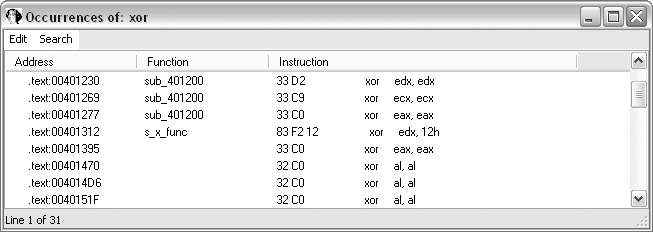
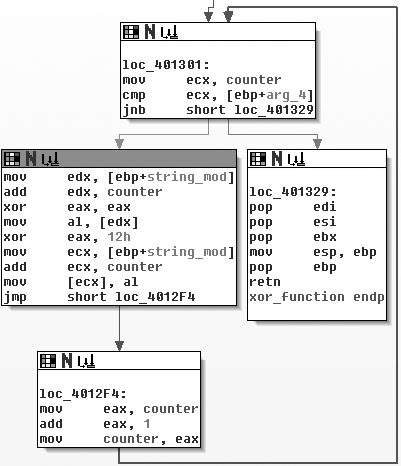
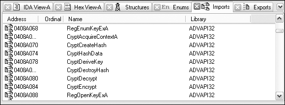
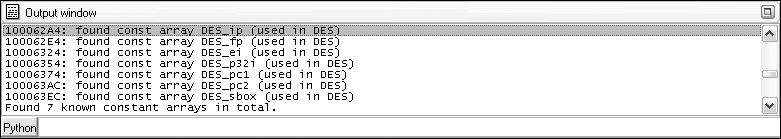
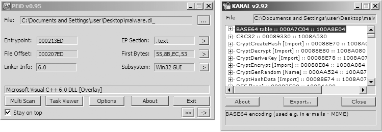
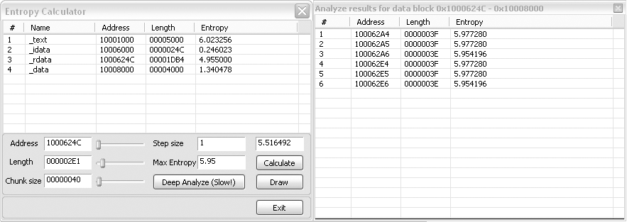
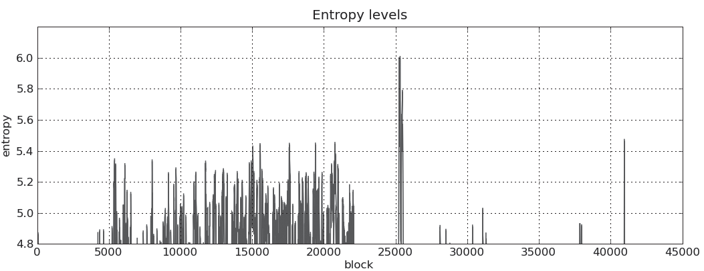

# Capitulo 13 - Codificacao de dados

> Titulo original: *Data Encoding*

> Navegacao: [Anterior](capitulo-12.md) | [Indice](README.md) | [Proximo](capitulo-14.md)

## Topicos

- objetivos: esconder C2, staging, strings; identificar funcoes de encoding e depois **decodificar** segredos
- Cifras simples: Caesar; XOR mono-byte; brute-force e assinaturas; XOR **NULL-preserving**
- Localizar lacos XOR no IDA (busca `xor`, grafos Fig. 13-2, 13-3); outros esquemas simples (ADD/SUB, ROL/ROR, ROT, multibyte, encadeado)
- Base64 MIME, padding, alfabetos custom (Fig. 13-5 a 13-8)
- Criptografia "seria": imports `Crypt*`, FindCrypt2, KANAL, entropia (Fig. 13-9 a 13-13); nota RC4/IDEA sem constantes magicas
- Encoding custom: rastrear I/O, grafos `WriteFile` (Fig. 13-14, 13-15)
- Decodificar: auto-decodificacao no debugger, scripts Python (13-7 a 13-10), instrumentacao ImmDbg (13-11, 13-12)

## Texto principal

Em analise de malware, **codificacao de dados** designa qualquer modificacao intencional do conteudo para **esconder intencao**. O malware usa encoding para mascarar actividades; o analista precisa de reconhecer essas tecnicas para compreender a amostra.

Atacantes escolhem o metodo que melhor serve os objetivos: cifras simples faceis de implementar e suficientes para evitar analise basica, ou cifras sofisticadas / custom para dificultar engenharia reversa.

O capitulo comeca por **encontrar e identificar** funcoes de encoding; depois **estrategias de descodificacao**.

### objetivo ao analisar algoritmos de encoding

O malware usa encoding para:

- Cifrar comunicacao de rede (C2)
- Esconder funcionamento interno
- Ocultar configuracao (ex.: dominio C2)
- Guardar informacao em arquivo de **staging** antes de exfiltrar
- Armazenar strings e descodificar apenas quando necessario
- Disfarçar-se de ferramenta legitima

O objetivo do analista tem **duas** partes: **identificar** as funcoes de encoding e **usar esse conhecimento** para revelar os segredos do atacante.

### Cifras simples

Tecnicas simples existem ha milenios; ainda sao comuns em malware porque:

- Cabem em ambientes com pouco espaco (shellcode de exploit)
- Sao **menos obvias** que cifras complexas para quem procura so "crypto forte"
- Baixo custo de CPU

Quem usa cifra simples **nao** espera imunidade a deteccao; quer sobretudo impedir analise basica.

#### Cifra de Cesar

Desloca letras do alfabeto (ex.: tres posicoes). Exemplo do livro: `ATTACK AT NOON` torna-se `DWWDFN DW QRRQ`.

#### XOR

**XOR** (OU exclusivo) opera ao nivel de bits. Uma cifra XOR usa um **byte estatico** e aplica XOR a cada byte do texto claro. A Figura 13-1 mostra `ATTACK AT NOON` com XOR `0x3C`: muitos bytes resultantes **nao** sao imprimiveis (celulas sombreadas no livro). O `C` de ATTACK passa a `0x7F` (DEL); o espaco a `0x1C`.

O XOR e **reversivel** com a mesma funcao: repetir XOR com a **mesma chave** recupera o original. Implementacao com uma unica instrucao em codigo maquina.

Quando a chave e **a mesma** para todos os bytes, fala-se em **XOR mono-byte**.

> Figura 13-1: `ATTACK AT NOON` codificado com XOR `0x3C` (original em cima; codificado em baixo).



#### Brute-force de XOR mono-byte

Cenario: dois arquivos aparecem na cache do browser; um SWF (exploit Flash) e `a.gif` **sem** cabecalho GIF (`GIF87a` / `GIF89a`). Os primeiros bytes parecem XOR.

**Listagem 13-1:** primeiros bytes do arquivo `a.gif` (extracto; ver PDF para matriz completa de caracteres)

```text
5F 48 42 12 10 12 12 12 16 12 1D 12 ED ED 12 12    _HB.............
...
```

So existem **256** chaves mono-byte; um script pode XORar o cabecalho com cada chave e comparar com um cabecalho PE esperado.

**Tabela 13-1:** brute-force do executavel XOR (extracto)

| Chave XOR | Primeiros bytes | Cabecalho MZ? |
|-----------|-----------------|---------------|
| Original | 5F 48 42 12 ... | Nao |
| ... | ... | Nao |
| 0x12 | 4D 5A 50 00 ... | **Sim** |

`4D 5A` e `MZ`. Com chave `0x12` obtem-se um PE.

**Listagem 13-2:** primeiros bytes do PE decifrado (extracto)

```text
4D 5A 50 00 02 00 00 00 04 00 0F 00 FF FF 00 00    MZP.............
...
54 68 69 73 20 70 72 6F 67 72 61 6D 20 6D 75 73    This program mus
```

"This program mus" e o inicio do **DOS stub**, confirmando PE.

#### Brute-force em muitos arquivos

Proactivamente, pode gerar-se **255 assinaturas** para procurar PEs XOR mono-byte. Outro truque: o string `This program` aparece em stubs; gerar todas as permutacoes XOR desse texto para cada byte-chave (Tabela 13-2 no livro).

#### XOR que preserva NULL

Na Listagem 13-1, a chave `0x12` **salta aos olhos** porque grande parte dos bytes iniciais e `0x12`. Muitos NULLs no plaintext tornam a chave **visivel** num editor hexadecimal.

**Esquema XOR mono-byte que preserva NULL** (duas excepcoes):

1. Se o byte do plaintext for **NULL** ou **igual a chave**, **nao** transforma
2. Caso contrario, XOR com a chave

**Tabela 13-3:** codigo C (extracto)

| XOR original | XOR NULL-preserving |
|--------------|---------------------|
| `buf[i] ^= key;` | `if (buf[i] != 0 && buf[i] != key) buf[i] ^= key;` |

**Listagem 13-3:** mesmos dados com encoding NULL-preserving (ja nao e obvio que a chave e `0x12`)

```text
5F 48 42 00 10 00 00 00 16 00 1D 00 ED ED 00 00    _HB.............
```

Popular em **shellcode** quando o codigo de encoding tem de ser minimo.

#### Identificar lacos XOR no IDA Pro

1. Vista de codigo IDA View
2. Search - Text: `xor`, marcar "Find all occurrences"
3. Avaliar cada ocorrencia

> Figura 13-2: Resultados da busca por `xor` no IDA Pro.



XOR serve tambem para **zerar registradores** (`xor edx, edx`); ignore esses casos quando procura cifra. Encoding costuma ser XOR entre um **registrador** e uma **constante**, ou entre dois registradores. `xor edx, 12h` e um exemplo de chave visivel no imediato.

> Figura 13-3: Grafo do laco XOR mono-byte (contador e limite).


#### Outros esquemas simples

**Tabela 13-4 (resumo):**

| Esquema | Descricao |
|---------|-----------|
| ADD/SUB | Semelhante ao XOR; nao reversivel isoladamente; usar em par (um codifica, outro descodifica) |
| ROL/ROR | Rodar bits; tambem em par |
| ROT | Cesar sobre A-Z/a-z ou 94 caracteres ASCII imprimiveis |
| Multibyte | Chave mais longa (ex. 4 ou 8 bytes), muitas vezes XOR por bloco |
| Encadeado / loopback | O proprio conteudo alimenta a chave do byte seguinte |

### Base64

Representa binario em string ASCII. Nome vem do MIME; hoje e ubiquo em HTTP/XML.

Converte blocos de **24 bits** (3 octetos) em **4** caracteres de um alfabeto de 64 simbolos. MIME usa `A-Za-z0-9+/` e padding `=`. Dados codificados ficam **mais longos** que o original.

**Listagem 13-4:** fragmento de email raw com corpo Base64 (extracto)

```text
Content-Transfer-Encoding: base64
SWYgeW91IGFyZSByZWFkaW5nIHRoaXMsIHlvdSBwcm9iYWJseSBzaG91bGQganVzdCBza2lwIHRoaX
```

#### Transformar dados para Base64

Leitura em grupos de 6 bits; cada valor indexa uma string de 64 bytes.

> Figura 13-4: Codificacao Base64 de `ATT` (bits, nibbles e indices).



#### Identificar e descodificar Base64

**Listagem 13-5:** dois pedidos HTTP GET de exemplo (livro)

```text
GET /X29tbVEuYC8=/index.htm
...
Cookie: Ym90NTQxNjQ
GET /c2UsYi1kYWM0cnUjdFlvbiAjb21wbFU0YP==/index.htm
...
Cookie: Ym90NTQxNjQ
```

Base64 "parece" caracteres aleatorios do conjunto permitido; comprimento muitas vezes **multiplo de 4** com `=` no fim (padding opcional em malware para evitar assinaturas).

Ferramentas online (ex.: decoders Base64) ajudam a testar.

> Figura 13-5: Tentativa de descodificar Cookie **sem** sucesso (comprimento invalido para Base64 standard).



Com **11** caracteres no Cookie, o padding esta errado; adicionando `=` (Fig. 13-6) obtem-se `bot54164`.

> Figura 13-6: Descodificacao bem-sucedida apos padding.



A string de indexacao MIME standard:

`ABCDEFGHIJKLMNOPQRSTUVWXYZabcdefghijklmnopqrstuvwxyz0123456789+/`

Implementacoes costumam conter esta string de **64 caracteres** imprimiveis; tambem pode existir `=` hardcoded na funcao de encoding.

Os paths das Listagens 13-5 parecem Base64, mas o decoder standard **falha** se o alfabeto for **custom** (Fig. 13-7).

> Figura 13-7: Falha por indice nao standard.



Basta **reordenar** o alfabeto (ex.: mover `a` para a frente):

`aABCDEFGHIJKLMNOPQRSTUVWXYZbcdefghijklmnopqrstuvwxyz0123456789+/`

Com esse alfabeto, a descodificacao produz texto interpretavel (Fig. 13-8).

> Figura 13-8: Descodificacao com string de indexacao custom.


### Algoritmos criptograficos comuns

Cifras modernas assumem poder computacional elevado; quebrar exige trabalho enorme. Malware **nem sempre** usa crypto standard porque:

- Bibliotecas **grandes** (link estatico ou DLL no host)
- Linkar codigo no host reduz **portabilidade**
- Bibliotecas standard sao **faceis** de detectar (imports, constantes)
- Cifras simetricas exigem **esconder a chave**

Identificacao: **strings** (ex.: OpenSSL compilado estaticamente), **imports** `Crypt*`, `CP*`, `Cert*` (Fig. 13-9), ferramentas de **constantes magicas**.

> Figura 13-9: Imports criptograficos no IDA.



#### FindCrypt2

Plugin IDA que procura **constantes magicas** tipicas de algoritmos.

> Figura 13-10: Saida FindCrypt2 (ex.: constantes DES).


**NOTA:** Alguns algoritmos **nao** usam constantes magicas notaveis; **IDEA** e **RC4** constroem estado dinamicamente. **RC4** e muito usado em malware (pequeno, sem constantes que denunciem).

#### Krypto ANALyzer (KANAL)

Plugin **PEiD**: mais constantes que FindCrypt2 (mais falsos positivos); tambem reconhece tabelas Base64 e imports relacionados.

> Figura 13-11: PEiD com KANAL.


#### Entropia alta

Dados cifrados ou comprimidos tendem a **alta entropia**. Plugin de entropia para IDA (Fig. 13-12, 13-13) destaca regioes; alinhamento com FindCrypt2 reforca hipotese.

**AVISO:** Imagens, audio e arquivos comprimidos tambem tem alta entropia; a tecnica e **grosseira** e funciona melhor como complemento.

> Figura 13-12: Calculadora de entropia (plugin).


> Figura 13-13: Grafico de entropia ao longo do binario (*spike* no arquivo: configuracao DES cifrada).


### Encoding custom

Malware pode **empilhar** XOR + Base64, ou inventar algoritmo proprio.

**Listagem 13-6:** primeiros bytes de arquivo cifrado (exemplo exercicio)

```text
88 5B D9 02 EB 07 5D 3A 8A 06 1E 67 D2 16 93 7F
...
```

Sem strings obvias, FindCrypt2/KANAL vazios, entropia ambigua: rastrear **fluxo** desde `ReadFile` / entrada ou ate `WriteFile` / rede. **Encoding** ocorre **antes** da saida; **descodificacao** **depois** da entrada.

No exemplo do livro, `CreateFile`/`WriteFile` em `sub_4011A9` contem um unico `xor` num laco antes de escrever.

> Figura 13-14: Grafo com escrita cifrada (laco XOR antes de `WriteFile`).


> Figura 13-15: Relacao entre inicializacao e geracao de bytes pseudo-aleatorios (cifra de fluxo).


Hipotese: `sub_40112F` devolve byte pseudo-aleatorio; XOR com buffer; possivel **cifra de fluxo** com estado global (array 256 bytes, dois DWORDs).

**Vantagens para o atacante:** esquemas custom podem ser **mais** trabalhosos de reverter que AES standard com chave conhecida, porque nao ha `decrypt()` pronto numa biblioteca.

### Descodificar

Duas abordagens:

1. **Reimplementar** a rotina (Python, etc.)
2. **Usar o proprio malware** (self-decoding)

#### Auto-decodificacao

Pausar no debugger **depois** da rotina de descodificacao e ler memoria (strings que nao apareciam em `strings` estatico).

#### Programacao manual

**Listagem 13-7:** Python 2 (livro) Base64 standard

```python
import base64
example_string = 'VGhpcyBpcyBhIHRlc3Qgc3RyaW5n'
print base64.decodestring(example_string)
```

**Listagem 13-8:** XOR NULL-preserving (funcao exemplo).

**Listagem 13-9:** mapear caracteres Base64 custom para standard e chamar `decodestring`.

**Listagem 13-10:** PyCrypto DES ECB (exemplo educacional; chave e modo devem corresponder ao malware).

#### Instrumentacao generica (Immunity Debugger)

**Listagem 13-11:** extracto do laco de cifra (enderecos do exemplo do livro).

**Listagem 13-12:** script Python **immlib** que aloca memoria no processo, escreve arquivo cifrado, ajusta `EIP` e variaveis de stack, corre ate breakpoint pos-laco, le memoria decifrada. Requer arquivo em `C:\encrypted_file` e caminhos de saida conforme documentacao ImmDbg.

Preparacao pode incluir arranque normal do malware para chaves embutidas ou simular servidor que envia nonce.

## Conclusao

Autores e analistas evoluem em paralelo. Encoding e cifra sao ferramentas centrais para esconder intencoes, tecnicas e comunicacoes. Com ferramentas e metodologia certas, muitas tecnicas sao **identificaveis** e **reversiveis**.

Este capitulo cobriu XOR, Base64 (e variantes), deteccao por imports/constantes/entropia, analise de rotinas custom e descodificacao pratica. O **Capitulo 14** aplica a mesma leitura de buffers ao **trafego de rede** e assinaturas.

## Laboratorios (perguntas)

### Lab 13-1

`Lab13-01.exe`

1. Compare `strings` e dinamica: que elementos parecem encoded?
2. IDA busca `xor`: que tipo encoding?
3. Chave e conteudo protegido?
4. FindCrypt2, KANAL, Entropy Plugin revelam mais mecanismos quais?
5. Parte trafego rede usa que encoding?
6. Onde funcao Base64 desassembly?
7. Tamanho maximo bloco Base64 enviado e o que codifica?
8. Padding `=` aparece nesta amostra?
9. objetivo malware global?

### Lab 13-2

`Lab13-02.exe`

1. Dinamica cria o que?
2. Busca XOR + FindCrypt2 + KANAL + Entropy: achados?
3. Com base pergunta 1 que import boa candidata achar rotinas encoding?
4. Onde funcao encoding desassembly?
5. Tracando ate fonte conteudo: que informacao?
6. Identifica algoritmo? Se nao como decodificar?
7. A instrumentacao recupera a origem do arquivo encoded do exemplo?

### Lab 13-3

`Lab13-03.exe`

1. `strings` vs dinamica: candidatos encoded?
2. Estatica XOR que tipo?
3. FindCrypt2/KANAL/Entropy comparado XOR?
4. Quais duas tecnicas encoding coexistem?
5. Chave por tecnica?
6. Para cifra crypto simetrica chave so e suficiente? Que mais precisa?
7. O que malware faz?
8. Escreva script decifra conteudo gerado dinamica: revela o que?

## Exercicios e desafios

- Releia a conclusao deste capitulo e escreva tres perguntas que faria a um colega sobre o tema.
- Opcional: laboratorios oficiais em VM isolada usando [PracticalMalwareAnalysis-Labs](https://github.com/mikesiko/PracticalMalwareAnalysis-Labs); gabaritos em [appendice-c.md](appendice-c.md).
- **Desafio:** ligue um conceito do capitulo a um IOC ou artefacto de disco/rede que procuraria num incidente real (sem executar malware nao confiavel).
