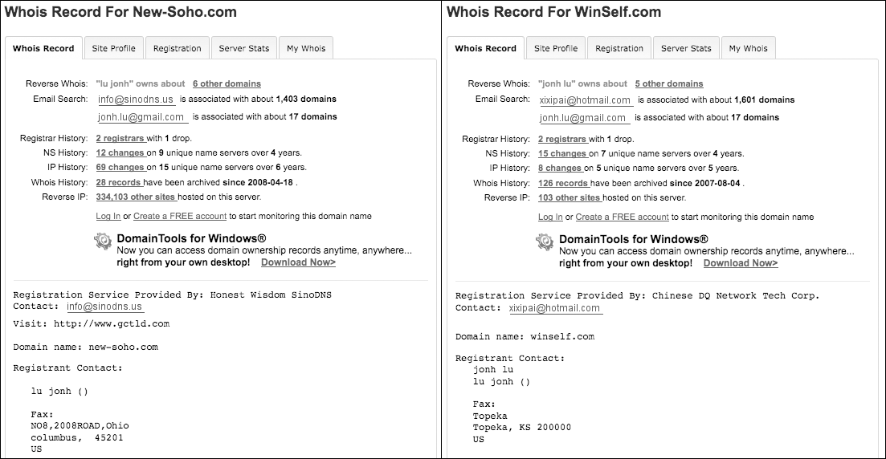
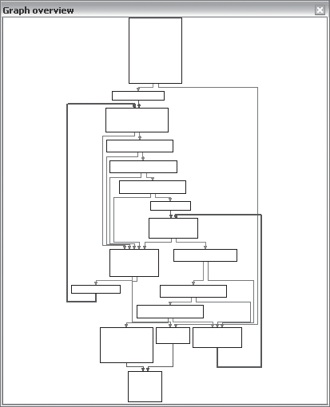

# Capitulo 14 - Assinaturas de rede focadas em malware

> Titulo original: *Malware-Focused Network Signatures*

> Navegacao: [Anterior](capitulo-13.md) | [Indice](README.md) | [Proximo](capitulo-15.md)

## Topicos

- Contra-medidas: IP, portas, DNS, conteudo; firewalls, sinkhole, proxies; IDS/IPS e inspeccao profunda
- Observar malware em **habitat real** (PCAP, SIEM) vs so laboratorio; OPSEC em pesquisas
- Indicadores cumulativos (Tabela 14-1); whois e correlacao (Fig. 14-1, 14-2)
- Snort: cabecalho de regra, `content`, `flow`, `pcre`, refinamento e falsos positivos (Webmin)
- Analise profunda: trafego real, User-Agent dinamico, amostragem multipla e hosts
- Camuflagem: HTTP/HTTPS/DNS; evolucao do User-Agent; tunelamento em campos atipicos; paginas web legitimas com comandos embutidos
- Fontes de conteudo na mensagem; dados hardcoded vs efemeros; erros subtis (`Accept`, ausencia de `Referer`)
- Expressoes regulares para URI codificada (Tabela 14-6); assinatura Snort combinada; modularizar regras
- Rotinas de **parsing** do servidor (Fig. 14-3); comandos em comentarios HTML Base64 (Tabela 14-7); assinaturas em camadas
- Perspectiva do atacante; regras praticas para assinaturas resilientes

## Texto principal

O malware depende fortemente da rede. Para **contra-medidas** efectivas e preciso perceber como o malware usa a rede e que **limitacoes** os autores enfrentam.

### Contra-medidas de rede

Atributos basicos (IP, portas TCP/UDP, nomes de dominio, **conteudo** do trafego) alimentam firewalls, routers, DNS (sinkhole), proxies. **IDS** e **IPS** e aparelhos similares permitem defesa **baseada em conteudo** (assinaturas, anti-spam).

Indicadores basicos (IP, dominio) sao dos primeiros que o analista investiga.

**NOTA:** O termo "intrusion detection system" e **antiquado**. Assinaturas detectam muito mais que "intrusao": scans, enumeracao de servicos, uso nao standard de protocolos, **beaconing** de malware instalado. **IPS** esta relacionado com IDS; a diferenca e que o IDS **detecta** e o IPS **detecta e bloqueia** o trafego malicioso.

### Observar o malware no habitat natural

O primeiro passo **nao** deve ser executar a amostra no laboratorio ou abrir o IDA de imediato. Em muitos casos ja existem **logs, alertas e capturas PCAP** gerados pelo malware.

Vantagens de dados **reais** face ao laboratorio:

- Visao mais transparente do comportamento; malware pode **detectar** laboratorio
- Trafego activo da vitima da informacao **unica** que acelera analise
- Em laboratorio costuma ver-se so **um** extremo da conversa; no mundo real ha **cliente e servidor**; analisar o que o malware **recebe** (parsing) e tipicamente mais dificil que o que **envia**
- Revisao **passiva** nao acciona o atacante (ver OPSEC)

### Indicadores de actividade maliciosa

Exemplo: DNS para `www.badsite.com`, HTTP GET na porta 80 ao IP devolvido, e 30 s depois beacon para um **IP sem** DNS. Tres indicadores: **dominio+IP**, **IP isolado**, **pedido HTTP** com metodo e cabecalhos (Tabela 14-1).

**Tabela 14-1:** indicadores de exemplo

| Tipo | Indicador |
|------|-----------|
| Dominio (com IP resolvido) | www.badsite.com (123.123.123.10) |
| Endereco IP | 123.64.64.64 |
| GET | `GET /index.htm HTTP/1.1`, `Accept: */*`, `User-Agent: Wefa7e`, etc. |

Pesquisas na Internet podem revelar idade da campanha, prevalencia, objectivos. **Falta** de informacao tambem informa (ataque direccionado).

### OPSEC (operations security)

Pesquisar online pode **avisar** o autor: pedido DNS a partir de gama de IPs inesperada, clicar em links de spear-phishing, resolver dominio embutido so para monitorizacao, etc. Se o atacante souber da investigacao, pode mudar de tatica.

**Indireccao:** Tor, proxy aberto, anonymizer web; VM dedicada; ligacao movel; SSH/VPN; maquina efemera em cloud; motores de busca (cuidado: query com dominio novo pode accionar **crawlers**; resultados podem accionar links subsequentes).

### Informacao sobre IP e dominio

DNS traduz nomes em IP. Malware usa DNS para parecer trafego normal e para **flexibilidade** no C2.

> Figura 14-1: Tipos de informacao sobre dominios DNS e enderecos IP (registo de dominio, DNS, RIR, blacklists, geo).



Ferramentas web (DomainTools, RobTex, BFK DNS logger, etc.) agregam whois, historico, DNS passivo, reverse IP.

> Figura 14-2: Exemplo de pedidos whois a dois dominios usados como C2; mesmo contacto de registo.


### Contra-medidas baseadas em conteudo

IP e dominio **mudam** rapidamente; assinaturas de **conteudo** costumam durar mais porque assentam em caracteristicas mais fundamentais.

**Snort** e um IDS popular: regras ligam **opcoes** (payload e nao-payload). Exemplos: `flow:established,to_client`; `dsize:200`.

Exemplo do livro: malware com `User-Agent: Wefa7e` distintivo.

```text
alert tcp $HOME_NET any -> $EXTERNAL_NET $HTTP_PORTS (msg:"TROJAN Malicious User-Agent";
content:"|0d 0a|User-Agent\: Wefa7e"; classtype:trojan-activity; sid:2000001; rev:1;)
```

**Tabela 14-2:** palavras-chave Snort (extracto)

| Palavra | Papel |
|---------|--------|
| msg | Mensagem do alerta |
| content | Procura bytes no payload |
| classtype | Categoria |
| sid / rev | Identificador e revisao da regra |

`|0d 0a|` em hex separa cabecalhos HTTP.

### Olhar mais fundo

Parar apos sandbox e indicadores basicos da **falsa sensacao de seguranca**. Regras da comunidade **Emerging Threats** para o mesmo malware usaram **PCRE** `We[a-z0-9]{4}` porque apareceram variantes `Wefa7e` e `Wee6a3`. Depois refinamento para **excluir** trafego legitimo **Webmin** (`content:!`).

**Tabela 14-3:** palavras-chave adicionais (extracto)

| Palavra | Descricao |
|---------|-----------|
| flow | Sessao TCP estabelecida, direccao cliente/servidor |
| isdataat | Verifica dados num offset |
| distance / within | Janela de busca apos match |
| pcre | Expressao regular compativel com Perl |

Correr o malware **varias** vezes revela aleatoriedade (ex.: conjunto de caracteres do User-Agent mais estreito que `[a-z]`). Testar em **dois hosts** evita assumir que um beacon estatico e global quando so reflecte um sistema.

### Combinar estatica e dinamica

Objectivos: **cobrir** funcionalidade com dinamica (INetSim, scripts) e **perceber** onde o conteudo e gerado (estatica). **Tabela 14-4** (livro): niveis desde "superficie" ate "replicacao operacional" e cobertura total de codigo.

### Esconder-se a vista

Atacantes usam **HTTP, HTTPS, DNS** (trafego enorme, dificil bloquear sem colaterais). Abusos: beacon tipo GET; **HTTPS** esconde payload; **DNS** para tunelar dados longos em labels; dados em **User-Agent** em vez do corpo.

Evolucao do **User-Agent**: strings inventadas faceis de assinar; depois strings **comuns** fixas; depois **varias** strings alternadas; estadio actual em alguns casos: **mesma stack** que o browser (indistinguivel).

**Infraestrutura legitima:** servidor partilhado com usos licitos; comandos embutidos em pagina HTML real (comentario `<!--` com Base64 `longsleep`, etc.).

**Beacon iniciado pelo cliente** atraves de NAT/proxy: o atacante identifica vitima por **identificador** no beacon (string derivada do host, hash, etc.).

### Codigo de rede e fontes de conteudo

Para trafego **de saida**, o malware gera amostras sempre que corre.

APIs comuns:

- **Winsock:** `WSAStartup`, `socket`, `connect`, `send`, `recv`, ...
- **WinINet:** `InternetOpen`, `InternetConnect`, `HTTPOpenRequest`, `HTTPSendRequest`, `InternetReadFile`, ...
- **COM / browser:** `CoCreateInstance`, `Navigate`, ou `URLDownloadToFile` (Tabela 14-5 no livro).

**Fontes fundamentais** de bytes no wire:

1. Dados **aleatorios** (PRNG)
2. Bibliotecas standard (formato GET gerado pela API)
3. **Hardcoded** no binario
4. **Atributos do host** (hostname, relogio, CPU)
5. Dados **recebidos** (nonce do servidor, ficheiro local, keylogger)

Encoding em camadas nao muda a **origem** logica do dado para assinatura.

Erros clasicos de malware: `Accept: * / *` com **espaco** extra vs `*/*`; **falta** de `Referer` onde browsers normais enviam.

### Exemplo de beacon e URI codificada

O livro desenvolve URI com `GetTickCount`, `Random`, `gethostbyname`, dois caracteres `:` hardcoded, e codificacao **decimal ASCII** por byte. Regex PCRE final (ver Tabela 14-6 no PDF) ancora nos `58` (digitos decimais do `:`).

Estrategias de performance: combinar regex com `User-Agent` fixo; dois `content:"58"` com `distance`/`within`; explorar bits altos estaveis de `GetTickCount`.

**NOTA:** Primeiras versoes de assinaturas focam **funcionar**; optimizar desempenho do motor IDS e passo separado.

### Analisar rotinas de **parsing** (trafego recebido)

Malware que obtem comandos de pagina web procura padroes tipo comentario HTML `<!-- ... -->`. Parsing **custom** em cadeia de testes (Fig. 14-3).

> Figura 14-3: Grafo IDA de funcao de parsing exemplo (comentarios e comando `adsrv?`).



Apos `adsrv?` segue Base64; comandos exemplo: `longsleep`, `run:...`, `connect:...` (Tabela 14-7).

Assinaturas **modulares**: uma regra para `<!-- adsrv?` + Base64 generico; outras para comandos conhecidos; separar **marcacao HTML**, **prefixo** e **parser** para sobreviver a mudancas parciais no codigo.

### Perspectiva do atacante

Atacantes minimizam alteracoes em cliente **e** servidor. Assinaturas que dependem de elementos presentes em **ambos** os lados custam mais a contornar. Evitar depender apenas do mesmo traco que **outros** defensores ja forçaram o autor a mudar.

### Conclusao

O capitulo ligou **analise de malware** a **defesa de rede**: assinaturas derivadas de reversing tendem a ser mais precisas e a aguentar **variantes** melhor que olhar so para PCAP superficial.

O **fim** tipico da analise basica e uma contra-medida efectiva. Quando autores introduzem **anti-analise**, os capitulos seguintes (Parte 5) tratam de contornar essas barreiras.

## Laboratorios (perguntas)

### Lab 14-1

`Lab14-01.exe` nao destrutivo sistema.

1. Bibliotecas networking usadas vantagens cada?
2. Elementos fonte constroem beacon rede condicoes mudariam beacon?
3. Porque dados beacon interessam atacante?
4. Base64 padrao? Se nao como difere?
5. Proposito global malware?
6. Que elementos comunicacao assinatura rede detecta bem?
7. Erros analista comuns construindo assinatura esta familia?
8. Conjunto assinaturas recomendado detectar amostra e variantes futuras?

### Lab 14-2

`Lab14-02.exe` beacon loopback hardcoded (imaginar IP externo real).

1. Pros contras malware usar IP directo hardcoded?
2. Bibliotecas networking vantagens desvantagens?
3. Origem URL beacon vantagens escolha fonte?
4. Que aspeto HTTP explorado atingir objectivos?
5. Informacao beacon inicial?
6. Desvantagens desenho canais comunicacao?
7. Esquema encoding padrao industria?
8. Como termina sessao?
9. Proposito malware papel arsenal atacante?

### Lab 14-3

`Lab14-03.exe` evolucao Lab 14-1.

1. Elementos hardcoded beacon inicial quais bons assinatura?
2. Elementos beacon frageis assinatura longa duracao?
3. Malware obtem comandos metodologia similar exemplo capitulo quais pros?
4. Checagens input validam comando como atacante esconde lista comandos?
5. Encoding argumentos comandos tipo diferenca Base64 pros cons?
6. Lista comandos disponiveis?
7. Proposito malware?
8. Onde capitulo sugere segmentar codigo configuracao independente assinaturas resilientes aplicar aqui?
9. Conjunto assinaturas recomendado?

## Exercicios e desafios

- Releia a conclusao deste capitulo e escreva tres perguntas que faria a um colega sobre o tema.
- Opcional: laboratorios oficiais em VM isolada usando [PracticalMalwareAnalysis-Labs](https://github.com/mikesiko/PracticalMalwareAnalysis-Labs); gabaritos em [appendice-c.md](appendice-c.md).
- **Desafio:** ligue um conceito do capitulo a um IOC ou artefacto de disco/rede que procuraria num incidente real (sem executar malware nao confiavel).
