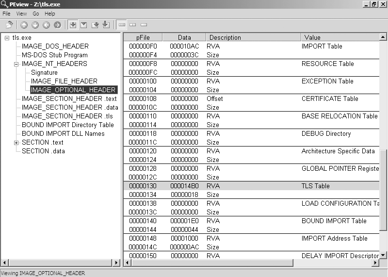
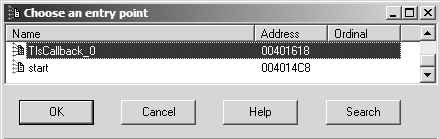
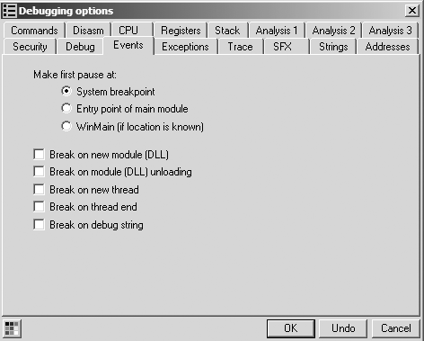
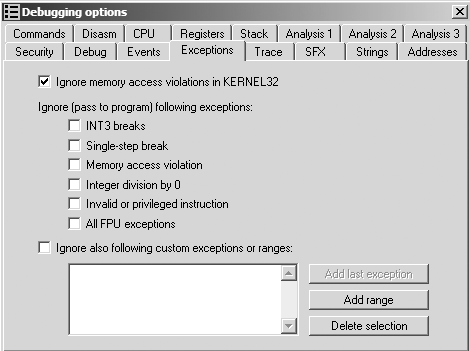

# Capitulo 16 - Anti-depuracao

> Titulo original: *Anti-Debugging*

> Navegacao: [Anterior](capitulo-15.md) | [Indice](README.md) | [Proximo](capitulo-17.md)

## Texto principal

A antidepuracao e uma tecnica popular de antianalise usada
por malware para reconhecer quando esta sob controle
de um depurador ou para impedir depuradores. Autores de malware
sabem que os analistas de malware usam depuradores para descobrir
como o malware opera, e os autores usam tecnicas anti-depuracao de uma forma
tente desacelerar o analista tanto quanto possivel. Assim que o malware perceber
que esta sendo executado em um depurador, ele pode alterar seu caminho normal de execucao de codigo
ou modificar o codigo para causar uma falha, interferindo assim nas tentativas dos analistas
para entende-lo e adicionando tempo e sobrecarga adicional aos seus esforcos.
Existem muitas tecnicas anti-depuracao - talvez centenas delas - e discutiremos apenas as mais populares que encontramos no
mundo real. Apresentaremos maneiras de contornar as tecnicas anti-depuracao, mas nosso
objetivo geral neste capitulo (alem de apresentar tecnicas especificas)
e ajuda-lo a desenvolver as habilidades necessarias para superar metodos anti-depuracao novos e ate entao desconhecidos durante a analise.

Deteccao do depurador do Windows
O malware usa uma variedade de tecnicas para procurar indicacoes de que um depurador
esta anexado, inclusive usando a API do Windows, verificando manualmente a memoria
estrutura para depuracao de artefatos e busca no sistema por residuos deixados por
um depurador. A deteccao do depurador e a maneira mais comum pela qual o malware executa a antidepuracao.
Usando a API do Windows
O uso de funcoes da API do Windows e o mais obvio dos metodos antidepuracao
tecnicas. A API do Windows fornece diversas funcoes que podem ser usadas por
um programa para determinar se ele esta sendo depurado. Algumas dessas funcoes
foram projetados para deteccao de depurador; outros foram projetados para diferentes
propositos, mas pode ser reaproveitado para detectar um depurador. Algumas dessas funcoes usam funcionalidades nao documentadas na API.
Normalmente, a maneira mais facil de superar uma chamada para uma API antidepuracao
funcao e modificar manualmente o malware durante a execucao para nao chamar
essas funcoes ou modificar a pos-chamada do sinalizador para garantir que o correto
caminho e tomado. Uma opcao mais dificil seria conectar essas funcoes, como
com um rootkit.
As seguintes funcoes da API do Windows podem ser usadas para antidepuracao:
IsDebuggerPresent
A funcao de API mais simples para detectar um depurador e IsDebuggerPresent.
Esta funcao pesquisa a estrutura do Process Environment Block (PEB)
para o campo IsDebugged, que retornara zero se voce nao estiver executando
o contexto de um depurador ou um valor diferente de zero se um depurador estiver anexado.
Discutiremos a estrutura do PEB com mais detalhes na proxima secao.
CheckRemoteDebuggerPresente
Esta funcao de API e quase identica a IsDebuggerPresent. O nome e
enganoso, pois nao verifica um depurador em um controle remoto
maquina, mas sim para um processo na maquina local. Tambem verifica
a estrutura PEB para o campo IsDebugged; no entanto, ele pode fazer isso por si mesmo
ou outro processo na maquina local. Esta funcao leva um processo
handle como parametro e ira verificar se aquele processo possui um depurador
anexado. CheckRemoteDebuggerPresent pode ser usado para verificar o seu proprio
processo simplesmente passando um identificador para o seu processo.
NtQueryInformationProcess
Esta e uma funcao de API nativa em Ntdll.dll que recupera informacoes sobre
um determinado processo. O primeiro parametro desta funcao e um identificador de processo;
o segundo e usado para informar a funcao o tipo de informacao do processo a ser
ser recuperado. Por exemplo, usando o valor ProcessDebugPort (valor 0x7)
para este parametro informara se o processo em questao esta atualmente
sendo depurado. Se o processo nao estiver sendo depurado, um zero sera
voltou; caso contrario, um numero de porta sera retornado.

Anti-depuracao
OutputDebugString
Esta funcao e usada para enviar uma string a um depurador para exibicao. Pode
ser usado para detectar a presenca de um depurador. Por exemplo, Listagem 16-1
usa SetLastError para definir o codigo de erro atual para um valor arbitrario. Se
OutputDebugString e chamado e nao ha nenhum depurador anexado, GetLastError
nao deve mais conter nosso valor arbitrario, porque um codigo de erro ira
ser definido pela funcao OutputDebugString se falhar. Se OutputDebugString for
chamado e ha um depurador anexado, a chamada para OutputDebugString
deve ser bem-sucedido e o valor em GetLastError nao deve ser alterado.
Valor de erro DWORD = 12345;
SetLastError(errorValue);
OutputDebugString("Teste para Depurador");
if(GetLastError() == errorValue)
{
  SairProcesso();
}
mais
{
  RunMaliciousPayload();
}
Listagem 16-1: Tecnica antidepuracao OutputDebugString
Verificando Estruturas Manualmente
Usar a API do Windows pode ser o metodo mais obvio para detectar o
presenca de um depurador, mas a verificacao manual das estruturas e o metodo mais comum usado pelos autores de malware. Existem muitas razoes pelas quais o malware
os autores sao desencorajados de usar a API do Windows para antidepuracao.
Por exemplo, as chamadas de API podem ser interceptadas por um rootkit para retornar informacoes falsas. Portanto, os autores de malware geralmente optam por executar a funcionalidade
equivalente a chamada de API manualmente, em vez de depender da API do Windows.
Ao realizar verificacoes manuais, varios sinalizadores na estrutura PEB fornecem informacoes sobre a presenca de um depurador. Aqui, veremos alguns
dos sinalizadores comumente usados para verificar um depurador.
Verificando o sinalizador BeingDebugged
Uma estrutura Windows PEB e mantida pelo sistema operacional para cada processo em execucao,
conforme mostrado no exemplo da Listagem 16-2. Ele contem todos os parametros do modo de usuario
associado a um processo. Esses parametros incluem os dados do ambiente do processo, que incluem variaveis de ambiente, os modulos carregados
lista, enderecos na memoria e status do depurador.
typedef estrutura _PEB {
  BYTE Reservado1[2];
  BYTE sendo depurado;

BYTE Reservado2[1];
  PVOID Reservado3[2];
  PPEB_LDR_DATA Ldr;
  PRTL_USER_PROCESS_PARAMETERS Parametros de Processo;
  BYTE Reservado4[104];
  PVOID Reservado5[52];
  PPS_POST_PROCESS_INIT_ROUTINE PostProcessInitRoutine;
  BYTE Reservado6[128];
  PVOID Reservado7[1];
  ID de sessao ULONG;
} PEB, *PPEB;
Listagem 16-2: Estrutura do Bloco de Ambiente de Processo Documentado (PEB)
Enquanto um processo esta em execucao, a localizacao do PEB pode ser referenciada por
a localizacao fs:[30h]. Para antidepuracao, o malware usara esse local para
verifique o sinalizador BeingDebugged, que indica se o processo especificado e
sendo depurado. A Tabela 16-1 mostra dois exemplos desse tipo de verificacao.
No codigo a esquerda da Tabela 16-1, a localizacao do PEB e movida
em EAX. A seguir, esse deslocamento mais 2 e movido para EBX, que corresponde a
o deslocamento no PEB do local do sinalizador BeingDebugged. Finalmente, EBX
e verificado para ver se e zero. Nesse caso, um depurador nao esta conectado e o salto
sera levado.
Outro exemplo e mostrado no lado direito da Tabela 16-1. A localizacao
do PEB e movido para EDX usando uma combinacao de instrucoes push/pop e, em seguida, o sinalizador BeingDebugged no deslocamento 2 e diretamente comparado a 1.
Esta verificacao pode assumir muitas formas e, em ultima analise, o salto condicional
determina o caminho do codigo. Voce pode adotar uma das seguintes abordagens para
superar este problema:

Forcar o salto a ser realizado (ou nao) modificando manualmente o sinalizador zero
imediatamente antes da instrucao de salto ser executada. Este e o mais facil
abordagem.

Altere manualmente o sinalizador BeingDebugged para zero.
Ambas as opcoes sao geralmente eficazes contra todas as tecnicas
descrito nesta secao.
**NOTE**
Varios plug-ins do OllyDbg alteram o sinalizador BeingDebugged para voce. Os mais populares sao Hide Debugger, Hidedebug e PhantOm. Todos sao uteis para superar o
Verifica o sinalizador BeingDebugged e tambem ajuda com muitas das outras tecnicas que discutimos em
este capitulo.
Tabela 16-1: Verificando manualmente o sinalizador BeingDebugged
metodo mov
metodo push/pop
mov eax, dword ptr fs:[30h]
mov ebx, byte ptr [eax+2]
testar ebx, ebx
jz NoDebuggerDetected
empurrar dword ptr fs:[30h]
pop edx
cmp byte ptr [edx+2], 1
je DebuggerDetected

Anti-depuracao
Verificando o sinalizador ProcessHeap
Um local nao documentado dentro do array Reserved4 (mostrado na Listagem 16-2),
conhecido como ProcessHeap, e definido como o local do primeiro heap de um processo alocado
pelo carregador. ProcessHeap esta localizado em 0x18 na estrutura PEB. Este primeiro
heap contem um cabecalho com campos usados para informar ao kernel se o heap
foi criado dentro de um depurador. Eles sao conhecidos como ForceFlags e Flags
campos.
O deslocamento 0x10 no cabecalho do heap e o campo ForceFlags no Windows XP,
mas para o Windows 7, esta no deslocamento 0x44 para aplicativos de 32 bits. O malware pode
veja tambem o deslocamento 0x0C no Windows XP ou o deslocamento 0x40 no Windows 7 para o
Campo de bandeiras. Este campo e quase sempre igual ao campo ForceFlags, mas geralmente recebe OR com o valor 2.
A Listagem 16-3 mostra o codigo assembly para esta tecnica. (Observe que dois
desreferencias separadas devem ocorrer.)
mov eax, grande fs:30h
mov eax, dword ptr [eax+18h]
cmp dword ptr ds:[eax+10h], 0
jne Debugger detectado
Listagem 16-3: Verificacao manual do sinalizador ProcessHeap
A melhor maneira de superar essa tecnica e alterar o ProcessHeap
sinalizar manualmente ou usar um plug-in hide-debug para seu depurador. Se voce estiver
usando WinDbg, voce pode iniciar o programa com o heap de depuracao desabilitado. Para
exemplo, o comando windbg -hd notepad.exe iniciara o heap normalmente
modo em oposicao ao modo de depuracao, e os sinalizadores que discutimos nao serao definidos.
Verificando NTGlobalFlag
Como os processos sao executados de maneira ligeiramente diferente quando iniciados com um depurador, eles
crie pilhas de memoria de maneira diferente. As informacoes que o sistema usa para
determinar como criar estruturas heap e armazenado em um local nao documentado no PEB no deslocamento 0x68. Se o valor neste local for 0x70, sabemos
que estamos executando em um depurador.
O valor de 0x70 e uma combinacao dos seguintes sinalizadores quando um heap e
criado por um depurador. Esses sinalizadores sao definidos para o processo se ele for iniciado a partir de
dentro de um depurador.
(FLG_HEAP_ENABLE_TAIL_CHECK | FLG_HEAP_ENABLE_FREE_CHECK | FLG_HEAP_VALIDATE_PARAMETERS)
A Listagem 16-4 mostra o codigo assembly para realizar esta verificacao.
mov eax, grande fs:30h
cmp dword ptr ds:[eax+68h], 70h
jz Debugger detectado
Listagem 16-4: verificacao NTGlobalFlag

A maneira mais facil de superar essa tecnica e alterar os sinalizadores manualmente ou com um plug-in de ocultacao de depuracao para o seu depurador. Se voce estiver usando WinDbg,
voce pode iniciar o programa com a opcao de depuracao heap desabilitada, conforme mencionado na secao anterior.
Verificando residuos do sistema
Ao analisar malware, normalmente usamos ferramentas de depuracao, que deixam residuos no sistema. O malware pode procurar esse residuo para determinar
quando voce esta tentando analisa-lo, como pesquisando chaves de registro por
referencias a depuradores. A seguir esta um local comum para um depurador:
HKEY_LOCAL_MACHINE\SOFTWARE\Microsoft\Windows NT\CurrentVersion\AeDebug
Esta chave de registro especifica o depurador que e ativado quando um aplicativo
ocorre um erro. Por padrao, isso e definido como Dr. Watson, portanto, se for alterado para algo como OllyDbg, o malware pode determinar que esta sob um microscopio.
O malware tambem pode pesquisar arquivos e diretorios no sistema, como
executaveis comuns de programas de depuradores, que normalmente estao presentes durante a analise de malware. (Muitos backdoors ja possuem codigo para atravessar sistemas de arquivos.) Ou o malware pode detectar residuos na memoria ativa,
visualizando a listagem de processos atual ou, mais comumente, executando um
FindWindow em busca de um depurador, conforme mostrado na Listagem 16-5.
if(FindWindow("OLLYDBG", 0) == NULO)
{
//Depurador nao encontrado
}
mais
{
//Depurador detectado
}
Listagem 16-5: Codigo C para deteccao FindWindow
Neste exemplo, o codigo simplesmente procura uma janela chamada OLLYDBG.
Identificando o comportamento do depurador
Lembre-se de que os depuradores podem ser usados para definir pontos de interrupcao ou para executar etapas unicas
um processo para auxiliar o analista de malware na engenharia reversa. Entretanto, quando essas operacoes sao executadas em um depurador, elas modificam o
codigo no processo. Varias tecnicas antidepuracao sao usadas por malware
para detectar esse tipo de comportamento do depurador: varredura INT, verificacoes de soma de verificacao,
e verificacoes de tempo.

Anti-depuracao
Digitalizacao INT
INT 3 e a interrupcao de software usada pelos depuradores para substituir temporariamente um
instrucao em um programa em execucao e chamar o mecanismo basico do manipulador de excecoes de depuracao para definir um ponto de interrupcao. O codigo de operacao para INT 3 e 0xCC. Sempre que voce usa um depurador para definir um ponto de interrupcao, ele modifica o codigo inserindo
um 0xCC.
Alem da instrucao especifica INT 3, um imediato INT pode definir qualquer
interrupcao, incluindo 3 (imediato pode ser um registro, como EAX). O INT
a instrucao imediata usa dois opcodes: valor 0xCD. Este opcode de 2 bytes e menor
comumente usado por depuradores.
Uma tecnica comum de antidepuracao faz com que um processo escaneie seu proprio codigo
para uma modificacao INT 3 pesquisando o codigo do opcode 0xCC, conforme mostrado
na Listagem 16-6.
ligue para $+5
edicao pop
subedi, 5
mov ecx, 400h
mov eax, 0CCh
repne scab
jz Debugger detectado
Listagem 16-6: Verificando o codigo em busca de pontos de interrupcao
Este codigo comeca com uma chamada, seguida por um pop que coloca o EIP no EDI.
O EDI e entao ajustado para o inicio do codigo. O codigo e entao escaneado para
0xCC bytes. Se um byte 0xCC for encontrado, ele sabera que um depurador esta presente. Isto
tecnica pode ser superada usando pontos de interrupcao de hardware em vez de pontos de interrupcao de software.
Executando somas de verificacao de codigo
O malware pode calcular uma soma de verificacao em uma secao de seu codigo para realizar a tarefa
mesmo objetivo da verificacao de interrupcoes. Em vez de procurar 0xCC, esta verificacao
simplesmente executa uma verificacao de redundancia ciclica (CRC) ou uma soma de verificacao MD5 do
opcodes no malware.
Essa tecnica e menos comum que a digitalizacao, mas e igualmente eficaz.
Procure o malware repetindo suas instrucoes internas seguidas por
uma comparacao com um valor esperado.
Esta tecnica pode ser superada usando pontos de interrupcao de hardware ou
modificando manualmente o caminho de execucao com o depurador em tempo de execucao.
### Verificacoes de tempo

As verificacoes de tempo sao das formas mais populares de deteccao de depurador em malware, porque os processos correm mais devagar sob depuracao. Por exemplo, avancar uma instrucao de cada vez atrasa muito a execucao.

Existem varias maneiras de usar verificacoes de tempo:

- Registe um *timestamp*, execute operacoes, registe outro *timestamp* e compare. Atraso anormal sugere depurador.
- Registe *timestamps* antes e depois de uma excecao. Sem depurador, tratamento e rapido; com depurador, mais lento. Muitos depuradores pedem intervencao em excecoes, gerando atraso grande.

#### Usando a instrucao rdtsc

O metodo mais comum usa a instrucao `rdtsc` (opcode
0x0F31), que retorna a contagem do numero de ticks desde o ultimo sistema
reboot como um valor de 64 bits colocado em EDX:EAX. O malware simplesmente sera executado
esta instrucao duas vezes e compare a diferenca entre as duas leituras.
A Listagem 16.7 mostra uma amostra real de malware usando a tecnica rdtsc.
rdtsc
xor ecx, ecx
adicionar ecx, eax
rdtsc
sub eax, ecx
cmp eax, 0xFFF
jb NoDebuggerDetected
rdtsc
empurrar eax
ret
Listagem 16-7: A tecnica de temporizacao rdtsc
O malware verifica se a diferenca entre as duas chamadas para rdtsc
e maior que 0xFFF em e, se tiver decorrido muito tempo, o condicional
o salto nao sera realizado. Se o salto nao for realizado, rdtsc sera chamado novamente e o
resultado e colocado na pilha em , o que fara com que o retorno tome o
execucao para um local aleatorio.
Usando QueryPerformanceCounter e GetTickCount
Duas funcoes da API do Windows sao usadas como rdtsc para executar uma verificacao de tempo antidepuracao. Este metodo baseia-se no fato de que os processadores tem
registros-contadores de desempenho de alta resolucao que armazenam contagens de atividades executadas no processador. QueryPerformanceCounter pode ser chamado para consultar
este contador duas vezes para obter uma diferenca de horario para uso em uma comparacao.
Se tiver passado muito tempo entre as duas chamadas, presume-se que um
depurador esta sendo usado.

Anti-depuracao
A funcao GetTickCount retorna o numero de milissegundos que
decorrido desde a ultima reinicializacao do sistema. (Devido ao tamanho alocado para este contador, ele e acumulado apos 49,7 dias.) Um exemplo de GetTickCount na pratica e
mostrado na Listagem 16-8.
a = GetTickCount();
MaliciousActivityFunction();
b = GetTickCount();
delta = b-a;
se ((delta)> 0x1A)
{
//Depurador detectado
}
mais
{
//Depurador nao encontrado
}
Listagem 16-8: Tecnica de temporizacao GetTickCount
Todos os ataques de temporizacao que discutimos podem ser encontrados durante a depuracao
ou analise estatica, identificando duas chamadas sucessivas para essas funcoes seguidas
por uma comparacao. Essas verificacoes deverao capturar um depurador somente se voce estiver executando uma etapa unica ou definindo pontos de interrupcao entre as duas chamadas usadas para capturar o
delta do tempo. Portanto, a maneira mais facil de evitar a deteccao por tempo e executar
atraves dessas verificacoes e defina um ponto de interrupcao logo apos elas, e entao comece
seu passo unico novamente. Se isso nao for uma opcao, simplesmente modifique o resultado
da comparacao para forcar o salto que voce deseja dar.
Interferindo na funcionalidade do depurador
O malware pode usar varias tecnicas para interferir na operacao normal do depurador: retornos de chamada de armazenamento local de thread (TLS), excecoes e insercao de interrupcao. Estas tecnicas tentam interromper a execucao do programa apenas se este for
sob o controle de um depurador.
Usando retornos de chamada TLS
Voce pode pensar que quando carrega um programa em um depurador, ele ira
pausa na primeira instrucao que o programa executa, mas nem sempre e essa a
caso. A maioria dos depuradores comeca no ponto de entrada do programa conforme definido pelo PE
cabecalho. Um retorno de chamada TLS pode ser usado para executar codigo antes do ponto de entrada
e, portanto, execute secretamente em um depurador. Se voce confiar apenas no uso de um
depurador, voce pode perder certas funcionalidades de malware, como o retorno de chamada TLS
pode ser executado assim que for carregado no depurador.
TLS e uma classe de armazenamento do Windows na qual um objeto de dados nao e automatico
variavel de pilha, mas e local para cada thread que executa o codigo. Basicamente, TLS
permite que cada thread mantenha um valor diferente para uma variavel declarada usando

TLS. Quando o TLS e implementado por um executavel, o codigo normalmente contem uma secao .tls no cabecalho PE, conforme mostrado na Figura 16-1. Suporta TLS
funcoes de retorno de chamada para inicializacao e encerramento de objetos de dados TLS.
O Windows executa essas funcoes antes de executar o codigo na inicializacao normal
de um programa.
Figura 16-1: Exemplo de retorno de chamada TLS - uma tabela TLS no PEview

Os retornos de chamada TLS podem ser descobertos visualizando a secao .tls usando PEview.
Voce deve suspeitar imediatamente de anti-depuracao se vir uma secao .tls, como
programas normais normalmente nao usam esta secao.
A analise de retornos de chamada TLS e facil com o IDA Pro. Assim que o IDA Pro terminar
sua analise, voce pode visualizar os pontos de entrada de um binario pressionando CTRL-E para
exibir todos os pontos de entrada para o programa, incluindo retornos de chamada TLS, conforme mostrado
na Figura 16-2. Todas as funcoes de retorno de chamada TLS tem seus rotulos prefixados com
TlsCallback. Voce pode navegar ate a funcao de retorno de chamada no IDA Pro clicando duas vezes no nome da funcao.
Figura 16-2: Visualizando uma funcao de retorno de chamada TLS no IDA Pro
(pressione CTRL-E para exibir)

Anti-depuracao
Os retornos de chamada TLS podem ser tratados em um depurador, embora as vezes
os depuradores executarao o retorno de chamada TLS antes de quebrar na entrada inicial
ponto. Para evitar esse problema, altere as configuracoes do depurador. Por exemplo,
se estiver usando o OllyDbg, voce pode fazer uma pausa antes do retorno de chamada TLS,
selecionando OptionsDebugging OptionsEvents e definindo System breakpoint como o local para a primeira pausa, conforme mostrado na Figura 16-3.
**NOTE**
OllyDbg 2.0 tem mais recursos de quebra do que a versao 1.1; por exemplo, pode pausar
no inicio de um retorno de chamada TLS. Alem disso, o WinDbg sempre quebra no ponto de interrupcao do sistema
antes dos retornos de chamada TLS.
Figura 16-3: Primeiras opcoes de pausa do OllyDbg

Como os retornos de chamada TLS sao bem conhecidos, o malware os utiliza com menos frequencia
do que no passado. Poucos aplicativos legitimos usam retornos de chamada TLS, entao um
A secao .tls em um executavel pode se destacar.
Usando excecoes
Conforme discutido anteriormente, as interrupcoes geram excecoes que sao usadas pelo depurador para executar operacoes como pontos de interrupcao. No Capitulo 15, voce aprendeu como
configurar um SEH para alcancar um salto nao convencional. A modificacao do
A cadeia SEH se aplica tanto a antidesmontagem quanto a antidepuracao. Nesta secao, pularemos os detalhes de SEH (ja que foram abordados no Capitulo 15)
e focar em outras maneiras pelas quais as excecoes podem ser usadas para dificultar o malware
analista.
Excecoes podem ser usadas para interromper ou detectar um depurador. A maior parte da deteccao baseada em excecoes depende do fato de que os depuradores capturarao a excecao e
nao passa-lo imediatamente para o processo que esta sendo depurado para manipulacao. O
a configuracao padrao na maioria dos depuradores e interceptar excecoes e nao passa-las
para o programa. Se o depurador nao passar a excecao para o processo
corretamente, essa falha pode ser detectada dentro do processo de tratamento de excecoes
mecanismo.

A Figura 16-4 mostra as configuracoes padrao do OllyDbg; todas as excecoes ficarao presas
a menos que a caixa esteja marcada. Essas opcoes sao acessadas via OptionsDebugging
OpcoesExcecoes.
Figura 16-4: Opcoes de processamento de excecao do Ollydbg

**NOTE**
Ao realizar analises de malware, recomendamos definir as opcoes de depuracao como
passe todas as excecoes para o programa.
Inserindo interrupcoes
Uma forma classica de antidepuracao e usar excecoes para irritar o analista e
interromper a execucao normal do programa inserindo interrupcoes no meio de um
sequencia de instrucoes valida. Dependendo das configuracoes do depurador, essas insercoes podem fazer com que o depurador pare, pois e o mesmo mecanismo que o
o proprio depurador usa para definir pontos de interrupcao de software.
Inserindo INT 3
Como o INT 3 e usado por depuradores para definir pontos de interrupcao de software, uma tecnica antidepuracao consiste em inserir opcodes 0xCC em secoes validas
de codigo para fazer o depurador pensar que os opcodes sao seus
pontos de interrupcao. Alguns depuradores rastreiam onde eles definem pontos de interrupcao de software
para evitar cair nesse truque.
A sequencia de opcode de 2 bytes 0xCD03 tambem pode ser usada para gerar um INT 3,
e essa geralmente e uma forma valida de o malware interferir no WinDbg. Fora de um
depurador, 0xCD03 gera uma excecao STATUS_BREAKPOINT. Porem, dentro
WinDbg, ele captura o ponto de interrupcao e avanca silenciosamente o EIP exatamente
1 byte, ja que um ponto de interrupcao normalmente e o opcode 0xCC. Isto pode causar
programa para executar um conjunto diferente de instrucoes ao ser depurado por
WinDbg versus execucao normal. (OllyDbg nao e vulneravel a interferencias
usando este ataque INT 3 de 2 bytes.)

Anti-depuracao
A Listagem 16-9 mostra o codigo assembly que implementa essa tecnica. Isto
O exemplo define um novo SEH e depois chama INT 3 para forcar a continuacao do codigo.
empurrar deslocamento continuar
empurrar dword fs:[0]
mov fs:[0], especialmente
interno 3
//sendo depurado
continuar:
//nao esta sendo depurado
Listagem 16-9: Tecnica INT 3
Inserindo INT 2D
A tecnica antidepuracao INT 2D funciona como INT 3 - a instrucao INT 0x2D e usada para acessar o depurador do kernel. Como INT 0x2D e a forma como os depuradores de kernel definem pontos de interrupcao, o metodo mostrado na Listagem 16-9 se aplica.
Inserindo ICE
Uma das instrucoes nao documentadas da Intel e o Emulador In-Circuit (ICE)
ponto de interrupcao, icebp (codigo de operacao 0xF1). Esta instrucao foi projetada para facilitar a depuracao usando um ICE, porque e dificil definir um ponto de interrupcao arbitrario
com um ICE.
A execucao desta instrucao gera uma excecao de etapa unica. Se o programa estiver sendo rastreado via single-step, o depurador pensara que e a excecao normal gerada pelo single-step e nao executara um conjunto previamente definido
manipulador de excecoes. O malware pode tirar vantagem disso usando a excecao
manipulador para seu fluxo de execucao normal, que seria interrompido neste caso.
Para contornar esta tecnica, nao passe um unico passo sobre um icebp
instrucao.
Vulnerabilidades do depurador
Como todo software, os depuradores contem vulnerabilidades e, as vezes, malware
os autores os atacam para evitar a depuracao. Aqui apresentamos varios
vulnerabilidades populares na maneira como o OllyDbg lida com o formato PE.
Vulnerabilidades de cabecalho PE
A primeira tecnica modifica o cabecalho Microsoft PE de um executavel binario,
fazendo com que o OllyDbg trave ao carregar o executavel. O resultado e um erro
de “Arquivo executavel de 32 bits invalido ou desconhecido”, mas o programa geralmente e executado
bem fora do depurador.
Esse problema se deve ao fato de o OllyDbg seguir muito estritamente as especificacoes da Microsoft em relacao ao cabecalho PE. No cabecalho PE, normalmente ha
uma estrutura conhecida como IMAGE_OPTIONAL_HEADER. A Figura 16-5 mostra um subconjunto de
esta estrutura.

Figura 16-5: Vulnerabilidade PE IMAGE_OPTIONAL_HEADER e NumberOfRvaAndSizes
Os ultimos elementos desta estrutura sao de particular interesse. O
O campo NumberOfRvaAndSizes identifica o numero de entradas no DataDirectory
matriz que segue. A matriz DataDirectory indica onde encontrar outros
componentes executaveis importantes no arquivo; e pouco mais que uma serie de
Estruturas IMAGE_DATA_DIRECTORY no final da estrutura de cabecalho opcional.
Cada estrutura de diretorio de dados especifica o tamanho e o endereco virtual relativo de
o diretorio.
O tamanho da matriz e definido como IMAGE_NUMBEROF_DIRECTORY_ENTRIES, que e
igual a 0x10. O carregador do Windows ignora qualquer NumberOfRvaAndSizes maior
do que 0x10, porque qualquer coisa maior nao cabera na matriz DataDirectory.
OllyDbg segue o padrao e usa NumberOfRvaAndSizes de qualquer maneira.
Como consequencia, definir o tamanho do array para um valor maior que 0x10
(como 0x99) fara com que o OllyDbg gere uma janela pop-up para o usuario
antes de sair do programa.
A maneira mais facil de superar essa tecnica e modificar manualmente o
Cabecalho PE e defina NumberOfRvaAndSizes como 0x10 usando um editor hexadecimal ou PE
Explorador. Ou, claro, voce pode usar um depurador que nao seja vulneravel a
esta tecnica, como WinDbg ou OllyDbg 2.0.
Outro truque de cabecalho PE envolve cabecalhos de secao, fazendo com que o OllyDbg
trava durante o carregamento com o erro “O arquivo contem muitos dados”. (WinDbg
e OllyDbg 2.0 nao sao vulneraveis a esta tecnica.) As secoes contem o
conteudo do arquivo, incluindo codigo, dados, recursos e outras informacoes.
Cada secao possui um cabecalho na forma de uma estrutura IMAGE_SECTION_HEADER.
A Figura 16-6 mostra um subconjunto dessa estrutura.
00000000h
NumeroOfRvaAndSizes
00000099h
Tamanho
00000000h
00000000h
Diretorio de dados[1]
Endereco virtual
Tamanho
01007604h
000000C8h
Diretorio de dados[2]
Endereco virtual
Tamanho
0100B000h
00008958h
Diretorio de Dados[15]
Endereco virtual
Tamanho
00000000h
00000000h
…
LoaderFlags
Diretorio de dados[0]
Endereco virtual
01007604h
000000C8h
0100B000h
00008958h
0x99 e invalido!
16 itens no
Matriz DataDirectory
…
…
…

Anti-depuracao
Figura 16-6: Estrutura PE IMAGE_SECTION_HEADER
Os elementos de interesse sao VirtualSize e SizeOfRawData. De acordo
para a especificacao do Windows PE, VirtualSize deve conter o tamanho total de
a secao quando carregada na memoria e SizeOfRawData deve conter o
tamanho dos dados no disco. O carregador do Windows usa o menor de VirtualSize e
SizeOfRawData para mapear os dados da secao na memoria. Se SizeOfRawData for
maior que VirtualSize, apenas os dados do VirtualSize sao copiados para a memoria; o resto e
ignorado. Como OllyDbg usa apenas SizeOfRawData, definindo SizeofRawData
para algo grande como 0x77777777, fara com que o OllyDbg trave.
A maneira mais facil de superar essa tecnica antidepuracao e modificar manualmente o cabecalho PE e definir SizeOfRawData usando um editor hexadecimal para
altere o valor para ficar proximo de VirtualSize. (Observe que, de acordo com o
especificacao, esse valor deve ser um multiplo do valor FileAlignment de
o IMAGE_OPTIONAL_HEADER). PE Explorer e um otimo programa para essa finalidade porque nao se deixa enganar por um valor grande para SizeofRawData.
A vulnerabilidade OutputDebugString
O malware frequentemente tenta explorar uma vulnerabilidade de string de formato na versao 1.1
do OllyDbg, fornecendo uma string de %s como parametro para OutputDebugString para
fazer com que o OllyDbg trave. Cuidado com chamadas suspeitas como OutputDebugString
("%s%s%s%s%s%s%s%s%s%s%s%s%s%s"). Se esta chamada for executada, seu depurador ira
acidente.
Conclusao
Este capitulo apresentou algumas tecnicas populares de antidepuracao.
E preciso paciencia e perseveranca para aprender a reconhecer e contornar as tecnicas antidepuracao. Certifique-se de fazer anotacoes durante sua analise e
lembre-se da localizacao de quaisquer tecnicas anti-depuracao e como voce
contorna-los; fazer isso ira ajuda-lo se voce precisar reiniciar a depuracao
processo.
A maioria das tecnicas anti-depuracao pode ser identificada usando o bom senso,
enquanto depura um processo lentamente. Por exemplo, se voce vir o codigo terminando
prematuramente em um salto condicional, isso pode sugerir uma anti-depuracao
Nome
“.texto”
Tamanho Virtual
00004C52h
Endereco Virtual
00401000h
SizeOfRawData
77777777h
PointerToRawData
PointerToRelocations
00000000h
00000400h
…
Localizacao dos dados brutos
no arquivo PE
Localizacao para virtualmente
carregar esta secao
77777777h e
invalido!

tecnica. As tecnicas anti-depuracao mais populares envolvem o acesso
fs:[30h], chamando uma chamada de API do Windows ou executando uma verificacao de tempo.
E claro que, como acontece com todas as analises de malware, a melhor maneira de aprender a impedir
tecnicas anti-depuracao e continuar a reverter e estudar malware.
Os autores de malware estao sempre procurando novas maneiras de impedir depuradores e
para manter analistas de malware como voce alertas.

## Laboratorios

Repositorio de amostras: [PracticalMalwareAnalysis-Labs](https://github.com/mikesiko/PracticalMalwareAnalysis-Labs). Gabaritos: [appendice-c.md](appendice-c.md).

### Laboratorio 16-1

Analise o malware em `Lab16-01.exe` com um depurador. E o mesmo binario que `Lab09-01.exe`, com tecnicas anti-depuracao adicionais.

**Perguntas**

1. Quais tecnicas anti-depuracao o malware emprega?
2. O que acontece quando cada tecnica tem sucesso?
3. Como contornar essas tecnicas?
4. Como alterar manualmente as estruturas verificadas em tempo de execucao?
5. Qual plugin do OllyDbg o protege das tecnicas usadas por este malware?

### Laboratorio 16-2

Analise `Lab16-02.exe` com um depurador. Objetivo: descobrir a senha correta. O malware nao larga carga maliciosa.

**Perguntas**

1. O que acontece ao executar `Lab16-02.exe` na linha de comando?
2. O que acontece ao executar com parametro de linha de comando errado?
3. Qual e a senha correta na linha de comando?
4. Carregue o binario no IDA Pro. Onde na `main` esta `strncmp`?
5. O que acontece ao abrir no OllyDbg com configuracoes padrao?
6. O que ha de unico na estrutura PE?
7. Onde esta o *return callback*? (Dica: CTRL-E no IDA.)
8. Que tecnica anti-depuracao encerra o programa no depurador e como evita-la?
9. Que senha ve no depurador depois de desativar a tecnica?
10. Essa senha funciona na linha de comando?
11. Que tecnicas explicam senhas diferentes no depurador vs linha de comando e como se defender?

### Laboratorio 16-3

Analise `Lab16-03.exe` com um depurador. Semelhante a `Lab09-02.exe` com modificacoes e anti-depuracao. Duvidas: ver Laboratorio 9-2.

**Perguntas**

1. Que strings aparecem na analise estatica?
2. O que acontece ao executar o binario?
3. Como renomear a amostra para funcionar corretamente?
4. Que tecnicas anti-depuracao sao usadas?
5. Para cada tecnica, o que o malware faz se concluir que esta sob depurador?
6. Por que essas tecnicas funcionam aqui?
7. Que nome de dominio o malware usa?

## Exercicios e desafios

- Compare [Verificacoes de tempo](#verificacoes-de-tempo) com uso de `rdtsc` no capitulo e explique quando hardware breakpoints ajudam.
- **Desafio:** numa VM descartavel, documente uma unica tecnica anti-depuracao vista em `Lab16-01.exe` e o contorno (sem publicar binarios).
