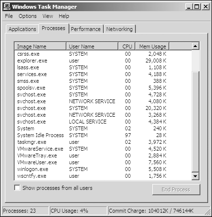
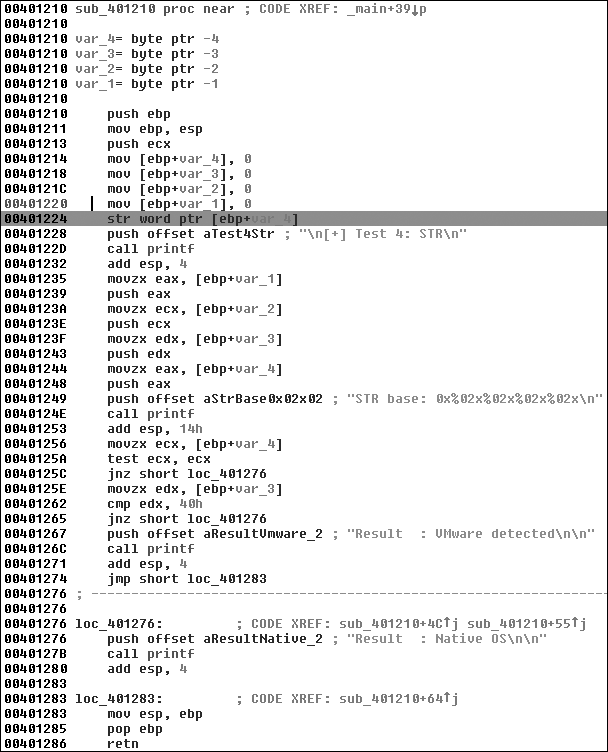

# Capitulo 17 - Tecnicas anti-maquina virtual

> Titulo original: *Anti-Virtual Machine Techniques*

> Navegacao: [Anterior](capitulo-16.md) | [Indice](README.md) | [Proximo](capitulo-18.md)

## Texto principal

Os autores de malware as vezes usam **tecnicas anti-VM** para dificultar a analise em laboratorio. O codigo tenta perceber se corre dentro de uma maquina virtual; se sim, pode mudar de comportamento ou terminar logo no arranque.

Essas tecnicas sao mais comuns em malware **de massa** (bots, scareware, *spyware*): *honeypots* costumam ser VMs, e o alvo tipico e o PC de um usuario que raramente virtualiza o dia todo.

A moda anti-VM **diminuiu** um pouco com a virtualizacao generalizada: ja nao e so o analista que usa VM; administradores e utilizadores usam *snapshots* para restaurar sistemas. Ainda assim, muitas familias testam VMware e produtos parecidos.

Este capitulo foca **artefatos VMware** e como os contornar (configuracao, remocao de *tools*, ou patch do binario).

### Artefatos VMware
O ambiente VMware deixa muitos artefatos no sistema, especialmente
quando o VMware Tools esta instalado. O malware pode usar esses artefatos, que sao
presentes no sistema de arquivos, no registro e na lista de processos, para detectar VMware.
Por exemplo, a Figura 17-1 mostra a listagem de processos para um VMware padrao
imagem com VMware Tools instalado. Observe que tres processos VMware sao
em execucao: VMwareService.exe, VMwareTray.exe e VMwareUser.exe. Qualquer um
deles pode ser encontrado por malware enquanto pesquisa a lista de processos pela
string `VMware`.

**Figura 17-1:** processos numa imagem VMware padrao com VMware Tools a correr



VMwareService.exe executa o VMware Tools Service como filho de services.exe.
Ele pode ser identificado pesquisando no registro os servicos instalados em uma maquina
ou listando servicos, por exemplo:

```text
C:\> sc query | findstr VMware
```

(saida exemplo: servicos relacionados a VMware Tools / disco virtual.)

### Tecnicas anti-VM
O diretorio de instalacao do VMware C:\Program Files\VMware\VMware Tools
tambem pode conter artefatos, assim como o registro. Uma pesquisa rapida por “VMware”
no registro de uma maquina virtual pode encontrar chaves como as seguintes, que sao
entradas que incluem informacoes sobre o disco rigido virtual, adaptadores e
rato virtual.

```text
[HKEY_LOCAL_MACHINE\HARDWARE\DEVICEMAP\Scsi\Porta Scsi 0\Barramento Scsi 0\ID de destino 0\ID de unidade logica 0]
"Identificador"="Disco rigido IDE virtual VMware"
"Type"="DiscoPeriferico"
[HKEY_LOCAL_MACHINE\SOFTWARE\Microsoft\Windows\CurrentVersion\Reinstalar\0000]
"DeviceDesc"="Adaptador AMD PCNet acelerado por VMware"
"DisplayName"="Adaptador AMD PCNet acelerado por VMware"
"Fabricante"="VMware, Inc."
"ProviderName"="VMware, Inc."
[HKEY_LOCAL_MACHINE\SYSTEM\ControlSet001\Control\Class\{4D36E96F-E325-11CE-BFC1-08002BE10318}\0000]
"LocationInformationOverride"="conectado a porta do mouse PS/2"
"InfPath"="oem13.inf"
"InfSection"="VMMouse"
"ProviderName"="VMware, Inc."
```

Conforme discutido no Capitulo 2, voce pode conectar sua maquina virtual a uma rede de diversas maneiras, todas elas permitindo que a maquina virtual tenha seu
propria placa de interface de rede virtual (NIC). Porque a VMware deve virtualizar
a NIC, ela precisa criar um endereco MAC para a maquina virtual e,
dependendo de sua configuracao, o adaptador de rede tambem pode identificar
Uso de VMware.
Os primeiros tres bytes de um endereco MAC sao normalmente especificos do fornecedor, e os enderecos MAC comecando com 00:0C:29 estao associados ao VMware.
Os enderecos MAC do VMware normalmente mudam de versao para versao, mas tudo isso
o que um autor de malware precisa fazer e verificar o endereco MAC da maquina virtual
para valores VMware.
O malware tambem pode detectar VMware por outro hardware, como a placa-mae. Se voce vir malware verificando versoes de hardware, pode estar tentando
para detectar VMware. Procure o codigo que verifica enderecos MAC ou hardware
versoes e corrigir o codigo para evitar a verificacao.
Os artefatos VMware mais comuns podem ser facilmente eliminados desinstalando o VMware Tools ou tentando interromper o VMware Tools Service com o
seguinte comando:
`sc stop "VMTools"` ou `net stop "VMware Tools Service"` (nome exato depende da lingua do SO)
Voce tambem pode impedir que malware procure artefatos.
Por exemplo, se voce encontrar uma unica string relacionada ao VMware em um malware, como
`sc query | findstr VMware`, `VMMouse`, `VMwareTray.exe` ou strings de driver IDE virtual, sabe que o malware procura artefatos VMware.
Voce deve conseguir encontrar esse codigo facilmente no IDA Pro usando as referencias
para as strings. Depois de encontra-lo, corrija o salto ou a condicao para contornar a deteccao e confirme que o malware ainda se comporta como esperado.

Contornar esta familia de checagens costuma ser um processo em dois passos: **localizar o teste** (por exemplo via string `VMwareTray.exe` e *xref* no IDA) e **patch** do salto ou da condicao. O excerto abaixo (Listagem 17-1) mostra `vmt.exe` a enumerar processos e a comparar o nome convertido com `strncmp` contra `VMwareTray.exe`; se encontrar, cai em `exit`.

```text
0040102D        call ds:CreateToolhelp32Snapshot
00401033        lea ecx, [ebp+processentry32]
00401039        mov ebx, eax
0040103B        push ecx        ; lppe
0040103C        push ebx        ; hSnapshot
0040103D        mov [ebp+processentry32.dwSize], 22Ch
00401047        call ds:Process32FirstW
0040104D        mov esi, ds:WideCharToMultiByte
00401053        mov edi, ds:strncmp
00401059        lea esp, [esp+0]
00401060 loc_401060:         ; CODE XREF: sub_401000+B7j
00401060        push 0          ; lpUsedDefaultChar
00401062        push 0          ; lpDefaultChar
00401064        push 104h       ; cbMultiByte
00401069        lea edx, [ebp+Str1]
0040106F        push edx        ; lpMultiByteStr
00401070        push 0FFFFFFFFh ; cchWideChar
00401072        lea eax, [ebp+processentry32.szExeFile]
00401078        push eax        ; lpWideCharStr
00401079        push 0          ; dwFlags
0040107B        push 3          ; CodePage
0040107D        call esi ; WideCharToMultiByte
0040107F        lea eax, [ebp+Str1]
00401085        lea edx, [eax+1]
00401088 loc_401088:         ; CODE XREF: sub_401000+8Dj
00401088        mov cl, [eax]
0040108A        inc eax
0040108B        test cl, cl
0040108D        jnz short loc_401088
0040108F        sub eax, edx
00401091        push eax        ; MaxCount
00401092        lea ecx, [ebp+Str1]
00401098        push offset Str2 ; "VMwareTray.exe"
0040109D        push ecx        ; Str1
0040109E        call edi ; strncmp
004010A0        add esp, 0Ch
004010A3        test eax, eax
004010A5        jz  short loc_4010C0
004010A7        lea edx, [ebp+processentry32]
004010AD        push edx        ; lppe
004010AE        push ebx        ; hSnapshot
004010AF        call ds:Process32NextW
004010B5        test eax, eax
004010B7        jnz short loc_401060
...
004010C0 loc_4010C0:         ; CODE XREF: sub_401000+A5j
004010C0        push 0          ; Code
004010C2        call ds:exit
```

**Listagem 17-1:** Trecho de `vmt.exe` (deteccao de artefato VMware via processos)

O codigo enumera processos (`CreateToolhelp32Snapshot`, `Process32FirstW`, `Process32NextW`), converte `processentry32.szExeFile` para multibyte e compara com `strncmp` contra `VMwareTray.exe`. Se houver *match*, o fluxo cai em `exit` (`0x4010C2`).
Existem algumas maneiras de evitar essa deteccao:

Corrija o binario durante a depuracao para que o salto em 0x4010a5
nunca seja levado.

Use um editor hexadecimal para modificar a string VMwareTray.exe para ler XXXareTray.exe
para fazer com que a comparacao falhe, pois esta nao e uma sequencia de processo valida.

Desinstale o VMware Tools para que o VMwareTray.exe nao seja mais executado.

### Verificando artefatos em memoria
VMware deixa muitos artefatos na memoria como resultado do processo de virtualizacao. Algumas sao estruturas criticas de processador que, por serem
movidos ou alterados em uma maquina virtual, deixam pegadas reconheciveis.
Uma tecnica comumente usada para detectar artefatos de memoria e uma pesquisa
atraves da memoria fisica para a string VMware, que descobrimos pode
detectar varias centenas de instancias.

### Instrucoes problematicas na VM
O programa monitor de maquina virtual monitora a execucao da maquina virtual. Ele e executado no sistema operacional host para apresentar ao sistema operacional convidado uma plataforma virtual. Ele tambem tem alguns pontos fracos de seguranca que
pode permitir que malware detecte a virtualizacao.
**NOTA:** Os problemas relacionados a instrucao x86 em maquinas virtuais discutidos nesta secao foram
originalmente descrito no artigo USENIX 2000 “Analise da capacidade do Intel Pentium
para oferecer suporte a um monitor de maquina virtual seguro”, de John Robin e Cynthia Irvine.
No modo kernel, o VMware usa traducao binaria para emulacao. Certo
instrucoes privilegiadas no modo kernel sao interpretadas e emuladas, entao elas
nao execute no processador fisico. Por outro lado, no modo de usuario, o codigo e executado
diretamente no processador e quase todas as instrucoes que interagem com
o hardware e privilegiado ou gera uma interceptacao ou interrupcao do kernel. VMware
captura todas as interrupcoes e as processa, para que a maquina virtual ainda
pensa que e uma maquina normal.

Algumas instrucoes no x86 acessam informacoes baseadas em hardware, mas nao
gerar interrupcoes. Estes incluem sidt, sgdt, sldt e cpuid, entre outros.
Para virtualizar essas instrucoes adequadamente, a VMware precisaria realizar a traducao binaria em todas as instrucoes (nao apenas nas instrucoes no modo kernel), resultando em um enorme impacto no desempenho. Para evitar grandes impactos no desempenho
de fazer emulacao de instrucoes completas, o VMware permite que certas instrucoes sejam
executar sem ser devidamente virtualizado. Em ultima analise, isso significa que certas sequencias de instrucoes retornarao resultados diferentes quando executadas sob
VMware do que em hardware nativo.
O processador usa certas estruturas e tabelas de chaves, que sao carregadas em
diferentes compensacoes como efeito colateral dessa falta de traducao completa. A interrupcao
tabela descritora (IDT) e uma estrutura de dados interna a CPU, que e usada por
o sistema operacional para determinar a resposta correta as interrupcoes e
excecoes. No x86, todos os acessos a memoria passam pelo global
tabela de descritores locais (GDT) ou tabela de descritores locais (LDT). Essas tabelas contem
descritores de segmento que fornecem detalhes de acesso para cada segmento, incluindo
o endereco base, tipo, comprimento, direitos de acesso e assim por diante. IDT (IDTR), GDT
(GDTR) e LDT (LDTR) sao os registradores internos que contem o
endereco e tamanho dessas respectivas tabelas.
Observe que os sistemas operacionais nao precisam utilizar essas tabelas. Para
Por exemplo, o Windows implementa um modelo de memoria simples e usa apenas o GDT
por padrao. Nao usa o LDT.
Tres instrucoes sensiveis - sidt, sgdt e sldt - leem a localizacao de
essas tabelas, e todas armazenam o respectivo registro em um local de memoria.
Embora essas instrucoes sejam normalmente usadas pelo sistema operacional, elas sao
nao sao privilegiados na arquitetura x86 e podem ser executados pelo usuario
espaco.
Um processador x86 so tem tres registradores dedicados a guardar a localizacao dessas
tres tabelas. Portanto, esses registradores devem conter valores validos para o
sistema operacional host subjacente e divergira dos valores esperados pelo
o sistema operacional virtualizado (convidado). Como as instrucoes sidt, sgdt e sldt podem ser invocadas a qualquer momento pelo codigo do modo de usuario sem serem capturadas
e devidamente virtualizados pela VMware, podem ser usados para detectar sua presenca.
### Red Pill (anti-VM)

Red Pill e uma tecnica anti-VM que executa a instrucao sidt para capturar o
valor do registro IDTR. O monitor da maquina virtual deve realocar o
IDTR do convidado para evitar conflito com o IDTR do host. Desde a maquina virtual
o monitor nao e notificado quando a maquina virtual executa a instrucao sidt,
o IDTR da maquina virtual e retornado. A Red Pill testa essa discrepancia para detectar o uso do VMware.
A Listagem 17-2 mostra como o Red Pill pode ser usado por malware.

```asm
push    ebp
mov     ebp, esp
sub     esp, 454h
push    ebx
push    esi
push    edi
push    8              ; Size
push    0              ; Val
lea     eax, [ebp+Dst]
push    eax            ; Dst
call    _memset
add     esp, 0Ch
lea     eax, [ebp+Dst]
sidt    fword ptr [eax]
mov     al, [eax+5]
cmp     al, 0FFh
jnz     short loc_401E19
```

**Listagem 17-2:** Red Pill em malware
O malware emite a instrucao sidt em , que armazena o conteudo
do IDTR no local de memoria apontado pelo EAX. O IDTR tem 6 bytes,
e o deslocamento do quinto byte contem o inicio do endereco de memoria base. Isso
o quinto byte e comparado a 0xFF, a assinatura VMware.
Red Pill so tem sucesso em uma maquina de processador unico. Nao funcionara de forma consistente em processadores multicore porque cada processador (convidado ou host)
tem um IDT atribuido a ele. Portanto, o resultado da instrucao sidt pode
variam e a assinatura usada pela Red Pill pode nao ser confiavel.
Para frustrar esta tecnica, execute em uma maquina com processador multicore ou
simplesmente NOP-out a instrucao sidt.

### Usando a tecnica sem pilula

A tecnica de instrucao sgdt e sldt para deteccao de VMware e comumente
conhecido como Sem pilula. Ao contrario da Red Pill, No Pill depende do fato de que o LDT
estrutura e atribuida a um processador, nao a um sistema operacional. E porque
O Windows normalmente nao usa a estrutura LDT, mas o VMware fornece suporte virtual para ela, a tabela sera diferente de forma previsivel: A localizacao do LDT no
maquina host sera zero e, na maquina virtual, sera diferente de zero. Um
uma simples verificacao de zero em relacao ao resultado da instrucao sldt resolve o problema.
O metodo sldt pode ser subvertido no VMware desativando a aceleracao.
Para fazer isso, selecione VMSettingsProcessors e marque a caixa Desativar aceleracao. No Pill resolve esse problema de aceleracao usando a instrucao smsw se
o metodo sldt falha. Este metodo envolve inspecionar os indocumentados
bits de alta ordem retornados pela instrucao smsw.

### Consultando a porta de comunicacao de E/S

Talvez a tecnica anti-VMware mais popular atualmente em uso seja a de
consultando a porta de comunicacao de E/S. Essa tecnica e frequentemente encontrada em worms e bots, como o worm Storm e o Phatbot.
VMware usa portas de E/S virtuais para comunicacao entre o virtual
maquina e o sistema operacional host para suportar funcionalidades como copia
e cole entre os dois sistemas. A porta pode ser consultada e comparada
com um numero magico para identificar o uso do VMware.

O sucesso desta tecnica depende da instrucao **`in`**, que
copia dados da porta de E/S indicada pelo operando de origem para o destino.
A VMware monitora `in` e intercepta acessos ao canal `0x5658` (`VX`).
O acumulador **EAX** deve estar com o numero magico `0x564D5868` (`VMXh`), **DX** com `VX`,
e **ECX** com o codigo de operacao desejado no
hypervisor. O valor `0xA` significa “obter tipo de versao VMware” e `0x14` significa “obter
o tamanho da memoria.” Ambos podem ser usados ​​para detectar VMware, mas 0xA e mais popular porque pode determinar a versao do VMware.
Phatbot, tambem conhecido como Agobot, e um botnet simples de usar. Um dos
suas caracteristicas sao o suporte integrado a tecnica de porta de comunicacao de E/S,
conforme mostrado na Listagem 17-3.

```text
004014FA        push    eax
004014FB        push    ebx
004014FC        push    ecx
004014FD        push    edx
004014FE        mov     eax, 'VMXh'
00401503        mov     ebx, [ebp+var_1C]
00401506        mov     ecx, 0xA
00401509        mov     dx, 'VX'
0040150E        in      eax, dx
0040150F        mov     [ebp+var_24], eax
00401512        mov     [ebp+var_1C], ebx
00401515        mov     [ebp+var_20], ecx
00401518        mov     [ebp+var_28], edx
...
0040153E        mov     eax, [ebp+var_1C]
00401541        cmp     eax, 'VMXh'
00401546        jnz     short loc_40155C
```

**Listagem 17-3:** Deteccao de VMware do Phatbot
O malware primeiro carrega o numero magico `0x564D5868` (`VMXh`) em **EAX**.
Em seguida, carrega a variavel local `var_1C` em **EBX**, um endereco de memoria
que retornara qualquer resposta da VMware. ECX e carregado com o valor 0xA para obter
o tipo de versao do VMware. Em seguida, `0x5658` (`VX`) e carregado em **DX**, para ser usado nas
instrucoes seguintes e especificar a porta de comunicacao de E/S do VMware.
Apos a execucao, a instrucao in e capturada pela maquina virtual e
emulado para executa-lo. A instrucao in usa parametros de EAX (magic
valor), ECX (operacao) e EBX (informacoes de retorno). Se o valor magico
corresponde a VMXh e o codigo esta sendo executado em uma maquina virtual, a maquina virtual
o monitor devolve dados no buffer apontado por **EBX**.

A comparacao seguinte determina se o codigo corre em VM.
Como a opcao "obter tipo de versao" esta selecionada, **ECX** pode
contem o tipo de VMware (1=Express, 2=ESX, 3=GSX e 4=Workstation).

A maneira mais facil de superar essa tecnica e fazer o NOP-out da instrucao in ou corrigir o salto condicional para permiti-lo, independentemente do resultado do
a comparacao.

### Usando a instrucao `str`

A instrucao str recupera o seletor de segmento do registrador de tarefa,
que aponta para o segmento de estado da tarefa (TSS) da tarefa atualmente em execucao.
Os autores de malware podem usar a instrucao str para detectar a presenca de uma maquina virtual, uma vez que os valores retornados pela instrucao podem diferir no
maquina virtual versus um sistema nativo. (Esta tecnica nao funciona em
hardware multiprocessador.)
A Figura 17-2 mostra a instrucao str em 0x401224 em malware conhecido como
SNG.exe. Isso carrega o TSS nos 4 bytes: var_1 a var_4, conforme rotulado por
IDA Pro. Duas comparacoes sao feitas em 0x40125A e 0x401262 para determinar
se VMware for detectado.

### Instrucoes anti-VM (x86)

Acabamos de revisar as instrucoes mais comuns usadas por malware para
empregar tecnicas anti-VM. Estas instrucoes sao as seguintes:

```text
sidt
sgdt
sldt
smsw
str
in   ; segundo operando tipico: porta VMware (ex.: VX)
cpuid
```

O malware normalmente nao executara essas instrucoes, a menos que esteja executando
A deteccao de VMware e evitar essa deteccao pode ser tao facil quanto corrigir o
binario para evitar chamar essas instrucoes. Essas instrucoes sao basicamente inuteis se executadas no modo de usuario; portanto, se voce as vir, provavelmente fazem parte do codigo antiVMware. A VMware descreve cerca de 20 instrucoes como “nao virtualizaveis”, das quais as anteriores sao as mais comumente usadas por malware.

### Destacando anti-VM no IDA Pro

Voce pode pesquisar as instrucoes listadas na secao anterior no IDA Pro
usando o script IDAPython mostrado na Listagem 17-4. Este script procura o
instrucoes, destaca qualquer uma em vermelho e imprime o numero total de anti-VM
instrucoes encontradas na janela de saida do IDA.
A Figura 17-2 mostra um resultado parcial da execucao deste script no SNG.exe
com um local (str em 0x401224) destacado pela barra. Examinando o
o codigo destacado no IDA Pro permitira que voce veja rapidamente se a instrucao
encontrado esta envolvido em uma tecnica anti-VM. Uma investigacao mais aprofundada mostra que
a instrucao str esta sendo usada para detectar VMware.

**Figura 17-2:** Tecnica `str` anti-VM em `SNG.exe`



**Listagem 17-4:** Script IDAPython para destacar instrucoes anti-VM (`sidt`, `sgdt`, `sldt`, `smsw`, `str`, `in`, `cpuid`)

```python
from idautils import Heads
from idc import *

heads = Heads(SegStart(ScreenEA()), SegEnd(ScreenEA()))
antiVM = []
for i in heads:
    m = GetMnem(i)
    if m in ("sidt", "sgdt", "sldt", "smsw", "str", "in", "cpuid"):
        antiVM.append(i)
print("Numero de possiveis instrucoes Anti-VM: %d" % len(antiVM))
for i in antiVM:
    SetColor(i, CIC_ITEM, 0x0000FF)
    Message("Anti-VM: %08x\n" % i)
```

### Usando ScoopyNG
ScoopyNG (http://www.trapkit.de/) e uma ferramenta gratuita de deteccao de VMware que
implementa sete verificacoes diferentes para uma maquina virtual, como segue:

As tres primeiras verificacoes procuram o sidt, sgdt e sldt (Red Pill e
Sem pilula).

A quarta verificacao procura str.

O quinto e o sexto usam as opcoes de porta de E/S backdoor 0xa e 0x14,
respectivamente.

A setima verificacao depende de um bug em versoes mais antigas do VMware em execucao
modo de emulacao.
Para uma versao desmontada da quarta verificacao do ScoopyNG, consulte a Figura 17-2.

### Ajustando configuracoes

Discutimos varias maneiras de impedir a deteccao de VMware em todo
neste capitulo, incluindo correcao de codigo, remocao de VMware Tools, alteracao
Configuracoes do VMware e usando uma maquina multiprocessadora.
Ha tambem varios recursos nao documentados no VMware que podem
ajudar a mitigar tecnicas anti-VMware. Por exemplo, colocando as opcoes em
A listagem 17-5 no arquivo .vmx da maquina virtual tornara a maquina virtual
menos detectavel.

**Listagem 17-5:** Opcoes nao documentadas do `.vmx` da VMware (mitigacao anti-VM; usar com cautela)

```ini
isolation.tools.getPtrLocation.disable = "TRUE"
isolation.tools.setPtrLocation.disable = "TRUE"
isolation.tools.setVersion.disable = "TRUE"
isolation.tools.getVersion.disable = "TRUE"
monitor_control.disable_directexec = "TRUE"
monitor_control.disable_chksimd = "TRUE"
monitor_control.disable_ntreloc = "TRUE"
monitor_control.disable_selfmod = "TRUE"
monitor_control.disable_reloc = "TRUE"
monitor_control.disable_btinout = "TRUE"
monitor_control.disable_btmemspace = "TRUE"
monitor_control.disable_btpriv = "TRUE"
monitor_control.disable_btseg = "TRUE"
```

O parametro directexec faz com que o codigo do modo de usuario seja emulado, em vez disso
de ser executado diretamente na CPU, frustrando assim certas tecnicas anti-VM.
As primeiras quatro configuracoes sao usadas pelos comandos backdoor do VMware para que
O VMware Tools em execucao no convidado nao pode obter informacoes sobre o host.
Essas alteracoes protegerao contra todas as verificacoes do ScoopyNG, exceto
o sexto, quando executado em uma maquina multiprocessada. No entanto, nao
Recomendamos o uso dessas configuracoes no VMware, pois elas desativam a utilidade das ferramentas VMware e podem ter serios efeitos negativos no desempenho de suas maquinas virtuais. Adicione essas opcoes somente depois de

esgotou todas as outras tecnicas. Essas tecnicas foram mencionadas para
integridade, mas modificando um arquivo .vmx para tentar capturar dez dos potencialmente
centenas de maneiras pelas quais o VMware pode ser detectado podem ser um pouco como um ganso selvagem
perseguicao.
Escapando da maquina virtual
VMware tem suas vulnerabilidades, que podem ser exploradas para travar o sistema operacional host ou ate mesmo executar codigo nele.
Muitas vulnerabilidades divulgadas sao encontradas no recurso de pastas compartilhadas do VMware ou em ferramentas que exploram a funcionalidade de arrastar e soltar do VMware Tools.
Uma vulnerabilidade bem divulgada usa pastas compartilhadas para permitir que um convidado escreva
qualquer arquivo no sistema operacional host para modificar ou comprometer o
sistema operacional hospedeiro. Embora esta tecnica especifica nao funcione com
a versao atual do VMware, varias falhas diferentes foram descobertas
no recurso de pastas compartilhadas. Desative pastas compartilhadas na maquina virtual
configuracoes para evitar esse tipo de ataque.
Outra vulnerabilidade bem divulgada foi encontrada na maquina virtual
funcao de exibicao no VMware. Uma exploracao para esta vulnerabilidade e conhecida como
Cloudburst, e esta disponivel publicamente como parte da ferramenta de teste de penetracao Canvas (esta vulnerabilidade tambem foi corrigida pela VMware).
Certas ferramentas disponiveis publicamente auxiliam na exploracao do VMware uma vez que o
host foi infectado, incluindo VMchat, VMcat, VMftp, VMdrag-n-hack,
e VMdrag-n-sploit. Essas ferramentas sao de pouca utilidade ate que voce escape
a maquina virtual, e voce nao precisa se preocupar com eles se malware estiver sendo executado na maquina virtual.
Conclusao
Este capitulo apresentou as tecnicas anti-VMware mais populares. Porque
autores de malware usam essas tecnicas para desacelerar a analise, e importante
ser capaz de reconhece-los. Explicamos essas tecnicas em detalhes para
que voce pode encontra-los na desmontagem ou depuracao, e nos exploramos
maneiras de supera-los sem a necessidade de modificar o malware no nivel de desmontagem.
Ao realizar analises dinamicas basicas, voce deve sempre usar um virtual
maquina. No entanto, se o malware em questao parece nao funcionar, considere
tentar outra maquina virtual com VMware Tools desinstalado antes de depurar ou desmontar o malware em busca de deteccao de maquina virtual.
Voce tambem pode executar o malware em questao em um ambiente virtual diferente
(como VirtualBox ou Parallels) ou mesmo em uma maquina fisica.
Tal como acontece com as tecnicas anti-depuracao, as tecnicas anti-VM podem ser detectadas
usando o bom senso enquanto depura lentamente um processo. Por exemplo, se voce
veja o codigo terminando prematuramente em um salto condicional, pode estar acontecendo isso
como resultado de uma tecnica anti-VM. Como sempre, esteja ciente desses tipos de
problemas e analise o codigo para determinar que acao tomar.

## Laboratorios

Amostras: [PracticalMalwareAnalysis-Labs](https://github.com/mikesiko/PracticalMalwareAnalysis-Labs). Gabaritos: [appendice-c.md](appendice-c.md).

### Laboratorio 17-1

Analise `Lab17-01.exe` no VMware. E o mesmo malware que `Lab07-01.exe`, com tecnicas anti-VMware extra.

**NOTA:** As tecnicas anti-VM podem nao reproduzir no seu ambiente.

**Perguntas**

1. Que tecnicas anti-VM o malware usa?
2. Com IDA Pro (comercial), execute o script IDA Python da Listagem 17-4 (`findAntiVM.py`). O que encontra?
3. O que acontece quando cada tecnica anti-VM tem sucesso?
4. Quais tecnicas funcionam na sua VM?
5. Por que cada uma funciona ou falha?
6. Como desativar essas tecnicas e fazer o malware correr?

### Laboratorio 17-2

Analise `Lab17-02.dll` no VMware. Depois da primeira pergunta, execute as exportacoes de instalacao com `rundll32.exe` e monitore com Procmon. Exemplo:

`rundll32.exe Lab17-02.dll,InstallRT` (ou `InstallSA` / `InstallSB`)

**Perguntas**

1. Que exportacoes tem a DLL?
2. O que acontece apos tentativa de instalacao com `rundll32.exe`?
3. Que ficheiros sao criados e o que contem?
4. Que metodo anti-VM esta em uso?
5. Como forcar a instalacao em tempo de execucao?
6. Como desativar permanentemente a tecnica anti-VM?
7. Como funciona cada export de instalacao?

### Laboratorio 17-3

Analise `Lab17-03.exe` no VMware. Semelhante a `Lab12-02.exe` com anti-VMware.

**Perguntas**

1. O que acontece ao executar o malware numa VM?
2. Como fazer o malware executar e largar o keylogger?
3. Que tecnicas anti-VM sao usadas?
4. Que alteracoes no sistema evitariam permanentemente o anti-VM deste malware?
5. Como patchar no OllyDbg para falhar permanentemente o anti-VM?

## Exercicios e desafios

- Liste dois indicadores de VM discutidos no [Texto principal](#texto-principal) e como contorna-los em analise segura.
- **Desafio:** numa VM de testes, compare execucao com e sem VMware Tools e registe uma unica diferenca comportamental.
