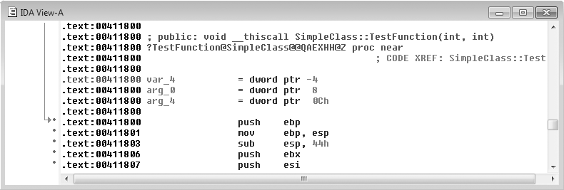
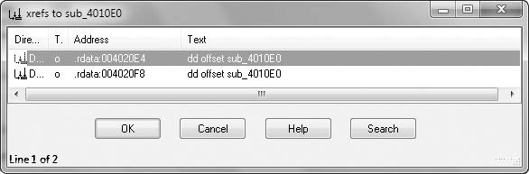

# Capitulo 20 - Analise C++

> Titulo original: *C++ Analysis*

> Navegacao: [Anterior](capitulo-19.md) | [Indice](README.md) | [Proximo](capitulo-21.md)

## Topicos

- Programacao orientada a objetos e metodos
- Ponteiro `this` e convencao `thiscall`
- Sobrecarga e *name mangling*
- Heranca e funcoes virtuais vs nao virtuais
- *Vtables*, reconhecimento no IDA Pro, criacao e destruicao de objetos (`new` / `delete`)

## Texto principal

A analise de malware e feita sem acesso ao codigo-fonte, mas a linguagem fonte especifica impacta fortemente o assembly. C++ tem recursos que nao existem em C e podem complicar a analise do assembly resultante. Programas maliciosos em C++ desafiam o analista e dificultam inferir a finalidade do codigo assembly. Entender os recursos basicos do C++ e como aparecem em assembly e essencial para analisar malware escrito em C++.

### Programacao orientada a objetos

Ao contrario de C, C++ e orientada a objetos: o modelo usa objetos que contem dados e funcoes que manipulam esses dados. As funcoes em POO assemelham-se as de C, exceto por estarem associadas a um objeto ou classe. Funcoes dentro de uma classe C++ costumam chamar-se *methods*.

Embora muitos aspectos de POO nao afetem o assembly, alguns complicam a analise.

**NOTA:** Para aprofundar C++, veja *Thinking in C++,* de Bruce Eckel, disponivel em http://www.mindviewinc.com/

Na orientacao a objetos, o codigo organiza-se em tipos definidos pelo usuario chamados **classes**. Classes assemelham-se a `struct`, mas guardam tambem informacao de funcoes alem de dados. Uma classe e como um molde que especifica funcoes e layout de dados do objeto na memoria.

Ao executar codigo C++ orientado a objetos, voce usa a classe para criar um **objeto** da classe. Esse objeto e uma **instancia** da classe. Pode haver varias instancias da mesma classe; cada uma tem seus proprios dados, mas objetos do mesmo tipo compartilham as mesmas funcoes. Para acessar dados ou chamar uma funcao, e preciso referenciar um objeto desse tipo.

A Listagem 20-1 mostra um programa simples com uma classe e um unico objeto.

```cpp
class SimpleClass {
public:
      int x;
      void HelloWorld() {
            printf("Hello World\n");
      }
};
int _tmain(int argc, _TCHAR* argv[])
{
      SimpleClass myObject;
      myObject.HelloWorld();
}
```

**Listagem 20-1:** Uma classe C++ simples

Neste exemplo a classe chama-se `SimpleClass`. Tem um dado `x` e uma funcao `HelloWorld`. Cria-se uma instancia `myObject` e chama-se `HelloWorld` para esse objeto. A palavra-chave `public` e um mecanismo de abstracao imposto pelo compilador **sem impacto** no assembly.

### O ponteiro this

Dados e funcoes associam-se a objetos. Para um dado usa-se `ObjectName.variableName`; para funcoes, `ObjectName.functionName`. Na Listagem 20-1, para acessar `x` usaria-se `myObject.x`.

Alem disso, dentro de metodos da classe pode-se acessar variaveis do objeto atual usando so o nome da variavel. A Listagem 20-2 ilustra.

```cpp
class SimpleClass {
public:
      int x;
      void HelloWorld() {
            if (x == 10) printf("X is 10.\n");
      }
      ...
};
int _tmain(int argc, _TCHAR* argv[])
{
      SimpleClass myObject;
      myObject.x = 9;
      myObject.HelloWorld();
      SimpleClass myOtherObject;
      myOtherObject.x = 10;
      myOtherObject.HelloWorld();
}
```

**Listagem 20-2:** Exemplo C++ com o ponteiro `this`

Em `HelloWorld`, `x` e usado sem prefixo de objeto, nao como `ObjectName.x`. A mesma variavel na mesma regiao de memoria e acessada em `main` como `myObject.x`. Dentro de `HelloWorld`, presume-se que `x` se refere ao objeto com o qual a funcao foi chamada; no primeiro caso `myObject`, no segundo `myOtherObject`. O ponteiro **`this`** rastreia qual endereco usar ao acessar `x`.

O ponteiro `this` esta implicito em todo acesso a variaveis dentro de uma funcao que nao especifica objeto; e parametro implicito de toda chamada a metodo de objeto. No assembly gerado pela Microsoft, esse parametro costuma ir em **ECX** (as vezes **ESI**). No Capitulo 6 vimos `stdcall`, `cdecl` e `fastcall`. A convencao C++ para `this` chama-se frequentemente **`thiscall`**. Identificar `thiscall` ajuda a reconhecer codigo orientado a objetos na desmontagem.

A Listagem 20-3 (assembly gerado a partir da Listagem 20-2) mostra o uso de `this`.

```text
; Main Function
00401100                 push    ebp
00401101                 mov     ebp, esp
00401103                 sub     esp, 1F0h
00401109                 mov     [ebp+var_10], offset off_404768
00401110                 mov     [ebp+var_C], 9
00401117                 lea     ecx, [ebp+var_10]
0040111A                 call    sub_4115D0
0040111F                 mov     [ebp+var_34], offset off_404768
00401126                 mov     [ebp+var_30], 0Ah
0040112D                 lea     ecx, [ebp+var_34]
00401130                 call    sub_4115D0
; HelloWorld Function
004115D0                 push    ebp
004115D1                 mov     ebp, esp
004115D3                 sub     esp, 9Ch
004115D9                 push    ebx
004115DA                 push    esi
004115DB                 push    edi
004115DC                 mov     [ebp+var_4], ecx
004115DF                 mov     eax, [ebp+var_4]
004115E2                 cmp     dword ptr [eax+4], 0Ah
004115E6                 jnz     short loc_4115F6
004115E8                 push    offset aXIs10_  ; "X is 10.\n"
004115ED                 call    ds:__imp__printf
```

**Listagem 20-3:** O ponteiro `this` na desmontagem

`main` aloca espaco na pilha. O inicio do objeto fica em `var_10`; o primeiro membro de dados `x` esta com deslocamento 4 a partir do inicio do objeto e e escrito em `var_C` (o IDA pode nao saber que `var_10` e `var_C` pertencem ao mesmo objeto). O ponteiro para o objeto e carregado em **ECX** antes da chamada. Em `HelloWorld`, **ECX** e recuperado como `this`; em offset 4 le-se `x`. Na segunda chamada a `HelloWorld`, outro ponteiro e carregado em **ECX**.

### Sobrecarga e name mangling

C++ permite **sobrecarga de metodos**: varias funcoes com o mesmo nome e parametros diferentes. O compilador escolhe a versao pelo numero e tipos dos argumentos (Listagem 20-4).

```cpp
LoadFile (String filename) {
...
}
LoadFile (String filename, int Options) {
...
}
Main () {
      LoadFile ("c:\\myfile.txt"); // primeira LoadFile
      LoadFile ("c:\\myfile.txt", GENERIC_READ); // segunda LoadFile
}
```

**Listagem 20-4:** Exemplo de sobrecarga

C++ usa **name mangling** para suportar sobrecarga. No PE, cada funcao e rotulada pelo nome; parametros nao aparecem no binario. Os nomes sao alterados para incluir informacao dos parametros. Por exemplo, `TestFunction` na classe `SimpleClass` com dois inteiros pode virar `?TestFunction@SimpleClass@@QAEXHH@Z`.

O algoritmo depende do compilador; o IDA Pro **demangle** a maioria. A Figura 20-1 mostra `TestFunction` com nome e parametros recuperados.



**Figura 20-1:** Listagem no IDA Pro com nome demangled

Simbolos internos so aparecem se existirem no binario. Malware costuma remover simbolos; ainda assim importacoes/exportacoes C++ com nomes mangled podem ser visiveis no IDA.

### Heranca e substituicao de funcoes

**Heranca** estabelece relacoes pai-filho entre classes. Classes filhas herdam funcoes e dados das pais, costumam adicionar mais. Na Listagem 20-5, `Socket` define `setDestinationAddr`; `UDPSocket` implementa `sendData` e pode chamar `setDestinationAddr` da classe pai mesmo sem redefini-la em `UDPSocket`.

```cpp
class Socket {
...
public:
      void setDestinationAddr (INetAddr * addr) {
      ...
      }
      ...
};
class UDPSocket : public Socket {
public:
      void sendData (char * buf, INetAddr * addr) {
          setDestinationAddr(addr)
      ...
      }
      ...
};
```

**Listagem 20-5:** Exemplo de heranca

Heranca ajuda a reutilizar codigo; em geral **nao** exige estruturas de dados de tempo de execucao extra e **raramente** e visivel explicitamente no assembly.

### Funcoes virtuais vs nao virtuais

Uma **funcao virtual** pode ser sobrescrita por subclasse; a escolha da implementacao e em **tempo de execucao**. Se pai e filho definem funcao com o mesmo nome, a do filho substitui a do pai.

No exemplo de *socket*, pode-se ter classe pai `Socket` com `sendData` virtual e filhas `UDPSocket` e `TCPSocket` que sobrescrevem `sendData`. O codigo cliente usa um objeto `Socket`; cada chamada a `sendData` resolve para a subclasse correta conforme o objeto criado. Um novo protocolo (ex.: QDP) pode exigir nova classe `QDPSocket` e mudar apenas onde o objeto e instanciado; as chamadas a `sendData` seguem coerentes.

Para funcoes **nao virtuais**, a funcao a executar e decidida em **tempo de compilacao**. Se o tipo e o da classe pai, chama-se a funcao do pai mesmo que em tempo de execucao o objeto seja de subclasse. Com **virtual**, em tempo de execucao pode-se chamar a versao da subclasse quando o objeto e referenciado como instancia do pai.

A Tabela 20-1 contrasta dois trechos identicos exceto pela palavra `virtual`: sem `virtual`, imprime `Class A`; com `virtual`, imprime `Class B`.

**Tabela 20-1:** Codigo-fonte de exemplo para funcoes virtuais

```cpp
// Funcao NAO virtual
class A {
public:
      void foo() {
            printf("Class A\n");
      }
};
class B : public A {
public:
      void foo() {
            printf("Class B\n");
      }
};
void g(A& arg) {
      arg.foo();
}
int _tmain(int argc, _TCHAR* argv[])
{
      B b;
      A a;
      g(b);
      return 0;
}
```

```cpp
// Funcao virtual
class A {
public:
      virtual void foo() {
            printf("Class A\n");
      }
};
class B : public A {
public:
      virtual void foo() {
            printf("Class B\n");
      }
};
void g(A& arg) {
      arg.foo();
}
int _tmain(int argc, _TCHAR* argv[])
{
      B b;
      A a;
      g(b);
      return 0;
}
```

Com funcoes nao virtuais, em `g(b)` o compilador trata o argumento como `A` na chamada a `foo` (lado esquerdo imprime `Class A`). Com virtuais, a resolucao e em tempo de execucao (lado direito imprime `Class B`). Isso e **polimorfismo**: objetos com comportamentos distintos compartilham interface comum.

### Uso de vtables

O compilador adiciona estruturas para suportar funcoes virtuais: **virtual function tables (vtables)**. Sao vetores de ponteiros de funcao. Cada classe com funcoes virtuais tem sua **vtable**; cada funcao virtual tem uma entrada.

A Tabela 20-2 mostra o assembly de `g` para os dois casos da Tabela 20-1: a chamada nao virtual assemelha-se a C; a **virtual** usa indirecao e o destino da `call` nao e obvio no disassembly, o que dificulta analise de C++.

**Tabela 20-2:** Assembly do exemplo da Tabela 20-1

```text
; Chamada NAO virtual
00401000   push    ebp
00401001   mov     ebp, esp
00401003   mov     ecx, [ebp+arg_0]
00401006   call    sub_401030
0040100B   pop     ebp
0040100C   retn

; Chamada virtual
00401000   push    ebp
00401001   mov     ebp, esp
00401003   mov     eax, [ebp+arg_0]
00401006   mov     edx, [eax]
00401008   mov     ecx, [ebp+arg_0]
0040100B   mov     eax, [edx]
0040100D   call    eax
0040100F   pop     ebp
00401010   retn
```

O argumento de `g` e referencia (como ponteiro) para objeto de classe `A` (ou subclasse). O assembly acessa o ponteiro para o inicio do objeto; depois os **primeiros 4 bytes** do objeto (x86).



**Figura 20-2:** Objeto C++ com virtual function table (vtable)

Os primeiros 4 bytes do objeto apontam para a **vtable**; a primeira entrada de 4 bytes da vtable aponta para o codigo da primeira funcao virtual. Para saber qual funcao e chamada, localiza-se onde a vtable e acessada e qual **offset** e usado. Na Tabela 20-2 acessa-se a primeira entrada da vtable; e preciso encontrar a vtable na memoria e seguir para a primeira funcao da lista.

Funcoes **nao virtuais** nao entram na vtable; o destino e fixo em compilacao.

**Figura 20-3** (no PDF: referencias cruzadas para uma funcao virtual): ilustra xrefs que sao *offsets* para a funcao, nao instrucoes `call` diretas.

### Reconhecendo uma vtable

Para identificar o destino da chamada, determine o tipo de objeto e localize a vtable. Se identificar o operador `new` e o construtor (secao seguinte), em geral descobre-se o endereco da vtable nas proximidades.

A vtable parece um vetor de ponteiros. Na Listagem 20-6, tres funcoes virtuais; em geral so o **primeiro** valor da tabela tem xref direto; os demais sao acessados por offset a partir do inicio da tabela.

**NOTA:** A linha `off_4020F0` inicia a vtable; nao confundir com tabelas de *switch* do Capitulo 6, que apontam para `loc_######` e nao `sub_######`.

```text
004020F0 off_4020F0      dd offset sub_4010A0
004020F4                 dd offset sub_4010C0
004020F8                 dd offset sub_4010E0
```

**Listagem 20-6:** Uma vtable no IDA Pro

Funcoes virtuais raramente recebem `call` direto de outras partes do codigo; os xrefs tendem a ser offsets. Funcoes nao virtuais costumam aparecer via `call`.

Com uma vtable identificada, sabe-se que as funcoes naquela tabela pertencem a mesma classe e estao relacionadas; vtables tambem ajudam a inferir relacoes de heranca.

A Listagem 20-7 estende a 20-6 com vtables de duas classes. Funcoes repetidas em entradas diferentes e duas vtables apontando para a mesma funcao sugerem heranca. Filhos incluem funcoes do pai salvo sobrescrita; `sub_4010E0` pode aparecer na vtable pai e na filha.

Se uma vtable e **maior** que a outra, a maior costuma ser a **subclasse** (mesmas entradas do pai mais extras).

```text
004020DC off_4020DC      dd offset sub_401100
004020E0                 dd offset sub_4010C0
004020E4                 dd offset sub_4010E0
004020E8                 dd offset sub_401120
004020EC                 dd offset unk_402198
004020F0 off_4020F0      dd offset sub_4010A0
004020F4                 dd offset sub_4010C0
004020F8                 dd offset sub_4010E0
```

**Listagem 20-7:** Vtables para duas classes diferentes

### Criando e destruindo objetos

**Construtor** e chamado ao criar objeto; **destrutor**, ao destruir. Objetos podem estar na **pilha** ou no **heap**. Na pilha nao e preciso alocar memoria separada; o destrutor e chamado ao sair de escopo (o compilador pode inserir codigo de excecao para garantir destrutores).

Objetos no heap usam o operador **`new`**: aloca espaco no heap e chama o construtor. Na desmontagem `new` costuma ser funcao importada facil de achar. O **`delete`** libera objetos no heap.

**NOTA:** Criacao e destruicao de objetos sao eixos do fluxo de execucao; engenharia reversa dessas rotinas revela layout de objeto e ajuda a analisar outros membros.

```text
00401070  push    ebp
00401071  mov     ebp, esp
00401073  sub     esp, 1Ch
00401076  mov     [ebp+var_10],  offset off_4020F0
0040107D  mov     [ebp+var_10],  offset off_4020DC
00401084  mov     [ebp+var_4], offset off_4020F0
0040108B  push    4
0040108D  call    ??2@YAPAXI@Z    ; operator new(uint)
```

**Listagem 20-8:** Operador `new` na desmontagem

O deslocamento movido para `var_10` indica a vtable; o trecho pode mostrar escritas sucessivas no mesmo local (comportamento do compilador). Comparando deslocamentos, identificam-se vtables de pai e de filho no objeto criado.

## Conclusao

Para analisar malware em C++ e preciso entender recursos da linguagem e o efeito no assembly. Dominando heranca, vtables, ponteiro `this` e mangling, voce nao fica bloqueado pelo C++ em disassembly e pode usar pistas da estrutura de classes.

## Laboratorios

Material de laboratorio oficial: repositorio [PracticalMalwareAnalysis-Labs](https://github.com/mikesiko/PracticalMalwareAnalysis-Labs). Binarios apenas em ambiente controlado; veja [appendice-c.md](appendice-c.md) sobre solucoes.

### Laboratorio 20-1

Objetivo: demonstrar o uso do ponteiro `this`. Analise o malware em `Lab20-01.exe`.

**Perguntas**

1. A funcao em `0x401040` aceita algum parametro?
2. Qual URL e usada na chamada a `URLDownloadToFile`?
3. O que este programa faz?

### Laboratorio 20-2

Objetivo: demonstrar funcoes virtuais. Analise o malware em `Lab20-02.exe`.

**NOTA:** Este programa nao e seguro para uso descuidado; pode tentar enviar arquivos sensiveis.

**Perguntas**

1. O que as strings interessantes revelam?
2. O que as importacoes indicam sobre o programa?
3. Qual a finalidade do objeto criado em `0x4011D9`? Tem funcoes virtuais?
4. Quais funcoes poderiam ser chamadas pela instrucao `call [edx]` em `0x401349`?
5. Como montar um servidor local para analisar o malware sem expor a maquina a Internet?
6. Qual o objetivo do programa?
7. Qual o proposito de usar chamada virtual neste programa?

### Laboratorio 20-3

Cenario mais longo. Existe `config.dat` no mesmo diretorio do executavel. Analise `Lab20-03.exe`.

**Perguntas**

1. O que as strings interessantes revelam?
2. O que as importacoes indicam?
3. A funcao em `0x4036F0` e chamada varias vezes com string de erro de configuracao e depois `CxxThrowException`. Aceita parametros alem da string? Retorna algo? O que se infere pelo contexto?
4. O que fazem as seis entradas da tabela de *switches* em `0x4025C8`?
5. Qual o objetivo do programa?

## Exercicios e desafios

- Relacione o ponteiro `this` com a convencao `thiscall` (secao [O ponteiro this](#o-ponteiro-this)) e com a Listagem 20-3.
- Abra um PE C++ conhecido no IDA, ative demangling e localize um simbolo no estilo `?...@...@@`; compare com a imagem da Figura 20-1 neste capitulo.
- Desenhe no papel objeto + vtable para o cenario da Tabela 20-2 (chamada virtual) e confira com a Figura 20-2 (imagem acima).
- **Desafio:** sem executar malware real, use apenas estatica para listar metodos virtuais candidatos (xrefs indiretos) num binario de treino do repositorio de labs.

Repositorio de amostras de laboratorio: https://github.com/mikesiko/PracticalMalwareAnalysis-Labs
